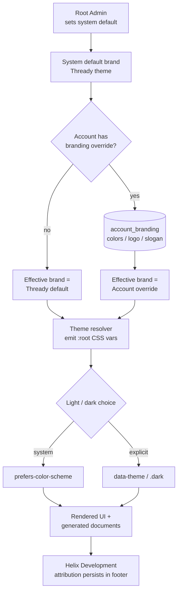

<!--
  Title           : Helix Thready — Theming & White‑Labeling
  Classification  : PUBLIC
  Location        : docs/public/research/mvp/design/theming.md
  Status          : Draft — v0.1
  Revision        : 1 (2026-07-21)
  Author          : Helix Thready documentation swarm (design)
  Related         : ./index.md, ./design-system.md, ./brand-assets.md,
                    ../api/index.md, ../database/index.md, ../CONVENTIONS.md
-->

# Helix Thready — Theming & White‑Labeling

| Rev | Date | Author | Change |
|-----|------|--------|--------|
| 1 | 2026-07-21 | swarm (design) | Initial complete draft: light/dark resolution, per‑account white‑label model, DDL, runtime injection, generated‑document branding |
| 2 | 2026-07-21 | swarm (design · review) | Second-pass review: aligned `account_branding` DDL to canonical `uuid` PKs + reconciled with `accounts.branding` JSONB; fixed malformed injected‑CSS example + uuid account scope; added `422` error schema + `bearerAuth` scheme to the OpenAPI slice; added a TDD reproduce‑first (RED) test for the AA accent gate |
| 3 | 2026-07-22 | swarm (design · Pass 3) | Depth pass: shipped-theme **precedents** table (§3.1, helix-green/vasic-red/helix-ota-blue as verified evidence a white-label = one brand + AA accent); noted the verified `default` slogan string + the `vasic-red` PLACEHOLDER caveat |

## Table of contents

- [1. Two orthogonal axes](#1-two-orthogonal-axes)
- [2. Light / dark resolution](#2-light--dark-resolution)
- [3. White‑labeling model](#3-white-labeling-model)
  - [3.1 Shipped-theme precedents (verified evidence)](#31-shipped-theme-precedents-verified-evidence)
- [4. The white‑label cascade](#4-the-white-label-cascade)
- [5. Data model (DDL)](#5-data-model-ddl)
- [6. Runtime injection (web, SSR‑safe)](#6-runtime-injection-web-ssr-safe)
- [7. API surface](#7-api-surface)
- [8. Cross‑platform theming](#8-cross-platform-theming)
- [9. Branding on generated documents](#9-branding-on-generated-documents)
- [10. Accessibility guardrails for white‑label](#10-accessibility-guardrails-for-white-label)
  - [10.1 TDD reproduce‑first (RED then GREEN)](#101-tdd-reproduce-first-red-then-green)
- [11. Gaps & open items](#11-gaps--open-items)

## 1. Two orthogonal axes

Thready theming has **two independent axes** that compose:

1. **Mode** — *light* vs. *dark*, with an explicit choice and a *system* default. This is a
   **per‑user, per‑device** preference `[OPERATOR: light+dark, explicit + system default]`.
2. **Brand** — the *color / logo / slogan* identity. This is **per‑Account** (white‑labeling),
   set by the Root Admin; new Accounts inherit the Thready default `[OPERATOR §8.3]`.

They are orthogonal: an Account's brand ships **both** a light and a dark palette, and the user's
mode choice selects which one renders. Structural tokens (§ design‑system.md §3.1) never change on
either axis.

## 2. Light / dark resolution

Thready reuses the shared `design_system` **`ThemeService`** verbatim `[VERIFIED — theme.service.ts]`.
It is signal‑based, SSR‑safe, and stamps the DOM via the **three sanctioned mechanisms** that the
theme CSS is authored against:

1. `@media (prefers-color-scheme: dark)` — the *system* default,
2. `:root[data-theme="dark"]` — the *explicit* choice,
3. `.dark` class — framework compatibility.

```typescript
// design_system ThemeService (verbatim behavior) — Thready sets storagePrefix 'thready'
export type ThemeChoice = 'light' | 'dark' | 'system';

// An effect stamps data-theme on <html>, toggles .dark, and persists to
// localStorage under `${cfg.storagePrefix}-theme` (= 'thready-theme').
// resolved(): 'light' | 'dark'  ← 'system' resolves via matchMedia.
```

The header exposes the shared **`ds-theme-toggle`** (Light / Dark / System, `aria-pressed`,
keyboard‑ and SR‑accessible) `[VERIFIED — theme-toggle.component.ts]`. Default choice = `system`,
so first paint honors the OS. To avoid a flash of the wrong theme on SSR/prerender (Angular 22
marketing + Tauri), a tiny head script applies the persisted `data-theme` before first paint
(the same script that toggles `html.no-svg`).

## 3. White‑labeling model

Per §8.3 and the request `[OPERATOR]`:

- The **system default** brand is **Thready / Helix Development** (the `thready` theme).
- **Newly created Accounts default** to the Thready brand.
- The **Root Admin** can override, **per Account**, the configurable attributes:
  **main theme colors, main (product) logo, slogan**.
- **Helix Development attribution persists** in footers regardless of override (resolves
  inconsistency #5) — a white‑label may replace the *product* mark but not the attribution.

**What is overridable vs. locked:**

| Attribute | Overridable per Account | Notes |
|-----------|:-----------------------:|-------|
| `--brand`, `--brand-2` (decorative) | ✅ | Account's primary/secondary |
| `--accent`, `--accent-on` (text/UI) | ✅ (validated, see §10) | Must pass AA or is auto‑darkened/rejected |
| Product logo (header, launcher where applicable) | ✅ | Account uploads light + dark, transparent |
| Slogan / tagline | ✅ | Free text; heart pattern optional |
| Structural tokens (type/space/radius/motion) | ❌ | One system across all Accounts |
| Neutral surfaces / semantic tokens | ❌ by default | Kept AA‑tuned; advanced override gated behind AA validation |
| **Helix Development attribution footer** | ❌ | Always present |

### 3.1 Shipped-theme precedents (verified evidence)

The white‑label model is not speculative — the design system **already ships three brand themes** by
exactly the mechanism an Account override uses (one `--brand`, one AA‑pinned `--accent`, shared
neutrals). They are the proof that "swap `--brand`/`--accent`, keep the slate" produces an accessible,
consistent result `[VERIFIED — docs/THEMES.md + tokens/themes/*.css]`:

| Theme | `--brand` | `--accent` light / dark | AA (measured) | Note |
|-------|-----------|-------------------------|---------------|------|
| helix-green (Thready base) | `#B6E376` | `#446E12` / `#B6E376` | 6.03:1 / 13.56:1 ✅ | eyedrop mean of 1.63M logo pixels |
| vasic-red | `#E11D2A` | `#B91C1C` / `#F87171` | 6.47:1 / 7.23:1 ✅ | ⚠ brand hex is a **PLACEHOLDER** until the vasic logo asset lands |
| helix-ota-blue | `#2563EB` | `#2563EB` / `#3B82F6` | ✅ | HelixOTA shadcn blue |

Two facts this evidence pins down for the white‑label editor. First, **a red brand ships without
masking errors**: `vasic-red` proves `--accent` (brand) and `--danger` (semantic error) stay separate
tokens `[VERIFIED — THEMES.md "Brand-red vs danger-red"]`, which is why §10.2 forbids overriding
`--danger`. Second, the **default slogan string is a real shipped default** — the canonical API models
it as `slogan` defaulting to `"Made with love ♥ by Helix Development"`
`[VERIFIED — api/openapi.yaml#/components/schemas/Branding]`; an Account may replace it, but the locked
Helix Development attribution (§9) renders regardless.

## 4. The white‑label cascade



> Rendered PNG/SVG exported via Docs Chain (§11.4.65). Source: `diagrams/white-label-cascade.mmd`.

**Explanation (for readers/models that cannot see the diagram).** The Root Admin sets the system
default brand, which is the Thready theme. When a surface renders for an Account, the resolver asks
whether that Account has a branding override. If not, the effective brand is the Thready default;
if yes, the effective brand is read from the `account_branding` record (colors, logo, slogan). Both
paths converge on the theme resolver, which emits the effective brand as `:root` CSS custom
properties. The user's light/dark choice then selects which palette renders: *system* resolves via
`prefers-color-scheme`, while an *explicit* choice is applied via `data-theme`/`.dark`. The result
drives both the live UI and the branding of generated documents. Finally — and independently of any
override — the Helix Development attribution persists in the footer, so a white‑label never erases
the "part of Helix Development" signal.

## 5. Data model (DDL)

> **Reconcile with the authoritative schema first `[OPEN: THREADY-DES-14]`.** The **canonical**
> database area ([../database/erd.md](../database/erd.md), `../database/schema-relational.sql`) already
> models per‑account branding as an `accounts.branding` **JSONB** column
> (`{colors, logo_url, slogan}`). The normalized `account_branding` table below is the design‑owned
> **proposal** to promote that blob into typed, **AA‑validated, audit‑friendly** columns (the AA gate
> in §10 needs typed accent columns and an `aa_validated` flag the JSONB blob does not carry). It is
> **NOT** an independent decision: the design area MUST NOT diverge from the canonical schema. Either
> the database area adopts this table (expand‑contract migration off `accounts.branding`) or this doc
> falls back to reading/writing the JSONB — tracked in [index.md](./index.md#open-items). Everything
> below is written to match the canonical conventions verbatim: **`uuid` surrogate keys**
> (`gen_random_uuid`, pgcrypto), `timestamptz` in UTC, and FKs to `accounts(id)` / `users(id)`.

PostgreSQL `[IN-HOUSE: database]` (types aligned to `schema-relational.sql` — `uuid`, not `bigint`):

```sql
-- Per-account white-label branding (design-owned normalization of accounts.branding).
-- account_id is BOTH the PK and the FK to accounts(id) (1:1 with the account).
CREATE TABLE account_branding (
    account_id       uuid PRIMARY KEY REFERENCES accounts(id) ON DELETE CASCADE,
    -- Decorative brand colors (hex #RRGGBB). NULL => inherit Thready default.
    brand            text,
    brand_2          text,
    -- Accessible accent, validated AA server-side before persist (see §10).
    accent_light     text,
    accent_dark      text,
    accent_on_light  text,
    accent_on_dark   text,
    -- Product logos (asset-service refs, never raw paths). Light + dark, transparent.
    logo_light_asset text,      -- resolves via Asset Service
    logo_dark_asset  text,
    -- Slogan (free text). Helix Development attribution is NOT stored here (always rendered).
    slogan           text,
    -- Optional theme name for audit/telemetry.
    theme_id         text NOT NULL DEFAULT 'thready',
    aa_validated     boolean NOT NULL DEFAULT false,
    updated_by       uuid REFERENCES users(id),        -- uuid, matches users.id
    updated_at       timestamptz NOT NULL DEFAULT now(),
    CONSTRAINT ck_brand_hex     CHECK (brand    IS NULL OR brand    ~* '^#[0-9a-f]{6}$'),
    CONSTRAINT ck_brand2_hex    CHECK (brand_2  IS NULL OR brand_2  ~* '^#[0-9a-f]{6}$'),
    CONSTRAINT ck_accent_l_hex  CHECK (accent_light IS NULL OR accent_light ~* '^#[0-9a-f]{6}$'),
    CONSTRAINT ck_accent_d_hex  CHECK (accent_dark  IS NULL OR accent_dark  ~* '^#[0-9a-f]{6}$')
);

CREATE INDEX ix_account_branding_updated ON account_branding (updated_at DESC);
```

Forward / rollback migration via `database/pkg/migration.Runner` (expand‑contract, tested rollback)
`[IN-HOUSE: database]` `[CONSTITUTION §Q30]`. Because the canonical store today is
`accounts.branding` JSONB, the **expand** step backfills from it and the **contract** step is deferred
until every writer is cut over — so the migration is reversible with no data loss:

```sql
-- up:   0007_account_branding.up.sql
--   CREATE TABLE account_branding (…);   -- (as above)
--   -- Expand: backfill from the existing JSONB (non-destructive; accounts.branding is retained).
--   INSERT INTO account_branding (account_id, brand, slogan)
--   SELECT id,
--          NULLIF(branding->>'colors', '')::text,   -- narrow mapping; full map in the DB area
--          NULLIF(branding->>'slogan', '')::text
--   FROM accounts
--   WHERE branding <> '{}'::jsonb
--   ON CONFLICT (account_id) DO NOTHING;

-- down: 0007_account_branding.down.sql
--   DROP TABLE IF EXISTS account_branding;   -- accounts.branding JSONB is untouched, so this is lossless
```

All branding writes are **audit‑logged** (append‑only) since they are admin actions
`[CONSTITUTION §14.4]`.

## 6. Runtime injection (web, SSR‑safe)

The effective brand is delivered to the browser as a scoped CSS custom‑property block. Because the
neutral/structural tokens never change, only the ~8 brand/accent variables are injected — cheap and
cache‑friendly:

```typescript
// ThreadyBrandService — resolves the effective brand and injects it once, SSR-safe.
// Builds on the design_system ThemeService (mode) — this adds the BRAND axis.
resolveBrandVars(b: AccountBranding | null): Record<string, string> {
  if (!b) return {}; // inherit Thready default from tokens/themes/thready.css
  return {
    '--brand':        b.brand        ?? 'var(--brand)',
    '--brand-2':      b.brand2       ?? 'var(--brand-2)',
    '--accent':       b.accentLight  ?? 'var(--accent)',       // light block
    '--accent-on':    b.accentOnLight?? 'var(--accent-on)',
  };
}
```

```html
<!-- Emitted server-side (SSR/prerender) so first paint is already branded.
     data-account carries the account uuid (accounts.id), not a numeric id. -->
<style id="thready-brand">
  :root[data-account="a1b2c3d4-1111-4222-8333-abcdef012345"]{
    --brand:#12a3ff; --brand-2:#0d6efd; --accent:#0b5ed7; --accent-on:#ffffff;
  }
  :root[data-account="a1b2c3d4-1111-4222-8333-abcdef012345"][data-theme="dark"]{
    --accent:#7db3ff; --accent-on:#001a33;   /* dark ink for the lighter dark-mode accent */
  }
</style>
```

The Account scope (`data-account` = the account `uuid`) means a Root Admin previewing multiple
Accounts sees each correctly; the default (no `data-account`) is the Thready brand.

## 7. API surface

Branding is read on bootstrap and written by admins (RBAC‑gated). OpenAPI 3.1 slice
`[DEFAULT — adjustable]` (full contract in [../api/index.md](../api/index.md)).

> **Reconcile with the canonical contract `[OPEN: THREADY-DES-14]`.** The authoritative API area
> already defines `PUT /v1/accounts/{accountId}/branding` (`operationId: setBranding`,
> `x-required-roles: [account_admin]`) with a **minimal** `Branding` schema
> (`primary_color`, `logo_asset_id`, `slogan`) in `api/openapi.yaml`. The slice below is the design
> area's **expansion proposal**: typed **light/dark accent** fields, an `aaValidated` flag, and a
> **`422` on WCAG‑AA failure** (§10) — the shape the branding editor ([wireframes.md §3.11](./wireframes.md#311-settings--branding--messenger-accounts))
> and the AA gate require. It MUST be merged into `api/openapi.yaml` (not maintained in parallel);
> until then treat the canonical `Branding` as the source of record. Nullability uses the canonical
> 3.1 style (`type: [string, "null"]`), matching `api/openapi.yaml`.

```yaml
openapi: 3.1.0
paths:
  /v1/accounts/{accountId}/branding:
    get:
      summary: Effective branding for an account (public-readable within the account).
      responses:
        '200': { description: OK, content: { application/json: { schema: { $ref: '#/components/schemas/Branding' } } } }
    put:
      summary: Set account branding (Root Admin or Account Admin). AA-validated server-side.
      security: [ { bearerAuth: [] } ]
      requestBody:
        required: true
        content: { application/json: { schema: { $ref: '#/components/schemas/BrandingInput' } } }
      responses:
        '200': { description: Updated }
        '403': { description: Caller lacks the Root/Account-Admin role for this account }
        '422':
          description: Accent fails WCAG AA (see §10); returns the failing ratio + suggestion.
          content:
            application/json:
              schema: { $ref: '#/components/schemas/BrandingError' }
components:
  securitySchemes:
    bearerAuth:            # full definition in ../api/index.md; reproduced here for a self-contained slice
      type: http
      scheme: bearer
      bearerFormat: JWT
  schemas:
    Branding:      # design-area EXPANSION of api/openapi.yaml#/components/schemas/Branding (see note above)
      type: object
      properties:
        brand:       { type: [string, "null"], pattern: '^#[0-9a-fA-F]{6}$' }
        brand2:      { type: [string, "null"], pattern: '^#[0-9a-fA-F]{6}$' }
        accentLight: { type: [string, "null"], pattern: '^#[0-9a-fA-F]{6}$' }
        accentDark:  { type: [string, "null"], pattern: '^#[0-9a-fA-F]{6}$' }
        logoLight:   { type: [string, "null"], format: uuid, description: Asset Service ref (asset id) }
        logoDark:    { type: [string, "null"], format: uuid }
        slogan:      { type: [string, "null"] }
        themeId:     { type: string, default: thready }
        aaValidated: { type: boolean, readOnly: true }
    BrandingInput:
      allOf: [ { $ref: '#/components/schemas/Branding' } ]
    BrandingError:      # body of the 422 — the failing ratio + an AA-passing suggestion (mirrors §10 ValidateAccent)
      type: object
      required: [error, field, ratio, required, suggestion]
      properties:
        error:      { type: string, example: accent_below_wcag_aa }
        field:      { type: string, enum: [accentLight, accentDark], example: accentLight }
        surface:    { type: string, description: hex of the surface the accent was measured on, example: '#ffffff' }
        ratio:      { type: number, format: float, example: 3.10 }
        required:   { type: number, format: float, example: 4.50 }
        suggestion: { type: string, pattern: '^#[0-9a-fA-F]{6}$', example: '#446e12' }
```

## 8. Cross‑platform theming

The brand axis reaches every surface because it is just token values:

- **Web / Desktop (Tauri):** the injected `:root` block above.
- **TUI:** the resolver emits a Lipgloss palette from the same values (regenerated per Account);
  the TUI reads the effective brand at login from `/v1/accounts/{id}/branding`.
- **Mobile (KMP/Compose, native):** the app fetches effective branding at login and maps to
  Compose `Color`/Material theme (KMP bridge, `[GAP: 8.4]`).
- **Generated documents:** §9.

## 9. Branding on generated documents

Every generated artifact is themed by the **effective Account brand** via **Docs Chain**
`[CONSTITUTION §11.4.65]` (see [brand-assets.md](./brand-assets.md#9-brand-on-generated-documents)):

- **Header:** effective product logo + title.
- **Body:** design‑system typography, code/syntax highlight, diagram + callout styles.
- **Footer:** **Helix Development attribution logo** + "Made with ♥ by Helix Development" slogan
  (locked) + the Account slogan (if set) + revision/date.

Because the document theme is the same token set, a white‑label research PDF matches that Account's
web portal exactly.

## 10. Accessibility guardrails for white‑label

A white‑label must not be allowed to ship an inaccessible palette. On `PUT …/branding`:

1. **Validate the accent** (`accent_light` on `--surface`/`--bg`, `accent_dark` on dark bg) to
   **WCAG AA** (≥ 4.5:1 text). If it fails → `422` with the measured ratio and an auto‑darkened
   suggestion (the same rule the shipped themes follow). `[VERIFIED pattern — THEMES.md]`
2. **Keep brand vs. semantic separate:** an Account may set a red `--brand`, but `--danger` stays
   the semantic error red — never overridden — so errors are never masked.
3. **Decorative brand tokens** (`--brand`, `--brand-2`) are allowed any hue (they are not used for
   text), but the UI must not place body text on a raw brand fill without an AA ink.
4. Neutral surfaces default to the AA‑tuned slate set; overriding them is gated behind full AA
   re‑validation (advanced, off by default).

```go
// Server-side AA gate (Go) — [IN-HOUSE: security/pkg patterns; DEFAULT — adjustable]
func ValidateAccent(accentHex, surfaceHex string) error {
    r := contrastRatio(accentHex, surfaceHex) // sRGB relative luminance
    const AA = 4.5
    if r < AA {
        return fmt.Errorf("accent %s on %s is %.2f:1, below AA %.1f:1; try %s",
            accentHex, surfaceHex, r, AA, darkenToRatio(accentHex, surfaceHex, AA))
    }
    return nil
}
```

### 10.1 TDD reproduce‑first (RED then GREEN) `[CONSTITUTION §11.4.27/43]`

Per the reproduce‑first mandate, the AA gate is specified by a **failing RED test first** — a
white‑label accent that a designer *would* try (`#7AA590`, a soft teal; note the captured Thready
`--brand-2 #ABDDC9` is even lighter and likewise fails, which is exactly why decorative brand tokens
are never used as text) is only **2.0:1** on white, so it MUST be rejected. The test is authored and run **before** `ValidateAccent` exists (it
fails to compile / returns nil → RED); implementing the gate above turns it GREEN; then it is
extended to the full matrix (dark surface, the AA‑passing `#446E12`, the boundary at 4.5:1).

```go
// theming/aa_gate_test.go — RED FIRST: written before ValidateAccent is implemented.
package theming

import "testing"

// RED: reproduces the bug "an inaccessible white-label accent is accepted".
func TestValidateAccent_RejectsBelowAA_onWhite(t *testing.T) {
    // #7AA590 (Thready teal) on #FFFFFF is ~2.0:1 — well below AA 4.5:1.
    err := ValidateAccent("#7aa590", "#ffffff")
    if err == nil {
        t.Fatalf("RED: expected a below-AA rejection for #7aa590 on #ffffff, got nil")
    }
}

// GREEN (added after RED passes): the verified helix-green accent must pass.
func TestValidateAccent_AcceptsVerifiedAccent(t *testing.T) {
    if err := ValidateAccent("#446e12", "#ffffff"); err != nil { // 6.03:1 [VERIFIED — THEMES.md]
        t.Fatalf("expected #446e12 on #ffffff (6.03:1) to pass AA, got %v", err)
    }
}

// EXTEND: dark surface + the error must carry a usable suggestion (drives the 422 BrandingError, §7).
func TestValidateAccent_DarkSurface_and_Suggestion(t *testing.T) {
    if err := ValidateAccent("#b6e376", "#020817"); err != nil { // 13.56:1 dark accent [VERIFIED]
        t.Fatalf("expected #b6e376 on #020817 (13.56:1) to pass, got %v", err)
    }
    err := ValidateAccent("#7aa590", "#ffffff")
    if err == nil || !containsHexSuggestion(err.Error()) {
        t.Fatalf("expected a rejection carrying an AA-passing #RRGGBB suggestion, got %v", err)
    }
}
```

The same reproduce‑first discipline governs the **client‑side** live AA meter in the branding editor
(the meter and the server gate MUST agree on the ratio) and is mirrored as a UI contract case in
[component-library.md §9](./component-library.md#9-testing-the-library).

## 11. Gaps & open items

- `[GAP: 8.1 design_system]` — the mode axis reuses the verified `ThemeService`; the brand axis
  (this doc) is the Thready addition. Publish alongside the package (THREADY‑DES‑DS‑01).
- `[GAP: 8.4 UI-Components-KMP]` — the mobile brand bridge depends on the KMP UI package that has
  no CI/publish yet; track before mobile white‑label ships.
- `[OPEN: THREADY-DES-06]` — decide whether Account Admins (tier 2), not only Root, may edit their
  own Account branding (request says Root configures; product may want delegated self‑branding).
- `[OPEN: THREADY-DES-07]` — advanced neutral‑surface override (beyond accent) needs a full AA
  re‑validation matrix before being exposed.
- `[OPEN: THREADY-DES-14]` — **branding model must be reconciled with the authoritative areas**
  (storage **and** contract). **Storage (§5 note):** the canonical schema stores branding as
  `accounts.branding` **JSONB**; the normalized `account_branding` table here is a proposal
  (expand‑contract off the JSONB) — confirm with [../database/erd.md](../database/erd.md).
  **Contract (§7 note):** `api/openapi.yaml` already defines `setBranding` with a minimal `Branding`;
  the expanded slice here (typed accents + `422` AA gate) must be **merged into**
  [../api/index.md](../api/index.md), not maintained in parallel. The design area MUST NOT diverge
  from `schema-relational.sql` / `openapi.yaml`.

---

*Made with love ♥ by Helix Development.*
