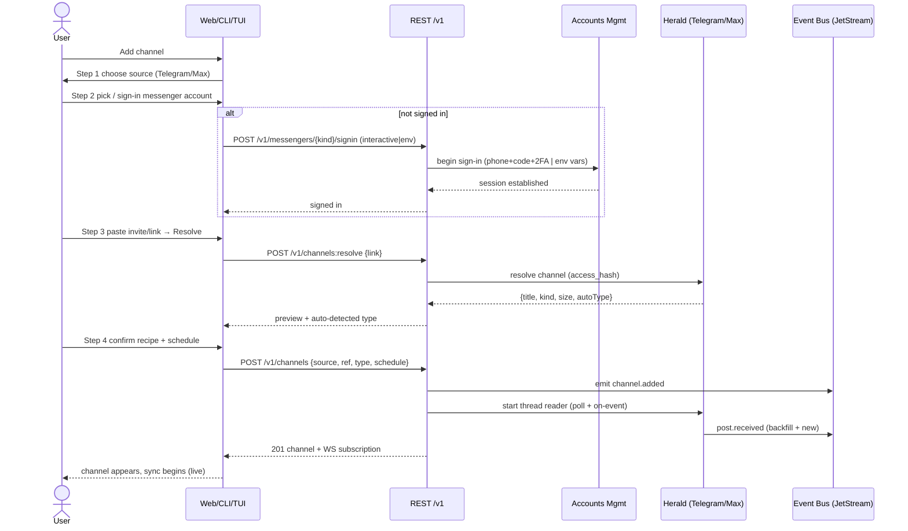
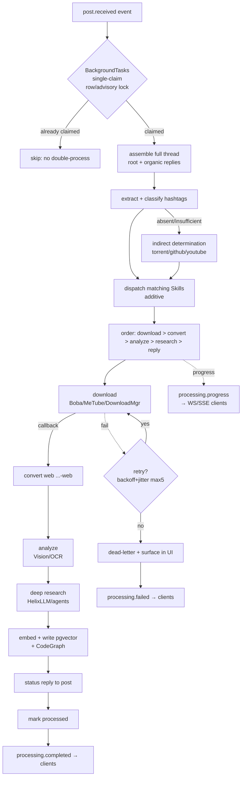
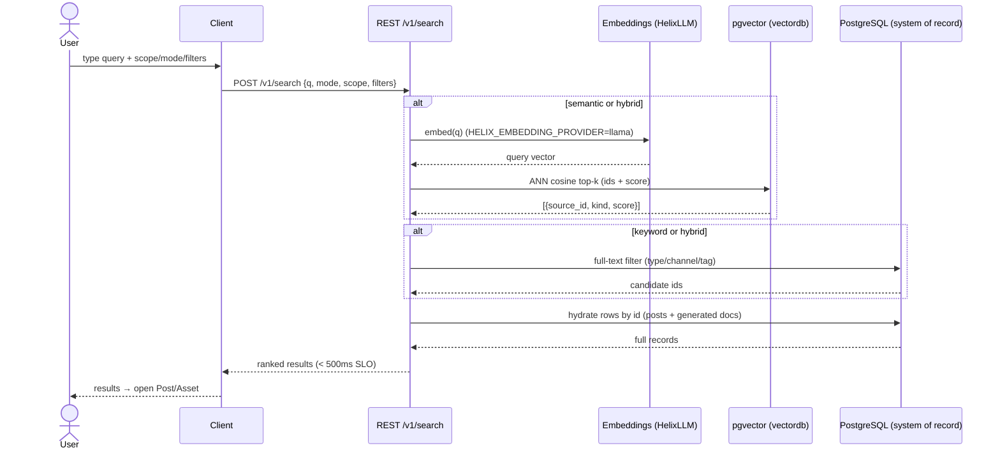
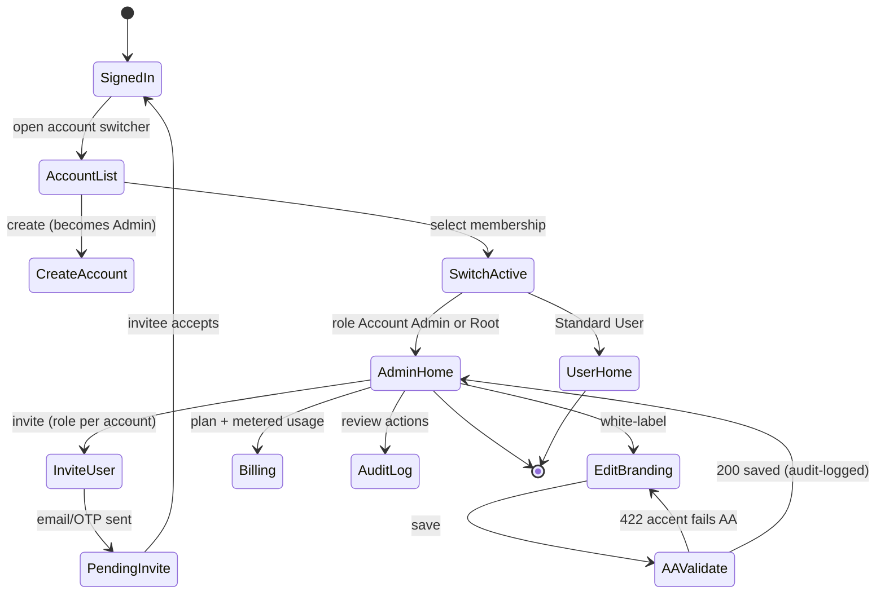

<!--
  Title           : Helix Thready — UX Flows (Key Journeys)
  Classification  : PUBLIC
  Location        : docs/public/research/mvp/design/ux-flows.md
  Status          : Draft — v0.1
  Revision        : 1 (2026-07-21)
  Author          : Helix Thready documentation swarm (design)
  Related         : ./index.md, ./wireframes.md, ../api/index.md,
                    ../architecture/index.md, ../CONVENTIONS.md
-->

# Helix Thready — UX Flows (Key Journeys)

| Rev | Date | Author | Change |
|-----|------|--------|--------|
| 1 | 2026-07-21 | swarm (design) | Initial complete draft: add channel, process post, search, manage account — with states, errors, event hooks |

## Table of contents

- [1. How to read these flows](#1-how-to-read-these-flows)
- [2. Add channel](#2-add-channel)
- [3. Process post](#3-process-post)
- [4. Search](#4-search)
- [5. Manage account](#5-manage-account)
- [6. Cross‑flow UX principles](#6-cross-flow-ux-principles)
- [7. Gaps & open items](#7-gaps--open-items)

## 1. How to read these flows

Each journey is a Mermaid diagram (sequence or state) + a multi‑paragraph prose explanation + a
sibling `.mmd`. Flows name the **REST endpoints** and **Event Bus events** the UI binds to (full
contract in [../api/index.md](../api/index.md)) and reference the concrete screens in
[wireframes.md](./wireframes.md). Every flow states its **happy path, error/empty states, and the
real‑time hook** that keeps the UI live. Endpoint/event names are `[DEFAULT — adjustable]` until the
API area finalizes them.

## 2. Add channel

Screens: [Add‑Channel wizard §3.4](./wireframes.md#34-channels-list--add-channel-wizard).

> Rendered PNG/SVG exported via Docs Chain (§11.4.65). Source: `diagrams/flow-add-channel.mmd`.

**Explanation (for readers/models that cannot see the diagram).** The user starts the Add‑Channel
wizard and picks a source messenger. In step 2 they select an already signed‑in messenger account
or sign one in; if signing in, the client calls `POST /v1/messengers/{kind}/signin`, and the
Accounts Management sub‑system runs the interactive flow (Telegram: phone + login code + optional
2FA via `gotd/td`) or a non‑interactive env‑var flow, establishing a session. In step 3 the user
pastes an invite/link and the client calls `POST /v1/channels:resolve`; Herald resolves the channel
(obtaining its `access_hash`) and returns a preview — title, kind, size, and an **auto‑detected**
content type — which the wizard shows so the user confirms rather than types. In step 4 the user
confirms (or overrides) the recipe/type and sets the schedule (poll interval and/or on‑event
trigger), and the client `POST /v1/channels`. The API emits `channel.added`, starts the Herald
thread reader (which backfills history and streams new posts as `post.received` onto the JetStream
Event Bus), and returns `201` with a WebSocket subscription so the new channel's sync progress
streams live into the UI.

**Error / empty states.** Sign‑in failures (wrong code, expired session, missing env vars) surface
inline with a `--danger` message and a retry; an unresolvable/invalid link returns `422` with a
reason; a private channel the account can't access returns `403` with guidance. If the auto‑type is
uncertain, the wizard defaults to "Notes/Everything" and flags it for review (never silently drops)
`[§Q32]`.

**Honesty.** Telegram resolution is real via `gotd/td` `[IN-HOUSE: herald]`, but the MTProto reader
is currently trapped in a QA harness and must be promoted to a first‑class channel
`[GAP: 5.1 herald]`. **Max is a stub** — the whole Max path is `[BUILD-NEW]`; the wizard shows a
clear "coming/setup" state for Max until the adapter lands.

## 3. Process post

Screens: [Post detail §3.6](./wireframes.md#36-post-detail-processing), Dashboard queue.

> Rendered PNG/SVG exported via Docs Chain (§11.4.65). Source: `diagrams/flow-process-post.mmd`.

**Explanation (for readers/models that cannot see the diagram).** A `post.received` event enters the
BackgroundTasks queue, which makes a **single claim** via a Postgres row/advisory lock — if the post
is already claimed (e.g. an event storm), the duplicate is skipped, guaranteeing no double
processing `[§3.3]`. The claimed worker assembles the **complete post** (root + the organic reply
chain, excluding the system's own replies), then extracts and classifies hashtags; when tags are
absent or insufficient it runs **indirect determination** (torrent→Torrent+ToDownload,
GitHub→research, YouTube→download+research). The matching Skills are dispatched **additively** and
run in the documented **precedence** — download > convert > analyze > research > reply — so, e.g.,
research can consume downloaded media. Downloads delegate to Boba/MeTube/the new Download Manager
and return via callback; converted `…-web` renditions, Vision/OCR analysis, and deep research
follow; results are embedded into pgvector (and CodeGraph where applicable); a status reply is
posted to the original thread; and the post is marked processed. Failures enter a retry loop
(exponential back‑off + jitter, max 5) and, if still failing, dead‑letter and surface in the UI.
Throughout, `processing.progress` events stream to WS/SSE clients; completion and failure emit
`processing.completed` / `processing.failed`, which drive the Dashboard queue and Post‑detail live
updates.

**UX states the user sees.** Per‑step progress bars (Post detail §3.6), a live Dashboard queue, an
inline **retry step** on failure, and — on completion — the generated assets/research appearing with
a toast. Because processing is async with progress events, the UI never blocks `[OPERATOR §Q14]`.

**Honesty.** The dispatch/execution engine is **BUILD‑NEW** — HelixSkills supplies the knowledge
DAG, not a runner `[GAP: 4.1 helix_skills]`. MeTube has **no completion webhook** yet (poll‑only)
`[GAP: 6.5]`; the flow assumes the BUILD‑NEW webhook. VisionEngine has **no OCR** engine
`[GAP: 2.6]`; the analyze step depends on the BUILD‑NEW Tesseract/PaddleOCR adapter. The UI is
specified against the target contract; the register tracks what must be built to make it real.

## 4. Search

Screens: [Search §3.7](./wireframes.md#37-search).

> Rendered PNG/SVG exported via Docs Chain (§11.4.65). Source: `diagrams/flow-search.mmd`.

**Explanation (for readers/models that cannot see the diagram).** The user enters a query and picks
scope (posts / generated docs / assets), mode (semantic / keyword / hybrid), and filters. The client
calls `POST /v1/search`. For semantic/hybrid, the API embeds the query through HelixLLM's real
embedding provider (`HELIX_EMBEDDING_PROVIDER=llama` — **not** the default hash stub) and asks
pgvector for the top‑k nearest by cosine distance, which returns **ids + scores only** (vectors are
reference‑only). For keyword/hybrid, the API runs a full‑text/metadata filter over the relational
store. Either way the API then **hydrates** the ids from PostgreSQL — the system of record — to
return full records (posts and generated docs together, per the "search over both" requirement).
Ranked results come back within the < 500 ms SLO and each routes to a Post or Asset detail.

**Error / empty states.** No results → an empty state with query‑refinement hints and recent
searches. A slow embedder → a skeleton with a graceful timeout and a "narrow your query" nudge.
Filters that exclude everything → a "clear filters" affordance.

**Honesty — the single most important semantic‑search trap.** HelixLLM's **default local embedder is
a non‑semantic `HashEmbedder` stub** that silently returns garbage relevance `[GAP: 2.1 HelixLLM
P0]`. This flow **requires** `HELIX_EMBEDDING_PROVIDER=llama` (a real embedding GGUF) and a contract
test on the `/v1/embeddings` shape before search can be trusted `[GAP: 2.1/2.7]`. The UI must not
present relevance scores from the stub as meaningful.

## 5. Manage account

Screens: [Admin §3.10](./wireframes.md#310-admin-accounts-users-billing-audit),
[Settings › Branding §3.11](./wireframes.md#311-settings--branding--messenger-accounts).

> Rendered PNG/SVG exported via Docs Chain (§11.4.65). Source: `diagrams/flow-manage-account.mmd`.

**Explanation (for readers/models that cannot see the diagram).** A signed‑in user opens the account
switcher and sees their memberships (a user may belong to multiple Accounts §6.1). They can create a
new Account (becoming its Admin) or switch the active Account; the destination depends on their role
for that Account — Account Admin (or Root) lands on the Admin home, a Standard User on the consumer
home. From the Admin home an admin can invite users (role assigned **per Account**), sending an
email/OTP invite that moves to a pending state until the invitee accepts. An admin can edit
white‑label branding; on save the server **AA‑validates** the accent — a failing accent returns
`422` and the editor shows the ratio + suggestion, while a passing save returns `200` and is
**audit‑logged**. The admin can also review billing (subscription + metered usage) and the
append‑only audit log. Standard Users see only their consumer home.

**Error / empty / permission states.** RBAC hides Admin from Standard Users (and the API rejects
with `403` defensively). Invite to an already‑member email → idempotent no‑op with a notice. The
last Root Admin cannot be demoted/removed (guard). Branding save is optimistic with rollback on
`422`.

**Honesty.** Auth/RBAC builds on `digital.vasic.auth` (JWT default HMAC‑SHA256; needs RS256/EdDSA +
JWKS for multi‑service) `[GAP: 7.2 auth]` and the BUILD‑NEW User Service (three‑tier RBAC on
`auth` + `security/pkg/policy` + Catalogizer pattern) `[§4.2.1]`. Whether Account Admins may edit
their own branding (not only Root) is `[OPEN: THREADY-DES-06]`.

## 6. Cross‑flow UX principles

Applied to every journey (bleeding‑edge enterprise usability per the request):

1. **Optimistic + live.** Mutations are optimistic where safe; the truth arrives via WS/SSE events,
   so the UI is never stale and never blocks on long work.
2. **Progressive disclosure.** Wizards (Add‑Channel) and drawers (Asset detail) reveal complexity
   step‑by‑step; defaults are auto‑detected so the user confirms rather than configures.
3. **Never silently drop.** Unknown types → "Notes/Everything" + review queue `[§Q32]`; failures →
   retry + dead‑letter surfaced in UI.
4. **Forms: validation, hints, tooltips** `[§10.3]` — inline validation (`--danger`, never
   `--accent`), field hints, and tooltips on every non‑obvious control.
5. **Accessible + localized** — every flow is keyboard‑complete, SR‑labeled, and localized
   (en/ru/sr‑Cyrl); errors are announced via live regions.
6. **Motion with meaning** — transitions (150/200ms tokens; larger choreographed in prototypes)
   reinforce state changes (enter/exit, skeleton→content, processing pulse), always honoring
   `prefers-reduced-motion`.
7. **Identical across surfaces** — Web, CLI, TUI and Mobile drive the *same* endpoints/events, so a
   flow behaves the same everywhere (the SDK is shared).

## 7. Gaps & open items

- `[GAP: 5.1 herald / Max]`, `[GAP: 4.1 helix_skills]`, `[GAP: 6.5 MeTube webhook]`,
  `[GAP: 2.6 VisionEngine OCR]`, `[GAP: 2.1 HelixLLM embedder]`, `[GAP: 7.2 auth]` — each flow
  depends on one or more BUILD‑NEW/hardening items; called out inline so no flow is presented as
  working when its backend is a stub.
- `[OPEN: THREADY-DES-06]` — delegated (Account‑Admin) self‑branding vs. Root‑only.
- `[OPEN: THREADY-DES-10]` — finalize endpoint/event names with the API area (these are
  `[DEFAULT — adjustable]`).

---

*Made with love ♥ by Helix Development.*
