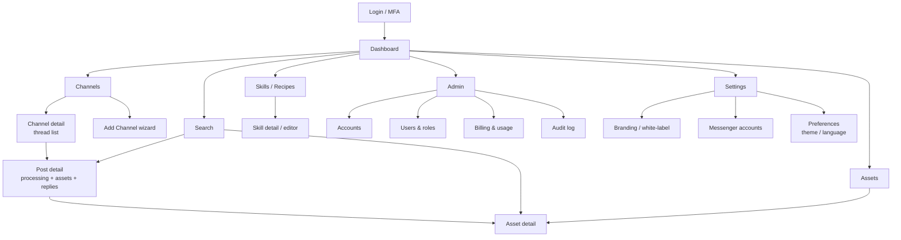
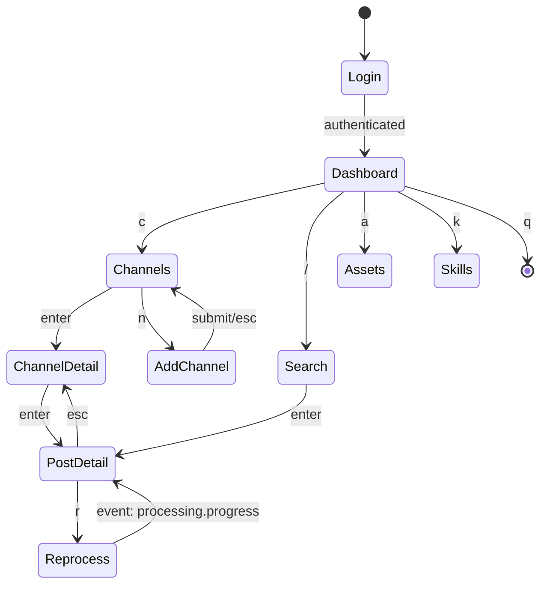
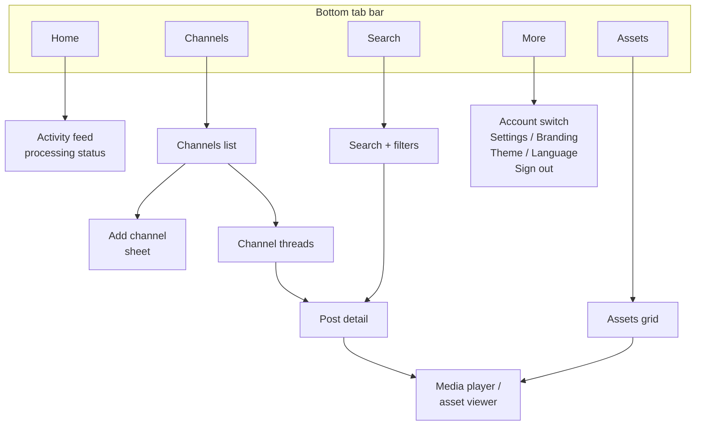

<!--
  Title           : Helix Thready — Wireframes (Web · CLI/TUI · Mobile)
  Classification  : PUBLIC
  Location        : docs/public/research/mvp/design/wireframes.md
  Status          : Draft — v0.1
  Revision        : 1 (2026-07-21)
  Author          : Helix Thready documentation swarm (design)
  Related         : ./index.md, ./ux-flows.md, ./component-library.md,
                    ../api/index.md, ../architecture/index.md, ../CONVENTIONS.md
-->

# Helix Thready — Wireframes (Web · CLI/TUI · Mobile)

| Rev | Date | Author | Change |
|-----|------|--------|--------|
| 1 | 2026-07-21 | swarm (design) | Initial complete draft: web portal IA + screen wireframes, CLI command tree, TUI layouts, mobile wireframes |
| 2 | 2026-07-21 | swarm (design · review) | Second-pass review: fixed Add‑Channel flow anchor (`#2-add-channel`) |

## Table of contents

- [1. Conventions & responsive breakpoints](#1-conventions--responsive-breakpoints)
- [2. Web portal — information architecture](#2-web-portal--information-architecture)
- [3. Web portal — screen wireframes](#3-web-portal--screen-wireframes)
  - [3.1 App shell](#31-app-shell)
  - [3.2 Login / MFA](#32-login--mfa)
  - [3.3 Dashboard](#33-dashboard)
  - [3.4 Channels list & Add‑Channel wizard](#34-channels-list--add-channel-wizard)
  - [3.5 Channel detail (thread list)](#35-channel-detail-thread-list)
  - [3.6 Post detail (processing)](#36-post-detail-processing)
  - [3.7 Search](#37-search)
  - [3.8 Assets](#38-assets)
  - [3.9 Skills / Recipes](#39-skills--recipes)
  - [3.10 Admin (Accounts, Users, Billing, Audit)](#310-admin-accounts-users-billing-audit)
  - [3.11 Settings — Branding & Messenger accounts](#311-settings--branding--messenger-accounts)
- [4. CLI](#4-cli)
- [5. TUI](#5-tui)
- [6. Mobile wireframes](#6-mobile-wireframes)
- [7. Gaps & open items](#7-gaps--open-items)

## 1. Conventions & responsive breakpoints

Wireframes are drawn as **monospace block layouts** (unambiguous in plain text and reviewable in
diffs) plus **Mermaid** navigation/screen maps (each followed by the mandatory prose explanation
and saved as a sibling `.mmd`). They are **low‑fidelity structure**, not final visuals — final
visuals live in Figma ([prototypes.md](./prototypes.md)). Every block references design‑system
components (`.ds-*`, see [component-library.md](./component-library.md)) and API endpoints/events
(see [../api/index.md](../api/index.md)).

Breakpoints (from `core.css` container/gutter tokens): **phone** < 768px, **tablet** 768–1024px,
**desktop** ≥ 1024px (`--container-max 1200px`). The web app is a responsive single codebase; the
Tauri desktop client wraps it with OS chrome only.

## 2. Web portal — information architecture



> Rendered PNG/SVG exported via Docs Chain (§11.4.65). Source: `diagrams/web-portal-ia.mmd`.

**Explanation (for readers/models that cannot see the diagram).** After Login/MFA the user lands on
the Dashboard, the hub from which seven primary areas branch: Channels, Search, Assets,
Skills/Recipes, Admin, and Settings. Channels leads to the Add‑Channel wizard and to a Channel
detail (the thread list); a thread opens a Post detail, which shows processing status, generated
assets and replies, and links onward to an Asset detail. Search reaches both Post detail and Asset
detail (it queries posts and generated materials). Assets is the media library and also reaches
Asset detail. Skills/Recipes lists the processing recipes and opens a Skill detail/editor. Admin —
visible per RBAC tier — contains Accounts, Users & roles, Billing & usage, and the Audit log.
Settings contains Branding/white‑label, the Messenger accounts management, and per‑user Preferences
(theme, language). This map is the navigation contract the app shell (§3.1) implements.

## 3. Web portal — screen wireframes

### 3.1 App shell

The persistent frame: top bar (product logo, global search, theme toggle, language picker, account
switcher, user menu) + collapsible left nav + content region.

```text
┌──────────────────────────────────────────────────────────────────────────────┐
│ [◫ Thready]   [🔍 global search…            ]     [☀/☾/⚙] [🌐 EN] [Acct ▾] [◕▾] │  ← .ds-nav
├───────────┬──────────────────────────────────────────────────────────────────┤
│ ▤ Dashboard│                                                                    │
│ # Channels │   <content region>                                                 │
│ 🔍 Search  │                                                                    │
│ ⬒ Assets   │                                                                    │
│ ✦ Skills   │                                                                    │
│ ⚙ Settings │                                                                    │
│ ⛨ Admin    │                                                                    │
├───────────┴──────────────────────────────────────────────────────────────────┤
│  Helix Development ◈   Made with ♥ by Helix Development        v1.0 · © 2026    │  ← .ds-footer
└──────────────────────────────────────────────────────────────────────────────┘
```

**Explanation.** The top bar is the shared `.ds-nav`: product mark (Account‑branded when
white‑labeled), a global semantic‑search field (routes to §3.7), the `ds-theme-toggle`, the
`ds-language-picker`, an **account switcher** (a user may belong to multiple Accounts — §6.1), and
the user menu. The left nav lists the primary areas from §2, filtered by RBAC (Admin hidden for
Standard Users). The footer is the shared `.ds-footer` carrying the locked Helix Development
attribution + slogan (§brand-assets §8). On phones the left nav collapses to a hamburger and the
global search collapses to an icon.

### 3.2 Login / MFA

```text
                 ┌───────────────────────────────────┐
                 │            ◫  Thready             │
                 │      read your threads, smarter    │
                 │  ┌─────────────────────────────┐  │
                 │  │ Email / username            │  │  .ds-input
                 │  ├─────────────────────────────┤  │
                 │  │ Password                    │  │  .ds-input
                 │  └─────────────────────────────┘  │
                 │  [  Sign in  ]  .ds-btn--primary  │
                 │  Forgot password?  ·  SSO/OAuth2   │
                 └───────────────────────────────────┘
   step 2 (admin tiers): ┌───────────────────────────┐
                         │  Enter 6-digit TOTP code   │  ← MFA mandatory for
                         │  [_ _ _  _ _ _]  [Verify]  │     Root/Account Admin
                         └───────────────────────────┘
```

**Explanation.** Email/username + password (`.ds-input`), Argon2id‑hashed server‑side, min‑12 +
breach‑check `[CONSTITUTION §6.3]`. Primary CTA is `.ds-btn--primary`. OAuth2 links external
services. For **Root Admin / Account Admin**, MFA (TOTP) is a **mandatory** second step; optional
for Standard Users `[DEFAULT — adjustable, §6.3/Q9]`. Errors use `--danger` inline (never
`--accent`). Session policy: access 15 min / refresh 7 d / idle 30 min `[§6.3]`.

### 3.3 Dashboard

```text
┌ Dashboard ───────────────────────────────────────────────────────────────────┐
│  ┌ Channels ─┐ ┌ Posts today ┐ ┌ Processing ┐ ┌ Assets ─┐   ← .ds-card stat row│
│  │   128     │ │   1,204     │ │  17 active │ │ 42.1 TB │                       │
│  └───────────┘ └─────────────┘ └────────────┘ └─────────┘                       │
│  ┌ Live activity (WS/SSE) ───────────────────┐ ┌ Processing queue ───────────┐  │
│  │ • #Research post processed   2s ago  ✓    │ │ ▓▓▓▓▓▓░░░░ downloading  63% │  │
│  │ • #Video download started    9s ago  ⭮    │ │ ▓▓▓░░░░░░░ research      31% │  │
│  │ • #Comic OCR complete       34s ago  ✓    │ │ ⚠ 1 failed → retry          │  │
│  └───────────────────────────────────────────┘ └─────────────────────────────┘  │
│  ┌ Recent threads ──────────────────────────────────────────────────────────┐   │
│  │ Channel        Root post (excerpt)          Tags          Status          │   │
│  │ #ml-papers     "New paper on…"  ↩12          #Research     ✓ processed     │   │
│  │ #films         magnet:?xt=…                  #Movie #ToDl  ⭮ downloading   │   │
│  └───────────────────────────────────────────────────────────────────────────┘   │
└────────────────────────────────────────────────────────────────────────────────┘
```

**Explanation.** A stat‑card row (`.ds-card`) summarizes the Account's footprint. The **Live
activity** panel subscribes to the Event Bus over **WebSocket/SSE** (`post.received`,
`processing.progress`, `processing.completed`, `processing.failed`) so it updates in real time
without polling `[§API real‑time]`. The **Processing queue** shows per‑job progress bars (download /
convert / analyze / research phases) with an inline **retry** affordance for failures (`--danger`
badge → retry). The **Recent threads** table previews each thread's root excerpt, reply count
(↩N), detected tags, and processing status; a row opens Post detail (§3.6). Aggressive SLO: the
page target is < 1.5 s and API calls p95 < 150 ms `[OPERATOR §Q14]`.

### 3.4 Channels list & Add‑Channel wizard

```text
┌ Channels ───────────────────────────────[ + Add channel ] .ds-btn--primary ────┐
│ Filter: [ all ▾ ] [ Telegram ▾ ] [ status ▾ ]     Sort: [ recent ▾ ]           │
│ ┌───────────────────────────────────────────────────────────────────────────┐ │
│ │ ⬤ #ml-papers      Telegram   auto: Research   128 posts   ✓ healthy   ⋯    │ │
│ │ ⬤ #films          Telegram   auto: Movies     94 posts    ⭮ syncing   ⋯    │ │
│ │ ⬤ Max: dev-notes  Max        auto: Notes      —           ⚠ auth       ⋯    │ │
│ └───────────────────────────────────────────────────────────────────────────┘ │
└────────────────────────────────────────────────────────────────────────────────┘

Add channel wizard (modal / route):
  Step 1 Source     ( ) Telegram   ( ) Max            → picks messenger adapter
  Step 2 Account    [ select signed-in messenger account ▾ ]  or  [ + sign in ]
  Step 3 Target     [ paste invite/link t.me/… or max.ru/join/… ] [ Resolve ]
                     ↳ resolved: "ML Papers" · public channel · 128 msgs
  Step 4 Recipes    auto-detected type: Research  [override ▾]   schedule: [poll 5m ▾] [+ on-event]
  Step 5 Confirm    [ Add channel ] .ds-btn--primary
```

**Explanation.** The list shows each channel's messenger, **auto‑detected content type**, post
count, health, and an overflow menu (⋯: pause, re‑detect, remove). The **Add‑Channel wizard**
(driven by the [ux-flows.md](./ux-flows.md#2-add-channel) journey) is five steps: choose the source
messenger; pick or interactively/non‑interactively sign in a messenger account (Accounts Management
sub‑system); paste + **Resolve** the invite/link (previews resolved title/kind/size); review the
**auto‑detected** recipe/type with an override, and set the schedule (poll interval and/or
on‑event trigger); confirm. A "Max: auth" warning state demonstrates a channel needing re‑auth —
its row surfaces a fix action. Note the Max adapter is `[GAP: 5.1 herald — Max stub]`: the UI is
specified now; the adapter is BUILD‑NEW.

### 3.5 Channel detail (thread list)

```text
┌ #ml-papers  ·  Telegram  ·  type: Research  [edit]  ·  poll 5m + on-event ─────┐
│ [ ⭮ Re-sync ] [ ⏸ Pause ] [ ⚙ Recipes ]                     search in channel 🔍│
│ ┌ Thread ─────────────────────────────────────────────────────────────────────┐│
│ │ ▸ "Diffusion models for…"     ↩ 12 replies   #Research #TODO   ✓ processed   ││
│ │ ▸ "magnet:?xt=urn:btih:…"     ↩ 3            #Movie #ToDownload ⭮ 63%         ││
│ │ ▸ "https://youtu.be/…"        ↩ 0            #Video (indirect) ◷ queued       ││
│ └─────────────────────────────────────────────────────────────────────────────┘│
└────────────────────────────────────────────────────────────────────────────────┘
```

**Explanation.** Header shows the channel's messenger, auto/overridden type, and schedule. Each row
is a **complete post** = root + its **organic reply chain** (↩N), the extracted/derived hashtags
(with an "indirect" badge when tags were AI‑derived — §3.5 of the request), and processing status.
Expanding (▸) reveals the reply chain inline; the system's own status replies are visually
separated and **excluded from processing**. A row opens Post detail.

### 3.6 Post detail (processing)

```text
┌ Post · #ml-papers ─────────────────────────────────────────── [ ⭮ Reprocess ] ─┐
│ ROOT  @author · 2026-07-20 14:02                                                │
│ "New paper on diffusion… https://github.com/x/y  https://youtu.be/z"            │
│ Tags: #Research #Video #TODO #ToDownload   (● direct  ○ indirect: #Video)       │
│ ┌ Thread (organic replies ↩12) ──────┐ ┌ Processing ───────────────────────────┐│
│ │ ↳ @b "see also …"                   │ │ ▸ classify        ✓                    ││
│ │ ↳ @c "#ToDownload"                  │ │ ▸ download (MeTube/Boba)  ▓▓▓▓░ 63%    ││
│ │ …                                   │ │ ▸ convert  …-web          ◷ queued     ││
│ │ (system replies hidden ▾)           │ │ ▸ research (deep)         ◷ queued     ││
│ └─────────────────────────────────────┘ │ ▸ reply status            ◷ queued     ││
│ ┌ Generated assets ───────────────────┐ │ precedence: download>convert>analyze  ││
│ │ ⬒ video.mp4  ⬒ video-web.mp4        │ │            >research>reply            ││
│ │ ⬒ research.md (semantic-indexed)     │ └───────────────────────────────────────┘│
│ └─────────────────────────────────────┘   ⚠ failed step → [ retry step ]         │
└────────────────────────────────────────────────────────────────────────────────┘
```

**Explanation.** The root post, its links, and its tags (marking **direct** vs. AI‑**indirect**
tags). The **Thread** panel shows organic replies with system replies collapsed. The **Processing**
panel shows the ordered pipeline — classify → download → convert (`…-web`) → research → reply — with
the documented **precedence** (download > convert > analyze > research > reply) and per‑step status
via `processing.progress` events; a failed step exposes **retry step** (idempotent single‑claim, so
retry never double‑processes) `[§3.3]`. **Generated assets** link to the Asset detail (raw + `…-web`
rendition + generated research). **Reprocess** triggers an explicit refresh (client → REST → System)
`[§3.2.3]`.

### 3.7 Search

```text
┌ Search ────────────────────────────────────────────────────────────────────────┐
│ [ semantic query: "papers about retrieval-augmented generation"        ] [Go]   │
│ Filters: [ posts ☑ ] [ generated docs ☑ ] [ assets ☐ ]  type[▾] channel[▾] tag[▾]│
│ Mode: ( ● semantic  ○ keyword  ○ hybrid )        sort: [ relevance ▾ ]           │
│ ┌ Results (semantic < 500ms) ─────────────────────────────────────────────────┐ │
│ │ 0.94  #ml-papers  "RAG survey…"        #Research   ↗ open post               │ │
│ │ 0.91  research.md "…retrieval augmented…" (generated)  ↗ open doc            │ │
│ │ 0.88  #nlp        "dense retrieval…"    #Research   ↗ open post              │ │
│ └──────────────────────────────────────────────────────────────────────────────┘│
└────────────────────────────────────────────────────────────────────────────────┘
```

**Explanation.** The Lumen‑style semantic search over **both** original posts **and** generated
materials `[§1.3]`. Users choose scope (posts / generated docs / assets), a mode (semantic /
keyword / hybrid), and filters (type, channel, tag). Results show a relevance score and route to
Post or Asset detail. SLO: semantic search < 500 ms `[OPERATOR §Q14]`; results hydrate ids from the
relational store (vectors are reference‑only) `[§2.1.1]`.

### 3.8 Assets

```text
┌ Assets ─────────────────────────────────────────[ grid ▦ | list ☰ ] filter[▾] ─┐
│ ▦ video-web.mp4   ▦ movie.mkv     ▦ cover.jpg     ▦ book.pdf     ▦ track.flac   │
│    linked: post…     #Movie          OCR ✓            author…        #Music      │
│ Asset detail (drawer): raw + …-web renditions · checksum · linked post(s) ·      │
│   [ ⭳ re-download ] (if broken link)  [ ▶ stream ] (Range/HLS)  [ 🔒 sensitive ] │
└────────────────────────────────────────────────────────────────────────────────┘
```

**Explanation.** The media library (Asset Service, Catalogizer‑backed). Grid/list toggle; each tile
shows the linked post and type. The Asset **detail** drawer exposes raw + `…-web` renditions, the
content‑hash checksum, linked posts, a **re‑download** action for broken physical links (via REST),
streaming (Range/`OpenSeekable` + HLS/DASH), and a **sensitive** lock for encrypted assets
(credit‑cards/contracts/QR) `[§7]`. Client links resolve **through** the Asset Service, never raw
paths `[§7.1]`.

### 3.9 Skills / Recipes

```text
┌ Skills / Recipes ───────────────────────────────────[ + New recipe ] ──────────┐
│ Graph view: atomic → composite → umbrella   |   list ☰                          │
│ ┌ Recipe: Research (#Research) ───────────────────────────────────────────────┐ │
│ │ triggers: #Research, GitHub link, IT content    order: research > reply      │ │
│ │ steps: web-research(multi-pass) → docs gen → skill-graph grow → semantic idx │ │
│ │ [ edit ]  [ test on sample post ]  version: v3  ✎ last edited by root        │ │
│ └──────────────────────────────────────────────────────────────────────────────┘│
└────────────────────────────────────────────────────────────────────────────────┘
```

**Explanation.** Recipes map hashtag/content‑type → Skill(s). The editor shows triggers, the
ordered steps, and version. **Important honesty:** HelixSkills provides the Skill‑Graph knowledge
DAG but **no execution engine** — the Thready dispatch engine is BUILD‑NEW `[GAP: 4.1 helix_skills]`.
This screen is the management surface for that dispatch mapping; it does not imply the engine
exists yet. "Test on sample post" exercises the dispatch against a fixture.

### 3.10 Admin (Accounts, Users, Billing, Audit)

```text
┌ Admin ──────────────────────────────────────────────────────────────────────────┐
│ [ Accounts ] [ Users & roles ] [ Billing & usage ] [ Audit log ]                 │
│ Users & roles:                                                                    │
│  User            Account(s)         Role              MFA    Status               │
│  root@…          (all)              Root Admin        ✓      active               │
│  alice@…         Acme, ML           Account Admin     ✓      active               │
│  bob@…           ML                 Standard User     —      invited              │
│  [ + Invite user ]   [ edit roles ]                                               │
│ Billing & usage:  plan[ Pro ▾ ]  metered: 1.2M posts · 42 TB · [ view invoices ] │
└────────────────────────────────────────────────────────────────────────────────┘
```

**Explanation.** The three‑tier RBAC (Root / Account Admin / Standard User) surface `[§6.1]`. A
user may belong to multiple Accounts; role is per‑Account. Invites, role edits, and MFA status are
shown. Billing shows the **subscription + metered** model `[OPERATOR §Q11]` (usage: posts, storage)
and invoices. The **Audit log** tab is an append‑only, queryable view of all admin/user actions
`[§14.4]`. Admin is RBAC‑gated (hidden for Standard Users).

### 3.11 Settings — Branding & Messenger accounts

```text
┌ Settings › Branding (white-label) ───────────────────────────────────────────────┐
│ Effective for account: [ Acme ▾ ]        (Root/Account-Admin only)                │
│ Primary  [#12A3FF ▣]  Secondary [#0D6EFD ▣]  Accent(light)[#0B5ED7 ▣] AA:6.1 ✓    │
│ Accent(dark) [#7DB3FF ▣] AA:7.2 ✓                                                 │
│ Product logo:  [ light.svg ⬆ ]  [ dark.svg ⬆ ]   (transparent)                    │
│ Slogan: [ Acme reads your threads              ]                                   │
│ ⓘ Helix Development attribution is always shown in footers (locked).              │
│ [ Live preview ▸ ]                    [ Save ] (rejects AA-failing accent → 422)   │
├───────────────────────────────────────────────────────────────────────────────────┤
│ Settings › Messenger accounts                                                     │
│  Telegram: @me (session ✓)   [ re-auth ]      Max: (not signed in) [ sign in ]     │
│  Sign-in: ( ) interactive (phone+code+2FA)  ( ) non-interactive (env vars)         │
└────────────────────────────────────────────────────────────────────────────────┘
```

**Explanation.** The white‑label editor (see [theming.md](./theming.md)): color swatches with
**live AA readout**, light+dark product‑logo upload, slogan; a locked note that Helix Development
attribution persists; a **live preview**; and a Save that server‑side **rejects AA‑failing accents
(422)**. The **Messenger accounts** panel is the Accounts Management sub‑system: per‑messenger
interactive (phone/code/2FA) or non‑interactive (env‑var) sign‑in, with re‑auth. Telegram is
live via `gotd/td` `[IN-HOUSE: herald]`; Max is `[GAP: 5.1 — BUILD‑NEW]`.

## 4. CLI

Everything the TUI/Web can do, headless, for pipelines `[§10.1]`. Go + Cobra, sharing the SDK.
Command tree `[DEFAULT — adjustable]`:

```text
thready
├── auth        login | logout | mfa | whoami | token create --scope …
├── account     list | switch | create | branding get|set
├── channel     list | add --source telegram --link … | detail <id> | pause | resync | rm
├── messenger   login <telegram|max> [--interactive|--env] | status
├── post        list --channel <id> | show <id> | reprocess <id> | replies <id>
├── search      "<query>" [--semantic|--keyword|--hybrid] [--scope posts,docs,assets] --json
├── asset       list | show <id> | download <id> | redownload <id> | stream <id>
├── skill       list | show <id> | test <id> --post <id>
├── user        list | invite --account <id> --role … | role set …
├── billing     usage | invoices
└── events      tail [--type processing.*] [--channel <id>]      # live WS/SSE stream
```

**Explanation.** Verbs mirror the web IA. `--json` on every read makes the CLI pipeline‑friendly
(the operator's **Web + CLI first** priority `[OPERATOR §Q13]`). `thready events tail` subscribes to
the real‑time bus so scripts can react to `processing.completed`. Auth uses **scoped API keys** for
non‑interactive use `[§6.3]`. The CLI and TUI share one Go SDK, so behavior is identical.

## 5. TUI

Bubble Tea + Cobra + **Lipgloss** (as in `helix_track/llms_verifier/.../tui` `[VERIFIED — IN-HOUSE]`),
styled from the Thready Lipgloss palette (§ design‑system.md §7).



> Rendered PNG/SVG exported via Docs Chain (§11.4.65). Source: `diagrams/tui-navigation.mmd`.

**Explanation (for readers/models that cannot see the diagram).** The TUI is a keyboard‑driven state
machine. Login transitions to Dashboard on auth. Single‑key shortcuts jump between areas: `c`
Channels, `/` Search, `a` Assets, `k` Skills. `enter` drills into a Channel then a Post; `esc`
walks back. `n` opens the Add‑Channel form (submit or `esc` returns). From a Post, `r` triggers
Reprocess, and incoming `processing.progress` events update the same Post view live (the TUI holds a
WS/SSE subscription). `q` quits from the Dashboard. This mirrors the web IA (§2) so muscle memory
transfers.

TUI layout (Dashboard):

```text
┌ Thready ── acct: Acme ── ☾ dark ───────────────────────────── [q]uit [?]help ┐
│ Channels 128 │ Live:                                                          │
│  c channels  │  ✓ #Research processed        2s                              │
│  / search    │  ⭮ #Video download 63%        9s   ▓▓▓▓▓▓░░░░                  │
│  a assets    │  ⚠ #Movie failed → r retry   34s                              │
│  k skills    │ ── recent threads ──                                          │
│              │  #ml-papers  "Diffusion…"  ↩12  #Research  ✓                  │
│              │  #films      magnet:…       ↩3   #Movie    ⭮                  │
└──────────────┴──────────────────────────────────────────────────────────────┘
 Made with ♥ by Helix Development
```

**Explanation.** A left key‑hint rail + a live pane (WS/SSE) and a threads table — the same
information as the web Dashboard, in Lipgloss styles bound to the Thready palette. The heart in the
footer uses the `U+2665` glyph tinted with the Lipgloss `Accent` (§brand-assets §8).

## 6. Mobile wireframes

Native per platform (Compose/Android, SwiftUI/iOS, ArkTS/HarmonyOS, Qt/Aurora) + KMP shared logic
`[§10.1]`. Bottom‑tab navigation.



> Rendered PNG/SVG exported via Docs Chain (§11.4.65). Source: `diagrams/mobile-navigation.mmd`.

**Explanation (for readers/models that cannot see the diagram).** Mobile uses a five‑item bottom tab
bar: Home (a real‑time activity/processing feed), Channels (list → add‑channel bottom sheet, or a
channel's thread list → Post detail → media player/asset viewer), Search (query + filters → Post
detail), Assets (a media grid → viewer), and More (account switch, Settings incl. Branding, theme
and language, sign out). The information architecture is the same as web/TUI, re‑laid for touch: the
Add‑Channel wizard becomes a bottom sheet, and media opens a full‑screen player.

```text
Home tab                     Channels tab                Post detail
┌───────────────┐            ┌───────────────┐           ┌───────────────┐
│ Thready   ☾ 🌐│            │ Channels   +  │           │ ‹ #ml-papers  │
│ ─ Live ────── │            │ #ml-papers ✓  │           │ @author 14:02 │
│ ✓ Research 2s │            │ #films     ⭮  │           │ "New paper…"  │
│ ⭮ Video 63%   │            │ Max dev   ⚠   │           │ #Research#Vid │
│   ▓▓▓▓▓░░      │            │ ───────────── │           │ ▸ download 63%│
│ ⚠ Movie retry │            │ (tap → threads)│           │ ▸ research ◷  │
│ ─ Threads ─── │            └───────┬───────┘           │ ⬒ video-web   │
│ #ml "Diff…"↩12│            [Home][Ch][🔍][⬒][•••]       │ [ Reprocess ] │
└───────────────┘                                        └───────────────┘
```

**Explanation.** Touch‑sized rows, a bottom tab bar, and a full Post detail with the same processing
pipeline and reprocess action. Compose/SwiftUI read the effective Account branding at login (§
theming §8).

> **Release gate (honesty).** Two gaps **block a production mobile release** and are called out on
> every mobile screen that stores secrets or targets HarmonyOS/Aurora:
> `[GAP: 7.3 Security-KMP]` mobile secure storage is an **in‑memory stub** (Keychain/KeyStore must
> be implemented — shipping on the stub would store tokens in plaintext memory), and
> `[GAP: 8.5 helix_shims / HarmonyOS+Aurora clients]` those native clients are **skeletons**. The
> wireframes are design‑complete; the platforms are not build‑ready.

## 7. Gaps & open items

- `[GAP: 5.1 herald — Max stub]` — Add‑Channel and Messenger‑accounts screens include Max now; the
  adapter is BUILD‑NEW. UI shows a clear "not signed in / auth" state until it lands.
- `[GAP: 4.1 helix_skills]` — the Skills/Recipes screen manages a dispatch mapping that needs the
  BUILD‑NEW Thready dispatch engine; the screen does not imply the engine exists.
- `[GAP: 7.3 Security-KMP]`, `[GAP: 8.5 HarmonyOS/Aurora]` — mobile release gates (above).
- `[OPEN: THREADY-DES-08]` — confirm whether Desktop (Tauri) needs any screen beyond the wrapped web
  UI (e.g. native tray/notifications for processing completion).
- `[OPEN: THREADY-DES-09]` — high‑fidelity Figma frames for every screen above are produced in
  [prototypes.md](./prototypes.md); these low‑fi wireframes are the structural contract they refine.

---

*Made with love ♥ by Helix Development.*
