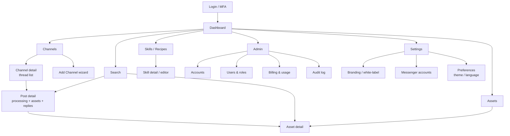
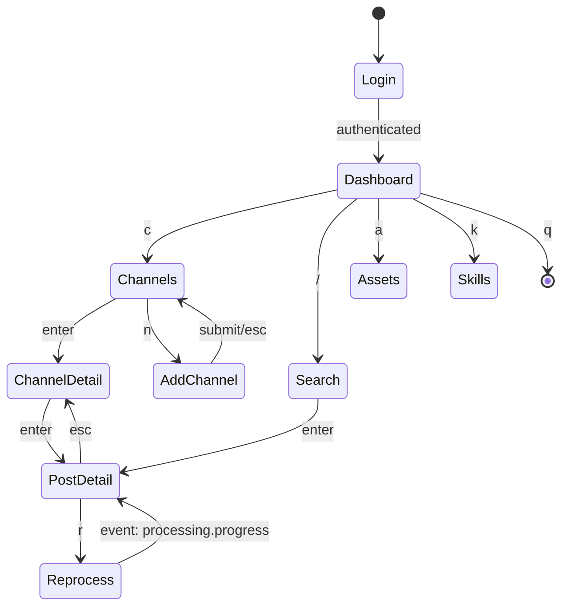
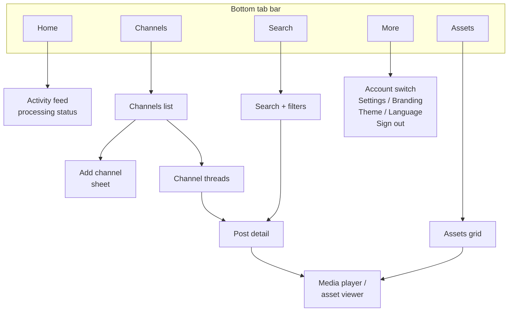
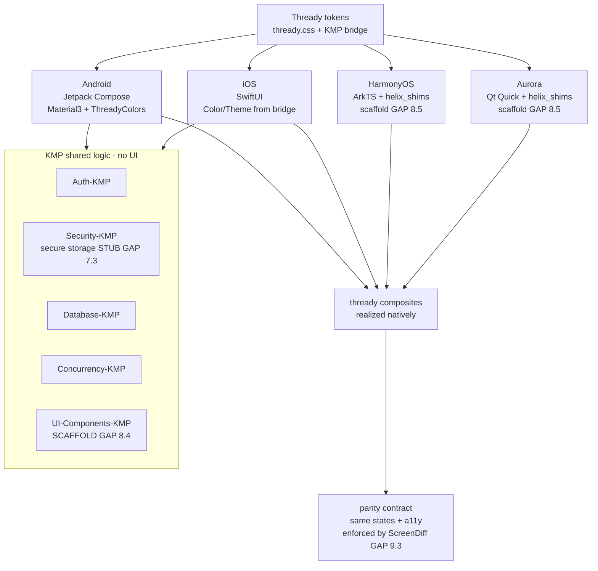

<!--
  Title           : Helix Thready — Wireframes (Web · CLI/TUI · Mobile)
  Classification  : PUBLIC
  Location        : docs/public/research/mvp/design/wireframes.md
  Status          : Draft — v0.1
  Revision        : 1 (2026-07-21)
  Author          : Helix Thready documentation swarm (design)
  Related         : ./index.md, ./ux-flows.md, ./component-library.md,
                    ../api/index.md, ../architecture/index.md, ../CONVENTIONS.md
-->

# Helix Thready — Wireframes (Web · CLI/TUI · Mobile)

| Rev | Date | Author | Change |
|-----|------|--------|--------|
| 1 | 2026-07-21 | swarm (design) | Initial complete draft: web portal IA + screen wireframes, CLI command tree, TUI layouts, mobile wireframes |
| 2 | 2026-07-21 | swarm (design · review) | Second-pass review: fixed Add‑Channel flow anchor (`#2-add-channel`) |
| 3 | 2026-07-22 | swarm (design · Pass 3) | Depth pass: global interaction-state + keyboard model (§1.1–1.3); per-screen validation/state tables for Login, Dashboard, Add‑Channel, Post detail, Search, Branding; CLI global flags + exit-code + `--json`/`--output` contract (§4.1–4.3); **verified** TUI keybinding map + Lipgloss style bindings + channel/post/search TUI layouts (grounded in `helix_track/llms_verifier/.../tui`); per-platform mobile realization map (Compose/SwiftUI/ArkTS/Qt), gestures, offline/sync states; two new diagrams (mobile fan-out) |

## Table of contents

- [1. Conventions & responsive breakpoints](#1-conventions--responsive-breakpoints)
  - [1.1 Interaction-state legend](#11-interaction-state-legend)
  - [1.2 Keyboard & focus model](#12-keyboard--focus-model)
  - [1.3 Validation model](#13-validation-model)
- [2. Web portal — information architecture](#2-web-portal--information-architecture)
- [3. Web portal — screen wireframes](#3-web-portal--screen-wireframes)
  - [3.1 App shell](#31-app-shell)
  - [3.2 Login / MFA](#32-login--mfa)
  - [3.3 Dashboard](#33-dashboard)
  - [3.4 Channels list & Add‑Channel wizard](#34-channels-list--add-channel-wizard)
  - [3.5 Channel detail (thread list)](#35-channel-detail-thread-list)
  - [3.6 Post detail (processing)](#36-post-detail-processing)
  - [3.7 Search](#37-search)
  - [3.8 Assets](#38-assets)
  - [3.9 Skills / Recipes](#39-skills--recipes)
  - [3.10 Admin (Accounts, Users, Billing, Audit)](#310-admin-accounts-users-billing-audit)
  - [3.11 Settings — Branding & Messenger accounts](#311-settings--branding--messenger-accounts)
- [4. CLI](#4-cli)
  - [4.1 Global flags & configuration](#41-global-flags--configuration)
  - [4.2 Exit codes & error model](#42-exit-codes--error-model)
  - [4.3 Output contract (`--json` / `--output`) & worked examples](#43-output-contract---json----output--worked-examples)
- [5. TUI](#5-tui)
  - [5.1 Verified keybinding map](#51-verified-keybinding-map)
  - [5.2 Lipgloss style bindings](#52-lipgloss-style-bindings)
  - [5.3 Channel / Post / Search layouts](#53-channel--post--search-layouts)
- [6. Mobile wireframes](#6-mobile-wireframes)
  - [6.1 Per-platform realization](#61-per-platform-realization)
  - [6.2 Gestures, offline & sync states](#62-gestures-offline--sync-states)
- [7. Gaps & open items](#7-gaps--open-items)

## 1. Conventions & responsive breakpoints

Wireframes are drawn as **monospace block layouts** (unambiguous in plain text and reviewable in
diffs) plus **Mermaid** navigation/screen maps (each followed by the mandatory prose explanation
and saved as a sibling `.mmd`). They are **low‑fidelity structure**, not final visuals — final
visuals live in Figma ([prototypes.md](./prototypes.md)). Every block references design‑system
components (`.ds-*`, see [component-library.md](./component-library.md)) and API endpoints/events
(see [../api/index.md](../api/index.md)).

Breakpoints (from `core.css` container/gutter tokens): **phone** < 768px, **tablet** 768–1024px,
**desktop** ≥ 1024px (`--container-max 1200px`). The web app is a responsive single codebase; the
Tauri desktop client wraps it with OS chrome only. The exact `.ds-container` media queries are
`[VERIFIED — components/css/components.css]`: gutter `--container-gutter-phone 12px` below 768px,
`--container-gutter-tablet 16px` at ≥ 768px, `--container-gutter-desktop 24px` at ≥ 1024px; section
rhythm `--section-y-{phone|tablet|desktop}` = 32/48/80px.

### 1.1 Interaction-state legend

Every screen below is specified against **one uniform state set** so no surface ships a half state.
The composite that renders each state is in [component-library.md §8](./component-library.md#8-states-emptyskeletonerror);
the state machine is in [component-library.md](./component-library.md#5b-component-state-lifecycle).

| State | Trigger | Visual contract | Component |
|-------|---------|-----------------|-----------|
| **default** | data present | token surfaces; `--fg`/`--muted` text | any |
| **loading** | fetch in flight < 150ms | inline spinner only (no layout shift) | `thready-skeleton` |
| **skeleton** | fetch in flight ≥ 150ms | token‑tinted placeholder blocks (static under reduced‑motion) | `thready-skeleton` |
| **empty** | resolved, zero rows | icon + one‑line reason + a primary action; never a blank pane | `thready-empty` |
| **error** | fetch/mutation failed | page‑level `thready-error` (retry) or field‑level `--danger` inline | `thready-error` |
| **focus‑visible** | keyboard focus | `--focus-ring` (3px accent‑tinted) `[VERIFIED]` | all interactive |
| **disabled** | RBAC / offline / busy | `--muted`, `aria-disabled`, not focus‑trapping | all interactive |
| **validating** | form submit | control busy + polite live‑region announce | forms |
| **success** | mutation confirmed | `--success` badge/toast; optimistic value confirmed | `thready-toast` |

### 1.2 Keyboard & focus model

The whole portal is keyboard‑complete `[CONSTITUTION §11.4.190]`. Global bindings are consistent
across Web, Desktop (Tauri) and — with the single‑key equivalents — the TUI (§5.1):

| Binding | Action | Scope |
|---------|--------|-------|
| `/` or `Ctrl/⌘+K` | focus global search | app shell |
| `g` then `d/c/s/a/k` | go to Dashboard/Channels/Search/Assets/Skills | app shell |
| `Tab` / `Shift+Tab` | move focus in DOM order | any |
| `Enter` / `Space` | activate focused control | any |
| `Esc` | close drawer/modal/wizard step; walk back | overlays |
| `?` | keyboard‑shortcut help sheet | app shell |
| `[` / `]` | collapse / expand left nav | app shell |

Focus order follows DOM order (no positive `tabindex`); modals/drawers **trap focus** and restore it
to the invoking control on close; the theme toggle uses `aria-pressed` and the language picker is a
native `<select>` `[VERIFIED — theme-toggle.component.ts / language-picker.component.ts]`. A visible
**skip‑to‑content** link is the first tab stop.

### 1.3 Validation model

Forms validate on **three** occasions, and the messages are always specific and actionable (never
"invalid input"):

1. **On blur** (per field) — synchronous format checks (email shape, hex `#RRGGBB`, required).
2. **On submit** (whole form) — cross‑field checks + a summary region announced to screen readers.
3. **Server echo** — the API's `422` field errors (shared [error model](../api/error-model.md))
   are mapped back to the originating field inline with `--danger` (never `--accent`).

Each field carries: a persistent **hint** (below the control), a **tooltip** on the label for
non‑obvious inputs, and — on error — an `aria-describedby` link from the control to the message so
the screen reader announces the reason. Per‑screen field tables below enumerate the exact rules.

## 2. Web portal — information architecture



> Rendered PNG/SVG exported via Docs Chain (§11.4.65). Source: `diagrams/web-portal-ia.mmd`.

**Explanation (for readers/models that cannot see the diagram).** After Login/MFA the user lands on
the Dashboard, the hub from which seven primary areas branch: Channels, Search, Assets,
Skills/Recipes, Admin, and Settings. Channels leads to the Add‑Channel wizard and to a Channel
detail (the thread list); a thread opens a Post detail, which shows processing status, generated
assets and replies, and links onward to an Asset detail. Search reaches both Post detail and Asset
detail (it queries posts and generated materials). Assets is the media library and also reaches
Asset detail. Skills/Recipes lists the processing recipes and opens a Skill detail/editor. Admin —
visible per RBAC tier — contains Accounts, Users & roles, Billing & usage, and the Audit log.
Settings contains Branding/white‑label, the Messenger accounts management, and per‑user Preferences
(theme, language). This map is the navigation contract the app shell (§3.1) implements.

## 3. Web portal — screen wireframes

### 3.1 App shell

The persistent frame: top bar (product logo, global search, theme toggle, language picker, account
switcher, user menu) + collapsible left nav + content region.

```text
┌──────────────────────────────────────────────────────────────────────────────┐
│ [◫ Thready]   [🔍 global search…            ]     [☀/☾/⚙] [🌐 EN] [Acct ▾] [◕▾] │  ← .ds-nav
├───────────┬──────────────────────────────────────────────────────────────────┤
│ ▤ Dashboard│                                                                    │
│ # Channels │   <content region>                                                 │
│ 🔍 Search  │                                                                    │
│ ⬒ Assets   │                                                                    │
│ ✦ Skills   │                                                                    │
│ ⚙ Settings │                                                                    │
│ ⛨ Admin    │                                                                    │
├───────────┴──────────────────────────────────────────────────────────────────┤
│  Helix Development ◈   Made with ♥ by Helix Development        v1.0 · © 2026    │  ← .ds-footer
└──────────────────────────────────────────────────────────────────────────────┘
```

**Explanation.** The top bar is the shared `.ds-nav`: product mark (Account‑branded when
white‑labeled), a global semantic‑search field (routes to §3.7), the `ds-theme-toggle`, the
`ds-language-picker`, an **account switcher** (a user may belong to multiple Accounts — §6.1), and
the user menu. The left nav lists the primary areas from §2, filtered by RBAC (Admin hidden for
Standard Users). The footer is the shared `.ds-footer` carrying the locked Helix Development
attribution + slogan (§brand-assets §8). On phones the left nav collapses to a hamburger and the
global search collapses to an icon.

### 3.2 Login / MFA

```text
                 ┌───────────────────────────────────┐
                 │            ◫  Thready             │
                 │      read your threads, smarter    │
                 │  ┌─────────────────────────────┐  │
                 │  │ Email / username            │  │  .ds-input
                 │  ├─────────────────────────────┤  │
                 │  │ Password                    │  │  .ds-input
                 │  └─────────────────────────────┘  │
                 │  [  Sign in  ]  .ds-btn--primary  │
                 │  Forgot password?  ·  SSO/OAuth2   │
                 └───────────────────────────────────┘
   step 2 (admin tiers): ┌───────────────────────────┐
                         │  Enter 6-digit TOTP code   │  ← MFA mandatory for
                         │  [_ _ _  _ _ _]  [Verify]  │     Root/Account Admin
                         └───────────────────────────┘
```

**Explanation.** Email/username + password (`.ds-input`), Argon2id‑hashed server‑side, min‑12 +
breach‑check `[CONSTITUTION §6.3]`. Primary CTA is `.ds-btn--primary`. OAuth2 links external
services. For **Root Admin / Account Admin**, MFA (TOTP) is a **mandatory** second step; optional
for Standard Users `[DEFAULT — adjustable, §6.3/Q9]`. Errors use `--danger` inline (never
`--accent`). Session policy: access 15 min / refresh 7 d / idle 30 min `[§6.3]`.

**Fields, validation & states.**

| Field | Rule (blur → submit → server) | Hint | Error message |
|-------|-------------------------------|------|---------------|
| Email / username | required; email shape if it contains `@` | "Email or username" | "Enter your email or username" |
| Password | required; never length‑validated on **login** (only at set‑password) | — | "Enter your password" |
| TOTP code | 6 digits, numeric, auto‑advance per box; paste‑aware | "6‑digit code from your authenticator" | "That code didn't match — try the current code" |

- **States:** default; **validating** (button shows spinner, inputs read‑only); **error** — invalid
  credentials return a **generic** "Email or password is incorrect" (no user‑enumeration) with a
  `--danger` summary; **locked** — after N failures the form shows a cooldown timer (rate‑limit /
  brute‑force guard `[CONSTITUTION §6.3]`); **MFA‑required** — step 2 replaces step 1, `Esc` cancels
  back to step 1; **SSO** — the OAuth2 button routes out and returns to the post‑login destination.
- **A11y:** the error summary is an `aria-live="assertive"` region; the TOTP group is a labelled
  `role="group"`; `Caps Lock` on the password field surfaces a warning hint.
- **Empty‑of‑account edge:** a valid login with **no** account membership lands on a "You're not a
  member of any account yet" empty state with a create/join affordance (ties to
  [ux-flows §5](./ux-flows.md#5-manage-account)).

### 3.3 Dashboard

```text
┌ Dashboard ───────────────────────────────────────────────────────────────────┐
│  ┌ Channels ─┐ ┌ Posts today ┐ ┌ Processing ┐ ┌ Assets ─┐   ← .ds-card stat row│
│  │   128     │ │   1,204     │ │  17 active │ │ 42.1 TB │                       │
│  └───────────┘ └─────────────┘ └────────────┘ └─────────┘                       │
│  ┌ Live activity (WS/SSE) ───────────────────┐ ┌ Processing queue ───────────┐  │
│  │ • #Research post processed   2s ago  ✓    │ │ ▓▓▓▓▓▓░░░░ downloading  63% │  │
│  │ • #Video download started    9s ago  ⭮    │ │ ▓▓▓░░░░░░░ research      31% │  │
│  │ • #Comic OCR complete       34s ago  ✓    │ │ ⚠ 1 failed → retry          │  │
│  └───────────────────────────────────────────┘ └─────────────────────────────┘  │
│  ┌ Recent threads ──────────────────────────────────────────────────────────┐   │
│  │ Channel        Root post (excerpt)          Tags          Status          │   │
│  │ #ml-papers     "New paper on…"  ↩12          #Research     ✓ processed     │   │
│  │ #films         magnet:?xt=…                  #Movie #ToDl  ⭮ downloading   │   │
│  └───────────────────────────────────────────────────────────────────────────┘   │
└────────────────────────────────────────────────────────────────────────────────┘
```

**Explanation.** A stat‑card row (`.ds-card`) summarizes the Account's footprint. The **Live
activity** panel subscribes to the Event Bus over **WebSocket/SSE** (`post.received`,
`processing.progress`, `processing.completed`, `processing.failed`) so it updates in real time
without polling `[§API real‑time]`. The **Processing queue** shows per‑job progress bars (download /
convert / analyze / research phases) with an inline **retry** affordance for failures (`--danger`
badge → retry). The **Recent threads** table previews each thread's root excerpt, reply count
(↩N), detected tags, and processing status; a row opens Post detail (§3.6). Aggressive SLO: the
page target is < 1.5 s and API calls p95 < 150 ms `[OPERATOR §Q14]`.

### 3.4 Channels list & Add‑Channel wizard

```text
┌ Channels ───────────────────────────────[ + Add channel ] .ds-btn--primary ────┐
│ Filter: [ all ▾ ] [ Telegram ▾ ] [ status ▾ ]     Sort: [ recent ▾ ]           │
│ ┌───────────────────────────────────────────────────────────────────────────┐ │
│ │ ⬤ #ml-papers      Telegram   auto: Research   128 posts   ✓ healthy   ⋯    │ │
│ │ ⬤ #films          Telegram   auto: Movies     94 posts    ⭮ syncing   ⋯    │ │
│ │ ⬤ Max: dev-notes  Max        auto: Notes      —           ⚠ auth       ⋯    │ │
│ └───────────────────────────────────────────────────────────────────────────┘ │
└────────────────────────────────────────────────────────────────────────────────┘

Add channel wizard (modal / route):
  Step 1 Source     ( ) Telegram   ( ) Max            → picks messenger adapter
  Step 2 Account    [ select signed-in messenger account ▾ ]  or  [ + sign in ]
  Step 3 Target     [ paste invite/link t.me/… or max.ru/join/… ] [ Resolve ]
                     ↳ resolved: "ML Papers" · public channel · 128 msgs
  Step 4 Recipes    auto-detected type: Research  [override ▾]   schedule: [poll 5m ▾] [+ on-event]
  Step 5 Confirm    [ Add channel ] .ds-btn--primary
```

**Explanation.** The list shows each channel's messenger, **auto‑detected content type**, post
count, health, and an overflow menu (⋯: pause, re‑detect, remove). The **Add‑Channel wizard**
(driven by the [ux-flows.md](./ux-flows.md#2-add-channel) journey) is five steps: choose the source
messenger; pick or interactively/non‑interactively sign in a messenger account (Accounts Management
sub‑system); paste + **Resolve** the invite/link (previews resolved title/kind/size); review the
**auto‑detected** recipe/type with an override, and set the schedule (poll interval and/or
on‑event trigger); confirm. A "Max: auth" warning state demonstrates a channel needing re‑auth —
its row surfaces a fix action. Note the Max adapter is `[GAP: 5.1 herald — Max stub]`: the UI is
specified now; the adapter is BUILD‑NEW.

**Per‑step validation & states (wizard).** The wizard is a `thready-wizard` (stepper); each step
gates *Next* until valid, and *Back*/`Esc` never loses entered data (state persists in the wizard
model):

| Step | Field | Rule | Error / empty state |
|------|-------|------|---------------------|
| 1 Source | radio (Telegram/Max) | required; exactly one | *Next* disabled until chosen |
| 2 Account | messenger‑account select | required; must be an established session | "No signed‑in Telegram account — sign in" (inline `thready-messenger-signin`) |
| 3 Target | invite/link text | required; must match `t.me/…` or `max.ru/join/…`; **Resolve** must succeed | `422` unresolvable → "We couldn't resolve that link"; `403` private → "This account can't access that channel" |
| 4 Recipes | type (auto‑detected) + schedule | type required (defaults to auto); poll interval 1–60m or on‑event ≥ 1 | uncertain auto‑type → banner "We guessed **Notes** — change if wrong" (never silently drops `[§Q32]`) |
| 5 Confirm | — | all prior steps valid | on `POST` failure, stay on step 5 with a retry + the server reason |

- **States:** each step has default / validating (**Resolve** shows a spinner + disables *Next*) /
  error / **resolved‑preview** (step 3 shows title·kind·size once resolved). Submitting shows an
  optimistic "Adding…" row in the channels list that reconciles on the `channel.added` event.
- **A11y:** the stepper exposes `aria-current="step"`; the resolved preview is announced politely;
  the *Resolve* button has an explicit busy state (`aria-busy`).

### 3.5 Channel detail (thread list)

```text
┌ #ml-papers  ·  Telegram  ·  type: Research  [edit]  ·  poll 5m + on-event ─────┐
│ [ ⭮ Re-sync ] [ ⏸ Pause ] [ ⚙ Recipes ]                     search in channel 🔍│
│ ┌ Thread ─────────────────────────────────────────────────────────────────────┐│
│ │ ▸ "Diffusion models for…"     ↩ 12 replies   #Research #TODO   ✓ processed   ││
│ │ ▸ "magnet:?xt=urn:btih:…"     ↩ 3            #Movie #ToDownload ⭮ 63%         ││
│ │ ▸ "https://youtu.be/…"        ↩ 0            #Video (indirect) ◷ queued       ││
│ └─────────────────────────────────────────────────────────────────────────────┘│
└────────────────────────────────────────────────────────────────────────────────┘
```

**Explanation.** Header shows the channel's messenger, auto/overridden type, and schedule. Each row
is a **complete post** = root + its **organic reply chain** (↩N), the extracted/derived hashtags
(with an "indirect" badge when tags were AI‑derived — §3.5 of the request), and processing status.
Expanding (▸) reveals the reply chain inline; the system's own status replies are visually
separated and **excluded from processing**. A row opens Post detail.

### 3.6 Post detail (processing)

```text
┌ Post · #ml-papers ─────────────────────────────────────────── [ ⭮ Reprocess ] ─┐
│ ROOT  @author · 2026-07-20 14:02                                                │
│ "New paper on diffusion… https://github.com/x/y  https://youtu.be/z"            │
│ Tags: #Research #Video #TODO #ToDownload   (● direct  ○ indirect: #Video)       │
│ ┌ Thread (organic replies ↩12) ──────┐ ┌ Processing ───────────────────────────┐│
│ │ ↳ @b "see also …"                   │ │ ▸ classify        ✓                    ││
│ │ ↳ @c "#ToDownload"                  │ │ ▸ download (MeTube/Boba)  ▓▓▓▓░ 63%    ││
│ │ …                                   │ │ ▸ convert  …-web          ◷ queued     ││
│ │ (system replies hidden ▾)           │ │ ▸ research (deep)         ◷ queued     ││
│ └─────────────────────────────────────┘ │ ▸ reply status            ◷ queued     ││
│ ┌ Generated assets ───────────────────┐ │ precedence: download>convert>analyze  ││
│ │ ⬒ video.mp4  ⬒ video-web.mp4        │ │            >research>reply            ││
│ │ ⬒ research.md (semantic-indexed)     │ └───────────────────────────────────────┘│
│ └─────────────────────────────────────┘   ⚠ failed step → [ retry step ]         │
└────────────────────────────────────────────────────────────────────────────────┘
```

**Explanation.** The root post, its links, and its tags (marking **direct** vs. AI‑**indirect**
tags). The **Thread** panel shows organic replies with system replies collapsed. The **Processing**
panel shows the ordered pipeline — classify → download → convert (`…-web`) → research → reply — with
the documented **precedence** (download > convert > analyze > research > reply) and per‑step status
via `processing.progress` events; a failed step exposes **retry step** (idempotent single‑claim, so
retry never double‑processes) `[§3.3]`. **Generated assets** link to the Asset detail (raw + `…-web`
rendition + generated research). **Reprocess** triggers an explicit refresh (client → REST → System)
`[§3.2.3]`.

### 3.7 Search

```text
┌ Search ────────────────────────────────────────────────────────────────────────┐
│ [ semantic query: "papers about retrieval-augmented generation"        ] [Go]   │
│ Filters: [ posts ☑ ] [ generated docs ☑ ] [ assets ☐ ]  type[▾] channel[▾] tag[▾]│
│ Mode: ( ● semantic  ○ keyword  ○ hybrid )        sort: [ relevance ▾ ]           │
│ ┌ Results (semantic < 500ms) ─────────────────────────────────────────────────┐ │
│ │ 0.94  #ml-papers  "RAG survey…"        #Research   ↗ open post               │ │
│ │ 0.91  research.md "…retrieval augmented…" (generated)  ↗ open doc            │ │
│ │ 0.88  #nlp        "dense retrieval…"    #Research   ↗ open post              │ │
│ └──────────────────────────────────────────────────────────────────────────────┘│
└────────────────────────────────────────────────────────────────────────────────┘
```

**Explanation.** The Lumen‑style semantic search over **both** original posts **and** generated
materials `[§1.3]`. Users choose scope (posts / generated docs / assets), a mode (semantic /
keyword / hybrid), and filters (type, channel, tag). Results show a relevance score and route to
Post or Asset detail. SLO: semantic search < 500 ms `[OPERATOR §Q14]`; results hydrate ids from the
relational store (vectors are reference‑only) `[§2.1.1]`.

**States & validation.** default (recent searches + suggested filters); **skeleton** while the
embedder/ANN runs; **empty** ("No matches — broaden your query" + a *clear filters* affordance when
filters exclude everything); **error/timeout** (a slow embedder yields a graceful "narrow your
query" nudge, not a spinner that hangs); **degraded** — if the deployment is running the
`HashEmbedder` stub, a `--warn` banner states scores are **not** semantic and hides the score column
`[GAP: 2.1]`. The query field is never *required* (empty = recent); mode/scope are radio/checkbox
groups with at least one scope enforced on submit. Results are a keyboard‑navigable list (`↑/↓`,
`Enter` opens); each row's score is exposed to SR as "relevance 0.94".

### 3.8 Assets

```text
┌ Assets ─────────────────────────────────────────[ grid ▦ | list ☰ ] filter[▾] ─┐
│ ▦ video-web.mp4   ▦ movie.mkv     ▦ cover.jpg     ▦ book.pdf     ▦ track.flac   │
│    linked: post…     #Movie          OCR ✓            author…        #Music      │
│ Asset detail (drawer): raw + …-web renditions · checksum · linked post(s) ·      │
│   [ ⭳ re-download ] (if broken link)  [ ▶ stream ] (Range/HLS)  [ 🔒 sensitive ] │
└────────────────────────────────────────────────────────────────────────────────┘
```

**Explanation.** The media library (Asset Service, Catalogizer‑backed). Grid/list toggle; each tile
shows the linked post and type. The Asset **detail** drawer exposes raw + `…-web` renditions, the
content‑hash checksum, linked posts, a **re‑download** action for broken physical links (via REST),
streaming (Range/`OpenSeekable` + HLS/DASH), and a **sensitive** lock for encrypted assets
(credit‑cards/contracts/QR) `[§7]`. Client links resolve **through** the Asset Service, never raw
paths `[§7.1]`.

### 3.9 Skills / Recipes

```text
┌ Skills / Recipes ───────────────────────────────────[ + New recipe ] ──────────┐
│ Graph view: atomic → composite → umbrella   |   list ☰                          │
│ ┌ Recipe: Research (#Research) ───────────────────────────────────────────────┐ │
│ │ triggers: #Research, GitHub link, IT content    order: research > reply      │ │
│ │ steps: web-research(multi-pass) → docs gen → skill-graph grow → semantic idx │ │
│ │ [ edit ]  [ test on sample post ]  version: v3  ✎ last edited by root        │ │
│ └──────────────────────────────────────────────────────────────────────────────┘│
└────────────────────────────────────────────────────────────────────────────────┘
```

**Explanation.** Recipes map hashtag/content‑type → Skill(s). The editor shows triggers, the
ordered steps, and version. **Important honesty:** HelixSkills provides the Skill‑Graph knowledge
DAG but **no execution engine** — the Thready dispatch engine is BUILD‑NEW `[GAP: 4.1 helix_skills]`.
This screen is the management surface for that dispatch mapping; it does not imply the engine
exists yet. "Test on sample post" exercises the dispatch against a fixture.

### 3.10 Admin (Accounts, Users, Billing, Audit)

```text
┌ Admin ──────────────────────────────────────────────────────────────────────────┐
│ [ Accounts ] [ Users & roles ] [ Billing & usage ] [ Audit log ]                 │
│ Users & roles:                                                                    │
│  User            Account(s)         Role              MFA    Status               │
│  root@…          (all)              Root Admin        ✓      active               │
│  alice@…         Acme, ML           Account Admin     ✓      active               │
│  bob@…           ML                 Standard User     —      invited              │
│  [ + Invite user ]   [ edit roles ]                                               │
│ Billing & usage:  plan[ Pro ▾ ]  metered: 1.2M posts · 42 TB · [ view invoices ] │
└────────────────────────────────────────────────────────────────────────────────┘
```

**Explanation.** The three‑tier RBAC (Root / Account Admin / Standard User) surface `[§6.1]`. A
user may belong to multiple Accounts; role is per‑Account. Invites, role edits, and MFA status are
shown. Billing shows the **subscription + metered** model `[OPERATOR §Q11]` (usage: posts, storage)
and invoices. The **Audit log** tab is an append‑only, queryable view of all admin/user actions
`[§14.4]`. Admin is RBAC‑gated (hidden for Standard Users).

### 3.11 Settings — Branding & Messenger accounts

```text
┌ Settings › Branding (white-label) ───────────────────────────────────────────────┐
│ Effective for account: [ Acme ▾ ]        (Root/Account-Admin only)                │
│ Primary  [#12A3FF ▣]  Secondary [#0D6EFD ▣]  Accent(light)[#0B5ED7 ▣] AA:6.1 ✓    │
│ Accent(dark) [#7DB3FF ▣] AA:7.2 ✓                                                 │
│ Product logo:  [ light.svg ⬆ ]  [ dark.svg ⬆ ]   (transparent)                    │
│ Slogan: [ Acme reads your threads              ]                                   │
│ ⓘ Helix Development attribution is always shown in footers (locked).              │
│ [ Live preview ▸ ]                    [ Save ] (rejects AA-failing accent → 422)   │
├───────────────────────────────────────────────────────────────────────────────────┤
│ Settings › Messenger accounts                                                     │
│  Telegram: @me (session ✓)   [ re-auth ]      Max: (not signed in) [ sign in ]     │
│  Sign-in: ( ) interactive (phone+code+2FA)  ( ) non-interactive (env vars)         │
└────────────────────────────────────────────────────────────────────────────────┘
```

**Explanation.** The white‑label editor (see [theming.md](./theming.md)): color swatches with
**live AA readout**, light+dark product‑logo upload, slogan; a locked note that Helix Development
attribution persists; a **live preview**; and a Save that server‑side **rejects AA‑failing accents
(422)**. The **Messenger accounts** panel is the Accounts Management sub‑system: per‑messenger
interactive (phone/code/2FA) or non‑interactive (env‑var) sign‑in, with re‑auth. Telegram is
live via `gotd/td` `[IN-HOUSE: herald]`; Max is `[GAP: 5.1 — BUILD‑NEW]`.

**Branding editor — fields, validation & states.** Every swatch is a hex input paired with a color
picker and a **live AA meter** (`thready-branding-editor`, see
[component-library §6](./component-library.md#6-component-contract-anatomy--props--states--a11y)):

| Field | Rule | Live feedback | Server |
|-------|------|---------------|--------|
| Primary / Secondary (`--brand`/`--brand-2`) | `^#[0-9a-fA-F]{6}$` | decorative — no AA gate; shows on a mark preview | stored as‑is |
| Accent (light) | hex; **≥ 4.5:1 on `#ffffff`/`--surface-warm`** | meter turns `--danger` + suggests a darker hex below AA | `422 accent_below_wcag_aa` if it fails ([theming §7](./theming.md#7-api-surface)) |
| Accent (dark) | hex; **≥ 4.5:1 on `#020817`** | same meter on the dark surface | `422` on fail |
| Product logo (light/dark) | SVG/PNG, transparent, ≤ size cap | thumbnail preview; rejects non‑transparent with a hint | Asset‑Service ref |
| Slogan | free text, length‑capped | live footer preview | stored |

- **The client meter and the server `ValidateAccent` gate MUST agree on the ratio**
  ([theming §10.1](./theming.md#101-tdd-reproduce-first-red-then-green)); the *Save* button stays
  disabled while any accent is below AA, and a server `422` re‑opens the offending field with the
  measured ratio + suggestion.
- **States:** default; **dirty** (unsaved‑changes guard on navigate‑away); **previewing** (live
  preview applies the `data-account` scoped block, [theming §6](./theming.md#6-runtime-injection-web-ssr-safe));
  **validating**/**error** (`422`); **success** (audit‑logged, toast). The locked Helix Development
  attribution note is always present and non‑editable.
- **RBAC:** the "Effective for account" selector and the whole editor are Root/Account‑Admin only;
  whether Account Admins may edit **their own** branding is `[OPEN: THREADY-DES-06]`.

## 4. CLI

Everything the TUI/Web can do, headless, for pipelines `[§10.1]`. Go + Cobra, sharing the SDK.
Command tree `[DEFAULT — adjustable]`:

```text
thready
├── auth        login | logout | mfa | whoami | token create --scope …
├── account     list | switch | create | branding get|set
├── channel     list | add --source telegram --link … | detail <id> | pause | resync | rm
├── messenger   login <telegram|max> [--interactive|--env] | status
├── post        list --channel <id> | show <id> | reprocess <id> | replies <id>
├── search      "<query>" [--semantic|--keyword|--hybrid] [--scope posts,docs,assets] --json
├── asset       list | show <id> | download <id> | redownload <id> | stream <id>
├── skill       list | show <id> | test <id> --post <id>
├── user        list | invite --account <id> --role … | role set …
├── billing     usage | invoices
└── events      tail [--type processing.*] [--channel <id>]      # live WS/SSE stream
```

**Explanation.** Verbs mirror the web IA. `--json` on every read makes the CLI pipeline‑friendly
(the operator's **Web + CLI first** priority `[OPERATOR §Q13]`). `thready events tail` subscribes to
the real‑time bus so scripts can react to `processing.completed`. Auth uses **scoped API keys** for
non‑interactive use `[§6.3]`. The CLI and TUI share one Go SDK, so behavior is identical.

### 4.1 Global flags & configuration

Every command accepts the same global flags (Cobra persistent flags) `[DEFAULT — adjustable]`:

| Flag / env | Meaning | Default |
|------------|---------|---------|
| `--json` | machine‑readable output on any read | off (human table) |
| `--output <table\|json\|yaml\|csv>` / `-o` | explicit output format | `table` |
| `--account <id>` / `THREADY_ACCOUNT` | act within an account (multi‑membership) | last used |
| `--profile <name>` / `THREADY_PROFILE` | named credential/endpoint profile | `default` |
| `--endpoint <url>` / `THREADY_ENDPOINT` | API base | prod URL |
| `--token <key>` / `THREADY_TOKEN` | scoped API key (non‑interactive) | keychain/`~/.config/thready` |
| `--quiet` / `-q`, `--verbose` / `-v` | suppress / expand logging | normal |
| `--no-color`, `--yes`/`-y` | disable ANSI; skip confirmation prompts | off |
| `--timeout <dur>` | per‑request timeout | `30s` |

Config precedence is **flag → env → profile file → default**. Credentials resolve from the OS
keychain first (never plaintext on disk when a keychain exists); `--token`/`THREADY_TOKEN` is the
CI/pipeline path. Config lives at `~/.config/thready/config.yaml` (XDG‑respecting).

### 4.2 Exit codes & error model

Exit codes are **stable and scriptable** (mapped from the shared [API error model](../api/error-model.md)):

| Code | Meaning | Example |
|------|---------|---------|
| `0` | success | any completed read/write |
| `1` | generic / unexpected error | unhandled |
| `2` | usage error (bad flags/args) | Cobra arg parse |
| `3` | auth required / expired (`401`) | missing or expired token |
| `4` | forbidden — RBAC (`403`) | Standard User calling `user invite` |
| `5` | not found (`404`) | `post show <bad-id>` |
| `6` | validation (`422`) | branding accent below AA; unresolvable link |
| `7` | conflict (`409`) | `post reprocess` already in flight |
| `8` | rate‑limited (`429`) | back off + retry |
| `124` | timeout | `--timeout` exceeded |

With `--json`, errors are emitted as `{"error":{"code","message","field?","request_id"}}` on
**stderr** so stdout stays a clean data stream for piping. `request_id` mirrors the API trace id for
support.

### 4.3 Output contract (`--json` / `--output`) & worked examples

Reads default to a compact human table; `--json` emits the same records the SDK returns (stable
keys), enabling `jq` pipelines. Writes echo the created/updated resource. Examples:

```bash
# List channels needing attention, pipe to jq (stable JSON keys)
thready channel list --json | jq '.[] | select(.health!="healthy") | {id,name,health}'

# Add a Telegram channel non-interactively in CI (scoped token + env account)
THREADY_TOKEN=$KEY THREADY_ACCOUNT=$ACC \
  thready channel add --source telegram --link "https://t.me/ml_papers" --type research --poll 5m -y

# React to completions in a script (long-lived SSE stream, one JSON object per line)
thready events tail --type 'processing.completed' --json \
  | while read -r ev; do notify-send "done: $(echo "$ev" | jq -r .post_id)"; done

# Semantic search, machine-readable, top 5
thready search "retrieval augmented generation" --semantic --scope posts,docs -o json | jq '.[0:5]'
```

- **Determinism:** `--json`/`-o` output is field‑stable across releases (additive only) so pipelines
  don't break; human table columns may change and MUST NOT be parsed.
- **Streaming:** `events tail` is newline‑delimited JSON (NDJSON), one event per line, so `read`/`jq
  -c` consume it incrementally; it reconnects with backoff on drop and prints nothing but events on
  stdout.
- **Honesty:** commands whose backend is a stub (`messenger login max`, semantic `search` on the
  hash‑embedder deployment) print a `--warn` notice to stderr and set a non‑zero advisory code where
  the result is not trustworthy `[GAP: 5.1 / 2.1]`.

## 5. TUI

Bubble Tea + Cobra + **Lipgloss**, styled from the Thready Lipgloss palette (§ design‑system.md §7).
The pattern is **verified in‑house**: `helix_track/llms_verifier/llm-verifier/tui` is a real Bubble
Tea program (`tui/app.go`, `tui/screens/*.go`, `tui/notifications.go`) using
`github.com/charmbracelet/lipgloss` styles and a `tea.KeyMsg` update loop
`[VERIFIED — inspected source]`. Thready reuses this structure (app model → screen models →
Lipgloss‑styled views + a notifications/live pane).



> Rendered PNG/SVG exported via Docs Chain (§11.4.65). Source: `diagrams/tui-navigation.mmd`.

**Explanation (for readers/models that cannot see the diagram).** The TUI is a keyboard‑driven state
machine. Login transitions to Dashboard on auth. Single‑key shortcuts jump between areas: `c`
Channels, `/` Search, `a` Assets, `k` Skills. `enter` drills into a Channel then a Post; `esc`
walks back. `n` opens the Add‑Channel form (submit or `esc` returns). From a Post, `r` triggers
Reprocess, and incoming `processing.progress` events update the same Post view live (the TUI holds a
WS/SSE subscription). `q` quits from the Dashboard. This mirrors the web IA (§2) so muscle memory
transfers.

TUI layout (Dashboard):

```text
┌ Thready ── acct: Acme ── ☾ dark ───────────────────────────── [q]uit [?]help ┐
│ Channels 128 │ Live:                                                          │
│  c channels  │  ✓ #Research processed        2s                              │
│  / search    │  ⭮ #Video download 63%        9s   ▓▓▓▓▓▓░░░░                  │
│  a assets    │  ⚠ #Movie failed → r retry   34s                              │
│  k skills    │ ── recent threads ──                                          │
│              │  #ml-papers  "Diffusion…"  ↩12  #Research  ✓                  │
│              │  #films      magnet:…       ↩3   #Movie    ⭮                  │
└──────────────┴──────────────────────────────────────────────────────────────┘
 Made with ♥ by Helix Development
```

**Explanation.** A left key‑hint rail + a live pane (WS/SSE) and a threads table — the same
information as the web Dashboard, in Lipgloss styles bound to the Thready palette. The heart in the
footer uses the `U+2665` glyph tinted with the Lipgloss `Accent` (§brand-assets §8).

### 5.1 Verified keybinding map

Thready's TUI adopts the **exact key model already shipped** in the in‑house pattern
`helix_track/llms_verifier/llm-verifier/tui` `[VERIFIED — grepped `case tea.KeyMsg` in `app.go` /
`screens/dashboard.go`]`, so muscle memory transfers and the model is proven, not invented:

| Key(s) | Action | Verified source binding |
|--------|--------|--------------------------|
| `ctrl+c`, `q` | quit | `app.go` `case "ctrl+c", "q"` |
| `1`–`4`, `F1`–`F4` | jump to primary tab/area | `app.go` `case "1","F1"` … `"4","F4"` |
| `left`/`h`, `right`/`l` | move between areas/tabs | `app.go` `case "left","h"` / `"right","l"` |
| `tab` | cycle focusable region | `app.go` `case "tab"` |
| `home`, `end` | first / last | `app.go` `case "home"` / `"end"` |
| `up`/`k`, `down`/`j` | list navigation | `screens/dashboard.go` `case "up","k"` / `"down","j"` |
| `enter`, `space` | open / activate selection | `screens/dashboard.go` `case "enter"," "` |
| `f`, `/` | filter / search | `screens/dashboard.go` `case "f","/"` |
| `r`, `R` | refresh / reprocess | `case "r","R"` (both files) |
| `esc` | back / cancel | `screens/dashboard.go` `case "esc"` |
| `?` | help overlay | `app.go` `case "?"` |

Thready adds domain keys layered on the same switch: `c` Channels, `a` Assets, `k` Skills, `n`
new‑channel, `p` pause — chosen not to collide with the verified navigation set. Every key is echoed
in the on‑screen `[?]help` rail (Lipgloss `help` style), so the TUI is discoverable without docs.

### 5.2 Lipgloss style bindings

The TUI reads the **generated** Thready Lipgloss palette (§ design‑system.md §7). The verified
pattern builds a header/footer with bordered styles, a right‑aligned nav, and a dimmed help line
`[VERIFIED — `lipgloss.NewStyle().BorderForeground(...)`, `.Foreground(...)`, `.Align(lipgloss.Right)`
in `app.go`]`. Thready binds those style roles to token values instead of raw ANSI indices:

```go
// tui/theme_bindings.go — map Lipgloss roles to the generated Thready palette (§design-system §7).
// Replaces raw ANSI indices ("205","39","240","62","241") seen in the reference with tokens.
var (
    Title   = lipgloss.NewStyle().Foreground(Accent).Bold(true)            // was Color("205")
    NavOn   = lipgloss.NewStyle().Foreground(Accent)                       // active tab   (was "39")
    NavOff  = lipgloss.NewStyle().Foreground(Muted)                        // inactive tab (was "240")
    Border  = lipgloss.NewStyle().BorderForeground(BorderColor)            // header/footer (was "62")
    Help    = lipgloss.NewStyle().Foreground(Muted)                        // key hints    (was "241")
    Danger  = lipgloss.NewStyle().Foreground(DangerColor)                  // failed steps / retry
)
```

Because the palette is generated from the same `thready.css` tokens as the web app, a theme or
white‑label change re‑tints the TUI without editing Go. Under a non‑truecolor terminal the tokens
degrade to the nearest 256‑color; the border styles (not just color) keep boundaries legible, matching
the "prefer ring elevation in dark" rule (§ design‑system.md §5).

### 5.3 Channel / Post / Search layouts

```text
Channel detail (enter on a channel)          Post detail (enter on a thread)
┌ #ml-papers · Telegram · Research ─── r↻ ┐   ┌ ‹ #ml-papers · @author 14:02 ── r reprocess ┐
│ ▸ "Diffusion models…" ↩12 #Research ✓  │   │ "New paper on diffusion… github… youtu…"     │
│ ▸ "magnet:?xt=…"      ↩3  #Movie   ⭮63% │   │ tags: ●#Research ●#Video ○#Video(indirect)   │
│ ▸ "https://youtu…"    ↩0  #Video   ◷    │   │ ── pipeline ──        ── replies ↩12 ──       │
│ [n]ew  [p]ause  [f]ilter  [esc]back     │   │ classify   ✓          ↳@b "see also…"         │
└─────────────────────────────────────────┘   │ download   ▓▓▓▓░ 63%  ↳@c "#ToDownload"       │
Search (/ or f)                                │ convert    ◷ queued   (system replies hidden) │
┌ query: retrieval augmented …  [enter]  ┐    │ research   ◷ queued   ⬒ video-web.mp4          │
│ ●semantic ○keyword ○hybrid  scope:posts│    │ ⚠ failed → [r]etry step (idempotent)          │
│ 0.94 #ml-papers "RAG survey…"  ↗       │    └───────────────────────────────────────────────┘
│ 0.91 research.md "…retrieval…" ↗ (gen) │     Made with ♥ by Helix Development
└─────────────────────────────────────────┘
```

**Explanation.** These three TUI screens mirror the web §3.5–3.7 exactly, re‑laid for an 80‑column
terminal. **Channel detail** lists complete posts (root + reply count `↩N`), the detected tags, and
per‑post status glyphs (`✓` processed, `⭮` running with %, `◷` queued), with the domain keys on a
hint rail. **Post detail** splits into a live pipeline pane (the same ordered steps and precedence as
the web, updating on `processing.progress`) and a replies pane (organic replies shown, system replies
hidden), with the generated assets listed and a keyboard **retry step** on failure — the retry is the
same idempotent single‑claim action as everywhere else, so pressing `r` twice never double‑processes.
**Search** is a query line + mode/scope selectors + a scored, keyboard‑navigable result list that
opens Post/Asset detail on `enter`. All three carry the locked footer slogan with the `♥` glyph tinted
by the Lipgloss `Accent`.

## 6. Mobile wireframes

Native per platform (Compose/Android, SwiftUI/iOS, ArkTS/HarmonyOS, Qt/Aurora) + KMP shared logic
`[§10.1]`. Bottom‑tab navigation.



> Rendered PNG/SVG exported via Docs Chain (§11.4.65). Source: `diagrams/mobile-navigation.mmd`.

**Explanation (for readers/models that cannot see the diagram).** Mobile uses a five‑item bottom tab
bar: Home (a real‑time activity/processing feed), Channels (list → add‑channel bottom sheet, or a
channel's thread list → Post detail → media player/asset viewer), Search (query + filters → Post
detail), Assets (a media grid → viewer), and More (account switch, Settings incl. Branding, theme
and language, sign out). The information architecture is the same as web/TUI, re‑laid for touch: the
Add‑Channel wizard becomes a bottom sheet, and media opens a full‑screen player.

```text
Home tab                     Channels tab                Post detail
┌───────────────┐            ┌───────────────┐           ┌───────────────┐
│ Thready   ☾ 🌐│            │ Channels   +  │           │ ‹ #ml-papers  │
│ ─ Live ────── │            │ #ml-papers ✓  │           │ @author 14:02 │
│ ✓ Research 2s │            │ #films     ⭮  │           │ "New paper…"  │
│ ⭮ Video 63%   │            │ Max dev   ⚠   │           │ #Research#Vid │
│   ▓▓▓▓▓░░      │            │ ───────────── │           │ ▸ download 63%│
│ ⚠ Movie retry │            │ (tap → threads)│           │ ▸ research ◷  │
│ ─ Threads ─── │            └───────┬───────┘           │ ⬒ video-web   │
│ #ml "Diff…"↩12│            [Home][Ch][🔍][⬒][•••]       │ [ Reprocess ] │
└───────────────┘                                        └───────────────┘
```

**Explanation.** Touch‑sized rows, a bottom tab bar, and a full Post detail with the same processing
pipeline and reprocess action. Compose/SwiftUI read the effective Account branding at login (§
theming §8).

### 6.1 Per-platform realization

The **same** composite spec (states + a11y semantics) is realized natively on each platform from the
Thready tokens; the KMP fleet supplies shared *logic* (not UI). Honest status per `[GAP: 8.x]`:



> Rendered PNG/SVG exported via Docs Chain (§11.4.65). Source: `diagrams/mobile-platform-fanout.mmd`.

**Explanation (for readers/models that cannot see the diagram).** The Thready token set — the same
`thready.css` values, delivered to native code through the KMP token bridge (§ design‑system.md §7) —
is the single upstream for all four mobile platforms. **Android** realizes the composites in Jetpack
Compose (Material 3 surfaces tinted by the generated `ThreadyColors`), **iOS** in SwiftUI (Color/theme
from the same bridge), and **HarmonyOS** (ArkTS) and **Aurora** (Qt Quick) through the `helix_shims`
native clients — both of which are **scaffolds** today `[GAP: 8.5]`.

The middle band is the **KMP shared‑logic fleet** consumed by Android and iOS: `Auth‑KMP`,
`Security‑KMP`, `Database‑KMP`, `Concurrency‑KMP`, and `UI‑Components‑KMP`. This is *logic*, not
pixels — it carries no UI. Two of these are the release‑gating honesty items: `Security‑KMP`'s secure
storage is an **in‑memory stub** `[GAP: 7.3]` and `UI‑Components‑KMP` is a **scaffold with no
CI/publish** `[GAP: 8.4]`.

Each platform assembles the **same composites** (thread row, processing pipeline, search, branding
read), and the bottom band is the crucial contract: cross‑platform **parity** — identical interaction
states and accessibility semantics — is not aspirational but a **tested** contract, locked by the
`ScreenDiff`/`VisualRegression` bank once CI lands `[GAP: 9.3]`. Because everything descends from one
token source, a theme or white‑label change re‑skins every platform at once.

**Platform accessibility & branding mapping** (the a11y contract from
[design-system §6](./design-system.md#6-accessibility-contract) realized per OS):

| Platform | A11y API | Theme source | Dynamic type | Status |
|----------|----------|--------------|--------------|--------|
| Android (Compose) | TalkBack + `semantics{}` | `ThreadyColors` (bridge) + `isSystemInDarkTheme()` | `sp` + font scale | KMP logic `SCAFFOLD` `[GAP: 8.4]` |
| iOS (SwiftUI) | VoiceOver + `accessibilityLabel` | bridge Color + `@Environment(\.colorScheme)` | Dynamic Type | KMP logic `SCAFFOLD` |
| HarmonyOS (ArkTS) | Barrier‑Free (a11y) kit | bridge + system dark | system font scale | client `SCAFFOLD` `[GAP: 8.5]` |
| Aurora (Qt Quick) | Qt Accessibility | bridge + Silica ambience | Qt font scaling | client `SCAFFOLD` `[GAP: 8.5]` |

### 6.2 Gestures, offline & sync states

Touch gestures map to the same actions as the keyboard/pointer surfaces, so behavior is consistent:

| Gesture | Action | Screen |
|---------|--------|--------|
| pull‑to‑refresh | re‑sync channel / refetch feed | Home, Channels, Channel threads |
| long‑press row | context menu (pause, re‑detect, remove) | Channels, threads |
| swipe row | quick actions (pause / mark) | Channels list |
| tap tag chip | filter by tag | anywhere tags show |
| pinch / double‑tap | zoom media | asset viewer |
| swipe‑down on sheet | dismiss Add‑Channel bottom sheet (`Esc` equiv.) | Add‑Channel |

**Offline & sync states** (mobile is often intermittently connected): a persistent **connectivity
banner** shows *live* / *reconnecting* / *offline*; reads render from the last cached snapshot with a
"stale · updated 3m ago" note; mutations queue optimistically and flush on reconnect (with a
conflict‑resolution toast if the server diverged); the real‑time pane degrades from WS/SSE push to a
polling fallback and back. Processing progress bars freeze at the last known value under `offline`
rather than resetting. Secrets (session tokens) **must** live in Keychain/KeyStore — shipping on the
`Security‑KMP` in‑memory stub would store them in plaintext memory `[GAP: 7.3]` (release gate below).

> **Release gate (honesty).** Two gaps **block a production mobile release** and are called out on
> every mobile screen that stores secrets or targets HarmonyOS/Aurora:
> `[GAP: 7.3 Security-KMP]` mobile secure storage is an **in‑memory stub** (Keychain/KeyStore must
> be implemented — shipping on the stub would store tokens in plaintext memory), and
> `[GAP: 8.5 helix_shims / HarmonyOS+Aurora clients]` those native clients are **skeletons**. The
> wireframes are design‑complete; the platforms are not build‑ready.

## 7. Gaps & open items

- `[GAP: 5.1 herald — Max stub]` — Add‑Channel and Messenger‑accounts screens include Max now; the
  adapter is BUILD‑NEW. UI shows a clear "not signed in / auth" state until it lands.
- `[GAP: 4.1 helix_skills]` — the Skills/Recipes screen manages a dispatch mapping that needs the
  BUILD‑NEW Thready dispatch engine; the screen does not imply the engine exists.
- `[GAP: 7.3 Security-KMP]`, `[GAP: 8.5 HarmonyOS/Aurora]` — mobile release gates (above).
- `[OPEN: THREADY-DES-08]` — confirm whether Desktop (Tauri) needs any screen beyond the wrapped web
  UI (e.g. native tray/notifications for processing completion).
- `[OPEN: THREADY-DES-09]` — high‑fidelity Figma frames for every screen above are produced in
  [prototypes.md](./prototypes.md); these low‑fi wireframes are the structural contract they refine.

---

*Made with love ♥ by Helix Development.*
