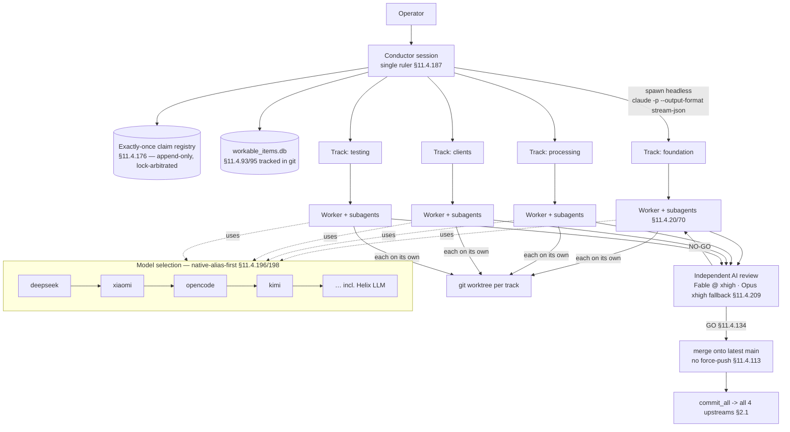

<!--
  Title           : Helix Thready — Agent-Fleet Orchestration Plan
  Classification  : PUBLIC
  Location        : docs/public/research/mvp/development/agent-orchestration.md
  Status          : Review — v0.2
  Revision        : 2 (2026-07-21)
  Author          : Helix Thready documentation swarm (development)
  Related         : ./index.md, ./workable-items.md, ./contribution-guidelines.md,
                    ../../../../private/research/mvp/helix_thready_research_request_final.md
-->

# Helix Thready — Agent-Fleet Orchestration Plan

| Rev | Date | Author | Change |
|-----|------|--------|--------|
| 1 | 2026-07-21 | swarm (development) | Initial draft — alias-first, multi-track, claim registry, Fable review |
| 2 | 2026-07-21 | swarm (development, review) | Review pass — corrected the `track_claim` DDL to a partial unique index (`WHERE released_at IS NULL`) so a released key can be re-claimed; added a TTL-expiry recovery index |

This document defines how the Helix Thready codebase is **built by an autonomous agent fleet**.
It is the development-time process, reconciling the original request's "fine-granulated workable
items implementable by a local model" with the Constitution's orchestration mandates
(final request §5.1.2 dev-orchestration reconciliation). It is *not* the runtime AI of the
delivered product — though, as noted below, the same local Helix LLM plays both roles.

> **Anchor-verification caveat `[OPEN: constitution-anchor-verify]`.** The exact normative text of
> **§11.4.196 / §11.4.198 / §11.4.209** was not available in the local Constitution copy (which
> tops out at §11.4.192). Their descriptions here are taken from the final request's decision
> matrix and §5.1.2 and are tracked for re-verification (`ATM-066`). §11.4.20/70/176/187/151/156/28
> **were** read at source.

## Table of Contents

- [1. Principles](#1-principles)
- [2. Orchestration topology](#2-orchestration-topology)
- [3. Native-alias-first model selection `[§11.4.196/198]`](#3-native-alias-first-model-selection-1141961198)
- [4. Subagent-driven-by-default `[§11.4.20/70]`](#4-subagent-driven-by-default-11142070)
- [5. Automatic multi-track ruler `[§11.4.187]`](#5-automatic-multi-track-ruler-114187)
- [6. Exactly-once claim registry `[§11.4.176]`](#6-exactly-once-claim-registry-114176)
- [7. Multi-track git-worktree isolation](#7-multi-track-git-worktree-isolation)
- [8. Independent AI review — Fable @ xhigh `[§11.4.209]`](#8-independent-ai-review--fable--xhigh-114209)
- [9. Token optimization `[§11.4.198]`](#9-token-optimization-114198)
- [10. The local Helix LLM: dev provider AND runtime engine](#10-the-local-helix-llm-dev-provider-and-runtime-engine)
- [11. Gaps this plan depends on](#11-gaps-this-plan-depends-on)

## 1. Principles

- **Autonomous, zero-idle** `[§11.4.94/97/192]` — a track is idle only when its domain genuinely
  has zero actionable items or all remaining work is externally blocked; "nothing visible right
  now" is never a valid stop. A freed track is immediately backfilled with its next-highest-priority
  item.
- **Decoupled items** `[§11.4.20]` — every `ATM-NNN` is scoped so a worker needs minimal
  cross-scope awareness (see [workable-items.md](./workable-items.md)).
- **Conflict-free by construction** `[§11.4.176]` — two tracks can never claim the same item or its
  hidden-coupling logical group.
- **Reproduce-first + reviewed** — every item is RED→GREEN TDD `[§11.4.43]` and passes an
  independent AI review before merge `[§11.4.209]`.
- **In-house first** — the fleet is driven by `vasic-digital`/`HelixDevelopment` tooling
  (`claude_toolkit` aliases, `llmorchestrator`, `challenges`, `HelixQA`), not bespoke scripts.

## 2. Orchestration topology



**Explanation (for readers/models that cannot see the diagram).** The operator launches a single
**conductor** session — the ruler mandated by §11.4.187. The conductor reads the tracked
`workable_items.db` `[§11.4.93/95]`, consults the append-only **claim registry** `[§11.4.176]`, and
programmatically spawns one headless worker per **track** (native `claude -p --output-format
stream-json`, capturing the `session_id` from the first `init` event and reading success from the
`result` event). Each track owns a canonical domain (foundation, processing, clients, testing) so
tracks do not contend. A worker further delegates to **subagents** `[§11.4.20/70]` for sub-scopes
and works inside its **own git worktree** so concurrent tracks never collide in one checkout. When
an item's tests are GREEN, the worker submits it for **independent AI review on Fable @ xhigh
(Opus xhigh fallback)** `[§11.4.209]`; a `GO` merges it onto the latest main with no force-push
`[§11.4.113]` and pushes to all four upstreams via the commit-all wrapper `[§2.1]`; a `NO-GO`
iterates `[§11.4.134]`. Underpinning all of this, every worker resolves its model through the
**native-alias-first** chain `[§11.4.196/198]` — `deepseek → xiaomi → opencode → kimi → …` — into
which the local Helix LLM is registered as one option.

> Rendered PNG/SVG exported via Docs Chain (§11.4.65). Source: [diagrams/orchestration-topology.mmd](./diagrams/orchestration-topology.mmd).

## 3. Native-alias-first model selection `[§11.4.196/198]`

Model access is **alias-first**: workers invoke a named alias, not a raw provider URL. This is the
`vasic-digital/claude_toolkit` mechanism `[IN-HOUSE: claude_toolkit]` (VERIFIED at source —
`README.md`, `qa-results/install_*.log`): each API key in the keys file becomes a Claude Code alias
pointed at that provider's strongest model, and native aliases (`deepseek`, `xiaomi`, …) resolve
over the native or router (`ccr`) transport.

```bash
# claude_toolkit resolves a chain of native aliases, each an independent Claude Code alias.
# Verified (qa-results/install_20260719.log):
#   [cma] provider 'deepseek' -> alias 'deepseek' [native] model=deepseek-v4-pro (verified)
# The dev-fleet preference order (from final request §5.1.2):
CLAUDE_ALIAS_CHAIN="deepseek xiaomi opencode kimi helixagent"   # ... local Helix LLM last-resort/offline

# A worker requests the first healthy alias; the conductor falls through on failure.
for alias in $CLAUDE_ALIAS_CHAIN; do
  if claude-alias-healthy "$alias"; then
    exec "$alias" -p --output-format stream-json < task.json
  fi
done
```

**Why alias-first.** (1) Cost/token efficiency — cheaper native aliases run the bulk of items,
reserving premium review capacity for §11.4.209. (2) Resilience — the chain degrades gracefully to
the next alias or the offline local Helix LLM. (3) Uniformity — the same `claude -p` invocation and
plugin/skill ecosystem apply to every alias (`claude-providers`, `claude-opencode-sync`), so an
item's implementation is model-agnostic. `[IN-HOUSE: claude_toolkit]`

> **Verified vs assumed.** The alias mechanism, transports and example alias names are VERIFIED in
> the local `claude_toolkit` clone. The exact *preference ordering* for Thready's dev fleet is
> `[DEFAULT — adjustable]` per the final request §5.1.2 (operator may reorder).

## 4. Subagent-driven-by-default `[§11.4.20/70]`

§11.4.70 makes subagent-driven execution **the default**, not an optimization; §11.4.20 mandates
subagent delegation for non-trivial and cross-cutting work. In Thready's fleet:

- A **track worker** decomposes its claimed `ATM-NNN` into disjoint sub-scopes and dispatches a
  **subagent per sub-scope** (e.g. `ATM-028 Download Manager` → subagents for the HTTP/3 source,
  the segmented-transfer engine, the callback emitter, the queue).
- Subagents observe **working-tree quiescence** `[§11.4.84]` before any `git add`: grep the tree
  for mutation markers, cross-check `git status --porcelain` against the declared scope, abort on
  any unaccounted file (a real forensic incident: a subagent swept an `// always pass` JWT mutation
  into an unrelated commit).
- The cleaner isolation is **one git worktree per subagent/track** (§7), which §11.4.84 explicitly
  recommends to compose with §11.4.20/70.

```yaml
# Subagent dispatch descriptor (conductor -> worker -> subagent)
item: ATM-028
worker_track: processing
subagents:
  - scope: "http3-source"       # digital.vasic.http3 wrapper as the HTTP source
    files_glob: "downloadmanager/pkg/source/http3/**"
    forbid_touching: ["downloadmanager/pkg/queue/**"]   # disjoint-scope guarantee (§11.4.58 L3)
  - scope: "segmented-transfer"
    files_glob: "downloadmanager/pkg/transfer/**"
  - scope: "callback-emitter"   # emits the shared callback schema (ATM-030)
    files_glob: "downloadmanager/pkg/callback/**"
quiescence_check: true          # §11.4.84 pre-add mutation-marker grep + porcelain cross-check
```

## 5. Automatic multi-track ruler `[§11.4.187]`

§11.4.187 (VERIFIED at source) requires multi-track orchestration to be a **universal, automatic,
inherited** capability — a single conductor session that programmatically spawns/drives/resumes/
monitors/controls per-track headless workers, **not** a per-project reimplementation. Mechanics:

- Workers are native headless: `claude -p --output-format stream-json`.
- The conductor captures each worker's `session_id` from the first `init` event and reads success
  from the `result` event; it can resume a track by `session_id`.
- On completion, the ruler looks up the next item, **claims it exactly-once** `[§11.4.176]`, and
  dispatches the next §11.4.182-labelled stream — **continuous multi-track auto-backfill**
  `[§11.4.192]`: a freed track is immediately re-assigned its next-highest-priority domain item,
  never left idle while its domain has actionable work.

```bash
# Conductor dispatch loop (illustrative; the real ruler is inherited, not hand-rolled)
dispatch_track() {
  local track="$1" item="$2"
  claim "$item" "$track" || return 1                 # §11.4.176 exactly-once; DENY if already claimed
  local wt=".worktrees/$track"
  git worktree add -B "track/$track" "$wt" origin/main 2>/dev/null || true   # §7 isolation
  ( cd "$wt" && "$(select_alias)" -p --output-format stream-json \
      <<<"$(item_prompt "$item")" | tee "logs/$track.jsonl" )               # capture init.session_id, result
}
# Auto-backfill (§11.4.192): the instant a track's worker returns, re-dispatch its next domain item.
on_track_free() { dispatch_track "$1" "$(next_highest_priority_item_for_domain "$1")"; }
```

**Track → domain mapping** (canonical, §11.4.191): `foundation` (Phase 1), `processing` (Phase 2),
`clients` (Phase 3), `testing` (Phase 4), with a `cross-cutting` track for ATM-058…065. Non-contending
items from different phases run concurrently once their dependencies are satisfied.

## 6. Exactly-once claim registry `[§11.4.176]`

§11.4.176 (VERIFIED) mandates two conflict-free-by-construction arbitration layers:

**(A) Work-item layer — exactly-once claim registry.** A lock-arbitrated, append-only registry
records `claim(item|group, track, ts, ttl)`. A track must **claim-before-touch**; a second claim on
an already-claimed item is **DENIED** (no silent overlap). Items that share files / subsystem /
feature / schema form one **logical group** claimed whole by one track (prevents the hidden-coupling
race two tracks editing the same seam would create, §11.4.58 L3 disjoint scope).

**(B) Device-lock layer.** A dead-lock-proof pool lock for scarce hardware/test-devices; a track
locks one or more devices selected by required capability, then releases. (Relevant to Thready's
mobile items `ATM-046`; less so to the Go services.)

Thready reuses this concept **twice**: for the **dev fleet** (this document) and, at **runtime**,
for the idempotent single-claim per post (`ATM-023`) — the same "at most one processor per unit of
work" invariant. The gap register flags `digital.vasic.session_orchestrator` (the atomic
track-claim registry) as **DESIGN-ONLY** `[GAP: 2.9]`; `ATM-062` implements it, and until then the
registry is realized directly on `digital.vasic.background`'s Postgres advisory locks.

```sql
-- Claim-registry substrate (Postgres advisory-lock backed; realizes §11.4.176(A))
-- A claim is exactly-once because a PARTIAL unique index rejects a second *live* claim of the key.
CREATE TABLE track_claim (
  id          BIGSERIAL   PRIMARY KEY,
  claim_key   TEXT        NOT NULL,          -- item id OR logical-group id
  track       TEXT        NOT NULL,
  claimed_at  TIMESTAMPTZ NOT NULL DEFAULT now(),
  ttl_seconds INTEGER     NOT NULL DEFAULT 3600,
  released_at TIMESTAMPTZ NULL               -- set on release; a released key may be re-claimed later
);
-- Exactly-once WHILE LIVE: the partial unique index rejects a second *live* claim of the same key,
-- yet allows re-claiming after release. Released rows remain as an in-table audit trail (ATM-062).
-- A plain UNIQUE(claim_key) would be wrong here — it would block ever re-claiming a completed item.
CREATE UNIQUE INDEX uq_live_claim ON track_claim (claim_key) WHERE released_at IS NULL;

-- TTL-expiry (crashed-track recovery): a claim past claimed_at + ttl is treated as released so the
-- ruler can re-dispatch. A sweeper stamps released_at on expiry; until then the index still holds.
CREATE INDEX ix_claim_ttl ON track_claim ((claimed_at + (ttl_seconds || ' seconds')::interval))
  WHERE released_at IS NULL;
```

## 7. Multi-track git-worktree isolation

Concurrent tracks must never share one working tree. Per §11.4.84 and the `superpowers:using-git-worktrees`
discipline, each track (and, ideally, each subagent) runs in its **own `git worktree`** on its own
branch. This makes the "concurrent subagents in the same checkout must coordinate through a lockfile"
hazard moot — disjoint worktrees cannot corrupt each other.

```bash
# One worktree per track; branch per track; merge back onto latest main after review.
git worktree add -B track/foundation  .worktrees/foundation  origin/main
git worktree add -B track/processing  .worktrees/processing  origin/main
git worktree add -B track/clients     .worktrees/clients     origin/main
git worktree add -B track/testing     .worktrees/testing     origin/main
# UNSAFE while a long build runs (§11.4.96): checkout/reset --hard/clean on the source tree —
# always operate in the worktree, never mutate the shared source tree from another track.
```

**Rules.** (1) Never `git checkout`/`reset --hard`/`clean -df` the shared source tree from a track;
mutate only inside the worktree `[§11.4.96]`. (2) Merge onto the **latest** main, resolve conflicts,
no force-push `[§11.4.113]`. (3) Remove the worktree after merge (`git worktree remove`).

## 8. Independent AI review — Fable @ xhigh `[§11.4.209]`

Every change is independently reviewed by AI on **Fable @ xhigh**, with **Opus xhigh** as the
fallback, and the item iterates until the review returns **GO** `[§11.4.134/142/194]`. The review is
*independent* — a different model/context than the one that wrote the code — so it is a genuine
second opinion, not self-attestation.

```yaml
# Review gate (runs after all mandated test types are GREEN, before merge)
review:
  reviewer: "Fable @ xhigh"
  fallback: "Opus @ xhigh"
  inputs: [diff, test_run_evidence, challenges_report, helixqa_evidence]
  checks:
    - correctness_and_root_cause      # §11.4.102 no fix without root-cause
    - anti_bluff                      # no stub passing as real (paired-mutation evidence, §11.4.27/CONST-035)
    - decoupling                      # §11.4.28 project-not-aware, config-injected
    - test_type_coverage              # all applicable of the 15 types present
    - security                        # secret-leak, authz, SSRF, input validation
  outcome: GO | NO_GO
  on_no_go: "iterate in-track (§11.4.134); re-review"
```

The review sits **inside** the item lifecycle (see [workable-items.md §2](./workable-items.md#2-item-lifecycle)):
`REVIEW → DONE` requires GO; `REVIEW → IN_PROGRESS` on NO-GO.

## 9. Token optimization `[§11.4.198]`

The Constitution mandates token-optimized orchestration. Thready's fleet applies three levers:
(1) **alias-first** routing (§3) sends routine items to cheaper native aliases; (2) **TOON encoding**
for structured prompt payloads — `claude_toolkit` ships `toon.mjs`/`toon_encode.py` (~40% fewer
tokens for structured data) `[IN-HOUSE: claude_toolkit]`; (3) **scoped context** — a subagent
receives only its sub-scope's files/globs, not the whole tree (§4).

> **Caveat `[GAP: 2.9]`.** The standalone `digital.vasic.TOON` module is **SCAFFOLD, not
> implemented** (`ErrTOONEncodingNotImplemented`), and `digital.vasic.token_optimizer` is partial
> (only `pkg/config`). `ATM-061` either implements both or marks them out-of-scope for MVP. Until
> then, token optimization relies on the **toolkit's** working `toon.mjs`/`toon_encode.py` utilities
> and alias-first routing — **not** the unfinished modules. Do not present TOON-the-module as working.

## 10. The local Helix LLM: dev provider AND runtime engine

Per the final request §5.1.2 reconciliation, the local Helix LLM (32 GB Nvidia workstation) plays
**two** roles: (a) it is registered as **one alias/provider option** in the dev-fleet chain (§3),
usable as an offline/last-resort implementer; and (b) it is the **runtime** AI engine of the
delivered product — semantic search (`ATM-039`), research, vision/OCR (`ATM-033`), and content
analysis. Fine-granulated `ATM-NNN` items remain implementable by a local model, satisfying the
original request. `[DEFAULT — adjustable]`

This dual role is why `ATM-040` (enforce the real llama embedder, never the `HashEmbedder` stub) is
**P0** `[GAP: 2.1]`: the same HelixLLM instance that a dev agent might use must also serve real
runtime embeddings — a silent hash-embedder would corrupt both dev-time RAG and product search.

## 11. Gaps this plan depends on

| Gap-register § | Impact on orchestration | Item |
|----------------|-------------------------|------|
| 2.9 session_orchestrator (DESIGN-ONLY) | The atomic track-claim registry §11.4.176(A) is not implemented; realized on `background` advisory locks meanwhile | ATM-062 |
| 2.9 TOON (SCAFFOLD) / token_optimizer (partial) | Token-optimization §11.4.198 leans on toolkit utilities, not these modules | ATM-061 |
| 2.4 LLMOrchestrator `[OPEN: agentpool-contract]` | `AgentPool` capability-matching not source-verified locally | ATM-067 |
| 2.2 HelixAgent (FOUNDATION, identity blur) | Only pin the ensemble/debate packages Thready needs | ATM-063 |
| — §11.4.196/198/209 `[OPEN: constitution-anchor-verify]` | Precise normative text unverified locally | ATM-066 |

---

*Made with love ♥ by Helix Development.*
