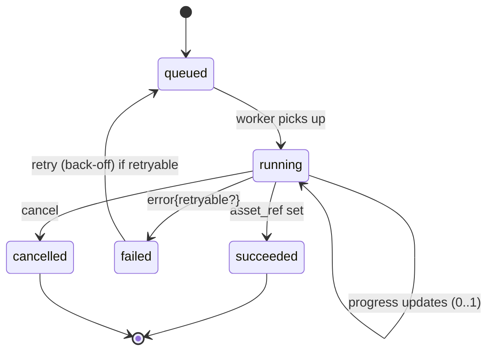
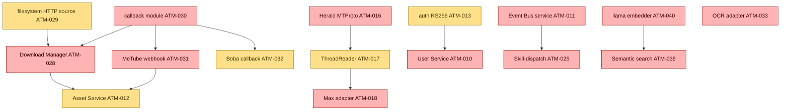

<!--
  Title           : Helix Thready — Build-New Subsystems (Scoped Design Plans)
  Classification  : PUBLIC
  Location        : docs/public/research/mvp/development/build-new-subsystems.md
  Status          : Review — v0.3
  Revision        : 3 (2026-07-22)
  Author          : Helix Thready documentation swarm (development)
  Related         : ./index.md, ./submodule-map.md, ./workable-items.md, ./workable-items-detail.md,
                    ../api/index.md,
                    ../../../../private/research/mvp/helix_thready_subsystem_gaps_and_improvements.md
-->

# Helix Thready — Build-New Subsystems (Scoped Design Plans)

| Rev | Date | Author | Change |
|-----|------|--------|--------|
| 1 | 2026-07-21 | swarm (development) | Initial design plans for every `[BUILD-NEW]` gap |
| 2 | 2026-07-21 | swarm (development, review) | Review pass — added OpenAPI 3.1 control surfaces for Asset Service, User Service and Semantic-search; added the Event Bus SSE/WS subscription contract `[CONVENTIONS §6]` |
| 3 | 2026-07-22 | swarm (development, pass 3) | Pinned the Max adapter (§3) and ThreadReader (§9) to the **VERIFIED** herald `channels.Channel` seam (`commons_messaging/channels/channel.go`); added `[VERIFIED-SOURCE]` reconciliation notes distinguishing the real adapter contract from the illustrative Thready reader seam |
| 4 | 2026-07-22 | swarm (development, critic pass) | Completeness fix — added a concrete **forward/rollback expand-contract migration** pair (`§7 User Service`) so the mandated `[CONVENTIONS §6]` migration-script requirement is satisfied with real up/down DDL, not only prose references |

This document turns every confirmed `[BUILD-NEW]` gap (gap register §11) into a scoped, decoupled,
enterprise-grade design plan. Each new capability becomes its **own repo** under `vasic-digital` /
`HelixDevelopment` with its own `upstreams/` recipe `[§11.4.28/36]` — never a vendored copy inside
`helix_thready`. Every plan reuses in-house seams first, distinguishes VERIFIED from ASSUMPTION, and
names the `ATM-NNN` item and `[GAP: …]` it closes.

## Table of Contents

- [1. Common design rules](#1-common-design-rules)
- [2. Standardized callback/task module `[BUILD-NEW]`](#2-standardized-callbacktask-module-build-new)
- [3. Max messenger adapter `[BUILD-NEW]`](#3-max-messenger-adapter-build-new)
- [4. OCR adapter `[BUILD-NEW]`](#4-ocr-adapter-build-new)
- [5. Download Manager `[BUILD-NEW]`](#5-download-manager-build-new)
- [6. Asset Service `[BUILD-NEW]`](#6-asset-service-build-new)
- [7. User Service `[BUILD-NEW]`](#7-user-service-build-new)
- [8. Event Bus service `[BUILD-NEW]`](#8-event-bus-service-build-new)
- [9. ThreadReader abstraction `[BUILD-NEW]`](#9-threadreader-abstraction-build-new)
- [10. Semantic-search service `[BUILD-NEW]`](#10-semantic-search-service-build-new)
- [11. Build-new dependency & sequencing](#11-build-new-dependency--sequencing)

## 1. Common design rules

Applies to every plan below:

- **Own repo, decoupled `[§11.4.28]`** — project-not-aware, config-injected, generic interfaces +
  abstract factories; `upstreams/` recipe; installed via `install_upstreams.sh`.
- **Reuse first** — each plan names the in-house seam it builds on; nothing is reinvented.
- **TDD reproduce-first + 15 test types `[§11.4.27/43]`**; mocks unit-only; paired-mutation anti-bluff
  gate for any dependency the gap register flags a scaffold.
- **Contracts** — Go interfaces for internal seams; OpenAPI 3.1 for HTTP; the shared callback schema
  (§2) for async completion; PostgreSQL DDL for state.
- **Reviewed on Fable @ xhigh `[§11.4.209]`** before merge.

## 2. Standardized callback/task module `[BUILD-NEW]`

**Gap:** register §6.6 / §8.1 — the common 3rd-party async mechanism (accept task → async → status →
callback → error → retry) is not extracted; Boba has a bespoke SSE+hooks contract, MeTube is
poll-only. **Item:** `ATM-030`. **Phase:** 2.2.

**Purpose.** A reusable, decoupled Go submodule defining one canonical async-job contract applied
uniformly to Boba, MeTube and the Download Manager, so the Processing Engine consumes a single
completion shape regardless of the 3rd-party system.

**Canonical schema (VERIFIED requirement, final request §8.1 / §19.4):** `job id, state, progress,
result/asset ref, error`.

```go
// callback: the one async-job contract every 3rd-party integration emits.
type JobState string
const (
    JobQueued     JobState = "queued"
    JobRunning    JobState = "running"
    JobSucceeded  JobState = "succeeded"
    JobFailed     JobState = "failed"
    JobCancelled  JobState = "cancelled"
)

type JobUpdate struct {
    JobID     string    `json:"job_id"`
    State     JobState  `json:"state"`
    Progress  float64   `json:"progress"`              // 0.0..1.0
    AssetRef  string    `json:"asset_ref,omitempty"`   // Asset Service id on success
    Error     *JobError `json:"error,omitempty"`
    UpdatedAt time.Time `json:"updated_at"`
}
type JobError struct{ Code string `json:"code"`; Message string `json:"message"`; Retryable bool `json:"retryable"` }

// A producer accepts a task and later delivers updates via the sink (webhook POST or event).
type TaskProducer interface {
    Accept(ctx context.Context, spec TaskSpec) (jobID string, err error)
    Cancel(ctx context.Context, jobID string) error
}
type UpdateSink interface { Deliver(ctx context.Context, u JobUpdate) error } // webhook or eventbus
```

**Delivery contract.** Outbound completion is an **idempotent** `POST` to the orchestrator's webhook
(HMAC-signed, retried with exponential back-off), and/or an Event Bus publish. Consumers must be
idempotent (at-least-once).



**Explanation (for readers/models that cannot see the diagram).** The happy path runs down the left
of the machine. A task begins `queued`; when a worker picks it up it moves to `running` and emits
periodic progress updates between 0 and 1 (the `running --> running` self-loop). On success it
transitions to `succeeded` carrying the Asset Service `asset_ref`, which is the payload every
downstream consumer (the Processing Engine, the Asset Service) actually waits for.

The right of the machine is the failure and cancellation handling. On error a running job goes
`failed` with an error object whose `retryable` flag is the decision point: a retryable failure
re-enters `queued` under exponential back-off, while a non-retryable one terminates. A cancel request
moves a running job to `cancelled`. Both `succeeded` and `cancelled` are terminal states. Because
delivery is at-least-once (a webhook may be redelivered, an Event Bus message replayed), every
consumer must treat duplicate `JobUpdate`s as idempotent — the same `job_id`+`state` observed twice
is a no-op, never a double-completion.

> Rendered PNG/SVG exported via Docs Chain (§11.4.65). Source: [diagrams/callback-job-fsm.mmd](./diagrams/callback-job-fsm.mmd).

**Applied to:** Boba (`ATM-032` — wrap its SSE+`POST /api/v1/hooks` in this schema), MeTube
(`ATM-031` — add the outbound webhook), Download Manager (`ATM-028` — native). **Test types:** unit,
integration (real Boba/MeTube), chaos (webhook drop/redeliver), stress, security (HMAC + SSRF).

## 3. Max messenger adapter `[BUILD-NEW]`

**Gap:** register §5.1 — Max is an **empty stub** (only a placeholder doc + reserved env vars; no
code). **Item:** `ATM-018`. **Phase:** 1.3. **Open:** `[OPEN: max-oneme-go-port]`.

**Purpose.** A Herald channel adapter for Max with two scopes: (a) **Bot API** (Go SDK, dev.max.ru)
for bot-scoped access, and (b) a **Go port of the OneMe user-WebSocket protocol** for full
channel/thread history (the reference impls `vkmax`/`max-mcp`/`MaxAPI` are Python `[RESEARCH]`).

**Reuse:** the `channels.Channel` interface as the seam (same as Telegram), and the ThreadReader
abstraction (§9) for root+reply assembly.

```go
// Max adapter implements Herald's channel seam; two transports behind one interface.
type Channel interface {
    Connect(ctx context.Context, creds Credentials) error
    ListDialogs(ctx context.Context) ([]Dialog, error)
    ReadThread(ctx context.Context, ref ThreadRef) (Thread, error) // root + organic replies
    Subscribe(ctx context.Context, onPost func(Post)) error         // push triggers
}

type maxAdapter struct {
    bot  *maxbot.Client   // Bot API — ships first (bot scope)
    user *oneme.Client    // OneMe user WebSocket — Go port, spike-gated (full history)
}
```

> **The real seam this adapter satisfies `[VERIFIED-SOURCE]`.** The `Channel` above is the
> Thready-facing *reader* shape (Connect/ListDialogs/ReadThread/Subscribe) used for illustration; the
> **binding contract** the Max adapter must implement is herald's own `channels.Channel`, read at
> source in `vasic-digital/herald/commons_messaging/channels/channel.go`:
>
> ```go
> // herald/commons_messaging/channels/channel.go — VERIFIED (Wave 7 richer adapter interface).
> type Channel interface {
>     commons.Channel // Name / Capabilities / Send / Subscribe / HealthCheck
>     // Reply quoting replyToID, fanning out each attachment as its own reply at the same depth.
>     SendReplyGeneric(ctx context.Context, recipient commons.Recipient, body, replyToID string, attachments []commons.Attachment) (string, error)
>     // Channel-native bot identity; MUST cross the wire on first call; Subscribe refuses to boot without it.
>     BotSelfIdentity(ctx context.Context) (SelfIdentity, error)
>     // Streams a channel-hosted file into ~/.herald/inbox/<channel>/<sha256>.<ext>, hashing inline.
>     DownloadAttachment(ctx context.Context, externalID, mime string) (finalPath, sha256Hex string, err error)
> }
> ```
>
> The Max adapter's Bot-API transport implements this directly (`var _ channels.Channel =
> (*maxAdapter)(nil)`); the OneMe user-WS transport adds the *history-backfill* reads the reader shape
> models. There is **no** `channels/max` or `channels/mtproto` package in herald today — only
> `docs/guides/messengers/MAX.md` (placeholder) — which is exactly why this is `[BUILD-NEW]`.

**Sequencing (honest, anti-bluff).** Bot-API scope ships first and is testable against the operator's
Max invite links (Appendix A fixtures). The OneMe user-WS Go port is **P0 but spike-gated**: a
research spike (`ATM-067`) captures the protocol before implementation; until proven, full
user-history reading is marked `[OPEN]`, not claimed working. **Test types:** unit, integration
(live invite links), e2e, security (session/token handling via the fixed Security-KMP for mobile).

## 4. OCR adapter `[BUILD-NEW]`

**Gap:** register §2.6 — VisionEngine has **no OCR engine** (grep-confirmed: no Tesseract/gosseract/
PaddleOCR/GOT-OCR); "text extraction" is a `TextRegion` type with no recognizer behind it. **Item:**
`ATM-033`. **Phase:** 2.2.

**Purpose.** A first-class `OCRProvider` seam behind VisionEngine with a Tesseract adapter (cgo
`gosseract` or `tesseract` subprocess) plus a PaddleOCR option for hard/multilingual scans; per-word
bounding boxes; offline + deterministic. Then a **hybrid pipeline**: Tesseract/PaddleOCR fast first
pass (raw text + boxes) → LLM-vision second pass over ambiguous regions; wire `TextRegion` to the
real recognizer.

```go
// The OCRProvider seam (see coding-standards.md §3 for the factory).
type OCRProvider interface {
    Recognize(ctx context.Context, img image.Image) (OCRResult, error)
    Name() string
}

// Hybrid: fast local OCR first, LLM-vision only over low-confidence regions.
func (h *HybridOCR) Extract(ctx context.Context, img image.Image) (OCRResult, error) {
    base, err := h.fast.Recognize(ctx, img) // Tesseract/PaddleOCR — deterministic, offline
    if err != nil { return OCRResult{}, err }
    for i, w := range base.Words {
        if w.Conf < h.threshold {           // escalate only ambiguous words to LLM-vision
            base.Words[i] = h.vision.Refine(ctx, img, w.Rect)
        }
    }
    return base, nil
}
```

**Serves:** `#Comic` (full OCR transcription → semantic ingest, no research/Skills), `#Screenshot`
(OCR+Vision meaning extraction), QR decode, sensitive-doc extraction. **Test types:** unit,
integration (real images), benchmarking (throughput), UX (transcription accuracy), challenges.
**Build tag:** cgo `gosseract` behind `-tags ocr`; document the non-cgo subprocess fallback.

## 5. Download Manager `[BUILD-NEW]`

**Gap:** register §6.3 (module does not exist) + §6.2 (`filesystem` has no HTTP source, no
download-manager semantics). **Item:** `ATM-028` (depends on `ATM-029`, `ATM-030`). **Phase:** 2.2.

**Purpose.** A generic multi-protocol download engine: HTTP/1.1/2/3+QUIC+Brotli (via
`vasic-digital/http3`) plus FTP/SMB/NFS/WebDav by **reusing `digital.vasic.filesystem`**; with queue,
resumable + segmented transfer, progress, retry/back-off, and the standardized completion callback
(§2). Torrent/magnet → Boba; YouTube/streaming → MeTube (both delegated with callbacks); the
Download Manager itself handles direct/protocol URLs.

```go
// Source adapters (Adapter+Factory); http3 for HTTP, filesystem for FTP/SMB/NFS/WebDav.
type Source interface {
    OpenSeekable(ctx context.Context, u *url.URL) (io.ReadSeekCloser, int64, error) // Range/segmented
    Supports(scheme string) bool
}
func NewSource(scheme string, cfg Config) (Source, error) {
    switch scheme {
    case "http", "https": return newHTTP3Source(cfg)               // vasic-digital/http3 (ATM-020/028)
    case "ftp", "smb", "nfs", "webdav": return newFSSource(cfg)    // reuse digital.vasic.filesystem (ATM-029)
    default: return nil, fmt.Errorf("download: unsupported scheme %q", scheme)
    }
}

// The engine: bounded worker pool, segmented ranges, resume from a persisted offset, callback on done.
type Manager struct{ pool int; sink UpdateSink /* §2 */; store SegmentStore }
func (m *Manager) Enqueue(ctx context.Context, spec TaskSpec) (jobID string, err error) { /* ... */ }
```

**Resumable/segmented (VERIFIED requirement).** Split into N byte-ranges via `OpenSeekable`;
persist per-segment offsets; on interruption, resume from the last committed offset; emit `JobUpdate`
progress. **NFS caveat `[GAP 6.2]`:** `filesystem` currently errors NFS on non-Linux yet lists it in
`SupportedProtocols`; `ATM-029` fixes the platform listing before the Download Manager advertises NFS.
**Test types:** unit, integration (each protocol against a real server — HTTP/3, FTP, SMB, NFS,
WebDav), stress (100 concurrent), chaos (mid-transfer kill → resume), performance (throughput).

**OpenAPI (control surface):**

```yaml
openapi: 3.1.0
info: { title: Download Manager, version: "1.0" }
paths:
  /v1/downloads:
    post:
      summary: Enqueue a download
      requestBody:
        content: { application/json: { schema: { $ref: '#/components/schemas/TaskSpec' } } }
      responses: { "202": { description: Accepted, content: { application/json: { schema: { $ref: '#/components/schemas/JobRef' } } } } }
  /v1/downloads/{jobId}:
    get: { summary: Job status, responses: { "200": { description: OK, content: { application/json: { schema: { $ref: '#/components/schemas/JobUpdate' } } } } } }
    delete: { summary: Cancel, responses: { "204": { description: Cancelled } } }
components:
  schemas:
    TaskSpec: { type: object, required: [url], properties: { url: { type: string, format: uri }, segments: { type: integer, default: 8 }, callback_url: { type: string, format: uri } } }
    JobRef:   { type: object, properties: { job_id: { type: string } } }
    JobUpdate:{ type: object, properties: { job_id: {type: string}, state: {type: string, enum: [queued,running,succeeded,failed,cancelled]}, progress: {type: number}, asset_ref: {type: string} } }
```

## 6. Asset Service `[BUILD-NEW]`

**Gap:** register §6.1 — `Catalogizer` is mature/PRODUCTION but **not decoupled** into a standalone
Asset Service; `Streaming` is a WS hub, not media byte/transcode streaming. **Item:** `ATM-012`
(+`ATM-034` transcode). **Phase:** 1.2.

**Purpose.** Decouple/extend Catalogizer into a reusable Asset Service: physical + virtual (blob)
files, multi-protocol access (SMB/FTP/NFS/WebDAV/local via `filesystem`, `OpenSeekable` for HTTP
Range), SQLCipher/encrypted-Postgres at rest + AES-256-GCM asset dirs, JWT+RBAC, WebSocket, MinIO/S3
object tier (`storage`) for the 50 TB+ scale. **Client links are never direct file paths** — they
resolve through the service (Proxy pattern), which maps to real/virtual content and enforces
auth/RBAC.

```go
type AssetService interface {
    Put(ctx context.Context, r io.Reader, meta AssetMeta) (AssetRef, error) // content-hash dedup
    OpenRange(ctx context.Context, ref AssetRef, off, n int64) (io.ReadSeekCloser, error) // Range/HLS
    Link(ctx context.Context, ref AssetRef, ttl time.Duration) (SignedURL, error)        // never a raw path
    Rendition(ctx context.Context, ref AssetRef, profile string) (AssetRef, error)       // "…-web"
}
```

**State (DDL):**

```sql
CREATE TABLE asset (
  id           BIGSERIAL PRIMARY KEY,
  content_hash BYTEA        NOT NULL,           -- sha-256 for dedup + integrity
  kind         TEXT         NOT NULL,           -- video|audio|image|document|book|comic
  storage_uri  TEXT         NOT NULL,           -- minio://... or fs://...
  sealed       BOOLEAN      NOT NULL DEFAULT false, -- AES-256-GCM sealed dir for sensitive assets
  size_bytes   BIGINT       NOT NULL,
  created_at   TIMESTAMPTZ  NOT NULL DEFAULT now(),
  UNIQUE (content_hash)                          -- dedup by content hash
);
CREATE TABLE asset_rendition (                   -- raw preserved + "…-web" renditions
  asset_id  BIGINT REFERENCES asset(id),
  profile   TEXT NOT NULL,                        -- web-h264 | web-h265 | web-av1 | hls | dash
  rendition_id BIGINT REFERENCES asset(id),
  PRIMARY KEY (asset_id, profile)
);
CREATE TABLE post_asset (                         -- post <-> asset relationships
  post_id  BIGINT NOT NULL, asset_id BIGINT NOT NULL REFERENCES asset(id),
  ordering INTEGER NULL,                          -- numeric prefix for series/playlists watch order
  PRIMARY KEY (post_id, asset_id)
);
```

**Renditions (`ATM-034`).** Raw preserved; `…-web` suffix before extension; video H.264/AAC fMP4
baseline (+H.265/AV1); 1080/720/480 adaptive HLS+DASH; audio MP3 320k/Opus 128k/FLAC. Broken physical
links re-downloadable via REST (re-invoke Download Manager). **Test types:** unit, integration (MinIO
signed URLs, Range), security (RBAC + sealed-dir decrypt-only-by-service), performance (streaming),
scaling (50 TB+ dedup).

**OpenAPI (control surface).** Client links are **never** raw paths — every access resolves through
these endpoints (Proxy pattern), which enforce JWT+RBAC and may return a short-lived signed URL. The
byte stream itself honours HTTP `Range` for HLS/DASH seeking.

```yaml
openapi: 3.1.0
info: { title: Asset Service, version: "1.0" }
paths:
  /v1/assets:
    post:
      summary: Store an asset (content-hash dedup); returns its ref
      requestBody:
        required: true
        content: { application/octet-stream: { schema: { type: string, format: binary } } }
      responses:
        "201": { description: Created, content: { application/json: { schema: { $ref: '#/components/schemas/AssetRef' } } } }
  /v1/assets/{ref}:
    get:
      summary: Stream asset bytes (Range-enabled for HLS/DASH seeking)
      parameters:
        - { name: ref, in: path, required: true, schema: { type: string } }
        - { name: Range, in: header, required: false, schema: { type: string } }
      responses:
        "200": { description: Full body, content: { application/octet-stream: { schema: { type: string, format: binary } } } }
        "206": { description: Partial (Range), content: { application/octet-stream: { schema: { type: string, format: binary } } } }
        "403": { description: RBAC denied }
  /v1/assets/{ref}/link:
    post:
      summary: Mint a short-lived signed URL (never a raw file path)
      parameters: [ { name: ref, in: path, required: true, schema: { type: string } } ]
      requestBody:
        content: { application/json: { schema: { type: object, properties: { ttl_seconds: { type: integer, default: 300 } } } } }
      responses:
        "200": { description: OK, content: { application/json: { schema: { $ref: '#/components/schemas/SignedURL' } } } }
  /v1/assets/{ref}/renditions/{profile}:
    get:
      summary: Resolve a "…-web" rendition (web-h264|web-h265|web-av1|hls|dash)
      parameters:
        - { name: ref, in: path, required: true, schema: { type: string } }
        - { name: profile, in: path, required: true, schema: { type: string, enum: [web-h264, web-h265, web-av1, hls, dash] } }
      responses:
        "200": { description: OK, content: { application/json: { schema: { $ref: '#/components/schemas/AssetRef' } } } }
components:
  securitySchemes:
    bearerAuth: { type: http, scheme: bearer, bearerFormat: JWT }
  schemas:
    AssetRef:  { type: object, required: [id], properties: { id: { type: string }, content_hash: { type: string }, kind: { type: string, enum: [video, audio, image, document, book, comic] } } }
    SignedURL: { type: object, properties: { url: { type: string, format: uri }, expires_at: { type: string, format: date-time } } }
security: [ { bearerAuth: [] } ]
```

## 7. User Service `[BUILD-NEW]`

**Gap:** register §11 / §7.2 — three-tier multi-tenant RBAC does not exist as a service; `auth`
default is HMAC-SHA256; no built-in RBAC. **Item:** `ATM-010` (+`ATM-013` RS256/EdDSA). **Phase:** 1.2.

**Purpose.** A multi-tenant users/roles/permissions service built on `digital.vasic.auth` (JWT +
API keys + OAuth2) + `security/pkg/policy` enforcer + the Catalogizer RBAC pattern, realizing the
three-tier hierarchy (Root Admin / Account Admin / Standard User) with cross-account membership and
white-labeling.

```go
type Role string
const ( RoleRoot Role = "root"; RoleAccountAdmin Role = "account_admin"; RoleUser Role = "user" )

type UserService interface {
    BootstrapRoot(ctx context.Context, owner OwnerSpec) (User, error)  // owner-only, once, at deploy
    CreateAccount(ctx context.Context, byRoot User, a AccountSpec) (Account, error)
    Invite(ctx context.Context, byAdmin User, acct AccountID, email string, r Role) error
    Authorize(ctx context.Context, u User, action, resource string) error // -> security/pkg/policy
}
```

**RBAC matrix (VERIFIED requirement, §6.1):**

| Tier | Role | Permissions |
|------|------|-------------|
| 1 | Root Admin | Full system; only one exists; edits all accounts/users/roles/permissions |
| 2 | Account Admin | Full control of their account + its users |
| 3 | Standard User | Consumer access to assigned accounts |

**Auth policy (`[DEFAULT — adjustable]`, Q9/Q10).** JWT access 15 min / refresh 7 d / idle 30 min;
**RS256/EdDSA** signing + JWKS rotation (`ATM-013`, not the HMAC default `[GAP 7.2]`); API keys
(scoped) for SDK/CLI; OAuth2 for external-service linking; **TOTP MFA mandatory for admin tiers**;
Argon2id passwords (≥12, breach-checked). **Mobile caveat `[GAP 7.3]`:** token storage on mobile must
use the **fixed** Security-KMP (native Keychain/KeyStore, `ATM-015`) — the current in-memory stub
would store secrets in plaintext.

```sql
CREATE TABLE account ( id BIGSERIAL PRIMARY KEY, name TEXT NOT NULL, branding JSONB, created_at TIMESTAMPTZ DEFAULT now() );
CREATE TABLE app_user ( id BIGSERIAL PRIMARY KEY, email CITEXT UNIQUE NOT NULL, pw_hash TEXT NOT NULL, totp_secret BYTEA, created_at TIMESTAMPTZ DEFAULT now() );
CREATE TABLE membership ( user_id BIGINT REFERENCES app_user(id), account_id BIGINT REFERENCES account(id), role TEXT NOT NULL, PRIMARY KEY (user_id, account_id) );
```

**Forward/rollback migration (expand-contract, `[CONVENTIONS §6]` / `[Q30]`).** Schema changes ship
as reversible `migration.Runner` pairs, never in-place `ALTER`s that a rollback cannot undo. Every
`ATM-NNN` that touches the schema (`ATM-019`, this service, the Asset Service §6) provides both
directions; `ATM-003.2`'s round-trip harness asserts `up` then `down` leaves **no residue**. Worked
example — adding a per-account membership expiry the expand-contract way (add nullable column + backfill,
never a `NOT NULL` add that locks/breaks old writers):

```sql
-- migrations/00042_membership_expiry.up.sql  (EXPAND: additive, backward-compatible)
BEGIN;
ALTER TABLE membership ADD COLUMN expires_at TIMESTAMPTZ NULL;          -- nullable: old writers unaffected
CREATE INDEX CONCURRENTLY IF NOT EXISTS ix_membership_expiry
  ON membership (expires_at) WHERE expires_at IS NOT NULL;              -- partial: only live expiries
COMMIT;
-- (a later CONTRACT migration may set NOT NULL + drop the default once every writer populates it.)
```

```sql
-- migrations/00042_membership_expiry.down.sql  (exact inverse — round-trips to zero residue)
BEGIN;
DROP INDEX CONCURRENTLY IF EXISTS ix_membership_expiry;
ALTER TABLE membership DROP COLUMN IF EXISTS expires_at;
COMMIT;
```

`CREATE/DROP INDEX CONCURRENTLY` runs outside the surrounding txn on Postgres in production
(`migration.Runner` splits them); the `BEGIN/COMMIT` shown is the SQLite-dev shape. Destructive
`down` steps require a hardlinked backup + operator authorization `[§9.2]`.

**OpenAPI (control surface).** Every mutation is authorized through `security/pkg/policy`; the
authz matrix (root/account-admin/user) is enforced server-side, never trusted from the client.

```yaml
openapi: 3.1.0
info: { title: User Service, version: "1.0" }
paths:
  /v1/accounts:
    post:
      summary: Create an account (Root only)
      requestBody:
        required: true
        content: { application/json: { schema: { $ref: '#/components/schemas/AccountSpec' } } }
      responses:
        "201": { description: Created, content: { application/json: { schema: { $ref: '#/components/schemas/Account' } } } }
        "403": { description: Not Root }
  /v1/accounts/{accountId}/invites:
    post:
      summary: Invite a user to an account (Root or that Account's Admin)
      parameters: [ { name: accountId, in: path, required: true, schema: { type: string } } ]
      requestBody:
        required: true
        content: { application/json: { schema: { type: object, required: [email, role], properties: { email: { type: string, format: email }, role: { type: string, enum: [account_admin, user] } } } } }
      responses:
        "202": { description: Invitation sent }
        "403": { description: Insufficient tier }
  /v1/auth/token:
    post:
      summary: Exchange credentials (+TOTP for admin tiers) for a JWT access/refresh pair
      requestBody:
        required: true
        content: { application/json: { schema: { type: object, required: [email, password], properties: { email: { type: string, format: email }, password: { type: string }, totp: { type: string } } } } }
      responses:
        "200": { description: OK, content: { application/json: { schema: { $ref: '#/components/schemas/TokenPair' } } } }
        "401": { description: Bad credentials or missing/invalid TOTP }
components:
  securitySchemes:
    bearerAuth: { type: http, scheme: bearer, bearerFormat: JWT }   # RS256/EdDSA, JWKS-rotated (ATM-013)
  schemas:
    AccountSpec: { type: object, required: [name], properties: { name: { type: string }, branding: { type: object } } }
    Account:     { type: object, properties: { id: { type: string }, name: { type: string } } }
    TokenPair:   { type: object, properties: { access_token: { type: string }, refresh_token: { type: string }, expires_in: { type: integer, example: 900 } } }
security: [ { bearerAuth: [] } ]
```

**Test types:** unit, integration, e2e, **security** (authz matrix, privilege-escalation, MFA
bypass, token revocation), challenges, HelixQA. **Migrations:** expand-contract via
`migration.Runner` `[Q30]`.

## 8. Event Bus service `[BUILD-NEW]`

**Gap:** register §11 — a thin client-facing service wrapping `digital.vasic.eventbus` (NATS
JetStream) for subscription. **Item:** `ATM-011`. **Phase:** 1.2.

**Purpose.** Surface the internal Event Bus to clients over WebSocket/SSE with durable subscriptions,
**sticky events + invalidation**, and at-least-once delivery with durable replay for disconnected
clients (§3.4). One-time events fire and are consumed; sticky events retain last-value (compacted
JetStream subject / last-value cache keyed by entity id, invalidated on state change or TTL).

```go
type EventBusService interface {
    Publish(ctx context.Context, e Event) error
    Subscribe(ctx context.Context, filter Filter, sticky bool) (<-chan Event, func(), error)
    Invalidate(ctx context.Context, entityID string) error // sticky invalidation
}
```

**Client subscription contract (SSE + WebSocket) `[CONVENTIONS §6]`.** Clients subscribe over SSE
(one-way, HTTP/2/3-friendly) or WebSocket (bidirectional). On (re)connect a client passes its last
seen cursor; the durable JetStream consumer **replays** missed events, and any **sticky** subjects
deliver their retained last-value first, so a reconnecting client is immediately consistent (§3.4).

```yaml
openapi: 3.1.0
info: { title: Event Bus service — subscription surface, version: "1.0" }
paths:
  /v1/events/stream:
    get:
      summary: Server-Sent Events stream (durable, replay-on-reconnect)
      parameters:
        - { name: filter, in: query, required: false, schema: { type: string }, description: "subject/entity filter" }
        - { name: sticky, in: query, required: false, schema: { type: boolean, default: false } }
        - { name: Last-Event-ID, in: header, required: false, schema: { type: string }, description: "replay cursor" }
      responses:
        "200":
          description: "text/event-stream of Event objects"
          content: { text/event-stream: { schema: { $ref: '#/components/schemas/Event' } } }
components:
  schemas:
    Event:
      type: object
      required: [id, type, entity_id, occurred_at]
      properties:
        id:          { type: string }
        type:        { type: string, description: "e.g. post.received, processing.completed, asset.ready" }
        entity_id:   { type: string }
        sticky:      { type: boolean, default: false }
        payload:     { type: object }
        occurred_at: { type: string, format: date-time }
```

```jsonc
// WebSocket frame contract (JSON text frames). Client -> server:
{ "op": "subscribe", "filter": "post.*", "sticky": true, "cursor": "evt_00817" }
{ "op": "unsubscribe", "filter": "post.*" }
// Server -> client: one Event per frame (same schema as the SSE `Event`), plus:
{ "op": "invalidated", "entity_id": "post:1042" }   // sticky last-value cleared (state change / TTL)
```

**Test types:** unit, integration (JetStream cluster), chaos (broker restart → durable replay),
scaling (fan-out), performance. A dedicated **events catalog** documents every system event, when it
fires, and how to subscribe (final request requirement).

## 9. ThreadReader abstraction `[BUILD-NEW]`

**Gap:** register §5.1 — no generic thread-reader channel abstraction (root + organic reply chain,
forum topics, reply threads). **Item:** `ATM-017`. **Phase:** 1.3.

**Purpose.** A reusable submodule that assembles the **complete post** = root + organic replies
(excluding the system's own processing replies), resolves `access_hash`, and normalizes forum topics
/ reply threads across messengers. Shared by the Telegram reader (`ATM-016`) and the Max adapter
(`ATM-018`).

```go
type ThreadReader interface {
    Assemble(ctx context.Context, ref ThreadRef) (Thread, error) // root + organic replies, system replies excluded
}
type Thread struct { Root Post; Replies []Post; Hashtags []string; Attachments []Attachment }
```

> **Reuses the verified herald primitives `[VERIFIED-SOURCE]`.** `ThreadReader` is a decoupled layer
> *above* the herald `channels.Channel` seam (§3): it drives each channel's `Subscribe` (inbound
> events), pulls attachments via `DownloadAttachment(ctx, externalID, mime)` (content-hashed into
> `~/.herald/inbox/`), and uses `BotSelfIdentity` to exclude the system's own replies from the
> assembled `Thread` — the echo-loop guard herald already enforces (`Subscribe` "refuses to boot
> without a self-identity"). Telegram forum-topic/reply reads (`channels.getForumTopics` /
> `messages.getReplies`) come from the promoted MTProto channel (`ATM-016`); `ThreadReader` normalizes
> them into the messenger-agnostic `Thread` the Skill-dispatch engine consumes.

**Why critical (VERIFIED, §3.2.1).** Tags are frequently added as a *reply* to a link-only or
text-only root post; assembling the full chain is required before classification. **Test types:**
unit, integration (live Telegram/Max fixtures), e2e.

## 10. Semantic-search service `[BUILD-NEW]`

**Gap:** register §11 / §2.7 — the in-house Lumen-style semantic search over llama.cpp/HelixLLM.
**Item:** `ATM-039` (depends on `ATM-040` llama embedder enforcement). **Phase:** 2.4.

**Purpose.** Re-implement the Lumen pattern in-house: tree-sitter/AST chunk (code) + Markdown/
structured chunk (docs) → `digital.vasic.embeddings` → `digital.vasic.vectordb` (pgvector/Qdrant) →
`MCP_Module` tool exposure, driven by HelixLLM `/v1/embeddings` (`HELIX_EMBEDDING_PROVIDER=llama`).
Indexes **both** source posts and generated materials; hydrates ids from the relational store.

```go
type SemanticSearch interface {
    Index(ctx context.Context, doc Document) error        // chunk -> embed -> upsert (posts + generated)
    Query(ctx context.Context, q string, k int) ([]Hit, error) // cosine; < 500 ms SLO
}
```

**OpenAPI (query surface).**

```yaml
openapi: 3.1.0
info: { title: Semantic-search service, version: "1.0" }
paths:
  /v1/search:
    post:
      summary: Cosine top-k semantic search over posts + generated materials (< 500 ms SLO)
      requestBody:
        required: true
        content: { application/json: { schema: { type: object, required: [q], properties: { q: { type: string }, k: { type: integer, default: 10 }, scope: { type: string, enum: [posts, generated, all], default: all } } } } }
      responses:
        "200":
          description: OK
          content:
            application/json:
              schema:
                type: object
                properties:
                  hits:
                    type: array
                    items: { type: object, properties: { id: { type: string }, score: { type: number }, snippet: { type: string } } }
        "503": { description: "Refused — embedder is the non-semantic HashEmbedder (see ATM-040)" }
security: [ { bearerAuth: [] } ]
components:
  securitySchemes:
    bearerAuth: { type: http, scheme: bearer, bearerFormat: JWT }
```

**Anti-bluff dependency `[GAP 2.1]`.** This service is worthless if HelixLLM serves the non-semantic
`HashEmbedder`; therefore `ATM-040` (fail-loud on the hash embedder) is a **hard P0 prerequisite**,
and `ATM-041` adds the native llama.cpp embeddings provider with dimension discovery. **Test types:**
unit, integration (real embeddings + pgvector), performance (< 500 ms), benchmarking, challenges
(relevance), plus a **paired-mutation gate** proving the search returns real semantic relevance, not
hash noise.

## 11. Build-new dependency & sequencing



**Explanation (for readers/models that cannot see the diagram).** Colour encodes priority: red nodes
are P0 (block the MVP), amber are P1 (GA-grade). The graph has three loosely-connected clusters that
the ruler can saturate in parallel.

The asset/download cluster is anchored by the callback module (`ATM-030`), which is foundational: the
Download Manager, the MeTube webhook and the Boba callback all depend on it, and the Download Manager
additionally needs the `filesystem` HTTP-source fix (`ATM-029`). The Download Manager and MeTube both
feed the Asset Service (`ATM-012`), so the Asset Service sits at the cluster's sink. The messenger
cluster is a short chain: Herald's promoted MTProto reader (`ATM-016`) feeds the ThreadReader
abstraction (`ATM-017`), which the Max adapter (`ATM-018`) reuses.

The remaining edges wire the service spine. The User Service (`ATM-010`) depends on the RS256/EdDSA
upgrade to `auth` (`ATM-013`); the Event Bus service (`ATM-011`) is a prerequisite for the
Skill-dispatch engine (`ATM-025`); and the Semantic-search service (`ATM-039`) is hard-gated on the
llama-embedder enforcement (`ATM-040`) so it never ships on the `HashEmbedder` stub. The OCR adapter
(`ATM-033`) has no inbound edge — it is genuinely independent and can proceed in parallel the instant
a track is free. Taken together, this graph is exactly the sequencing the multi-track ruler follows
when it claims build-new items: an item is claimable only once all its inbound edges are `DONE`.

> Rendered PNG/SVG exported via Docs Chain (§11.4.65). Source: [diagrams/build-new-deps.mmd](./diagrams/build-new-deps.mmd).

---

*Made with love ♥ by Helix Development.*
