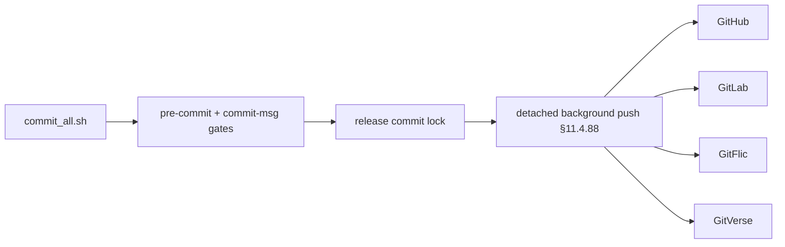

<!--
  Title           : Helix Thready — Contribution Guidelines
  Classification  : PUBLIC
  Location        : docs/public/research/mvp/development/contribution-guidelines.md
  Status          : Review — v0.2
  Revision        : 2 (2026-07-22)
  Author          : Helix Thready documentation swarm (development)
  Related         : ./index.md, ./coding-standards.md, ./agent-orchestration.md, ./workable-items.md,
                    ./git-workflow-internals.md
-->

# Helix Thready — Contribution Guidelines

| Rev | Date | Author | Change |
|-----|------|--------|--------|
| 1 | 2026-07-21 | swarm (development) | Initial draft — commit-all, all-upstreams, tags, hooks, no-CI |
| 2 | 2026-07-22 | swarm (development, pass 3) | Linked the new [git-workflow-internals.md](./git-workflow-internals.md) — the `[VERIFIED-SOURCE]` mechanics (symlink installer, marker-based bypass audit, scoped pre-push secret scan, atomic commit-all lock, buffered `push_all` fan-out) behind the policy stated here |

Every contribution — human or agent — follows this workflow. It implements the Constitution's
multi-upstream push `[§2.1]`, no-server-CI `[§11.4.156]`, project-prefixed tags `[§11.4.151]`,
mechanical git-hook enforcement `[§11.4.75]`, and workable-items DB discipline `[§11.4.93/95]`.

## Table of Contents

- [1. Golden rules](#1-golden-rules)
- [2. Branch & worktree](#2-branch--worktree)
- [3. The commit-all wrapper](#3-the-commit-all-wrapper)
- [4. All-upstreams push `[§2.1]`](#4-all-upstreams-push-21)
- [5. Git-hook gates `[§11.4.75]`](#5-git-hook-gates-114-75)
- [6. Workable-items DB discipline `[§11.4.93/95]`](#6-workable-items-db-discipline-114-9395)
- [7. Release & project-prefixed tags `[§11.4.151]`](#7-release--project-prefixed-tags-114-151)
- [8. No server CI `[§11.4.156]`](#8-no-server-ci-114-156)
- [9. Pull-request-equivalent review](#9-pull-request-equivalent-review)
- [10. Contribution checklist](#10-contribution-checklist)

## 1. Golden rules

1. **One `ATM-NNN` per change-set.** Claim it exactly-once (`[§11.4.176]`) before touching files.
2. **Reproduce-first TDD** (`[§11.4.43]`) and **independent Fable review** (`[§11.4.209]`) — see
   [coding-standards.md](./coding-standards.md) and [agent-orchestration.md](./agent-orchestration.md).
3. **Every commit fans out to all four upstreams** (`[§2.1]`).
4. **No secrets in any public repo or log** (`[§11.4.10]`); sensitive material lives only in the
   private submodule.
5. **No force-push** to shared branches (`[§11.4.113]`); merge onto the latest main.
6. **Every `.md` carries HTML/PDF/DOCX siblings** via Docs Chain (`[§11.4.65]`).

## 2. Branch & worktree

Work on a per-track branch inside a dedicated git worktree (never the default branch, never a shared
checkout) — see [agent-orchestration.md §7](./agent-orchestration.md#7-multi-track-git-worktree-isolation).

```bash
git worktree add -B track/processing .worktrees/processing origin/main
cd .worktrees/processing
# ... implement ATM-028 ...
```

Before `git add`, run the **quiescence check** `[§11.4.84]`: grep the tree for mutation markers
(`// always pass`, `MUTATED for paired`, `// MUTATION`) and cross-check `git status --porcelain`
against the item's declared scope; abort on any unaccounted file.

## 3. The commit-all wrapper

Commits go through the org's **commit-all wrapper** (`commit_all.sh`), never a bare `git commit`.
The wrapper `[§11.4.75]`: (a) runs `_constitution_sibling_check` (refuses staged `.md` lacking
`.html`+`.pdf` siblings, auto-repairs via `sync_all_markdown_exports.sh`); (b) enforces the
`commit-msg` policy; (c) releases the commit lock immediately and pushes **detached** to all
upstreams in the background `[§11.4.88]`.

```bash
# Commit through the wrapper; it self-repairs doc siblings and pushes to all upstreams in background.
commit_all.sh -m "ATM-028: Download Manager — segmented HTTP/3 transfer + resume

Implements the multi-protocol download engine reusing digital.vasic.filesystem
for FTP/SMB/NFS/WebDav and vasic-digital/http3 for the HTTP source. RED->GREEN
covered by unit+integration+stress; Fable @ xhigh: GO.

Co-Authored-By: Claude Opus 4.8 <noreply@anthropic.com>"
```

Commit-message policy: first line `ATM-NNN: <summary>`; body explains *what and why*; a
`Bypass-rationale: <reason>` footer is **required** if `--no-verify` is ever used (logged to
`docs/audit/bypass_events.md`). Do not bypass without operator authorization.

## 4. All-upstreams push `[§2.1]`

Multi-upstream push is the norm. Each upstream is declared in `upstreams/*.sh` (VERIFIED — present
in this repo) exporting `UPSTREAMABLE_REPOSITORY`; `install_upstreams.sh` wires them as git remotes
so one push fans out.

```bash
# upstreams/GitHub.sh  (verbatim shape from the repo)
export UPSTREAMABLE_REPOSITORY="git@github.com:HelixDevelopment/helix_thready.git"
# Siblings: upstreams/GitLab.sh, upstreams/GitFlic.sh, upstreams/GitVerse.sh
```

The four canonical upstreams `[§2.1]`:

| Provider | Remote |
|----------|--------|
| GitHub (primary) | `git@github.com:HelixDevelopment/helix_thready.git` |
| GitLab | `git@gitlab.com:helixdevelopment1/helix_thready.git` |
| GitFlic | `git@gitflic.ru:helixdevelopment/helix_thready.git` |
| GitVerse | `git@gitverse.ru:helixdevelopment/helix_thready.git` |

New `[BUILD-NEW]` submodules get their **own** repos on all four providers with their own
`upstreams/` recipe `[§11.4.36]`; `install_upstreams.sh` is invoked on clone/add `[CONST-056]` —
skipping it silently breaks §2.1 (the next push lands on only one upstream). Git URLs are **SSH only**
`[CONST-003]`; no HTTPS git.



**Explanation (for readers/models that cannot see the diagram).** The left half of the flow is the
local gate. A contribution enters through `commit_all.sh`, which fires the `pre-commit` and
`commit-msg` gates — the doc-sibling check `[§11.4.65]`, the mutation-residue scan `[§11.4.84]` and
the message policy (including the `--no-verify` bypass audit). Only once those pass and the commit is
durably recorded does control move rightward.

The right half is the fan-out. The wrapper immediately releases the commit lock so the working tree
is free again, then launches the push **detached in the background** `[§11.4.88]` to all four
upstreams — GitHub (primary), GitLab, GitFlic and GitVerse — in parallel, each with its own per-remote
lock and retry. The separation matters: because the push is detached, a slow or flaky remote never
holds the developer's tree hostage. A push that reaches only one upstream is a §2.1 violation; the
`upstreams/*.sh` recipes plus `install_upstreams.sh` guarantee the fan-out, and `push_all.sh` exits
non-zero unless **every** remote succeeded (see
[git-workflow-internals.md §8](./git-workflow-internals.md#8-push_allsh--buffered-background-fan-out)).

> Rendered PNG/SVG exported via Docs Chain (§11.4.65). Source: [diagrams/commit-fanout.mmd](./diagrams/commit-fanout.mmd).

## 5. Git-hook gates `[§11.4.75]`

Enforcement is mechanical via five layers, installed by `scripts/install_git_hooks.sh`:

| Hook | Enforces |
|------|----------|
| `pre-commit` | Refuses staged `.md` lacking `.html`+`.pdf` siblings; lint/format; secret-leak scan |
| `commit-msg` | `ATM-NNN:` prefix; `Bypass-rationale:` footer when `--no-verify` detected |
| `pre-push` | Re-runs siblings + a propagation-gate subset; **fetch + investigate + integrate before push** `[§11.4.71]`; mutation-residue scan |
| `post-commit` | Auto-generates orphan-`.md` siblings (idempotent, recursion-guarded) |
| Final-gate ritual | Operator runs `pre_build_verification.sh` + meta-test before every tag `[§11.4.40]` (remote CI disabled) |

There is **no escape hatch** — no `--skip-hooks`/`--bypass-enforcement`/`--allow-orphan-md`.

> **Verified mechanics.** The exact behavior of each hook and wrapper — read at source in the org
> tooling clones — is documented in [git-workflow-internals.md](./git-workflow-internals.md): the
> symlink-based idempotent installer, the `.git/ATMO_PRECOMMIT_RAN` marker hand-off that detects a
> `--no-verify` bypass, the `pre-push` force-push guard (`/proc/PPID/cmdline`) + secret scan **scoped
> to the pushed commit range** (not the whole working tree), the `mkdir`-atomic commit-all lock, and
> the per-remote-`flock` buffered `push_all` fan-out (retry ×3, honest all-or-nothing exit).

## 6. Workable-items DB discipline `[§11.4.93/95]`

The workable-items store is a **SQLite DB tracked in git** at `docs/workable_items.db` (VERIFIED
mandate). It is authoritative source data, **not** a build artifact, and is **never gitignored**.

- Every `workable-items sync md-to-db` that mutates state must stage + commit + push the DB
  alongside [workable-items.md](./workable-items.md), atomically `[§11.4.19]`.
- Run `PRAGMA wal_checkpoint(TRUNCATE)` before staging so the `.db-wal`/`.db-shm` sidecars (which
  *are* gitignored `[§11.4.30]`) are safely discardable.
- Destructive DB ops require a hardlinked backup `[§9.2]` + operator authorization.

## 7. Release & project-prefixed tags `[§11.4.151]`

VERIFIED at source. Every release tag and version name is prefixed `<PREFIX>-<version>`. Prefix
resolution: `HELIX_RELEASE_PREFIX` from `.env` (authoritative), else the lowercased project-root dir
name (`helix_thready`). The **same** prefix is used across the main repo **and all owned submodules**
in one release.

```bash
# Resolve prefix, then tag consistently across main repo + owned submodules.
PREFIX="${HELIX_RELEASE_PREFIX:-$(basename "$PWD")}"     # -> helix_thready
git tag "${PREFIX}-1.0.0"                                # e.g. helix_thready-1.0.0
```

Release process `[§11.4.28-Q / §11.4.151 / §5]`: full-suite retest GREEN → merge-onto-latest-main
(no force-push `[§11.4.113]`) → fan-out to all upstreams `[§2.1]` → changelog + multi-format export
per tag → tags **mirrored on all owned submodules**.

> **Note (VERIFIED caveat).** The local Constitution copy records that some projects' current tag
> history uses `vN.N.N` without the prefix — an operator decision deferred to a future major release.
> Thready adopts the prefixed form from its first release unless the operator directs otherwise
> `[DEFAULT — adjustable]`.

## 8. No server CI `[§11.4.156]`

VERIFIED at source. **All server-side CI/CD is disabled** — no GitHub Actions, GitLab CI, Jenkins,
etc. `[CONST-001]`. Equivalent assurance comes from: local git hooks (§5) + the pre-tag full-suite
retest `[§11.4.40]` + the all-upstreams push `[§2.1]`. A contribution that adds a server CI workflow
**fails** the `CM-CI-WORKFLOW-PRESENT` gate. This is why `ATM-052…ATM-056` run their test suites
locally/via the fleet, never on a hosted runner.

## 9. Pull-request-equivalent review

There is no GitHub PR gate (no server CI); the equivalent is the **independent AI review on Fable @
xhigh (Opus xhigh fallback)** `[§11.4.209]` inside the item lifecycle. A change merges only on a
`GO`; a `NO-GO` iterates `[§11.4.134]`. The review is a genuine second opinion (different model/
context than the author) covering correctness+root-cause, anti-bluff, decoupling, test-type coverage
and security — see [agent-orchestration.md §8](./agent-orchestration.md#8-independent-ai-review--fable--xhigh-114209).

## 10. Contribution checklist

- [ ] `ATM-NNN` claimed exactly-once; scope disjoint from other live claims.
- [ ] Work on a per-track branch in a dedicated worktree; quiescence check passed `[§11.4.84]`.
- [ ] Reproduce-first RED test written before the fix; root cause understood `[§11.4.102]`.
- [ ] All applicable of the 15 test types green; mocks unit-only `[§11.4.27]`.
- [ ] Paired-mutation anti-bluff gate for any scaffold dependency `[CONST-035]`.
- [ ] `.md` siblings (HTML/PDF/DOCX) generated `[§11.4.65]`.
- [ ] Committed via `commit_all.sh`; message `ATM-NNN: …`; no secrets.
- [ ] Fanned out to all four upstreams `[§2.1]`; no force-push `[§11.4.113]`.
- [ ] Fable @ xhigh review = GO `[§11.4.209]`.
- [ ] Workable-items DB synced + committed `[§11.4.93/95]`.
- [ ] For a release: prefixed tag `helix_thready-<ver>` mirrored across owned submodules `[§11.4.151]`.

---

*Made with love ♥ by Helix Development.*
