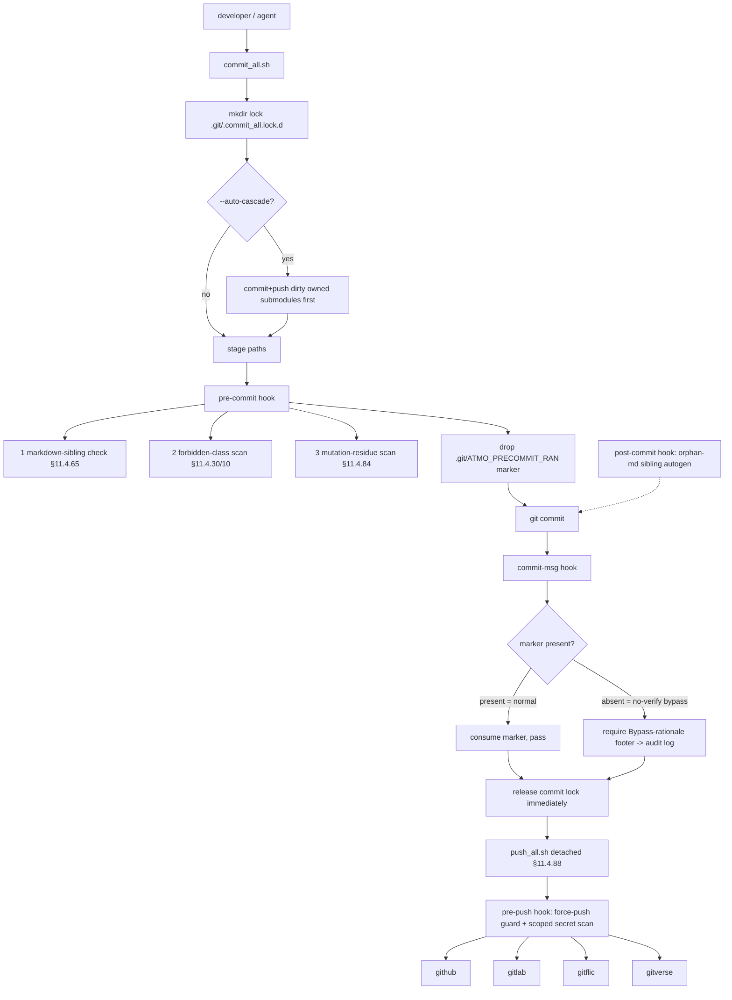

<!--
  Title           : Helix Thready — Git-Workflow Internals (Verified Mechanics)
  Classification  : PUBLIC
  Location        : docs/public/research/mvp/development/git-workflow-internals.md
  Status          : Review — v0.1
  Revision        : 1 (2026-07-22)
  Author          : Helix Thready documentation swarm (development)
  Related         : ./contribution-guidelines.md, ./agent-orchestration.md, ./index.md,
                    ./workable-items-detail.md
-->

# Helix Thready — Git-Workflow Internals (Verified Mechanics)

| Rev | Date | Author | Change |
|-----|------|--------|--------|
| 1 | 2026-07-22 | swarm (development, pass 3) | Verified mechanics of the commit-all wrapper, four git hooks, push-all fan-out and upstreams installer — read at source in the org tooling clones |

This document is the **implementation-level** companion to
[contribution-guidelines.md](./contribution-guidelines.md). The guidelines state the *policy*
(commit through the wrapper, fan out to four upstreams, no server CI); this document documents the
*mechanism* — the exact lock strategy, the marker-based bypass detection, the scoped secret scan, the
per-remote retry — as **read at source** in the org tooling clones under
`/home/milos/Factory/projects/tools_and_research/` (`helix_ota`, `helix_code`). Every mechanic below
carries a `[VERIFIED-SOURCE]` anchor to the exact file it was read from, so an agent implementing
`ATM-001` (repo + hook bootstrap, see
[workable-items-detail.md §3.1](./workable-items-detail.md#atm-001--repo--4-upstream-bootstrap--git-hooks))
reproduces the real behavior, not a paraphrase.

> **Why this deserves its own doc.** The Constitution's mechanical-enforcement mandate `[§11.4.75]`
> is realized by four cooperating hooks plus two wrapper scripts whose *interactions* (marker
> hand-off between `pre-commit` and `commit-msg`; lock release before background push; scoped vs
> whole-tree secret scan) are subtle and were the site of a real forensic incident (a mutation
> swept into an unrelated commit). Documenting the exact mechanics is the anti-bluff requirement
> `[CONVENTIONS §7]`.

## Table of Contents

- [1. The enforcement pipeline (end to end)](#1-the-enforcement-pipeline-end-to-end)
- [2. `install_git_hooks.sh` — symlink installer](#2-install_git_hookssh--symlink-installer)
- [3. `pre-commit` — three staged-only invariants](#3-pre-commit--three-staged-only-invariants)
- [4. `commit-msg` — marker-based bypass audit](#4-commit-msg--marker-based-bypass-audit)
- [5. `pre-push` — force-push guard + scoped secret scan](#5-pre-push--force-push-guard--scoped-secret-scan)
- [6. `post-commit` — orphan-md sibling autogen](#6-post-commit--orphan-md-sibling-autogen)
- [7. `commit_all.sh` — the canonical wrapper](#7-commit_allsh--the-canonical-wrapper)
- [8. `push_all.sh` — buffered background fan-out](#8-push_allsh--buffered-background-fan-out)
- [9. `install_upstreams.sh` — remote wiring](#9-install_upstreamssh--remote-wiring)
- [10. Thready-specific bootstrap checklist](#10-thready-specific-bootstrap-checklist)

## 1. The enforcement pipeline (end to end)



**Explanation (for readers/models that cannot see the diagram).** A change enters through
`commit_all.sh` — never a bare `git commit`. The wrapper first takes an **atomic directory lock**
(`mkdir .git/.commit_all.lock.d`, portable across Linux/macOS) so two invocations can never
interleave. If `--auto-cascade` is set, it walks dirty **owned submodules**, committing and pushing
each *before* capturing their updated pointers in the parent commit — this preserves the
"submodule pointer always references a pushed commit" invariant. It then stages the target paths and
the `git commit` fires the hooks.

The `pre-commit` hook evaluates three **staged-only** invariants against the index (never the whole
tree): the markdown-sibling check `[§11.4.65]`, the forbidden-class scan (secrets / build artifacts
/ private keys, `[§11.4.30/10]`), and the mutation-residue scan `[§11.4.84]`. Immediately before it
returns it drops a one-shot freshness marker (`.git/ATMO_PRECOMMIT_RAN`). The `commit-msg` hook then
runs and reads that marker: if it is **present**, a normal gated commit happened, so the hook
consumes (deletes) the marker and passes; if it is **absent**, the commit used `--no-verify` (which
skips `pre-commit` but *not* `commit-msg`), and the hook demands a `Bypass-rationale:` footer,
appending an entry to `docs/audit/bypass_events.md`. This marker hand-off is the whole
bypass-detection mechanism — git provides no direct "was `--no-verify` used" signal.

Once the local commit is durable, the wrapper **releases the lock immediately** and launches
`push_all.sh` **detached** `[§11.4.88]` so the working tree is free again while the push proceeds in
the background. The push triggers the `pre-push` hook, which blocks force-pushes (via
`/proc/PPID/cmdline` inspection) and runs a secret scan **scoped to the commits actually being
pushed** (not the whole working tree), then fans the branch out to all four remotes. Independently,
`post-commit` regenerates siblings for any orphan `.md` (idempotent, recursion-guarded).

> Rendered PNG/SVG exported via Docs Chain (§11.4.65). Source: [diagrams/git-hook-layers.mmd](./diagrams/git-hook-layers.mmd).

## 2. `install_git_hooks.sh` — symlink installer

**`[VERIFIED-SOURCE]`** `helix_code/scripts/install_git_hooks.sh` (canonical §11.4.75 installer).

The installer is **symlink-based and idempotent**: it symlinks every hook body under
`scripts/git_hooks/` into `.git/hooks/` so a single tracked source of truth drives the live hooks —
editing the source updates the installed hook with **no re-install**. Re-running is a no-op when the
symlinks already point at the right targets.

- Managed hook names (only these): `pre-commit pre-push post-commit commit-msg`.
- It honours a non-default `core.hooksPath` if the operator configured one (falls back to an absolute
  target in that case; otherwise uses a relative `../../scripts/git_hooks/<name>` link portable across
  repo relocations).
- `--dry-run` prints what *would* be installed; a non-symlink pre-existing hook is reported as
  "WOULD replace (non-symlink)".

```bash
# Idempotent install (Thready ATM-001.2). Editing scripts/git_hooks/<name> updates the live hook.
scripts/install_git_hooks.sh            # install/refresh symlinks
scripts/install_git_hooks.sh --dry-run  # preview only
```

There is a legacy dash-named `scripts/install-git-hooks.sh` that *copies* instead of symlinking; the
underscore form above is the canonical one the §11.4.75 mandate names — prefer it.

## 3. `pre-commit` — three staged-only invariants

**`[VERIFIED-SOURCE]`** `helix_code/scripts/git_hooks/pre-commit` ("§11.4.75 mechanical-enforcement
layer 1"). All three invariants are evaluated **against the index** (what `git commit` is about to
write), never against the whole tree:

1. **Markdown-sibling check `[§11.4.65 / CONST-066]`.** A staged **governed** `.md` MUST ship its
   `.html` + `.pdf` siblings in the *same* index. The scope is reconciled to avoid blocking the
   in-flight backfill: a staged `.md` is sibling-CHECKED iff (a) it is in the **core governed set**
   (root manual / tracker doc / `Status{,_Summary}.md`) — always checked — **or** (b) it already has
   at least one sibling in the tree or index (it opted into the export regime, so an update that
   forgets to regenerate siblings is caught). A brand-new md-only working spec (no sibling yet) is
   **not** blocked — it belongs to the backfill scope, not a regression. Working specs under
   `docs/{superpowers,research,guides,testing}` are md-only by convention.
2. **Forbidden-class scan `[§11.4.30 / §11.4.10]`.** No staged secret / build-artifact / private-key
   class file.
3. **Mutation-residue scan `[§11.4.84]`.** No staged file carrying a paired-mutation marker
   (`MUTATED for paired`, `// always pass`, `// MUTATION`, …). This is the guard that prevents the
   real forensic incident where a subagent swept an `// always pass` JWT mutation into an unrelated
   commit.

The hook is a **courtesy gate**: on a genuine product/security risk it BLOCKS (exit 1); benign
tooling gaps (no staged files, detached index) degrade to a WARN + exit 0 rather than blocking every
commit. Immediately before returning it drops `.git/ATMO_PRECOMMIT_RAN` (consumed by §4).

> **Thready note on `docs/public/research/mvp/`.** These research docs live under `docs/research/`
> convention scope, so they are **md-only by default** unless they have opted into siblings.
> `ATM-009`/`ATM-069` provision pandoc/weasyprint and wire the Docs Chain context so the whole tree
> can generate HTML/PDF/DOCX siblings and move into the fully-checked set `[§11.4.65]`.

## 4. `commit-msg` — marker-based bypass audit

**`[VERIFIED-SOURCE]`** `helix_code/scripts/git_hooks/commit-msg` ("§11.4.75 audit-trail seam for
`--no-verify`").

Mechanism: the `pre-commit` hook drops `.git/ATMO_PRECOMMIT_RAN` right before it runs; this hook
**consumes** it. If the marker is absent when `commit-msg` runs, `pre-commit` did not run for *this*
commit — i.e. `--no-verify` was used (it skips `pre-commit` but not `commit-msg`). An explicit
`HELIX_COMMIT_NO_VERIFY=1` environment override forces the footer requirement on regardless.

- **Bypass without footer → BLOCKED (exit 1).** The required footer is
  `Bypass-rationale: <reason>` (matched case-insensitively: `^Bypass-rationale:[[:space:]]*[^[:space:]]`).
- **Bypass with footer → accepted**, and one line is appended to `docs/audit/bypass_events.md` (audit
  trail; best-effort, never fatal).
- **Normal commit (marker present) → passes unconditionally** and the marker is consumed one-shot so
  it cannot mask a subsequent bypass commit.

This hook **never** blocks a normal commit; it only blocks a *detected* bypass that lacks the
rationale footer. Thready's commit-message policy layered on top (from
[contribution-guidelines.md §3](./contribution-guidelines.md#3-the-commit-all-wrapper)): first line
`ATM-NNN: <summary>`; body explains what and why; `Co-Authored-By:` trailer.

## 5. `pre-push` — force-push guard + scoped secret scan

**`[VERIFIED-SOURCE]`** `helix_code/scripts/git_hooks/pre-push` ("force-push protection per CONST-042").

Two gates:

1. **Force-push detection.** The hook inspects `/proc/$PPID/cmdline` for `--force` / `-f` /
   `--force-with-lease` and rejects the push unless `HELIX_FORCE_PUSH_APPROVED=1` is set. On platforms
   without `/proc` (macOS/BSD) it **degrades gracefully** — warns and exits 0 rather than blocking
   every push. The constitutional clause (CONST-042 / `[§11.4.113]`) is the actual contract; the hook
   is the courtesy gate.
2. **Scoped secret scan.** It runs `scripts/scan-secrets.sh --range <base> <new>` scoped to the
   **commits actually being pushed** (read from the ref-update lines git supplies on STDIN:
   `<local-ref> <local-oid> <remote-ref> <remote-oid>`). For an existing remote ref the range is
   `remote-oid..local-oid` (diffs only the new commits); for a brand-new ref it resolves the best
   merge-base against existing remote-tracking refs, falling back to the git empty-tree object for a
   genuine first-ever push. This scoping was a deliberate 2026-07-11 fix: a prior whole-working-tree
   scan swept **untracked** files (scratchpad reports, local notes) and blocked unrelated pushes on
   their content — `[§11.4.6]`: a push is judged on what it actually publishes, not on whatever is
   lying around locally.

If the scanner is missing (early bootstrap), the check SKIPs with a warning rather than blocking.

The `pre-push` hook also composes with the propagation gate `[§11.4.71]`: **fetch + investigate +
integrate before push**, so a push always lands on top of the latest remote state (no force needed).

## 6. `post-commit` — orphan-md sibling autogen

**`[VERIFIED-SOURCE]`** `helix_code/scripts/git_hooks/post-commit`.

After a successful commit, this hook regenerates HTML/PDF/DOCX siblings for any orphan `.md`,
**idempotently** and **recursion-guarded** (it must not trigger itself into a loop). It is the
best-effort backfill companion to the `pre-commit` sibling *check*: `pre-commit` blocks a governed
`.md` that ships without siblings; `post-commit` proactively generates siblings so the next commit is
already compliant.

## 7. `commit_all.sh` — the canonical wrapper

**`[VERIFIED-SOURCE]`** `helix_ota/scripts/commit_all.sh` ("the ONLY authorized commit+push tool").

Key mechanics:

- **Atomic lock:** `mkdir "$PROJECT_ROOT/.git/.commit_all.lock.d"` (mkdir is atomic on Linux+macOS);
  writes the owner PID; `trap … EXIT INT TERM` cleans it up. A second invocation exits **2** on lock
  contention with a directed recovery hint. This is stronger than a bare `flock` for cross-platform
  portability.
- **Workflow:** validate submodule pointers → stage → commit → push to all upstreams.
- **Options** (verified in `--help`): `-m/--message`, `-n/--no-push`, `--auto-cascade` (commit+push
  dirty owned submodules first, then capture their pointers in the parent commit), `--docs-only`
  (stage+commit only doc files — Issues/Fixed/CONTINUATION/Status + exports, `[§11.4.22]`),
  `--sync-push` (synchronous; **default is detached** per `[§11.4.88]`), `--paths "p1 p2"` (fast path),
  `--dry-run`.
- **Exit codes:** 0 success · 1 validation failure · 2 lock contention.

```bash
# Thready commit through the wrapper (ATM-028 example). Detached push is the default (§11.4.88).
scripts/commit_all.sh -m "ATM-028: Download Manager — segmented HTTP/3 transfer + resume

Implements the multi-protocol download engine reusing digital.vasic.filesystem
for FTP/SMB/NFS/WebDav and vasic-digital/http3 for the HTTP source. RED->GREEN
covered by unit+integration+stress; Fable @ xhigh: GO.

Co-Authored-By: Claude Opus 4.8 <noreply@anthropic.com>"
```

## 8. `push_all.sh` — buffered background fan-out

**`[VERIFIED-SOURCE]`** `helix_ota/scripts/push_all.sh` ("buffered background push to all upstreams").

- **Remote list (verified):** `github gitlab gitflic gitverse`.
- **Per-remote serialization:** a per-remote `flock` on `.git/.push.<remote>.lock` so concurrent
  pushes to the same remote never race.
- **Retry with backoff:** default **3 retries per remote**, initial delay **5 s** (`-r/--retries`,
  `-d/--delay` override); output is buffered to a log (`-l/--log`, else auto-generated under
  `qa-results/push_failures/`).
- **Honest exit:** exit **0 only if ALL remotes succeed**, 1 if **any** fail — no false green (there
  is a regression guard `guard_push_all_honest_exit.sh` protecting exactly this).
- Designed to run **detached** (`nohup … &`) per `[§11.4.88]` so `commit_all.sh` releases its lock as
  soon as the local commit is durable.

```bash
nohup bash scripts/push_all.sh main --retries 5 > /tmp/push.log 2>&1 &   # detached, 5 retries
```

## 9. `install_upstreams.sh` — remote wiring

**`[VERIFIED-SOURCE]`** `helix_code/constitution/install_upstreams.sh` (+ the Thready `upstreams/`
recipes verified in-repo).

- Reads every `./upstreams/*.sh` declaration; each **MUST** `export UPSTREAMABLE_REPOSITORY=<git-url>`
  (verified shape — see the four Thready recipes below).
- Decodes a short remote name from the host: `github.com→github`, `gitlab.com→gitlab`,
  `gitflic.ru→gitflic`, `gitverse.ru→gitverse` (plus `bitbucket`/`codeberg`/generic-first-label).
- Prefers the lowercase `upstreams/` dir (`[§11.4.29 / CONST-052]`), falling back to a legacy
  `Upstreams/` with a rename warning.
- Wires each as a git remote so **one push fans out** to every provider.

**Thready's four recipes (VERIFIED in-repo, `helix_thready/upstreams/`):**

| File | `UPSTREAMABLE_REPOSITORY` |
|------|---------------------------|
| `GitHub.sh` | `git@github.com:HelixDevelopment/helix_thready.git` |
| `GitLab.sh` | `git@gitlab.com:helixdevelopment1/helix_thready.git` |
| `GitFlic.sh` | `git@gitflic.ru:helixdevelopment/helix_thready.git` |
| `GitVerse.sh` | `git@gitverse.ru:helixdevelopment/helix_thready.git` |

Git URLs are **SSH only** `[CONST-003]`; no HTTPS git. Each `[BUILD-NEW]` submodule (Asset Service,
Download Manager, Max adapter, OCR adapter, User Service, callback module) gets its **own** repo on
all four providers with its own `upstreams/` recipe `[§11.4.36]`, and `install_upstreams.sh` is
invoked on clone/add `[CONST-056]` — skipping it silently breaks §2.1 (the next push lands on only
one upstream).

## 10. Thready-specific bootstrap checklist

This is the executable form of `ATM-001` (see
[workable-items-detail.md §3.1](./workable-items-detail.md#atm-001--repo--4-upstream-bootstrap--git-hooks)):

- [ ] `upstreams/{GitHub,GitLab,GitFlic,GitVerse}.sh` present (VERIFIED in-repo) → run
      `install_upstreams.sh` → `git remote` shows `github gitlab gitflic gitverse` (SSH URLs).
- [ ] `scripts/git_hooks/{pre-commit,pre-push,post-commit,commit-msg}` vendored → run
      `scripts/install_git_hooks.sh` (symlink, idempotent).
- [ ] `scripts/commit_all.sh` + `scripts/push_all.sh` vendored; `docs/audit/bypass_events.md` created.
- [ ] `docs/private` submodule wired (VERIFIED `.gitmodules` →
      `git@github.com:HelixDevelopment/helix_thready_private.git`).
- [ ] Dry-run each hook: a governed `.md` without siblings blocks (`pre-commit`); a `--no-verify`
      without footer blocks (`commit-msg`); a `--force` push blocks unless approved (`pre-push`).
- [ ] `commit_all.sh --dry-run` succeeds; a detached `push_all.sh` reaches all four remotes.

---

*Made with love ♥ by Helix Development.*
