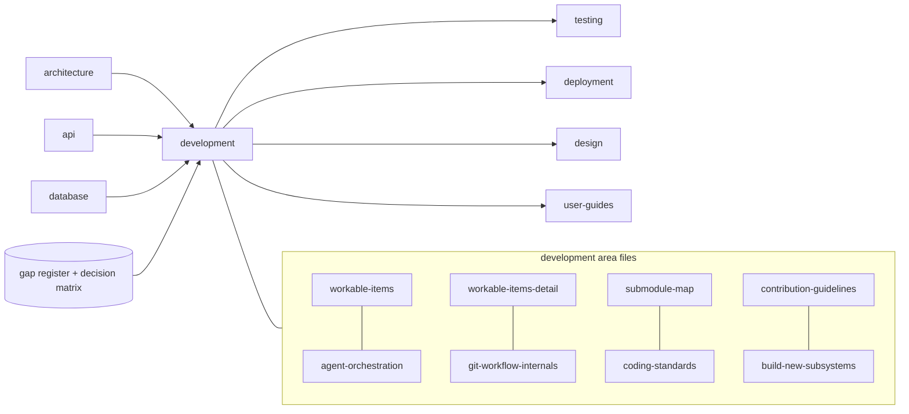
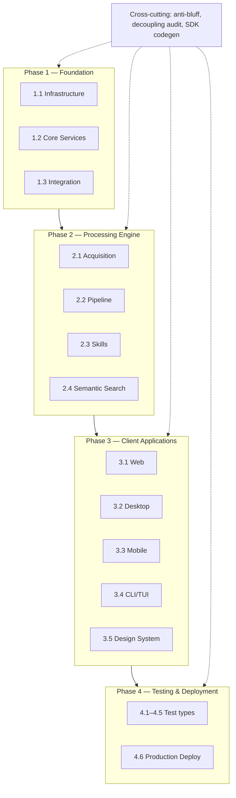

<!--
  Title           : Helix Thready — Development & Orchestration (Area Index)
  Classification  : PUBLIC
  Location        : docs/public/research/mvp/development/index.md
  Status          : Review — v0.3
  Revision        : 4 (2026-07-22)
  Author          : Helix Thready documentation swarm (development)
  Related         : ./workable-items.md, ./workable-items-detail.md, ./agent-orchestration.md,
                    ./submodule-map.md, ./coding-standards.md, ./contribution-guidelines.md,
                    ./git-workflow-internals.md, ./build-new-subsystems.md,
                    ../index.md, ../CONVENTIONS.md
-->

# Helix Thready — Development & Orchestration (Area Index)

| Rev | Date | Author | Change |
|-----|------|--------|--------|
| 1 | 2026-07-21 | swarm (development) | Initial draft — index, dependency map, area file links |
| 2 | 2026-07-21 | swarm (development, review) | Review pass — tracked the pending `architecture/`+`database/` `index.md` cross-links as `ATM-072` |
| 3 | 2026-07-21 | orchestrator (integration) | Integration pass — `architecture/index.md` + `database/index.md` now present and the §3 cross-links resolve; `ATM-072` closed |
| 4 | 2026-07-22 | swarm (development, pass 3) | Depth pass — added `workable-items-detail.md` (full-granularity cards) + `git-workflow-internals.md` (verified hook/wrapper mechanics); closed `[OPEN: agentpool-contract]` (ATM-067) and rescoped ATM-062 after reading `session_orchestrator` at source; updated §6 open-items ledger |

This is the canonical entry point for the **Development & Orchestration** area of the Helix
Thready MVP. It defines *how the system is built*: the granular workable-item backlog, the
agent-fleet orchestration model, the map of reused in-house submodules, the coding standards,
the contribution rules, and the design plans for the confirmed new subsystems.

All files here follow **[../CONVENTIONS.md](../CONVENTIONS.md)** exactly and never contradict
the authoritative sources of truth (see below). Provenance tags used throughout:
`[CONSTITUTION §x]`, `[IN-HOUSE: module]`, `[RESEARCH]`, `[OPERATOR]`,
`[DEFAULT — adjustable]`, `[BUILD-NEW]`, `[GAP: id]`, `[OPEN: …]`.

## Table of Contents

- [1. Authoritative sources (read-only)](#1-authoritative-sources-read-only)
- [2. Area files](#2-area-files)
- [3. Upstream / Downstream dependencies](#3-upstream--downstream-dependencies)
- [4. How this area maps onto the four phases](#4-how-this-area-maps-onto-the-four-phases)
- [5. Verified vs assumed — reading discipline](#5-verified-vs-assumed--reading-discipline)
- [6. Open items tracked in this area](#6-open-items-tracked-in-this-area)

## 1. Authoritative sources (read-only)

- **Final answered request** — `../../../../private/research/mvp/helix_thready_research_request_final.md`
  (the technology decision matrix §0.2, architecture §2, processing workflow §3, methodology §5,
  operator decisions §0.1, Q1–Q45 §18). **Primary source.**
- **Subsystem gaps & improvements** — `../../../../private/research/mvp/helix_thready_subsystem_gaps_and_improvements.md`
  (per-subsystem P0/P1/P2 gap register). Every gap relevant to this area is addressed by a design
  plan or a tracked `ATM-NNN` item tagged `[GAP: …]`.
- **Original request + Part II answers** — `../../../../private/research/mvp/helix_thready_research_request.md`.
- **Conventions** — [../CONVENTIONS.md](../CONVENTIONS.md).

## 2. Area files

| File | Purpose |
|------|---------|
| [workable-items.md](./workable-items.md) | The granular `ATM-NNN` backlog — every item decoupled, agent-implementable, mapped to the four phases (§5.1.2), with acceptance criteria, dependencies, test-type coverage and `[GAP: …]` tags |
| [workable-items-detail.md](./workable-items-detail.md) | The **full-granularity** expansion of the backlog: per-item cards with task-level sub-items (`ATM-NNN.k`), Given/When/Then acceptance, explicit blocks/blocked-by edges, and `[VERIFIED-SOURCE]` anchors for every claim read at module source in Pass 3 |
| [git-workflow-internals.md](./git-workflow-internals.md) | The **verified mechanics** behind the contribution rules: the symlink hook installer, the marker-based `--no-verify` bypass audit, the scoped pre-push secret scan, the atomic commit-all lock, and the buffered background `push_all` fan-out — each `[VERIFIED-SOURCE]` to the org tooling clone it was read from |
| [agent-orchestration.md](./agent-orchestration.md) | The dev-fleet plan: native-alias-first `[§11.4.196/198]`, subagent-driven `[§11.4.20/70]`, automatic multi-track ruler `[§11.4.187]`, exactly-once claim registry `[§11.4.176]`, git-worktree isolation, Fable @ xhigh review `[§11.4.209]` |
| [submodule-map.md](./submodule-map.md) | Every reused `vasic-digital` / `HelixDevelopment` / `milos85vasic` submodule, its role, import path and **maturity** from the gap register (PRODUCTION / FOUNDATION / SCAFFOLD / DESIGN-ONLY / BUILD-NEW) |
| [coding-standards.md](./coding-standards.md) | Go 1.26 standards, TDD reproduce-first `[§11.4.43]`, design patterns, SOLID, decoupling `[§11.4.28]`, concurrency, error handling, anti-bluff |
| [contribution-guidelines.md](./contribution-guidelines.md) | commit-all wrapper + git-hook gates `[§11.4.75]`, all-upstreams push `[§2.1]`, project-prefixed tags `[§11.4.151]`, no server CI `[§11.4.156]`, workable-items DB discipline `[§11.4.93/95]` |
| [build-new-subsystems.md](./build-new-subsystems.md) | Scoped design plans for every `[BUILD-NEW]` gap: Download Manager, Max adapter, OCR adapter, User Service, Asset Service, standardized callback/task module (plus Event Bus service, ThreadReader, Semantic-search service) |

## 3. Upstream / Downstream dependencies

**Upstream (this area consumes):**

- **architecture** — the component boundaries, event model and concurrency model that the
  workable items decompose into decoupled tasks. See [../architecture/index.md](../architecture/index.md).
- **api** — the OpenAPI/Protobuf contracts the SDK-codegen and REST-skeleton items target. See
  [../api/index.md](../api/index.md).
- **database** — the schema/migration definitions the DB-wiring items implement. See
  [../database/index.md](../database/index.md).
- The **decision matrix** and **gap register** (authoritative sources §1) constrain every choice.

**Downstream (this area produces / feeds):**

- **testing** — every `ATM-NNN` names its mandated test types; the testing area expands them into
  the 15-type banks. See [../testing/index.md](../testing/index.md).
- **deployment** — the contribution + orchestration rules feed the release/deploy pipeline. See
  [../deployment/index.md](../deployment/index.md).
- **design** / **user-guides** — Phase-3 client items feed those areas. See
  [../design/index.md](../design/index.md), [../user-guides/index.md](../user-guides/index.md).

**Explanation (for readers/models that cannot see the diagram).** The left edge of the graph is the
development area's **upstream**. It consumes the architecture area (component boundaries, the event
model, the concurrency model), the API area (the OpenAPI/Protobuf contracts the SDK-codegen and
REST-skeleton items target), and the database area (the schema/migration definitions the DB-wiring
items implement). Overlaid on those three is the pair of authoritative planning inputs drawn as a
single cylinder — the decision matrix and the private gap register — which constrain every choice.
Together the upstream answers *what* to build; this area answers *how* and *in what order*.

The right edge is the **downstream** the development area feeds. Testing expands each item's declared
test types into the full 15-type banks; deployment consumes the contribution and release rules to
drive the pipeline; and design plus user-guides consume the Phase-3 client-application items. The
arrows are one-directional on purpose: development never reaches back up into architecture/API/database
to redefine a contract — it implements them and surfaces gaps as tracked items.

Internally (the `DEV_files` subgraph) the area is now **eight** coupled files. The workable-item
backlog (summary + full-granularity detail) and the agent-orchestration plan are the operational
core; the submodule map, coding standards, contribution guidelines, git-workflow internals and the
build-new-subsystem design plans are the reference material every item is implemented against. The
two documents added in Pass 3 — `workable-items-detail.md` and `git-workflow-internals.md` — sit
inside this same cluster and inherit the same upstream/downstream edges.

> Rendered PNG/SVG exported via Docs Chain (§11.4.65). Source: [diagrams/dev-area-deps.mmd](./diagrams/dev-area-deps.mmd).

## 4. How this area maps onto the four phases

The final request §5.1.2 defines four sequential phases. The workable-item backlog is organized
by phase and sub-phase; the orchestration model runs multiple phases' non-contending items in
parallel tracks where dependencies allow.

**Explanation (for readers/models that cannot see the diagram).** The four stacked subgraphs are the
sequential phases of final request §5.1.2, each split into its sub-phases. Phase 1 (Foundation)
stands up infrastructure (1.1), the core services (1.2 — User Service, Event Bus service, Asset
Service), and the messenger/database/API integration (1.3). Phase 2 (Processing Engine) builds
content acquisition (2.1), the processing pipeline (2.2), Skills integration (2.3) and semantic
search (2.4) on top of that foundation.

Phase 3 (Client Applications) delivers the Web portal, Desktop, Mobile, CLI/TUI and design-system
surfaces (3.1–3.5), and Phase 4 (Testing & Deployment) runs the mandated test types (4.1–4.5) and
the production deployment (4.6). The solid `P1 --> P2 --> P3 --> P4` spine encodes the *hard*
ordering: a later phase's items may only start once their specific upstream dependencies in an
earlier phase are `DONE` — not once the whole earlier phase completes.

The dotted cross-cutting band (`XC`) — the anti-bluff sweep, the decoupling audit and SDK codegen —
attaches to all four phases because those disciplines apply continuously rather than at one
milestone. Crucially, the sequential drawing is a *dependency* statement, not a *schedule*: the
orchestration model (see [agent-orchestration.md](./agent-orchestration.md)) runs non-contending
items from different phases concurrently across isolated git-worktree tracks the moment their
individual dependencies are satisfied, which is why the four "rivers" of the
[critical-path DAG](./workable-items-detail.md#2-critical-path-dependency-dag) flow in parallel.

> Rendered PNG/SVG exported via Docs Chain (§11.4.65). Source: [diagrams/dev-phase-map.mmd](./diagrams/dev-phase-map.mmd).

## 5. Verified vs assumed — reading discipline

Per CONVENTIONS §7 and the gap register's anti-bluff caveat, this area distinguishes:

- **VERIFIED** — read at source (the decision matrix, the gap register marked `VERIFIED`, or a
  module inspected in the local clones under `/home/milos/Factory/projects/tools_and_research/`).
- **ASSUMPTION / `[DEFAULT — adjustable]`** — a proposed engineering default the operator may
  override; never presented as a settled fact.
- A module the gap register flagged `SCAFFOLD` / `DESIGN-ONLY` / `BUILD-NEW` is **never** described
  as "working"; the relevant `[GAP: …]` and the plan to close it are cited instead.

## 6. Open items tracked in this area

Items that could not be fully resolved from the sources available are marked `[OPEN: …]` and
carried as tracked workable items. The consolidated list lives in
[workable-items.md §8 (Open items register)](./workable-items.md#8-open-items-register); the
headline open items are:

- `[OPEN: constitution-anchor-verify]` — the local Constitution submodule copy tops out at
  §11.4.192; the exact normative text of **§11.4.196 / §11.4.198 / §11.4.209** was taken from the
  final request's descriptions, not read at source. Re-verify against the canonical constitution
  before relying on the precise wording (tracked as `ATM-066`).
- `[OPEN: max-oneme-go-port]` — the Max OneMe user-WebSocket reference implementations are Python;
  a Go port is unproven and needs a research spike (tracked as `ATM-018` / build-new plan).
- ~~`[OPEN: agentpool-contract]`~~ **CLOSED (Pass 3, 2026-07-22).** The `AgentPool` contract was read
  at source — `vasic-digital/LLMOrchestrator/pkg/agent/pool.go`: `type AgentPool interface { Acquire(ctx,
  requirements AgentRequirements) (Agent, error); Release(agent Agent) }`, capability-matched via
  `Agent.Capabilities() AgentCapabilities` vs `AgentRequirements`. Documented in
  [workable-items-detail.md §ATM-067](./workable-items-detail.md#atm-067--llmorchestrator-agentpool-contract-open--closed)
  and [agent-orchestration.md §3](./agent-orchestration.md#3-native-alias-first-model-selection-1141961198).
- **Pass-3 finding — `session_orchestrator` is no longer DESIGN-ONLY.** Reading
  `vasic-digital/session_orchestrator` at source revealed a shipped exactly-once claim `Registry`
  (`claim/claim.go`), superseding the gap register's DESIGN-ONLY status; `ATM-062` is rescoped from
  build-from-scratch to wire+verify+integrate. See
  [workable-items-detail.md §ATM-062](./workable-items-detail.md#atm-062--session_orchestrator-wire-the-now-implemented-claim-registry).
- ~~`[OPEN: sibling-area-index-missing]`~~ **CLOSED (integration pass, 2026-07-21).** The upstream
  cross-links in §3 to `../architecture/index.md` and `../database/index.md` now resolve: both areas
  publish their canonical `index.md` `[§11.4.212]`, matching every other sibling area. The integration
  orchestrator verified all cross-area references across the eight areas resolve to real files
  (`ATM-072` closed — see [../INTEGRATION_REPORT.md](../INTEGRATION_REPORT.md)).

---

*Made with love ♥ by Helix Development.*
