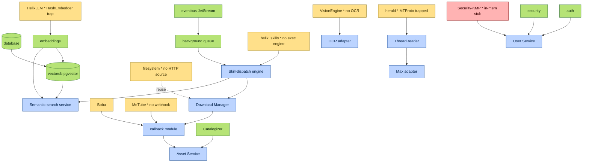

<!--
  Title           : Helix Thready — Reused Submodule Map & Maturity
  Classification  : PUBLIC
  Location        : docs/public/research/mvp/development/submodule-map.md
  Status          : Draft — v0.1
  Revision        : 1 (2026-07-21)
  Author          : Helix Thready documentation swarm (development)
  Related         : ./index.md, ./build-new-subsystems.md, ./workable-items.md,
                    ../../../../private/research/mvp/helix_thready_subsystem_gaps_and_improvements.md
-->

# Helix Thready — Reused Submodule Map & Maturity

| Rev | Date | Author | Change |
|-----|------|--------|--------|
| 1 | 2026-07-21 | swarm (development) | Initial map — every reused module, role, import path, maturity |

This document maps **every** `vasic-digital` / `HelixDevelopment` / `milos85vasic` submodule
Helix Thready reuses or extends, its role, its import path (where confirmed), and its **maturity**
as recorded in the private gap register. It is the "in-house first" ledger: the decision matrix
(final request §0.2) chose an owned module for almost every concern, and this map records the
honest build-readiness of each so no scaffold is mistaken for production.

> **Maturity legend `[gap register §0]`.** `PRODUCTION` (build on directly) · `FOUNDATION` (real but
> early) · `SCAFFOLD` (skeleton/stub) · `DESIGN-ONLY` (no working code) · `BUILD-NEW` (does not
> exist — see [build-new-subsystems.md](./build-new-subsystems.md)). **Confidence:** `VERIFIED`
> (read at source) · `FLAGGED` (metadata/README only — re-verify before reliance).

## Table of Contents

- [1. How to read this map](#1-how-to-read-this-map)
- [2. Data & infrastructure](#2-data--infrastructure)
- [3. AI / LLM](#3-ai--llm)
- [4. Skills & processing](#4-skills--processing)
- [5. Messenger & assets](#5-messenger--assets)
- [6. Security & auth](#6-security--auth)
- [7. Frontend / design / mobile](#7-frontend--design--mobile)
- [8. Testing / QA / docs / process](#8-testing--qa--docs--process)
- [9. Dependency & maturity diagram](#9-dependency--maturity-diagram)
- [10. Decoupling constraints `[§11.4.28]`](#10-decoupling-constraints-114-28)

## 1. How to read this map

- **Role** — what Thready uses it for.
- **Import / repo** — the confirmed import path (`digital.vasic.*` convention) or repo slug.
- **Maturity / Conf.** — from the gap register.
- **Thready action** — `WIRE` (config-inject as-is) · `EXTEND` · `HARDEN` (raise a scaffold) ·
  `BUILD-NEW`. Cross-referenced to the `ATM-NNN` item(s) and `[GAP: …]`.

## 2. Data & infrastructure

| Module | Role | Import / repo | Maturity / Conf. | Thready action | Item / Gap |
|--------|------|---------------|------------------|----------------|-----------|
| database | Relational store (SQLite dev / Postgres prod; `migration.Runner`) | `digital.vasic.database` | PRODUCTION / VERIFIED | WIRE + add partitioning/retention helpers | ATM-003, ATM-043 · [GAP 3.2] |
| vectordb | Semantic store (pgvector cosine; Qdrant/Pinecone/Milvus behind `VectorStore`) | `digital.vasic.vectordb` | PRODUCTION (pgvector) / VERIFIED; others FLAGGED | WIRE pgvector; HARDEN Qdrant | ATM-004, ATM-042 · [GAP 3.1] |
| embeddings | Embedding generation (OpenAI-compat providers) | `digital.vasic.embeddings` | PRODUCTION / VERIFIED | EXTEND: add native llama.cpp/HelixLLM provider | ATM-041 · [GAP 2.7] |
| rag | Retrieval-augmented generation | `digital.vasic.rag` | PRODUCTION / VERIFIED | WIRE | ATM-039 |
| eventbus | In-proc channel bus + **NATS JetStream** durable adapter | `digital.vasic.eventbus` | PRODUCTION / VERIFIED | WIRE (JetStream primary) | ATM-011 |
| background | Postgres task queue, DLQ, retry/back-off, worker pool | `digital.vasic.background` | PRODUCTION / VERIFIED | WIRE (idempotent single-claim) | ATM-023, ATM-027 |
| messaging | Kafka/RabbitMQ for firehose streams | `digital.vasic.messaging` | PRODUCTION / VERIFIED | WIRE (optional, high-throughput) | — |
| cache | L1/L2 in-mem + Redis + Postgres; consistent hashing | `digital.vasic.cache` | PRODUCTION / VERIFIED | WIRE | — |
| storage | MinIO/S3 object store + local FS + signed URLs | `digital.vasic.storage` | PRODUCTION / VERIFIED | WIRE; validate MinIO signed-URL parity | ATM-034, ATM-043 · [GAP 3.2] |
| filesystem | SMB/FTP/NFS/WebDAV/local; `OpenSeekable` for Range | `digital.vasic.filesystem` | PRODUCTION / VERIFIED | EXTEND: **add HTTP(S) source**; fix NFS listing | ATM-029 · [GAP 6.2] |
| observability | OTel + Prometheus + logrus + ClickHouse + `pkg/health` | `digital.vasic.observability` | PRODUCTION / VERIFIED | WIRE | ATM-005 |
| containers | Rootless Podman orchestration (`pkg/boot`/`compose`/`health`) | `vasic-digital/containers` | PRODUCTION / VERIFIED | WIRE (sole orchestration §11.4.76) | ATM-002 |
| lets_encrypt | ACME TLS (HTTP-01/DNS-01, atomic deploy-hook + rollback) | `vasic-digital/lets_encrypt` | PRODUCTION / VERIFIED | WIRE per subdomain | ATM-006 |
| discovery / mdns / port_prefix | Service discovery + deterministic dynamic ports | `digital.vasic.discovery` · `mdns` · `port_prefix` | PRODUCTION / VERIFIED | WIRE | ATM-007 |
| http3 | quic-go/http3 transport wrapper | `vasic-digital/http3` | PRODUCTION / VERIFIED | WIRE (REST + Download Manager) | ATM-020, ATM-028 |
| middleware / ratelimiter | CORS/request-id/recovery; rate limiting | `digital.vasic.middleware` · `digital.vasic.ratelimiter` | PRODUCTION / VERIFIED | WIRE | ATM-020 |

## 3. AI / LLM

| Module | Role | Import / repo | Maturity / Conf. | Thready action | Item / Gap |
|--------|------|---------------|------------------|----------------|-----------|
| HelixLLM | Local llama.cpp serving (OpenAI+Anthropic APIs); embeddings endpoint | `HelixDevelopment/HelixLLM` | PRODUCTION **with traps** / VERIFIED | HARDEN: enforce `llama` embedder, kill `HashEmbedder` default; remove 768 hardcode | ATM-040, ATM-041 · **[GAP 2.1]** |
| LLMProvider | 40+ provider adapters; retry/circuit-breaker/health | `digital.vasic.llmprovider` | PRODUCTION / FLAGGED (adapters unaudited) | WIRE + per-adapter contract tests | ATM-064 · [GAP 2.3] |
| LLMOrchestrator | Dev-time headless-agent pool orchestration (`AgentPool`) | `digital.vasic.llmorchestrator` | PRODUCTION / VERIFIED (core); `AgentPool` contract `[OPEN]` | WIRE for dev fleet; document `AgentPool` | ATM-067 · [GAP 2.4] |
| HelixAgent | Ensemble/debate agent hub | `dev.helix.agent` | FOUNDATION / FLAGGED (identity blur) | HARDEN: resolve identity split; pin only needed pkgs | ATM-063 · [GAP 2.2] |
| LLMsVerifier | Model scoring/selection for the fallback chain | `digital.vasic.llmsverifier` | PRODUCTION core / VERIFIED | HARDEN: reconcile `:7061`/`:8080`; stable scoring API | ATM-065 · [GAP 2.5] |
| VisionEngine | LLM-vision adapters; CV analyzer (`StubAnalyzer` behind `-tags vision`) | `digital.vasic.visionengine` | FOUNDATION / VERIFIED (**no OCR**) | EXTEND: add `OCRProvider` seam | ATM-033 · **[GAP 2.6]** |
| Memory / HelixMemory | Semantic/cognitive memory | `digital.vasic.memory` · HelixMemory | PRODUCTION / VERIFIED | DEFER or back `Memory` with `vectordb` | — · [GAP 2.8] |
| token_optimizer | Prompt token optimization pipeline | `digital.vasic.token_optimizer` | **partial/WIP** / VERIFIED | HARDEN or scope-out | ATM-061 · [GAP 2.9] |
| TOON | Token-Oriented Object Notation encoder | `digital.vasic.TOON` | **SCAFFOLD (not implemented)** / VERIFIED | HARDEN or scope-out; use toolkit `toon.mjs` meanwhile | ATM-061 · [GAP 2.9] |
| session_orchestrator | Atomic track-claim registry | `digital.vasic.session_orchestrator` | **DESIGN-ONLY** / VERIFIED | BUILD the claim registry | ATM-062 · [GAP 2.9] |
| Normalize / conversation / SkillRegistry / ToolSchema / MCP_Module / Agentic / Planning / AgentWrapper | Agent-support modules | (paths partly unconfirmed) | FLAGGED (docs-only) | **Source-verify + pin** before reliance | ATM-068 · [GAP 2.9] |

> **Anti-bluff, do not misread.** HelixLLM is production **with a trap** — its default local
> embedder is a non-semantic `HashEmbedder` stub; `TOON`/`session_orchestrator` have **no working
> code**. These are cited as gaps, not capabilities.

## 4. Skills & processing

| Module | Role | Import / repo | Maturity / Conf. | Thready action | Item / Gap |
|--------|------|---------------|------------------|----------------|-----------|
| helix_skills | Skill-Graph DAG (atomic→composite→umbrella); knowledge units | `HelixDevelopment/helix_skills` | FOUNDATION/MVP / VERIFIED (**no execution engine**) | BUILD-NEW dispatch engine on top; standardize `SKILL.md` | ATM-025, ATM-037, ATM-038 · **[GAP 4.1]** |
| SkillRegistry / MCP_Module | Runtime skill registration + tool exposure | (paths unconfirmed) | FLAGGED | Source-verify | ATM-068 · [GAP 2.9] |
| helix_proto | Protobuf/OpenAPI codegen pattern | `HelixDevelopment/helix_proto` | PRODUCTION / VERIFIED | WIRE for SDK codegen | ATM-060 |

## 5. Messenger & assets

| Module | Role | Import / repo | Maturity / Conf. | Thready action | Item / Gap |
|--------|------|---------------|------------------|----------------|-----------|
| herald | Messengers/posts/replies + fan-out; `gotd/td` MTProto in `qaherald` | `vasic-digital/herald` | FOUNDATION / VERIFIED (**MTProto trapped in QA; Max stub**) | EXTEND: promote MTProto reader; add Max; ThreadReader | ATM-016, ATM-017, ATM-018 · **[GAP 5.1]** |
| Catalogizer | Multi-protocol asset store (SQLCipher, JWT+RBAC, WS) | `vasic-digital/Catalogizer` | PRODUCTION / VERIFIED (not decoupled) | BUILD-NEW: decouple as Asset Service | ATM-012 · [GAP 6.1] |
| Boba-Base | Torrent search/download (SSE + `POST /api/v1/hooks`) | `milos85vasic/Boba-Base` | FOUNDATION / VERIFIED | EXTEND: standardize callback | ATM-032 · [GAP 6.4] |
| YT-DLP (MeTube) | Video/streaming download (poll-only API) | `milos85vasic/YT-DLP` | FOUNDATION / VERIFIED (**no outbound webhook**) | EXTEND: add completion webhook | ATM-031 · [GAP 6.5] |
| streaming | WebSocket hub (**not** media byte streaming) | `digital.vasic.streaming` | PRODUCTION / VERIFIED | WIRE for real-time surface | ATM-021 |

## 6. Security & auth

| Module | Role | Import / repo | Maturity / Conf. | Thready action | Item / Gap |
|--------|------|---------------|------------------|----------------|-----------|
| security | AES-256-GCM + Argon2id; `pkg/securestorage`/`pii`/`policy`/`headers`; SSRF | `digital.vasic.security` | PRODUCTION / VERIFIED | WIRE; add searchable-sealed creds; wire scanner adapters | ATM-014, ATM-055 · [GAP 7.1] |
| auth | JWT + API keys + OAuth2 (default HMAC-SHA256) | `digital.vasic.auth` | PRODUCTION / VERIFIED | EXTEND: RS256/EdDSA + JWKS; RBAC into User Service | ATM-013, ATM-010 · [GAP 7.2] |
| Security-KMP | Mobile secure storage | `vasic-digital/Security-KMP` | **SCAFFOLD (in-memory stub)** / VERIFIED | HARDEN: real Keychain/KeyStore before mobile release | ATM-015 · **[GAP 7.3]** |
| Auth-KMP | Mobile OAuth2 flows | `vasic-digital/Auth-KMP` | FOUNDATION / VERIFIED | EXTEND: consume fixed Security-KMP | ATM-046 · [GAP 7.4] |

## 7. Frontend / design / mobile

| Module | Role | Import / repo | Maturity / Conf. | Thready action | Item / Gap |
|--------|------|---------------|------------------|----------------|-----------|
| design_system | Web/CSS + Angular tokens/components (helix-green base) | `vasic-digital/design_system` | FOUNDATION / VERIFIED | HARDEN + Thready brand theme; publish npm | ATM-050 · [GAP 8.1] |
| open-design | Design-system source of truth (§11.4.162) | `nexu-io/open-design` | PRODUCTION / VERIFIED | WIRE (source, never fork) | ATM-050 |
| helix_design | Non-web design arm (Flutter/Qt/CSS token pkgs) | `vasic-digital/helix_design` | **SCAFFOLD** / VERIFIED | HARDEN: implement per-platform pkgs | ATM-051 · [GAP 8.2] |
| helix_ui | Flutter UI (alt family) | `vasic-digital/helix_ui` | **SCAFFOLD** / VERIFIED | Only if Flutter chosen; cannot target HarmonyOS/Aurora | — · [GAP 8.3] |
| KMP fleet (Auth/Security/Storage/Database/Concurrency/Formatters/Document/Config/RateLimiter/UI-Components-KMP) | Shared mobile logic | `vasic-digital/*-KMP` | **SCAFFOLD (no CI/publish; Database-KMP interfaces-only)** / VERIFIED | HARDEN: CI + Maven + SQLDelight | ATM-047 · [GAP 8.4] |
| helix_shims + HarmonyOS/Aurora clients | Native platform reach | `vasic-digital/helix_shims` + native clients | **SCAFFOLD** / VERIFIED/FLAGGED | BUILD-NEW: ArkTS + Qt clients | ATM-046 · [GAP 8.5] |
| helix_track_cli | TUI reference (Bubble Tea/Cobra/Lipgloss) | `vasic-digital/helix_track_cli` | FOUNDATION / FLAGGED | Confirm impl before adopting wholesale | ATM-049 · [GAP 8.6] |
| TS client libs (6) + UI-Components-React | React/TS surfaces | (various) | SCAFFOLD/FOUNDATION / FLAGGED | Re-audit + CI | ATM-049 · [GAP 8.6] |

## 8. Testing / QA / docs / process

| Module | Role | Import / repo | Maturity / Conf. | Thready action | Item / Gap |
|--------|------|---------------|------------------|----------------|-----------|
| challenges | Per-feature real-use-case scenario bank | `vasic-digital/challenges` | PRODUCTION / VERIFIED | WIRE: author Thready scenario banks | ATM-054 · [GAP 9.3] |
| HelixQA / helix_qa | AI-driven multi-platform QA (runtime evidence) | `HelixDevelopment/helix_qa` (+ `vasic-digital/HelixQA`) | PRODUCTION / VERIFIED/FLAGGED (mirror) | WIRE: YAML banks; confirm canonical vs mirror | ATM-054 · [GAP 9.1] |
| Panoptic / VisualRegression / ScreenDiff / ReplayBuffer | Visual regression (LLM-vision + pixel) | `vasic-digital/*` | Panoptic PRODUCTION; VR family no-CI / VERIFIED/FLAGGED | WIRE + add CI to VR family | ATM-054 · [GAP 9.3] |
| DocProcessor | Feature-map → coverage tracking | `HelixDevelopment/DocProcessor` | PRODUCTION / VERIFIED | WIRE docs↔tests coverage | ATM-054 · [GAP 9.4] |
| docs_chain | md↔HTML/PDF/DOCX↔SQLite sync (§11.4.65/106) | `vasic-digital/docs_chain` | PRODUCTION (ph 1–5) / VERIFIED | WIRE; provision pandoc/weasyprint | ATM-009, ATM-069 · [GAP 10.1] |
| claude_toolkit | Multi-account aliases; provider aliases; TOON utils; OpenCode sync | `vasic-digital/claude_toolkit` | PRODUCTION / VERIFIED | WIRE for dev fleet (alias-first, token opt) | orchestration |
| HelixTranslate + i18n | Localization (en/ru/sr-Cyrl) | `HelixDevelopment/helix_translate` · `digital.vasic.i18n` | PRODUCTION / VERIFIED | WIRE | ATM-044 |
| codegraph | Code intelligence (§11.4.78–80) | `colbymchenry/codegraph` | PRODUCTION / VERIFIED | WIRE: index own-org submodules | ATM-008 |

## 9. Dependency & maturity diagram

**Explanation (for readers/models that cannot see the diagram).** Colour encodes maturity: green =
PRODUCTION, amber = FOUNDATION (real but early, with the specific trap noted inline), red = SCAFFOLD/
stub, blue = BUILD-NEW. The green data spine — `database` → `vectordb` (pgvector) with `embeddings`
— is production and wired directly. `HelixLLM` feeds `embeddings` but is amber because its default
embedder is the `HashEmbedder` stub (`ATM-040`). The processing spine flows `eventbus` → `background`
→ the **new** Skill-dispatch engine, which reads the amber `helix_skills` Skill-Graph (knowledge
only — no execution engine). The dispatch engine drives the **new** Download Manager (reusing the
amber `filesystem`, which lacks an HTTP source), which emits the **new** standardized callback that
`Boba` and the amber `MeTube` (no webhook today) also emit, all landing in the **new** Asset Service
(decoupled from the green `Catalogizer`). The amber `VisionEngine` (no OCR) gains a **new** OCR
adapter; the amber `herald` (MTProto trapped in a QA harness) gains a **new** ThreadReader and Max
adapter. The green `auth` + `security` plus the **red** `Security-KMP` stub back the **new** User
Service. Finally the dispatch engine and the green `embeddings`/`vectordb` feed the **new**
Semantic-search service. Every blue node has a design plan in
[build-new-subsystems.md](./build-new-subsystems.md); every amber/red trap has a `[GAP]` and a
hardening item.

> Rendered PNG/SVG exported via Docs Chain (§11.4.65). Source: [diagrams/submodule-maturity.mmd](./diagrams/submodule-maturity.mmd).

## 10. Decoupling constraints `[§11.4.28]`

VERIFIED at source (Constitution §11.4.28 / CONST-051): every owned submodule Thready reuses MUST
be **project-not-aware**, fully reusable and **config-injected**, laid out at `<root>/<name>/` or
`<root>/submodules/<name>/`. **Nested own-org submodule chains are forbidden** (depth-1 exception
only for constitution-anchored reusable engines carrying `helix-deps.yaml`). Consequences for this
map: (1) Thready never forks a module — it consumes it as a dependency and extends **upstream**;
(2) each `BUILD-NEW` submodule (Asset Service, Download Manager, Max adapter, OCR adapter, User
Service, callback module) gets its **own** repo under `vasic-digital`/`HelixDevelopment` with an
`upstreams/` recipe, not a vendored copy inside `helix_thready`; (3) `ATM-059` audits every reused
module for project-not-awareness before wiring.

---

*Made with love ♥ by Helix Development.*
