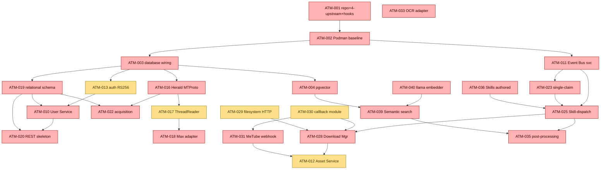

<!--
  Title           : Helix Thready — Workable-Items Backlog (Full-Granularity Cards)
  Classification  : PUBLIC
  Location        : docs/public/research/mvp/development/workable-items-detail.md
  Status          : Review — v0.1
  Revision        : 1 (2026-07-22)
  Author          : Helix Thready documentation swarm (development)
  Related         : ./workable-items.md, ./index.md, ./agent-orchestration.md,
                    ./build-new-subsystems.md, ./submodule-map.md,
                    ../../../../private/research/mvp/helix_thready_subsystem_gaps_and_improvements.md
-->

# Helix Thready — Workable-Items Backlog (Full-Granularity Cards)

| Rev | Date | Author | Change |
|-----|------|--------|--------|
| 1 | 2026-07-22 | swarm (development, pass 3) | Full-granularity expansion: per-item cards (phase → sub-phase → task) with Given/When/Then acceptance, dependencies, blocks, test-type coverage and verified-source anchors for ATM-001…ATM-072 |

This document is the **implementation-ready** expansion of the summary backlog in
[workable-items.md](./workable-items.md). The summary tables give the *shape* of the backlog
(id, title, kind, priority, depends-on, gap); **this** document gives each item its full card:
the decoupled scope, the **task-level sub-items** (`ATM-NNN.k`) a worker/subagent claims, the
**Given/When/Then acceptance criteria**, the explicit **blocks/blocked-by** edges, the mandated
**test types**, and — where a claim was verified against real module source during Pass 3 — a
**Verified-source** anchor citing the exact file. Nothing here is a bluff: an item that depends on
a scaffold/stub says so and names the hardening prerequisite.

The card format is the unit the orchestration model dispatches (see
[agent-orchestration.md §4–§6](./agent-orchestration.md#4-subagent-driven-by-default-11142070)):
a **track worker** claims an `ATM-NNN`, decomposes it into its `ATM-NNN.k` tasks, and dispatches a
**subagent per task** on disjoint file globs. The `ATM-NNN.k` ids are the disjoint-scope guarantee
`[§11.4.58 L3]` — two subagents never share a task's glob.

> **Provenance tags** `[CONSTITUTION §x]` · `[IN-HOUSE: module]` · `[RESEARCH]` · `[OPERATOR]` ·
> `[DEFAULT — adjustable]` · `[BUILD-NEW]` · `[GAP: id]` · `[VERIFIED-SOURCE]` (read at module
> source during Pass 3) · `[OPEN: …]`.

## Table of Contents

- [1. Card schema](#1-card-schema)
- [2. Critical-path dependency DAG](#2-critical-path-dependency-dag)
- [3. Phase 1 — Foundation (ATM-001…ATM-021)](#3-phase-1--foundation-atm-001atm-021)
- [4. Phase 2 — Processing Engine (ATM-022…ATM-043)](#4-phase-2--processing-engine-atm-022atm-043)
- [5. Phase 3 — Client Applications (ATM-044…ATM-051)](#5-phase-3--client-applications-atm-044atm-051)
- [6. Phase 4 — Testing & Deployment (ATM-052…ATM-057)](#6-phase-4--testing--deployment-atm-052atm-057)
- [7. Cross-cutting (ATM-058…ATM-072)](#7-cross-cutting-atm-058atm-072)
- [8. Estimation & sequencing guidance](#8-estimation--sequencing-guidance)

## 1. Card schema

Each card carries the fields below. Fields also present in the summary DB (`docs/workable_items.db`,
`[§11.4.93/95]`) are mirrored 1:1; the **Tasks** and **Given/When/Then** fields are the new
granularity this document adds.

- **Kind / Pri / Phase** — `PRODUCTION-WIRE | EXTEND | BUILD-NEW | HARDEN | AUDIT`; `P0|P1|P2`;
  `phase.subphase` from final request §5.1.2.
- **Provides / Depends on / Blocks** — the item's output contract and its explicit graph edges.
- **Decoupled scope** — what the item does and, crucially, what it must **not** touch `[§11.4.28]`.
- **Tasks (`ATM-NNN.k`)** — the disjoint sub-scopes a subagent claims; each names its file-glob home.
- **Acceptance (Given/When/Then)** — executable acceptance statements; these become the RED tests.
- **Test types** — the mandated subset of the 15 `[§11.4.27]`; mocks are unit-only.
- **Verified-source** — where a fact was read at module source in Pass 3 (else the caveat is kept).

## 2. Critical-path dependency DAG

**Explanation (for readers/models that cannot see the diagram).** This is the P0/P1 critical path
the multi-track ruler follows; red is P0 (blocks the MVP) and amber is P1 (GA-grade). The single
root is `ATM-001` (repo + four-upstream bootstrap + git hooks): nothing can be committed to spec
until the enforcement layer exists, so it gates the entire tree. From the container baseline
(`ATM-002`) the graph forks into three broad rivers that run **concurrently** on separate tracks:
the *data river* (`ATM-003` database → `ATM-004` pgvector and `ATM-019` relational schema →
`ATM-020` REST and `ATM-010` User Service), the *messenger river* (`ATM-016` Herald MTProto →
`ATM-017` ThreadReader → `ATM-018` Max, and → `ATM-022` acquisition), and the *processing river*
(`ATM-011` Event Bus → `ATM-023` single-claim + `ATM-025` Skill-dispatch).

The three rivers rejoin at the processing spine: the Skill-dispatch engine (`ATM-025`) drives the
Download Manager (`ATM-028`), which — with the callback module (`ATM-030`) and the `filesystem`
HTTP-source fix (`ATM-029`) — feeds the Asset Service (`ATM-012`) alongside the MeTube webhook
(`ATM-031`). A parallel semantic branch runs `ATM-040` (enforce the real llama embedder) →
`ATM-039` (Semantic search) fed by `ATM-004` (pgvector), and finally post-processing (`ATM-035`)
consumes both the dispatch output and the semantic index to write the status reply and grow the
Skill-Trees. The OCR adapter (`ATM-033`) hangs off the graph with no inbound edge because it is
genuinely independent — it can proceed the moment a track is free. The ruler's job is to keep every
one of these rivers saturated: a freed track is immediately re-assigned the next-highest-priority
item whose inbound edges are all `DONE` `[§11.4.192]`.

> Rendered PNG/SVG exported via Docs Chain (§11.4.65). Source: [diagrams/critical-path-dag.mmd](./diagrams/critical-path-dag.mmd).

---

## 3. Phase 1 — Foundation (ATM-001…ATM-021)

### 3.1 Infrastructure (sub-phase 1.1)

#### ATM-001 — Repo + 4-upstream bootstrap + git hooks
- **Kind/Pri/Phase:** PRODUCTION-WIRE · P0 · 1.1. **Depends on:** — . **Blocks:** everything.
- **Provides:** a repo whose every commit is spec-enforced and fans out to all four upstreams.
- **Decoupled scope:** install the org tooling into `helix_thready`; do **not** author product code.
- **Tasks:**
  - `ATM-001.1` — place `upstreams/{GitHub,GitLab,GitFlic,GitVerse}.sh` (VERIFIED present) and run
    `install_upstreams.sh` so `github/gitlab/gitflic/gitverse` remotes exist. Glob: `upstreams/**`.
  - `ATM-001.2` — vendor `scripts/git_hooks/{pre-commit,pre-push,post-commit,commit-msg}` and run the
    **symlink** installer `scripts/install_git_hooks.sh`. Glob: `scripts/**`.
  - `ATM-001.3` — vendor `scripts/commit_all.sh` + `scripts/push_all.sh`; add `docs/audit/bypass_events.md`.
  - `ATM-001.4` — wire the private submodule `docs/private` (VERIFIED `.gitmodules`).
- **Acceptance (Given/When/Then):**
  - Given a fresh clone, When `install_upstreams.sh` runs, Then `git remote` lists exactly
    `github, gitlab, gitflic, gitverse` pointing at the SSH URLs in Appendix C.
  - Given a staged `.md` lacking `.html/.pdf` siblings in the governed set, When `git commit`, Then
    the `pre-commit` hook exits 1 and blocks.
  - Given `git commit --no-verify` with no `Bypass-rationale:` footer, When committing, Then the
    `commit-msg` hook blocks (marker-freshness detection).
- **Test types:** unit (hook logic), integration (real four-remote push to test repos), challenges.
- **Verified-source `[VERIFIED-SOURCE]`:** installer is symlink-based/idempotent
  (`helix_code/scripts/install_git_hooks.sh`); commit-msg uses the `.git/ATMO_PRECOMMIT_RAN`
  marker (`helix_code/scripts/git_hooks/commit-msg`); see [git-workflow-internals.md](./git-workflow-internals.md).
- **Gap:** — . **Provenance:** `[CONSTITUTION §11.4.75/§2.1]` `[VERIFIED-SOURCE]`.

#### ATM-002 — Rootless Podman Compose baseline
- **Kind/Pri/Phase:** PRODUCTION-WIRE · P0 · 1.1. **Depends on:** ATM-001. **Blocks:** ATM-003/005/006/007/011/057.
- **Provides:** the sole orchestration substrate `[§11.4.76]` — `pkg/boot`/`pkg/compose`/`pkg/health`.
- **Decoupled scope:** stand up `vasic-digital/containers`; no product services yet.
- **Tasks:** `ATM-002.1` compose baseline + rootless Podman socket; `ATM-002.2` per-service health
  probes via `observability/pkg/health`; `ATM-002.3` three env profiles (`dev.`/`sta.`/`thready.`).
- **Acceptance:** Given the compose baseline, When `pkg/boot` starts, Then all declared containers
  report healthy within the boot budget and Podman runs **rootless** (no root daemon). Given a
  killed container, When health polling runs, Then it is reported unhealthy and restarted.
- **Test types:** unit, integration (real Podman), chaos (container kill), performance (boot time).
- **Gap:** — . **Provenance:** `[CONSTITUTION §11.4.76/161]` `[IN-HOUSE: containers]`.

#### ATM-003 — `digital.vasic.database` wiring
- **Kind/Pri/Phase:** PRODUCTION-WIRE · P0 · 1.1. **Depends on:** ATM-002. **Blocks:** ATM-004/013/019/043.
- **Provides:** SQLite dev (`modernc.org/sqlite`, cgo-free) / Postgres prod (`pgx/v5`) + `migration.Runner`.
- **Tasks:** `ATM-003.1` DSN/config injection (project-not-aware); `ATM-003.2` `migration.Runner`
  up/down harness; `ATM-003.3` connection-pool + health.
- **Acceptance:** Given the dev profile, When the app boots, Then it opens a cgo-free SQLite DB and
  applies all pending migrations; Given the prod profile, Then it opens Postgres via `pgx/v5`. Given
  a migration `up` then `down`, Then the schema round-trips with no residue (expand-contract, `[Q30]`).
- **Test types:** unit, integration (both backends), migration round-trip.
- **Gap:** — . **Provenance:** `[IN-HOUSE: database]` `[Q12/Q30]`.

#### ATM-004 — pgvector provisioning + `digital.vasic.vectordb`
- **Kind/Pri/Phase:** PRODUCTION-WIRE · P0 · 1.1. **Depends on:** ATM-003. **Blocks:** ATM-039/042.
- **Provides:** cosine `<=>` vector store co-located in Postgres behind the `VectorStore` seam.
- **Tasks:** `ATM-004.1` enable pgvector extension in the Postgres image; `ATM-004.2` `VectorStore`
  cosine upsert/search; `ATM-004.3` id-hydration join back to relational rows; `ATM-004.4` the
  embedding-provider guard (`RequireSemanticEmbedder`, ties to ATM-040).
- **Acceptance:** Given a set of embedded rows, When a cosine `<=>` top-k query runs, Then the
  returned ids hydrate against relational rows and the search completes < 500 ms (Aggressive SLO,
  `[Q14]`). Given `HELIX_EMBEDDING_PROVIDER != llama` in a RAG/search context, Then the guard fails
  loudly (never the `HashEmbedder` stub — see ATM-040).
- **Test types:** unit, integration, performance (< 500 ms), benchmarking.
- **Gap:** 3.1. **Provenance:** `[IN-HOUSE: vectordb]` `[GAP 2.1]`.

#### ATM-005 — `digital.vasic.observability`
- **Kind/Pri/Phase:** PRODUCTION-WIRE · P0 · 1.1. **Depends on:** ATM-002. **Blocks:** all runtime items (telemetry).
- **Provides:** OTel traces + Prometheus metrics + logrus structured logs + ClickHouse + `pkg/health`.
- **Tasks:** `ATM-005.1` OTLP exporter + Jaeger/Zipkin; `ATM-005.2` Prometheus registry + Grafana
  dashboards; `ATM-005.3` logrus + correlation-id middleware; `ATM-005.4` ClickHouse analytics sink.
- **Acceptance:** Given a cross-service call, When it executes, Then an OTel span with a correlation
  id is emitted and queue/latency/retry Prometheus metrics update. Given a secret in a log field,
  Then it is redacted (`[§11.4.10]`).
- **Test types:** unit, integration (real collectors), security (no-secret-in-log).
- **Gap:** — . **Provenance:** `[IN-HOUSE: observability]` `[Q40/Q42/Q43]`.

#### ATM-006 — Let's Encrypt TLS per subdomain
- **Kind/Pri/Phase:** PRODUCTION-WIRE · P1 · 1.1. **Depends on:** ATM-002. **Blocks:** ATM-057.
- **Provides:** ACME certs (HTTP-01/DNS-01) per `dev.`/`sta.`/`thready.` with atomic deploy-hook + rollback.
- **Tasks:** `ATM-006.1` acme.sh integration; `ATM-006.2` atomic deploy-hook; `ATM-006.3` systemd
  renew timer; `ATM-006.4` rollback-on-failed-reload.
- **Acceptance:** Given a subdomain, When issuance runs, Then a valid cert is installed atomically
  and a failed reload rolls back to the prior cert; When renewal is due, Then the timer renews
  without downtime.
- **Test types:** unit, integration (staging ACME), chaos (failed reload → rollback).
- **Gap:** — . **Provenance:** `[IN-HOUSE: lets_encrypt]` `[Q44]`.

#### ATM-007 — Dynamic ports (`discovery` + `mdns` + `port_prefix`)
- **Kind/Pri/Phase:** PRODUCTION-WIRE · P1 · 1.1. **Depends on:** ATM-002.
- **Provides:** deterministic dynamic port allocation ≤ 65535 + service registration + failover.
- **Tasks:** `ATM-007.1` `port_prefix` deterministic allocation; `ATM-007.2` `discovery` registration;
  `ATM-007.3` `mdns` advertisement; `ATM-007.4` health-gated deregistration.
- **Acceptance:** Given N services, When they boot, Then each gets a deterministic port ≤ 65535 with
  no collision and registers; When one dies, Then it deregisters and failover routes elsewhere.
- **Test types:** unit, integration, chaos (service death → failover).
- **Gap:** — . **Provenance:** `[IN-HOUSE: discovery/mdns/port_prefix]` `[§14.3]`.

#### ATM-008 — CodeGraph index of own-org submodules
- **Kind/Pri/Phase:** PRODUCTION-WIRE · P1 · 1.1. **Depends on:** ATM-001.
- **Provides:** a local SQLite code-intelligence index `[§11.4.78–80]` + scheduled re-index.
- **Tasks:** `ATM-008.1` index the reused submodules; `ATM-008.2` MCP wiring for agent queries;
  `ATM-008.3` scheduled re-index hook.
- **Acceptance:** Given the reused submodules, When indexing runs, Then `codegraph explore` answers
  symbol/call-path queries; When a submodule changes, Then the scheduled re-index refreshes it.
- **Test types:** unit, integration.
- **Gap:** — . **Provenance:** `[CONSTITUTION §11.4.78–80]` `[IN-HOUSE: codegraph]`.

#### ATM-009 — Docs Chain contexts (md → HTML/PDF/DOCX siblings)
- **Kind/Pri/Phase:** PRODUCTION-WIRE · P1 · 1.1. **Depends on:** ATM-001. **Related:** ATM-069.
- **Provides:** `.docs_chain/contexts/*.yaml` so every `.md` gets HTML/PDF/DOCX siblings `[§11.4.65]`.
- **Tasks:** `ATM-009.1` author the Thready docs-chain context; `ATM-009.2` wire `sync_all_markdown_exports.sh`;
  `ATM-009.3` provision pandoc/weasyprint (ties to ATM-069).
- **Acceptance:** Given a committed `.md`, When Docs Chain runs, Then HTML/PDF/DOCX siblings exist and
  the content-hash DAG marks them fresh; Given pandoc/weasyprint absent, Then it **honest-SKIPs** with
  a logged reason (never fakes success, `[§11.4.3/52]`).
- **Test types:** unit, integration (real pandoc/weasyprint), challenges (SKIP honesty).
- **Gap:** 10.1. **Provenance:** `[CONSTITUTION §11.4.65/106]` `[GAP 10.1]`.

### 3.2 Core Services (sub-phase 1.2)

#### ATM-010 — User Service `[BUILD-NEW]`
- **Kind/Pri/Phase:** BUILD-NEW · P0 · 1.2. **Depends on:** ATM-003, ATM-013. **Blocks:** ATM-012, ATM-020.
- **Provides:** three-tier multi-tenant RBAC (root / account-admin / user) + cross-account membership.
- **Decoupled scope:** own repo on `auth` + `security/pkg/policy` + Catalogizer RBAC pattern; **not** a
  vendored copy inside `helix_thready`. Design: [build-new-subsystems.md §7](./build-new-subsystems.md#7-user-service-build-new).
- **Tasks:** `ATM-010.1` `BootstrapRoot` (owner-only, once, at deploy); `ATM-010.2` `CreateAccount`
  (Root-only); `ATM-010.3` `Invite` (Root or that account's Admin); `ATM-010.4` `Authorize` →
  `security/pkg/policy`; `ATM-010.5` TOTP MFA for admin tiers; `ATM-010.6` account/user/membership DDL.
- **Acceptance:** Given a fresh deploy, When bootstrap runs, Then exactly one Root Admin exists,
  owner-only. Given a non-Root caller, When `CreateAccount`, Then `403`. Given a user in two accounts,
  Then both memberships resolve and each permission check flows through `security/pkg/policy`. Given
  an admin login without TOTP, Then `401`.
- **Test types:** unit, integration, e2e, **security** (authz matrix + privilege-escalation + MFA
  bypass + token revocation), challenges, HelixQA.
- **Gap:** 7.2, §11. **Provenance:** `[BUILD-NEW]` `[IN-HOUSE: auth/security]` `[GAP 7.2]`.

#### ATM-011 — Event Bus service `[BUILD-NEW]`
- **Kind/Pri/Phase:** BUILD-NEW · P0 · 1.2. **Depends on:** ATM-002. **Blocks:** ATM-021/023/025/030.
- **Provides:** client-facing durable subscription over WS/SSE wrapping `eventbus` (NATS JetStream),
  sticky events + invalidation, at-least-once + durable replay. Design:
  [build-new-subsystems.md §8](./build-new-subsystems.md#8-event-bus-service-build-new).
- **Tasks:** `ATM-011.1` `Publish`; `ATM-011.2` `Subscribe(filter, sticky)` with durable JetStream
  consumer; `ATM-011.3` sticky last-value cache + `Invalidate`; `ATM-011.4` SSE surface
  (`Last-Event-ID` replay cursor); `ATM-011.5` WebSocket frame contract; `ATM-011.6` the events catalog.
- **Acceptance:** Given a disconnected client reconnecting with a cursor, When it resubscribes, Then
  missed events replay and sticky subjects deliver last-value first. Given an entity state change,
  Then the sticky value is invalidated. Given a broker restart, Then durable consumers resume with
  no lost event (at-least-once, idempotent consumers).
- **Test types:** unit, integration (JetStream cluster), chaos (broker restart → replay), scaling
  (fan-out), performance.
- **Gap:** §11. **Provenance:** `[BUILD-NEW]` `[IN-HOUSE: eventbus]` `[§3.4]`.

#### ATM-012 — Asset Service `[BUILD-NEW]`
- **Kind/Pri/Phase:** BUILD-NEW · P1 · 1.2. **Depends on:** ATM-003, ATM-010. **Blocks:** ATM-031/034.
- **Provides:** decoupled Catalogizer-based asset store/serve (multi-protocol, SQLCipher-at-rest,
  JWT+RBAC, WS, Range/`OpenSeekable`, MinIO tier, content-hash dedup, `…-web` renditions, **Proxy**
  links — never raw paths). Design: [build-new-subsystems.md §6](./build-new-subsystems.md#6-asset-service-build-new).
- **Tasks:** `ATM-012.1` `Put` (content-hash dedup); `ATM-012.2` `OpenRange` (Range/HLS);
  `ATM-012.3` `Link` (short-lived signed URL, never a path); `ATM-012.4` `Rendition` (`…-web`);
  `ATM-012.5` sealed AES-256-GCM dirs for sensitive assets; `ATM-012.6` asset/rendition/post_asset DDL.
- **Acceptance:** Given the same bytes twice, When `Put`, Then one row exists (dedup by content hash).
  Given a client, When it requests bytes, Then it receives a signed URL / Range stream, **never** a
  raw file path, and RBAC is enforced server-side. Given a sealed asset, Then only the service can
  decrypt it.
- **Test types:** unit, integration (MinIO signed URLs, Range), security (RBAC + sealed-dir), performance
  (streaming), scaling (50 TB+ dedup).
- **Gap:** 6.1, §11. **Provenance:** `[BUILD-NEW]` `[IN-HOUSE: Catalogizer]` `[GAP 6.1]`.

#### ATM-013 — `digital.vasic.auth` RS256/EdDSA + JWKS
- **Kind/Pri/Phase:** EXTEND · P1 · 1.2. **Depends on:** ATM-003. **Blocks:** ATM-010, ATM-020.
- **Provides:** asymmetric JWT signing (default is **HMAC-SHA256** `[GAP 7.2]`) + JWKS rotation.
- **Tasks:** `ATM-013.1` RS256/EdDSA signer; `ATM-013.2` JWKS endpoint + rotation; `ATM-013.3`
  scoped API keys; `ATM-013.4` OAuth2 external-linking.
- **Acceptance:** Given a token signed RS256, When any service verifies it, Then verification uses the
  published JWKS (no shared HMAC secret). Given a rotated key, Then old tokens verify until expiry and
  new tokens use the new key.
- **Test types:** unit, integration, security (key rotation, alg-confusion).
- **Gap:** 7.2. **Provenance:** `[EXTEND]` `[IN-HOUSE: auth]` `[GAP 7.2]`.

#### ATM-014 — `digital.vasic.security` searchable-yet-sealed credentials
- **Kind/Pri/Phase:** EXTEND · P2 · 1.2. **Depends on:** ATM-003.
- **Provides:** sealed key store + a **searchable-yet-sealed** credential representation (embed over a
  redacted/tokenized form so secrets are findable without leaking the raw value).
- **Tasks:** `ATM-014.1` sealed key store; `ATM-014.2` redacted/tokenized embedding representation;
  `ATM-014.3` `pkg/pii` redaction wiring.
- **Acceptance:** Given a stored credential, When a semantic search runs, Then the credential is found
  by meaning **without** the raw secret ever appearing in the index or logs (`[§3.6/§11.4.10]`).
- **Test types:** unit, integration, security (leak audit).
- **Gap:** 7.1. **Provenance:** `[EXTEND]` `[IN-HOUSE: security]` `[GAP 7.1]`.

#### ATM-015 — `Security-KMP` native secure storage
- **Kind/Pri/Phase:** HARDEN · P0 (mobile) · 1.2. **Depends on:** — . **Blocks:** ATM-046.
- **Provides:** real Android Keystore / iOS Keychain / Wasm secure storage — currently an **in-memory
  stub** `[GAP 7.3]` (only `DesktopSecureStorage` JVM is real AES-256-GCM).
- **Tasks:** `ATM-015.1` Android Keystore; `ATM-015.2` iOS Keychain; `ATM-015.3` Wasm/browser store;
  `ATM-015.4` on-device round-trip contract test.
- **Acceptance:** Given a secret stored on a real device, When the app restarts, Then it is retrieved
  from the platform-native secure enclave, **never** plaintext memory. **Mobile release is blocked**
  until this passes on-device.
- **Test types:** unit, integration (on-device), security (plaintext-at-rest negative), paired-mutation.
- **Gap:** 7.3. **Provenance:** `[HARDEN]` `[IN-HOUSE: Security-KMP]` `[GAP 7.3]` (README self-discloses stub).

### 3.3 Integration (sub-phase 1.3)

#### ATM-016 — Herald first-class Telegram thread-reader (promote MTProto)
- **Kind/Pri/Phase:** EXTEND · P0 · 1.3. **Depends on:** ATM-003. **Blocks:** ATM-017, ATM-022.
- **Provides:** promote the `qaherald` `gotd/td` MTProto user client to a first-class
  `channels.Channel` (forum topics via `channels.getForumTopics`, replies via `messages.getReplies`,
  full attachment/forward extraction), keeping the `channels.Channel` seam.
- **Tasks:** `ATM-016.1` lift the MTProto client out of `qaherald/internal/mtproto` into a first-class
  channel package; `ATM-016.2` implement `channels.Channel` (`SendReplyGeneric`/`BotSelfIdentity`/
  `DownloadAttachment` + embedded `commons.Channel`); `ATM-016.3` forum-topic + reply-thread reads;
  `ATM-016.4` `access_hash` resolution.
- **Acceptance:** Given a configured Telegram channel, When acquisition runs, Then full channel/group
  **history** is backfilled (Bot-API cannot do this); Given a forum topic, Then its topics and reply
  threads are read; the adapter satisfies `var _ channels.Channel`.
- **Test types:** unit, integration (live Telegram fixture — Appendix A `t.me/+622y04wzy_YzOTA0`), e2e.
- **Verified-source `[VERIFIED-SOURCE]`:** the seam is `commons_messaging/channels/channel.go`:
  `type Channel interface { commons.Channel; SendReplyGeneric(ctx, recipient, body, replyToID,
  attachments) (string, error); BotSelfIdentity(ctx) (SelfIdentity, error); DownloadAttachment(ctx,
  externalID, mime) (string, string, error) }`; MTProto currently lives only in `qaherald`/`docs/guides/MTPROTO.md`.
- **Gap:** 5.1. **Provenance:** `[EXTEND]` `[IN-HOUSE: herald]` `[VERIFIED-SOURCE]` `[GAP 5.1]`.

#### ATM-017 — ThreadReader abstraction `[BUILD-NEW]`
- **Kind/Pri/Phase:** BUILD-NEW · P1 · 1.3. **Depends on:** ATM-016. **Blocks:** ATM-018.
- **Provides:** reusable root + organic-reply assembly (exclude system replies, resolve `access_hash`),
  shared across messengers. Design: [build-new-subsystems.md §9](./build-new-subsystems.md#9-threadreader-abstraction-build-new).
- **Tasks:** `ATM-017.1` `Assemble(ThreadRef) (Thread, error)`; `ATM-017.2` system-reply exclusion;
  `ATM-017.3` hashtag + attachment extraction into `Thread`.
- **Acceptance:** Given a link-only root post with tags added in a reply, When `Assemble` runs, Then
  the returned `Thread` contains the root + all organic replies with the reply-borne tags, and the
  system's own processing replies are excluded (VERIFIED §3.2.1 — critical).
- **Test types:** unit, integration (live Telegram/Max fixtures), e2e.
- **Gap:** 5.1, §11. **Provenance:** `[BUILD-NEW]` `[GAP 5.1]`.

#### ATM-018 — Max adapter `[BUILD-NEW]`
- **Kind/Pri/Phase:** BUILD-NEW · P0 · 1.3. **Depends on:** ATM-017. **Open:** `[OPEN: max-oneme-go-port]`.
- **Provides:** a Herald Max channel with two transports — Bot API (Go SDK, dev.max.ru) **and** a Go
  port of the OneMe user-WebSocket protocol for full history. Design:
  [build-new-subsystems.md §3](./build-new-subsystems.md#3-max-messenger-adapter-build-new).
- **Tasks:** `ATM-018.1` Bot-API transport implementing `channels.Channel` (ships first);
  `ATM-018.2` **[spike]** OneMe user-WS protocol capture (`ATM-067`-style); `ATM-018.3` Go OneMe
  client (spike-gated); `ATM-018.4` ThreadReader integration.
- **Acceptance:** Given an operator Max invite link (Appendix A), When the Bot-API transport connects,
  Then bot-scoped posts are read and satisfy `channels.Channel`. Given the OneMe port, Then full
  channel/thread history reads — **but** this remains `[OPEN]` until the spike proves the protocol;
  it is **never** claimed working before then.
- **Test types:** unit, integration (live invite links), e2e, security (session/token via fixed Security-KMP).
- **Verified-source `[VERIFIED-SOURCE]`:** Herald has **no** `channels/max` or `channels/mtproto`
  package — only `docs/guides/messengers/MAX.md` (placeholder) + reserved env vars; confirms the empty
  stub. Reference impls `vkmax`/`max-mcp`/`MaxAPI` are Python `[RESEARCH]`.
- **Gap:** 5.1, §11. **Provenance:** `[BUILD-NEW]` `[RESEARCH]` `[VERIFIED-SOURCE]` `[GAP 5.1]`.

#### ATM-019 — Relational schema + migrations
- **Kind/Pri/Phase:** EXTEND · P0 · 1.3. **Depends on:** ATM-003. **Blocks:** ATM-010/020/022.
- **Provides:** the full ERD (posts, threads, replies, hashtags, categories, accounts, users, roles,
  permissions, memberships, assets, asset_links, processing_state, events, subscriptions,
  billing/metering, audit).
- **Tasks:** `ATM-019.1` post/thread/reply/hashtag/category tables; `ATM-019.2` account/user/role/
  permission/membership; `ATM-019.3` asset/asset_link/processing_state; `ATM-019.4` event/subscription/
  billing/audit; `ATM-019.5` up/down migrations (expand-contract).
- **Acceptance:** Given the schema, When migrations apply, Then all tables + indexes exist with FK
  integrity; When rolled back, Then no residue. Given a post, Then its processing_state row is unique.
- **Test types:** unit, integration, migration round-trip.
- **Gap:** 3.2. **Provenance:** `[EXTEND]` `[IN-HOUSE: database]` `[§19.12]`. See [../database/index.md](../database/index.md).

#### ATM-020 — REST API skeleton (`/v1`, HTTP/3 + H2)
- **Kind/Pri/Phase:** EXTEND · P0 · 1.3. **Depends on:** ATM-010, ATM-019. **Blocks:** ATM-021/044/048.
- **Provides:** `/v1` REST surface on `vasic-digital/http3` (H2 fallback) + `auth` + `ratelimiter` +
  `security/pkg/headers` + `middleware`.
- **Tasks:** `ATM-020.1` router + `/v1` versioning; `ATM-020.2` HTTP/3 transport + H2 fallback;
  `ATM-020.3` auth + rate-limit + security-headers middleware; `ATM-020.4` OpenAPI 3.1 surface + Swagger.
- **Acceptance:** Given a request, When it hits `/v1`, Then it is authn/authz-checked, rate-limited and
  security-headed; API p95 < 150 ms (Aggressive SLO). Given an HTTP/3-incapable client, Then it falls
  back to H2.
- **Test types:** unit, integration, performance (p95 < 150 ms), security (headers, rate-limit).
- **Gap:** — . **Provenance:** `[EXTEND]` `[IN-HOUSE: http3/middleware/ratelimiter]` `[Q29/Q14]`.

#### ATM-021 — Real-time surface (WebSocket hub + SSE)
- **Kind/Pri/Phase:** EXTEND · P1 · 1.3. **Depends on:** ATM-011, ATM-020.
- **Provides:** `digital.vasic.streaming` WS hub + SSE bridged to the Event Bus service.
- **Tasks:** `ATM-021.1` WS hub bridge; `ATM-021.2` SSE bridge; `ATM-021.3` backpressure + reconnect.
- **Acceptance:** Given a subscribed client, When an event fires, Then it is delivered over WS/SSE;
  Given a reconnect, Then the Event Bus replay (ATM-011) reconciles it.
- **Test types:** unit, integration, scaling (fan-out), chaos (disconnect/reconnect).
- **Gap:** 9. **Provenance:** `[EXTEND]` `[IN-HOUSE: streaming]`.

---

## 4. Phase 2 — Processing Engine (ATM-022…ATM-043)

### 4.1 Content Acquisition (sub-phase 2.1)

#### ATM-022 — Acquisition poller + push triggers (complete-post assembly)
- **Kind/Pri/Phase:** EXTEND · P0 · 2.1. **Depends on:** ATM-016, ATM-019. **Blocks:** ATM-023 (feeds).
- **Provides:** configurable-cadence poll + push triggers; assemble the **complete post** = root +
  organic reply chain; store raw + emit acquisition events.
- **Tasks:** `ATM-022.1` poll scheduler (configurable cadence); `ATM-022.2` push-trigger listener;
  `ATM-022.3` complete-post assembly via ThreadReader; `ATM-022.4` raw persist + `post.received` emit.
- **Acceptance:** Given a new post, When either the poll or a push trigger fires, Then the complete
  post (root + organic replies, system replies excluded) is stored and a `post.received` event is
  emitted exactly once per post.
- **Test types:** unit, integration (live fixtures), e2e.
- **Gap:** 5.1. **Provenance:** `[EXTEND]` `[IN-HOUSE: herald]` `[§3.1]`.

#### ATM-023 — Idempotent single-claim per post
- **Kind/Pri/Phase:** EXTEND · P0 · 2.1. **Depends on:** ATM-011, ATM-019. **Blocks:** ATM-025.
- **Provides:** exactly-once processing per post on `digital.vasic.background` (Postgres row/advisory
  lock) even under a `post.received` event storm — the runtime analogue of §11.4.176.
- **Tasks:** `ATM-023.1` `pg_try_advisory_xact_lock`-based non-blocking claim; `ATM-023.2` processing_state
  transition; `ATM-023.3` storm/duplicate-delivery test harness.
- **Acceptance:** Given the same `post.received` delivered N times concurrently, When workers race,
  Then exactly one processes the post and the rest skip without blocking (non-blocking claim,
  `TryClaim` returns `false`).
- **Test types:** unit, integration, chaos (event storm), stress (N concurrent), race (`-race`).
- **Verified-source `[VERIFIED-SOURCE]`:** the exactly-once concept is now realized as a shipped
  module — `vasic-digital/session_orchestrator/claim/claim.go` (`Registry.TryClaim` /
  `Release`, `ErrNotClaimed`/`ErrClaimMismatch`) — usable directly or via the Postgres advisory-lock
  substrate; see ATM-062.
- **Gap:** 2.9. **Provenance:** `[EXTEND]` `[IN-HOUSE: background/session_orchestrator]` `[VERIFIED-SOURCE]`.

#### ATM-024 — Indirect hashtag determination
- **Kind/Pri/Phase:** BUILD-NEW · P1 · 2.1. **Depends on:** ATM-025.
- **Provides:** derive tags when absent/insufficient (torrent → `Torrent`+`ToDownload`; git host →
  research; YouTube/media → download+research) + AI fallback; never silently drop.
- **Tasks:** `ATM-024.1` link-class heuristics; `ATM-024.2` AI fallback classifier; `ATM-024.3`
  unclassified → generic-ingest + manual-review queue.
- **Acceptance:** Given a link-only post, When classified, Then the correct indirect tags are derived;
  Given a fully-ambiguous post, Then it is generic-ingested (stored+embedded+indexed) and queued for
  review — **never** dropped (`[Q32]`).
- **Test types:** unit, integration, challenges (edge inputs).
- **Gap:** — . **Provenance:** `[BUILD-NEW]` `[§3.5]`.

### 4.2 Processing Pipeline (sub-phase 2.2)

#### ATM-025 — Skill-dispatch engine `[BUILD-NEW]`
- **Kind/Pri/Phase:** BUILD-NEW · P0 · 2.2. **Depends on:** ATM-011, ATM-023, ATM-036. **Blocks:** ATM-024/026/027/028/035.
- **Provides:** hashtag/content-type → Skill(s) resolution + ordered execution
  (download→convert→analyze→research→reply) over BackgroundTasks with idempotent single-claim.
- **Decoupled scope:** read-only consumer of the helix_skills Skill-Graph DAG; does **not** modify the
  knowledge model.
- **Tasks:** `ATM-025.1` hashtag/content-type → Skill(s) resolver (reads the DAG); `ATM-025.2` step
  ordering by `SortOrder` + precedence; `ATM-025.3` dispatch over BackgroundTasks with single-claim;
  `ATM-025.4` per-step event emission.
- **Acceptance:** Given a post tagged `#Video #Research`, When dispatched, Then both the video-download
  Skill and the deep-research Skill run, download-first; Given a duplicate `post.received`, Then no
  double-dispatch; Given unknown/insufficient tags, Then fall through to ATM-024, never dropped.
- **Test types:** unit, integration, e2e, chaos, stress, performance, challenges, HelixQA.
- **Gap:** 4.1. **Provenance:** `[BUILD-NEW]` `[IN-HOUSE: helix_skills]` `[OPERATOR: all-categories-parallel]` `[GAP 4.1]`.

#### ATM-026 — Multi-hashtag additive resolution + precedence
- **Kind/Pri/Phase:** EXTEND · P0 · 2.2. **Depends on:** ATM-025.
- **Provides:** additive multi-Skill resolution + precedence table (download > convert > analyze >
  research > reply) + `SortOrder`.
- **Tasks:** `ATM-026.1` additive matcher; `ATM-026.2` precedence table; `ATM-026.3` deterministic ordering.
- **Acceptance:** Given a post with multiple categories, When resolved, Then **every** matching Skill
  runs, ordered deterministically so download-type Skills precede analysis-type Skills (research can
  consume downloaded media).
- **Test types:** unit, integration.
- **Gap:** 2.9. **Provenance:** `[EXTEND]` `[§3.3]`.

#### ATM-027 — Retry/back-off + circuit-breaker + soft timeout
- **Kind/Pri/Phase:** EXTEND · P0 · 2.2. **Depends on:** ATM-025.
- **Provides:** exp back-off + jitter (max 5, base 2 s, factor 2.0, cap 5 min) + circuit-breaker +
  per-post soft timeout (`[DEFAULT — adjustable]` 30 min research-heavy).
- **Tasks:** `ATM-027.1` retry policy (Strategy); `ATM-027.2` circuit-breaker guard; `ATM-027.3`
  per-post soft-timeout budget; `ATM-027.4` per-step vs whole-post retriability.
- **Acceptance:** Given a flapping external system, When it fails, Then the step retries with exp
  back-off up to 5 and the breaker opens on sustained failure; Given a research-heavy post exceeding
  its soft budget, Then it yields the slot (long downloads are delegated with callbacks).
- **Test types:** unit, integration, chaos (flapping dependency), performance.
- **Gap:** — . **Provenance:** `[EXTEND]` `[§3.3]`.

#### ATM-028 — Download Manager `[BUILD-NEW]`
- **Kind/Pri/Phase:** BUILD-NEW · P0 · 2.2. **Depends on:** ATM-029, ATM-030. **Blocks:** ATM-012.
- **Provides:** multi-protocol download engine (HTTP/1.1/2/3+QUIC+Brotli via `http3`; FTP/SMB/NFS/
  WebDav by reusing `filesystem`) with queue, resumable+segmented, progress, retry, standardized
  callback. Design: [build-new-subsystems.md §5](./build-new-subsystems.md#5-download-manager-build-new).
- **Tasks:** `ATM-028.1` HTTP/3 source adapter; `ATM-028.2` filesystem source adapter (FTP/SMB/NFS/
  WebDav); `ATM-028.3` segmented-transfer engine + resume from persisted offset; `ATM-028.4` bounded
  worker-pool queue; `ATM-028.5` callback emitter (shared schema, ATM-030).
- **Acceptance:** Given a large HTTP/3 URL, When enqueued, Then it downloads in N segments with
  progress; Given a mid-transfer kill, Then it resumes from the last committed offset; Given
  completion, Then a `JobUpdate{succeeded, asset_ref}` callback fires idempotently.
- **Test types:** unit, integration (each protocol vs a real server), stress (100 concurrent), chaos
  (mid-transfer kill → resume), performance (throughput).
- **Gap:** 6.2, 6.3, §11. **Provenance:** `[BUILD-NEW]` `[IN-HOUSE: filesystem/http3]` `[GAP 6.3]`.

#### ATM-029 — `filesystem` HTTP source + NFS platform-listing fix
- **Kind/Pri/Phase:** EXTEND · P1 · 2.2. **Depends on:** — . **Blocks:** ATM-028.
- **Provides:** add an HTTP(S) source protocol to `digital.vasic.filesystem`; fix NFS non-Linux
  listing; expose `OpenSeekable` uniformly for Range.
- **Tasks:** `ATM-029.1` HTTP(S) source; `ATM-029.2` NFS `SupportedProtocols` platform gate;
  `ATM-029.3` uniform `OpenSeekable`.
- **Acceptance:** Given an HTTP(S) URL, When opened, Then `OpenSeekable` returns a Range-capable
  reader; Given a non-Linux host, Then NFS is **not** advertised in `SupportedProtocols` (it errors
  today yet is still listed).
- **Test types:** unit, integration (HTTP/FTP/SMB/NFS/WebDav), cross-platform.
- **Gap:** 6.2. **Provenance:** `[EXTEND]` `[IN-HOUSE: filesystem]` `[GAP 6.2]`.

#### ATM-030 — Standardized callback/task module `[BUILD-NEW]`
- **Kind/Pri/Phase:** BUILD-NEW · P1 · 2.2. **Depends on:** ATM-011. **Blocks:** ATM-028/031/032.
- **Provides:** one canonical async-job contract (job id, state, progress, result/asset ref, error)
  applied to Boba, MeTube, Download Manager. Design:
  [build-new-subsystems.md §2](./build-new-subsystems.md#2-standardized-callbacktask-module-build-new).
- **Tasks:** `ATM-030.1` `JobUpdate`/`JobState`/`JobError` schema; `ATM-030.2` `TaskProducer` +
  `UpdateSink`; `ATM-030.3` HMAC-signed idempotent webhook POST + exp back-off; `ATM-030.4` Event
  Bus publish sink.
- **Acceptance:** Given a completed task, When delivery runs, Then an idempotent HMAC-signed POST (or
  Event Bus publish) carries the `JobUpdate`; Given a dropped webhook, Then it redelivers under
  back-off and consumers treat duplicates idempotently (at-least-once).
- **Test types:** unit, integration (real Boba/MeTube), chaos (webhook drop/redeliver), stress,
  security (HMAC + SSRF).
- **Gap:** 6.6, §11. **Provenance:** `[BUILD-NEW]` `[GAP 6.6]`.

#### ATM-031 — MeTube outbound completion webhook
- **Kind/Pri/Phase:** EXTEND · P0 · 2.2. **Depends on:** ATM-012, ATM-030.
- **Provides:** add an **outbound completion webhook** to MeTube (poll-only today `[GAP 6.5]`) + Asset
  Service integration + `…-web` conversion profiles.
- **Tasks:** `ATM-031.1` outbound webhook on the postprocessor sidecar; `ATM-031.2` Asset Service
  handoff; `ATM-031.3` `…-web` conversion-profile config.
- **Acceptance:** Given a completed MeTube download, When post-processing finishes, Then it **pushes**
  a shared-schema completion webhook (no polling) and the asset lands in the Asset Service with a
  `…-web` rendition.
- **Test types:** unit, integration (real MeTube), chaos (webhook retry).
- **Gap:** 6.5. **Provenance:** `[EXTEND]` `[IN-HOUSE: MeTube]` `[GAP 6.5]`.

#### ATM-032 — Boba callback standardization
- **Kind/Pri/Phase:** EXTEND · P1 · 2.2. **Depends on:** ATM-030.
- **Provides:** standardize Boba's existing SSE + `POST /api/v1/hooks` to the shared callback schema;
  Asset Service integration.
- **Tasks:** `ATM-032.1` map SSE `result_found` → `JobUpdate`; `ATM-032.2` map `POST /api/v1/hooks`
  to the shared schema; `ATM-032.3` Asset Service handoff.
- **Acceptance:** Given a Boba torrent result, When found, Then the callback conforms to the shared
  schema (job id/state/progress/asset ref/error) and the asset lands in the Asset Service.
- **Test types:** unit, integration (real Boba).
- **Gap:** 6.4. **Provenance:** `[EXTEND]` `[IN-HOUSE: Boba]` `[GAP 6.4]`.

#### ATM-033 — OCR adapter `[BUILD-NEW]`
- **Kind/Pri/Phase:** BUILD-NEW · P0 · 2.2. **Depends on:** — (independent).
- **Provides:** a first-class `OCRProvider` seam behind VisionEngine (Tesseract via cgo `gosseract`/
  subprocess + PaddleOCR option), per-word boxes, offline+deterministic, then a hybrid Tesseract→
  LLM-vision pipeline. Design: [build-new-subsystems.md §4](./build-new-subsystems.md#4-ocr-adapter-build-new).
- **Tasks:** `ATM-033.1` `OCRProvider` interface + factory; `ATM-033.2` Tesseract adapter (cgo
  `-tags ocr` + subprocess fallback); `ATM-033.3` PaddleOCR adapter; `ATM-033.4` hybrid escalation
  of low-confidence words to LLM-vision; `ATM-033.5` wire `TextRegion` to the real recognizer.
- **Acceptance:** Given a `#Comic` page, When OCR runs, Then a full transcription with per-word boxes
  is produced offline+deterministically and semantically ingested (no research/Skills); Given an
  ambiguous region, Then only that region escalates to LLM-vision.
- **Test types:** unit, integration (real images), benchmarking (throughput), UX (accuracy), challenges.
- **Gap:** 2.6, §11. **Provenance:** `[BUILD-NEW]` `[IN-HOUSE: VisionEngine]` `[GAP 2.6]`.

#### ATM-034 — Media transcode profiles
- **Kind/Pri/Phase:** EXTEND · P1 · 2.2. **Depends on:** ATM-012, ATM-031.
- **Provides:** raw preserved + `…-web` H.264/AAC fMP4 (+H.265/AV1); 1080/720/480 HLS+DASH; audio
  MP3 320k/Opus 128k/FLAC.
- **Tasks:** `ATM-034.1` `…-web` H.264/AAC fMP4; `ATM-034.2` H.265/AV1 renditions; `ATM-034.3`
  adaptive HLS+DASH ladders; `ATM-034.4` audio profiles.
- **Acceptance:** Given a raw video asset, When transcoded, Then the raw is preserved and a `…-web`
  rendition + adaptive HLS/DASH ladder exist; Given a broken physical link, Then it is re-downloadable
  via REST (re-invoke Download Manager).
- **Test types:** unit, integration, performance (transcode throughput), UX (playback).
- **Gap:** 6.1. **Provenance:** `[EXTEND]` `[Q36]`.

#### ATM-035 — Post-processing (status reply, events, embed+index, Skill-Tree growth)
- **Kind/Pri/Phase:** EXTEND · P0 · 2.2. **Depends on:** ATM-025, ATM-039.
- **Provides:** status reply to the original post (Robot/User acct), fire events, embed+index generated
  materials, grow Skill-Trees; **never process own replies**.
- **Tasks:** `ATM-035.1` status-reply composer + poster; `ATM-035.2` result events; `ATM-035.3` embed
  + semantic index of generated materials; `ATM-035.4` Skill-Tree growth; `ATM-035.5` self-reply guard.
- **Acceptance:** Given a processed post, When post-processing runs, Then a status reply (metrics +
  asset refs) is posted from the Robot/User account, events fire, generated materials are embedded +
  indexed, and Skill-Trees grow; Given the system's own reply, Then it is **never** processed.
- **Test types:** unit, integration, e2e, challenges.
- **Gap:** — . **Provenance:** `[EXTEND]` `[§3.2.3]`.

### 4.3 Skills Integration (sub-phase 2.3)

#### ATM-036 — Author a Skill (recipe) for every documented content type
- **Kind/Pri/Phase:** EXTEND · P0 · 2.3. **Depends on:** — . **Blocks:** ATM-025 (needs recipes).
- **Provides:** a Skill per content type — all 18 categories in parallel `[OPERATOR]` (Video, Torrent,
  Series, Movie, Research, Documentary, Concert, Game, Software, Channel, Playlist, Music, Book, Comic,
  Netflix, Training, Technology, Screenshot/QR-sensitive).
- **Tasks:** one task per category cluster, e.g. `ATM-036.1` download-family (Video/Torrent/Series/
  Movie/Netflix/Music/Concert); `ATM-036.2` research-family (Research/Technology/Documentary/Training/
  Book-IT); `ATM-036.3` media-analysis (Comic/Screenshot/QR); `ATM-036.4` collection (Channel/Playlist/
  Game/Software).
- **Acceptance:** Given each documented content type, When a matching post arrives, Then its Skill
  recipe resolves and orders the correct steps (e.g. Playlist groups with ordering-number prefixes for
  watch order; Comic → OCR transcription + semantic ingest, no research).
- **Test types:** unit, integration, e2e, challenges (per-category scenario banks).
- **Gap:** 4.1. **Provenance:** `[EXTEND]` `[IN-HOUSE: helix_skills]` `[OPERATOR]` `[§3.2.2]`.

#### ATM-037 — Standardize the Skill file format
- **Kind/Pri/Phase:** HARDEN · P1 · 2.3. **Depends on:** ATM-036.
- **Provides:** one canonical `SKILL.md` YAML-frontmatter schema; migrate no-frontmatter dirs; fix the
  `catalog-engine` "Test Catalog" mislabel; deterministic `INDEX.md` regen.
- **Tasks:** `ATM-037.1` canonical `SKILL.md` schema (`name`/`description`/`version`); `ATM-037.2`
  migrate lowercase no-frontmatter `skill.md` dirs; `ATM-037.3` fix the catalog mislabel; `ATM-037.4`
  deterministic `INDEX.md` regeneration.
- **Acceptance:** Given the skills tree, When validated, Then every skill uses the canonical `SKILL.md`
  frontmatter and `INDEX.md` regenerates identically across runs.
- **Test types:** unit, integration, challenges (format lint).
- **Verified-source `[VERIFIED-SOURCE]`:** the inconsistency is real — `constitution/skills/
  workable-item-lifecycle/SKILL.md` carries YAML frontmatter (`name`/`description`/`version: 1.0.0`)
  while `constitution/skills/media-validator/skill.md` has **no** frontmatter (starts `# Media
  Validator Skill`). `docs/catalog/catalog.json` is titled "Helix Skills — **Test Catalog**" and its
  entries are grammar/mutation *tests*, not skills (the mislabel).
- **Gap:** 4.1. **Provenance:** `[HARDEN]` `[IN-HOUSE: helix_skills]` `[VERIFIED-SOURCE]` `[GAP 4.1]`.

#### ATM-038 — Triage the Skill-Graph MVP open findings
- **Kind/Pri/Phase:** AUDIT · P1 · 2.3. **Depends on:** ATM-037.
- **Provides:** burn down the Skill-Graph MVP's 95 open findings (of 136) relevant to Thready.
- **Tasks:** `ATM-038.1` triage the 95 open findings for Thready relevance; `ATM-038.2` fix the
  Thready-relevant subset; `ATM-038.3` reconcile the unreliable generated `INDEX.md`/README counts.
- **Acceptance:** Given the findings register, When triaged, Then every Thready-relevant finding is
  fixed or explicitly deferred with rationale; counts regenerate deterministically.
- **Test types:** unit, integration, AUDIT.
- **Gap:** 4.1. **Provenance:** `[AUDIT]` `[IN-HOUSE: helix_skills]` `[GAP 4.1]`.

### 4.4 Semantic Search (sub-phase 2.4)

#### ATM-039 — Semantic-search service `[BUILD-NEW]`
- **Kind/Pri/Phase:** BUILD-NEW · P0 · 2.4. **Depends on:** ATM-004, ATM-040. **Blocks:** ATM-035.
- **Provides:** Lumen-style in-house search — chunk (AST/tree-sitter for code, Markdown/structured for
  docs) → `embeddings` → `vectordb` → `MCP_Module`, over HelixLLM `/v1/embeddings`; indexes posts +
  generated materials; hydrates ids from the relational store. Design:
  [build-new-subsystems.md §10](./build-new-subsystems.md#10-semantic-search-service-build-new).
- **Tasks:** `ATM-039.1` chunkers (AST + Markdown); `ATM-039.2` `Index` (embed+upsert);
  `ATM-039.3` `Query` (cosine top-k, < 500 ms); `ATM-039.4` `MCP_Module` tool exposure;
  `ATM-039.5` the anti-bluff paired-mutation gate proving real relevance.
- **Acceptance:** Given indexed posts + generated materials, When a query runs, Then cosine top-k hits
  hydrate against relational rows in < 500 ms; Given `HELIX_EMBEDDING_PROVIDER != llama`, Then the
  service **refuses** (503) rather than returning hash noise.
- **Test types:** unit, integration (real embeddings + pgvector), performance (< 500 ms), benchmarking,
  challenges (relevance), paired-mutation.
- **Gap:** 2.7, §11. **Provenance:** `[BUILD-NEW]` `[IN-HOUSE: embeddings/vectordb/rag]` `[GAP 2.1/2.7]`.

#### ATM-040 — HelixLLM: enforce `llama` embedder, fail loudly on `HashEmbedder`
- **Kind/Pri/Phase:** HARDEN · P0 · 2.4. **Depends on:** — . **Blocks:** ATM-039, ATM-004.4, ATM-041.
- **Provides:** enforce `HELIX_EMBEDDING_PROVIDER=llama`; **fail loudly** (not warn) if the
  non-semantic `HashEmbedder` is selected in a RAG/search context; load a real code-tuned embedding GGUF.
- **Tasks:** `ATM-040.1` provider guard rejecting `hash`/`local`/unrecognised in semantic contexts;
  `ATM-040.2` load a real embedding GGUF; `ATM-040.3` startup fail-loud (not the current WARN).
- **Acceptance:** Given `NewEmbedder("hash"|"local"|<unknown>, …)` in a semantic context, When
  invoked, Then it errors and refuses to serve; Given `NewEmbedder("llama", …)`, Then it serves real
  vectors. A paired-mutation gate proves the guard actually fires.
- **Test types:** unit, integration, paired-mutation (anti-bluff), security.
- **Verified-source `[VERIFIED-SOURCE]`:** `HelixLLM/internal/knowledge/embedding_providers.go`:
  `func NewEmbedder(provider, apiKey, model string, dimension int) (Embedder, error)` — `"llama"` →
  `LlamaEmbedder`; `"hash"/"local"` **and any unrecognised name** → `NewHashEmbedder(dimension)`
  (the exact silent-fallback trap). Companion `cmd/helixllm/embedder_warning_test.go` shows today's
  behaviour is a warning, not a hard fail.
- **Gap:** 2.1. **Provenance:** `[HARDEN]` `[IN-HOUSE: HelixLLM]` `[VERIFIED-SOURCE]` `[GAP 2.1]`.

#### ATM-041 — `embeddings`: native llama.cpp/HelixLLM provider + dimension discovery
- **Kind/Pri/Phase:** EXTEND · P1 · 2.4. **Depends on:** ATM-040.
- **Provides:** a first-class llama.cpp/HelixLLM embeddings provider (not a repurposed OpenAI client)
  with health checks + dimension discovery; parameterize embedding dimension (remove the 768 hardcode).
- **Tasks:** `ATM-041.1` native provider; `ATM-041.2` `/v1/embeddings` OpenAI-shape contract test
  (sort by `index`); `ATM-041.3` config-driven dimension validated against the model.
- **Acceptance:** Given a real llama embedding model, When the provider queries it, Then dimensions are
  discovered and validated (no 768 hardcode) and `/v1/embeddings` returns `{data:[{embedding,index}]}`.
- **Test types:** unit, integration (real embeddings), contract.
- **Gap:** 2.1, 2.7. **Provenance:** `[EXTEND]` `[IN-HOUSE: embeddings]` `[GAP 2.7]`.

#### ATM-042 — `vectordb`: harden the Qdrant backend to pgvector parity
- **Kind/Pri/Phase:** HARDEN · P1 · 2.4. **Depends on:** ATM-004.
- **Provides:** Qdrant backend to full pgvector parity behind `VectorStore` + ANN index tuning +
  benchmark for < 500 ms SLO.
- **Tasks:** `ATM-042.1` Qdrant end-to-end integration; `ATM-042.2` ANN index tuning; `ATM-042.3`
  < 500 ms benchmark; `ATM-042.4` config-swap parity test vs pgvector.
- **Acceptance:** Given the same corpus, When queried on Qdrant vs pgvector, Then results are
  equivalent and Qdrant meets the < 500 ms SLO; Thready can swap backend by config.
- **Test types:** unit, integration (real Qdrant), performance, benchmarking.
- **Gap:** 3.1. **Provenance:** `[HARDEN]` `[IN-HOUSE: vectordb]` `[GAP 3.1]`.

#### ATM-043 — `database`: time-partitioning + retention/archive helpers
- **Kind/Pri/Phase:** EXTEND · P1 · 2.4. **Depends on:** ATM-003.
- **Provides:** time-partitioning + retention/archive helpers for 10k+/day posts; validate `storage`
  MinIO signed-URL parity; pool + pgvector co-location tuning.
- **Tasks:** `ATM-043.1` time-partitioned posts; `ATM-043.2` retention/archive helpers (per-account
  overrides); `ATM-043.3` MinIO signed-URL parity vs CloudFront; `ATM-043.4` pool + co-location tuning.
- **Acceptance:** Given 10k+/day posts, When partitioning + retention run, Then old partitions archive
  per the per-account retention policy and queries stay within SLO; MinIO signed URLs match the
  CloudFront contract.
- **Test types:** unit, integration (MinIO), performance, scaling.
- **Gap:** 3.2. **Provenance:** `[EXTEND]` `[IN-HOUSE: database/storage]` `[GAP 3.2]`.

---

## 5. Phase 3 — Client Applications (ATM-044…ATM-051)

#### ATM-044 — Angular 19 product portal
- **Kind/Pri/Phase:** EXTEND · P0 · 3.1. **Depends on:** ATM-020, ATM-060. **Provides:** the Web portal
  on the shared OpenDesign `design_system` (Web + CLI first `[OPERATOR]`), i18n via HelixTranslate.
- **Tasks:** `ATM-044.1` scaffold on `design_system` + Material 19; `ATM-044.2` auth/session flows;
  `ATM-044.3` post/thread/asset views; `ATM-044.4` search UI (`/v1/search`); `ATM-044.5` ngx-translate.
- **Acceptance:** Given an authenticated user, When they open the portal, Then posts/threads/assets/
  search render on the design system; page load < 1.5 s (Aggressive SLO).
- **Test types:** unit (Jasmine+Karma), e2e (Cypress + cypress-axe), performance, UX.
- **Gap:** 8.1. **Provenance:** `[EXTEND]` `[IN-HOUSE: design_system]` `[Q13/Q17]`.

#### ATM-045 — Tauri 2 desktop
- **Kind/Pri/Phase:** EXTEND · P1 · 3.2. **Depends on:** ATM-044. **Provides:** Tauri 2 desktop (Rust
  core + Angular UI) — org standard.
- **Tasks:** `ATM-045.1` Tauri shell wrapping the Angular UI; `ATM-045.2` native integration;
  `ATM-045.3` packaging.
- **Acceptance:** Given the desktop build, When launched, Then it wraps the portal natively and shares
  the Angular UI; `cargo clippy -D warnings` clean.
- **Test types:** unit, integration, e2e.
- **Gap:** — . **Provenance:** `[EXTEND]` `[IN-HOUSE]` `[Q18]`.

#### ATM-046 — Native mobile clients + KMP shared logic
- **Kind/Pri/Phase:** BUILD-NEW · P2 · 3.3. **Depends on:** ATM-047, ATM-015. **Provides:** native
  clients (Compose/Android, SwiftUI/iOS, ArkTS/HarmonyOS, Qt/Aurora + `helix_shims`) + KMP shared logic.
- **Tasks:** `ATM-046.1` Compose/Android; `ATM-046.2` SwiftUI/iOS; `ATM-046.3` ArkTS/HarmonyOS;
  `ATM-046.4` Qt/Aurora + shims; `ATM-046.5` KMP shared-logic wiring.
- **Acceptance:** Given the fixed Security-KMP (ATM-015), When a mobile client stores tokens, Then they
  use native Keychain/KeyStore; the ArkTS + Qt clients reach HarmonyOS + Aurora (native is the only path).
  **Mobile release is blocked until ATM-015 passes on-device.**
- **Test types:** unit, integration, e2e, security (on-device storage).
- **Gap:** 8.3, 8.4, 8.5. **Provenance:** `[BUILD-NEW]` `[IN-HOUSE: *-KMP/helix_shims]` `[Q19]` `[GAP 8.5]`.

#### ATM-047 — KMP module fleet: CI + Maven publish + Database-KMP SQLDelight
- **Kind/Pri/Phase:** HARDEN · P1 · 3.x. **Depends on:** — . **Blocks:** ATM-046.
- **Provides:** CI + Maven publish + shared convention plugin for the 10 `*-KMP` modules; implement
  `Database-KMP` with SQLDelight (interfaces-only today `[GAP 8.4]`).
- **Tasks:** `ATM-047.1` shared convention plugin; `ATM-047.2` CI + Maven publish; `ATM-047.3`
  `Database-KMP` SQLDelight implementation.
- **Acceptance:** Given a KMP module, When CI runs, Then it builds/tests and publishes to Maven;
  `Database-KMP` has a working SQLDelight implementation (not just interfaces).
- **Test types:** unit (Kotest), integration, instrumented (Compose).
- **Gap:** 8.4. **Provenance:** `[HARDEN]` `[IN-HOUSE: *-KMP]` `[GAP 8.4]`.

#### ATM-048 — Go/Cobra CLI (headless, shares SDK with TUI)
- **Kind/Pri/Phase:** EXTEND · P0 · 3.4. **Depends on:** ATM-060. **Provides:** the headless Cobra CLI
  sharing the SDK — first alongside Web `[OPERATOR]`.
- **Tasks:** `ATM-048.1` Cobra command tree; `ATM-048.2` SDK wiring; `ATM-048.3` MCP tool for search.
- **Acceptance:** Given the CLI, When a command runs, Then it uses the generated SDK and can trigger
  `/v1/search` (+ MCP tool for CLI agents).
- **Test types:** unit, integration, e2e.
- **Gap:** — . **Provenance:** `[EXTEND]` `[IN-HOUSE]` `[Q13/§21.3]`.

#### ATM-049 — Bubble Tea + Cobra + Lipgloss TUI
- **Kind/Pri/Phase:** EXTEND · P1 · 3.4. **Depends on:** ATM-048. **Provides:** the TUI (as
  `helix_track_cli`).
- **Tasks:** `ATM-049.1` Bubble Tea model; `ATM-049.2` Lipgloss styling on the design tokens;
  `ATM-049.3` shared SDK/commands with the CLI.
- **Acceptance:** Given the TUI, When launched, Then it renders the same SDK-backed operations as the
  CLI with a Bubble Tea UI.
- **Test types:** unit, integration, UX.
- **Gap:** 8.6. **Provenance:** `[EXTEND]` `[IN-HOUSE: helix_track_cli]` `[Q20]`.

#### ATM-050 — Thready brand theme + mature design_system + publish npm
- **Kind/Pri/Phase:** EXTEND · P1 · 3.5. **Depends on:** — . **Provides:** Thready brand theme from
  `Logo.png` on the helix-green base; mature `design_system`; publish `@vasic-digital/design-system`.
- **Tasks:** `ATM-050.1` brand theme tokens; `ATM-050.2` light+dark variants; `ATM-050.3` npm publish.
- **Acceptance:** Given the design system, When themed, Then Thready branding (helix-green base) renders
  in light+dark and the package publishes to npm.
- **Test types:** unit, integration, visual-regression.
- **Gap:** 8.1. **Provenance:** `[EXTEND]` `[IN-HOUSE: design_system]` `[GAP 8.1]`.

#### ATM-051 — helix_design per-platform token packages
- **Kind/Pri/Phase:** HARDEN · P1 · 3.5. **Depends on:** ATM-050. **Provides:** per-platform token
  packages (Flutter, Qt/Aurora, CSS) from the OpenDesign source (currently a scaffold `[GAP 8.2]`).
- **Tasks:** `ATM-051.1` Flutter tokens; `ATM-051.2` Qt/Aurora tokens; `ATM-051.3` CSS tokens.
- **Acceptance:** Given the OpenDesign source, When token packages build, Then Flutter/Qt/CSS consumers
  render consistent tokens in lockstep with `design_system`.
- **Test types:** unit, integration, visual-regression.
- **Gap:** 8.2. **Provenance:** `[HARDEN]` `[IN-HOUSE: helix_design]` `[GAP 8.2]`.

---

## 6. Phase 4 — Testing & Deployment (ATM-052…ATM-057)

#### ATM-052 — Unit + mutation testing + paired-mutation anti-bluff gates
- **Kind/Pri/Phase:** EXTEND · P0 · 4.1. **Depends on:** per-item. **Provides:** unit + `go-mutesting`
  + paired-mutation gates proving real behavior, not stubs.
- **Tasks:** `ATM-052.1` per-package unit + `-race`; `ATM-052.2` `go-mutesting` runs; `ATM-052.3`
  paired-mutation gates for every scaffold dependency.
- **Acceptance:** Given a scaffold dependency, When the paired-mutation gate runs, Then mutating the
  impl makes the test FAIL and restoring makes it PASS (the test detects real behavior).
- **Test types:** unit, mutation, paired-mutation.
- **Gap:** 12. **Provenance:** `[EXTEND]` `[CONST-035]` `[GAP 12]`.

#### ATM-053 — Integration (cross-module contracts + critical paths)
- **Kind/Pri/Phase:** EXTEND · P0 · 4.2. **Depends on:** Phase 1–2. **Provides:** all cross-module
  contracts + critical paths first; no-fakes-beyond-unit.
- **Tasks:** `ATM-053.1` critical-path contracts; `ATM-053.2` expand to full combinations; `ATM-053.3`
  real-dependency harness (no mocks beyond unit).
- **Acceptance:** Given two modules with a contract, When integration runs, Then they interoperate
  against the real system (mocks unit-only, `[§11.4.27]`).
- **Test types:** integration, contract.
- **Gap:** §11.4.27. **Provenance:** `[EXTEND]` `[Q24]`.

#### ATM-054 — System/e2e + HelixQA banks + Challenges banks
- **Kind/Pri/Phase:** EXTEND · P0 · 4.3. **Depends on:** ATM-053. **Provides:** system/e2e + HelixQA
  YAML banks (runtime evidence) + Challenges scenario banks + VR family + DocProcessor coverage.
- **Tasks:** `ATM-054.1` HelixQA YAML banks per service+client; `ATM-054.2` Challenges scenario banks;
  `ATM-054.3` visual-regression (Panoptic/VR) scenarios; `ATM-054.4` DocProcessor feature-map coverage.
- **Acceptance:** Given each feature × platform, When the banks run, Then runtime evidence proves the
  behavior (anti-bluff) and docs↔tests coverage is tracked.
- **Test types:** e2e, system, HelixQA, challenges, visual-regression.
- **Gap:** 9.1, 9.3, 9.4. **Provenance:** `[EXTEND]` `[IN-HOUSE: HelixQA/challenges/Panoptic/DocProcessor]`.

#### ATM-055 — Security (SonarQube + Snyk + fuzzing + CVE + DDoS/authz)
- **Kind/Pri/Phase:** EXTEND · P0 · 4.4. **Depends on:** ATM-053. **Provides:** SonarQube (CLI +
  rootless-Podman server) + Snyk + fuzzing + CVE + DDoS/authz.
- **Tasks:** `ATM-055.1` SonarQube CLI + server; `ATM-055.2` Snyk; `ATM-055.3` fuzzing; `ATM-055.4`
  CVE scanning; `ATM-055.5` DDoS/authz/pen tests (via HelixQA security).
- **Acceptance:** Given the codebase, When security scans run, Then SonarQube/Snyk gates pass, fuzzers
  find no crashers, and the authz matrix resists privilege escalation.
- **Test types:** security, fuzzing, penetration.
- **Gap:** 7.1. **Provenance:** `[EXTEND]` `[CONSTITUTION §11.4.184]` `[Q23]`.

#### ATM-056 — Performance/benchmarking/stress/scaling/chaos + RPO/RTO
- **Kind/Pri/Phase:** EXTEND · P1 · 4.5. **Depends on:** ATM-053. **Provides:** validate SLOs (API p95
  < 150 ms, search < 500 ms) + RPO/RTO.
- **Tasks:** `ATM-056.1` API p95 benchmark; `ATM-056.2` search < 500 ms benchmark; `ATM-056.3` stress/
  scaling; `ATM-056.4` chaos + RPO ≈ 1 h / RTO ≈ 4 h validation.
- **Acceptance:** Given the deployed system, When load/chaos tests run, Then the Aggressive SLOs hold
  and a simulated disaster restores within RPO ≈ 1 h / RTO ≈ 4 h.
- **Test types:** performance, benchmarking, stress, scaling, chaos.
- **Gap:** 3.1, 3.2. **Provenance:** `[EXTEND]` `[Q14/Q45]`.

#### ATM-057 — Production deployment (3 isolated env stacks)
- **Kind/Pri/Phase:** EXTEND · P0 · 4.6. **Depends on:** ATM-002, ATM-006. **Provides:** 3 isolated env
  stacks (`dev.`/`sta.`/`thready.`), rootless Podman Compose, Let's Encrypt, backup/DR runbook.
- **Tasks:** `ATM-057.1` three isolated compose stacks behind subdomains; `ATM-057.2` per-subdomain
  certs; `ATM-057.3` backup (daily full + hourly DB incrementals); `ATM-057.4` restore runbook (PITR).
- **Acceptance:** Given the Hetzner host, When deployed, Then `dev.`/`sta.`/`thready.` run as fully
  isolated container stacks with their own certs, and the documented restore runbook meets RPO/RTO.
- **Test types:** integration, e2e, chaos (DR drill), performance.
- **Gap:** — . **Provenance:** `[EXTEND]` `[OPERATOR]` `[Q8/Q41/Q45]`. See [../deployment/index.md](../deployment/index.md).

---

## 7. Cross-cutting (ATM-058…ATM-072)

These span all phases. Full cards for the items whose scope changed in Pass 3; the rest carry the
summary from [workable-items.md §7](./workable-items.md#7-cross-cutting-items).

#### ATM-058 — Anti-bluff sweep
- **Kind/Pri:** AUDIT · P1. **Provides:** a paired-mutation gate for every `SCAFFOLD`/`DESIGN-ONLY`
  dep before reliance. **Acceptance:** Given any scaffold dep (HelixLLM embedder, Security-KMP,
  TOON/token_optimizer), When the gate runs, Then a real-behavior mutation is proven detected before
  the dep is relied on. **Test types:** paired-mutation, integration. **Gap:** 12.

#### ATM-059 — Decoupling audit `[§11.4.28]`
- **Kind/Pri:** AUDIT · P1. **Provides:** each reused submodule verified project-not-aware/config-
  injected; no nested own-org chains. **Acceptance:** Given each reused module, When audited, Then it
  is config-injected with no hardcoded Thready specifics and no forbidden nested own-org submodule
  chain. **Test types:** AUDIT, integration. **Gap:** 12.

#### ATM-060 — SDK codegen (OpenAPI 3.1 + Protobuf via helix_proto)
- **Kind/Pri:** BUILD-NEW · P1. **Depends on:** ATM-020 (REST surface). **Blocks:** ATM-044/048.
- **Provides:** OpenAPI 3.1 + Protobuf via the `helix_proto` pattern (`buf` → Go/Rust; `openapi-generator`
  → TS/Dart) + a thin idiomatic layer per language. **Tasks:** `ATM-060.1` OpenAPI 3.1 surface;
  `ATM-060.2` Protobuf DTO/event contracts; `ATM-060.3` `buf` Go/Rust codegen; `ATM-060.4`
  `openapi-generator` TS/Dart; `ATM-060.5` thin idiomatic layer + registry publish.
- **Acceptance:** Given the OpenAPI+Protobuf contracts, When codegen runs, Then versioned SDKs generate
  for Go/Rust/TS/Dart with a thin hand-written idiomatic layer, tested + registry-published.
- **Test types:** unit, integration, contract. **Gap:** 13. **Provenance:** `[BUILD-NEW]` `[IN-HOUSE: helix_proto]` `[§13.1]`.

#### ATM-061 — TOON + token_optimizer: implement or scope-out
- **Kind/Pri:** HARDEN · P1. **Provides:** implement `TOON` (SCAFFOLD, `ErrTOONEncodingNotImplemented`)
  + `token_optimizer` (partial, only `pkg/config`) **or** explicitly mark out-of-scope for MVP. Until
  then token optimization relies on the **toolkit's** working `toon.mjs`/`toon_encode.py`, not these
  modules. **Acceptance:** Given the token-optimization mandate `[§11.4.198]`, When the decision is
  recorded, Then either both modules are implemented+tested or MVP explicitly uses the toolkit utilities
  and marks the modules out-of-scope — **never** presenting TOON-the-module as working. **Test types:**
  unit, integration, paired-mutation. **Gap:** 2.9.

#### ATM-062 — session_orchestrator: wire the (now-implemented) claim registry
- **Kind/Pri:** ~~BUILD-NEW~~ **HARDEN/WIRE** (rescoped Pass 3) · P1. **Provides:** the atomic
  track-claim registry §11.4.176(A). **Pass-3 update:** the gap register flagged this **DESIGN-ONLY**,
  but at source `vasic-digital/session_orchestrator` now ships **real Go code** — so the item is
  **rescoped from build-from-scratch to wire+verify+integrate**.
- **Tasks:** `ATM-062.1` verify the `claim` package against §11.4.176(A) semantics; `ATM-062.2` wire it
  as the dev-fleet claim registry (replacing the interim advisory-lock realization); `ATM-062.3`
  reuse the same registry for the runtime single-claim (ATM-023); `ATM-062.4` contract + paired-mutation
  tests.
- **Acceptance:** Given two tracks claiming the same key, When both call `TryClaim`, Then exactly one
  wins and the other gets the unchanged live claim (exactly-once); `Release` with a mismatched id
  returns `ErrClaimMismatch`.
- **Verified-source `[VERIFIED-SOURCE]`:** `vasic-digital/session_orchestrator/claim/claim.go` —
  `type Registry struct { claims map[string]Claim … }`, `func New(cfg Config) *Registry`,
  `TryClaim(...)` returning an `Outcome` (never-erroring), `Release` returning `ErrNotClaimed` /
  `ErrClaimMismatch`; sibling packages `alias/`, `scheduler/`, `supervisor/`, `claim/select.go`.
  Package doc: "the exactly-once claim + deadlock-free device-lock" (WS-D DESIGN §1.3–§1.4). This
  **supersedes** the DESIGN-ONLY claim in the gap register `[GAP 2.9]`.
- **Test types:** unit, integration, paired-mutation, race. **Gap:** 2.9. **Provenance:** `[HARDEN]`
  `[IN-HOUSE: session_orchestrator]` `[VERIFIED-SOURCE]`.

#### ATM-063 — HelixAgent identity/module split + close admitted stubs
- **Kind/Pri:** HARDEN · P2. **Provides:** resolve the HelixAgent↔HelixCode identity/module split;
  enumerate + close admitted stub/bluff areas; pin only the packages Thready needs (ensemble/debate).
  **Acceptance:** Given HelixAgent, When Thready pins it, Then only the needed ensemble/debate packages
  are depended on and their real coverage is verified (not the 65.6% claim taken on faith). **Test
  types:** AUDIT, integration. **Gap:** 2.2.

#### ATM-064 — LLMProvider per-adapter contract tests
- **Kind/Pri:** AUDIT · P1. **Provides:** per-adapter contract tests for every adapter Thready relies
  on; confirm whether the embeddings interface lives here or in `Embeddings`. **Acceptance:** Given each
  relied-on adapter, When contract tests run, Then retry/circuit-breaker/health behave as specified and
  the embeddings-interface location is confirmed. **Test types:** contract, integration. **Gap:** 2.3, 13.

#### ATM-065 — LLMsVerifier port reconciliation + stable scoring API
- **Kind/Pri:** HARDEN · P2. **Provides:** reconcile the `:7061` vs `:8080` port; expose a stable
  scoring API for HelixLLM's fallback chain; prune the `FINAL_*`/`COMPLETE_*`/`ULTIMATE_*` doc sprawl.
  **Acceptance:** Given HelixLLM's fallback chain, When it scores models, Then a single-source-of-truth
  port + stable scoring API are used. **Test types:** integration, contract. **Gap:** 2.5.

#### ATM-066 — Constitution anchor verification `[OPEN]`
- **Kind/Pri:** AUDIT · P1. **`[OPEN: constitution-anchor-verify]`** — the local Constitution copy tops
  out at §11.4.192; the exact normative text of **§11.4.196/198/209** was taken from the final request's
  descriptions, not read at source. **Resolution:** re-verify against the canonical
  `HelixDevelopment/helix_constitution` and update citations. **Pass-3 check:** the constitution repo
  exists (`HelixDevelopment/helix_constitution`, public) but the specific §-anchors were **not**
  re-read this pass — kept `[OPEN]`. **Test types:** AUDIT. **Gap:** 13.

#### ATM-067 — LLMOrchestrator AgentPool contract `[OPEN → CLOSED]`
- **Kind/Pri:** ~~AUDIT `[OPEN]`~~ **CLOSED (Pass 3)** · P1. **Provides:** the `AgentPool`
  capability-matching contract for the dev fleet. **Resolution:** read at source — **CLOSED**.
- **Verified-source `[VERIFIED-SOURCE]`:** `vasic-digital/LLMOrchestrator/pkg/agent/pool.go` —
  `type AgentPool interface { Acquire(ctx context.Context, requirements AgentRequirements) (Agent,
  error); Release(agent Agent) }`; `func NewPool() AgentPool`; siblings `multi_pool.go`, `simple_pool.go`.
  Capability matching (`pkg/agent/agent.go`): `Agent.Capabilities() AgentCapabilities` where
  `AgentCapabilities{ Vision, Streaming, ToolUse bool; MaxTokens, MaxImages int; Providers []string }`
  is matched against `AgentRequirements{ NeedsVision, NeedsStreaming bool; MinTokens int; PreferredAgent
  string }`. `pool.Acquire` blocks until an agent whose `Capabilities()` satisfy the `requirements` is
  free. Concrete agents: `claudecode_agent.go`, `gemini_agent.go`, `junie_agent.go`, `opencode_agent.go`,
  `qwencode_agent.go`. This **closes** `[OPEN: agentpool-contract]`.
- **Remaining:** adding HarmonyOS/Aurora build-agent capabilities (if those become agent tasks) is a
  follow-on, not a blocker. **Test types:** contract, integration. **Gap:** 2.4.

#### ATM-068 — FLAGGED agent-support modules verify `[OPEN — partial]`
- **Kind/Pri:** AUDIT · P1. **`[OPEN: flagged-modules-verify]`** — `Normalize`/`conversation`/
  `SkillRegistry`/`ToolSchema`/`MCP_Module`/`Agentic`/`Planning`/`AgentWrapper` import paths unconfirmed.
  **Pass-3 partial close:** `vasic-digital/Agentic` **exists** at source ("Graph-based agentic workflow
  orchestration", public). The remaining modules (`Normalize`, `conversation`, `SkillRegistry`,
  `ToolSchema`, `MCP_Module`, `Planning`, `AgentWrapper`) were **not** individually source-verified this
  pass — kept `[OPEN]` with the exact residual list. **Resolution:** source-verify + pin exact import
  paths before any item depends on them. **Test types:** AUDIT. **Gap:** 2.9, 13.

#### ATM-069 — Docs Chain tooling provisioning `[OPEN]`
- **Kind/Pri:** HARDEN · P1. **`[OPEN: docs-chain-tooling]`** — Docs Chain honest-SKIPs md→HTML/PDF when
  `pandoc`/`weasyprint` are absent (as on the current host). **Resolution:** provision pandoc/weasyprint
  on dev/CI hosts so `ATM-009` siblings generate. **Test types:** integration, challenges (SKIP honesty).
  **Gap:** 10.1.

#### ATM-070 — memory/HelixMemory decision (recorded)
- **Kind/Pri:** AUDIT · P2. **Decision:** Thready standardizes on `vectordb`+`embeddings`+`rag` (via the
  Semantic-search service ATM-039) and does **not** rely on `memory`'s word-overlap (Jaccard) search; if
  `memory` is later adopted, back it with `vectordb`. `HelixMemory` (Mem0/Cognee/Letta/Graphiti) is
  **deferred** unless full cognitive memory is required. **Gap:** 2.8.

#### ATM-071 — HelixStream defer (recorded)
- **Kind/Pri:** AUDIT · P2. **Decision:** **defer** (`HelixDevelopment/HelixStream`, SCAFFOLD, ~5
  commits) — not on the Thready MVP critical path; if streaming-app testing is later required, harden the
  scaffold + add CI before reliance. **Gap:** 9.2.

#### ATM-072 — sibling-area-index cross-links `[CLOSED]`
- **Kind/Pri:** AUDIT · P1 · **CLOSED (integration pass).** The `../architecture/index.md` and
  `../database/index.md` canonical entry points now exist; the upstream cross-links from
  [index.md §3](./index.md#3-upstream--downstream-dependencies) resolve. See
  [../INTEGRATION_REPORT.md](../INTEGRATION_REPORT.md).

---

## 8. Estimation & sequencing guidance

The backlog is **not** sprint-timeboxed (no fixed cadence — an autonomous loop from the first prompt,
`[Q6/§11.4.126]`). Instead the ruler sequences by the critical-path DAG (§2) and these rules:

- **P0 first, dependency-topological.** A track claims the highest-priority item all of whose inbound
  edges are `DONE`. The four foundational P0s with no product dependency — `ATM-001` (must be first),
  `ATM-036` (author Skills), `ATM-040` (llama embedder), `ATM-033` (OCR) — can start immediately and in
  parallel on separate tracks.
- **Build-new before its consumers.** `ATM-030` (callback) precedes `ATM-028`/`ATM-031`/`ATM-032`;
  `ATM-011` (Event Bus) precedes `ATM-025`; `ATM-040` precedes `ATM-039`; `ATM-016` precedes `ATM-017`
  precedes `ATM-018`. These are hard edges the ruler never inverts.
- **Spike-gated items never block the MVP claim.** `ATM-018`'s OneMe user-WS scope is `[OPEN]`; its
  Bot-API scope ships first so the item makes progress while the spike runs.
- **Anti-bluff gates are release-blocking, not schedule-blocking.** `ATM-052`/`ATM-058` run continuously;
  an item cannot reach `DONE` on a scaffold dependency without its paired-mutation gate green.

A coarse effort banding `[DEFAULT — adjustable]` for planning only (not a commitment): the six
build-new services (`ATM-010/011/012/028/033/039`) are each multi-task, multi-test-type items (the
"large" band); the wire/extend items (`ATM-003/004/005/019/020`) are "medium"; the audit/decision items
(`ATM-070/071`) are "small". Real sizing emerges from the RED-test-first decomposition, not up-front.

---

*Made with love ♥ by Helix Development.*
