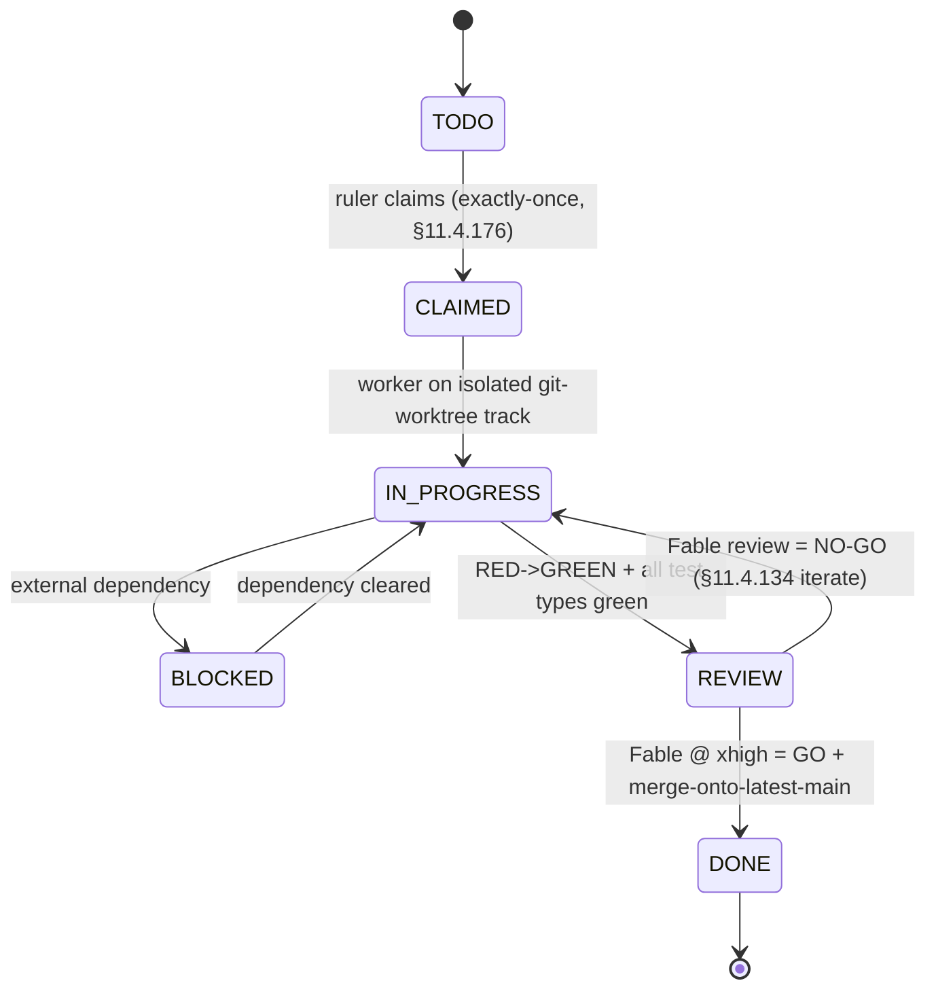

<!--
  Title           : Helix Thready — Workable-Items Backlog (ATM-NNN)
  Classification  : PUBLIC
  Location        : docs/public/research/mvp/development/workable-items.md
  Status          : Review — v0.3
  Revision        : 3 (2026-07-22)
  Author          : Helix Thready documentation swarm (development)
  Related         : ./index.md, ./workable-items-detail.md, ./agent-orchestration.md,
                    ./build-new-subsystems.md, ./submodule-map.md,
                    ../../../../private/research/mvp/helix_thready_subsystem_gaps_and_improvements.md
-->

# Helix Thready — Workable-Items Backlog (ATM-NNN)

| Rev | Date | Author | Change |
|-----|------|--------|--------|
| 1 | 2026-07-21 | swarm (development) | Initial backlog — ATM-001…ATM-069 mapped to the four phases |
| 2 | 2026-07-21 | swarm (development, review) | Review pass — added ATM-070/071/072; completed the §9 gap-register coverage matrix (added 2.4, 2.8, 7.4, 8.3, 9.2, 9.4, 13) so the completeness claim holds |
| 3 | 2026-07-22 | swarm (development, pass 3) | Depth pass — added the full-granularity companion [workable-items-detail.md](./workable-items-detail.md); closed ATM-067 (AgentPool read at source); rescoped ATM-062 (session_orchestrator now shipped, not DESIGN-ONLY); partial-closed ATM-068 (`Agentic` verified); updated the §8 open-items register accordingly |
| 4 | 2026-07-22 | swarm (development, critic pass) | Linked the `test_types` field to the new canonical **15 mandated test types** enumeration in [coding-standards.md §8](./coding-standards.md#8-anti-bluff-discipline-114-27) so each item's coverage is verifiable against a self-contained list |

This document is the granular, decoupled, agent-implementable backlog for Helix Thready. Every
item is an `ATM-NNN` ("**A**utonomous **T**hready **M**odule") workable item: independently
scoped, with explicit dependencies, acceptance criteria, mandated test types, and `[GAP: …]`
tags linking it to the private gap register. The backlog maps onto the four phases of final
request §5.1.2. Items are the unit the orchestration model claims, dispatches and reviews (see
[agent-orchestration.md](./agent-orchestration.md)).

> **Source-of-truth note `[CONSTITUTION §11.4.93/95]`.** The authoritative store for workable
> items is a **SQLite DB tracked in git** at `docs/workable_items.db`, regenerated to/from this
> Markdown by `workable-items sync md-to-db`. This document is the human-readable projection; the
> DB is the machine source. The DB is **never gitignored** and is committed + pushed alongside the
> MD on every state change.

> **Full-granularity companion.** This file is the **summary** view (id/kind/pri/deps/gap tables).
> The **implementation-ready** per-item cards — task-level sub-items (`ATM-NNN.k`), Given/When/Then
> acceptance, explicit blocks/blocked-by edges, and `[VERIFIED-SOURCE]` anchors for every claim read
> at module source in Pass 3 — live in [workable-items-detail.md](./workable-items-detail.md).

## Table of Contents

- [1. Item schema](#1-item-schema)
- [2. Item lifecycle](#2-item-lifecycle)
- [3. Phase 1 — Foundation](#3-phase-1--foundation)
- [4. Phase 2 — Processing Engine](#4-phase-2--processing-engine)
- [5. Phase 3 — Client Applications](#5-phase-3--client-applications)
- [6. Phase 4 — Testing & Deployment](#6-phase-4--testing--deployment)
- [7. Cross-cutting items](#7-cross-cutting-items)
- [8. Open items register](#8-open-items-register)
- [9. Gap-register coverage matrix](#9-gap-register-coverage-matrix)

## 1. Item schema

Each item carries the fields below. The `id`, `phase`, `title`, `depends_on`, `test_types` and
`gap` fields are mirrored 1:1 into the tracked SQLite DB.

```yaml
# One workable item as stored (projection of a row in docs/workable_items.db)
id: ATM-025
title: "Skill-dispatch engine (recipe-per-hashtag) on HelixSkills"
phase: "2.2"                     # phase.subphase from final request §5.1.2
kind: BUILD-NEW                  # PRODUCTION-WIRE | EXTEND | BUILD-NEW | HARDEN | AUDIT
owner_track: processing          # canonical multi-track domain (§11.4.191)
status: TODO                     # TODO | CLAIMED | IN_PROGRESS | REVIEW | DONE | BLOCKED
priority: P0                     # P0 blocks MVP | P1 GA | P2 hardening
depends_on: [ATM-011, ATM-023, ATM-036]
provides: "content-type -> Skill(s) resolution + ordered execution over BackgroundTasks"
decoupled_scope: |
  New submodule that maps hashtag/content-type -> Skill(s) from the helix_skills
  Skill-Graph, orders download->convert->analyze->research->reply, and runs each
  step via digital.vasic.background with the idempotent single-claim. Does NOT
  modify helix_skills' knowledge model (read-only consumer of the DAG).
acceptance_criteria:
  - "Given a post tagged #Video #Research, both the video-download Skill and the deep-research Skill run, download-first."
  - "A second delivery of the same post.received event does not double-dispatch (idempotent claim)."
  - "Unknown/insufficient tags fall through to indirect determination (ATM-024), never silently dropped."
test_types: [unit, integration, e2e, chaos, stress, performance, challenges, helixqa]
gap: ["4.1"]                     # gap-register subsystem ids addressed
provenance: ["IN-HOUSE: helix_skills", "BUILD-NEW", "OPERATOR: all-categories-parallel"]
review: "Fable @ xhigh (Opus xhigh fallback) — §11.4.209"
```

Field notes: `kind=PRODUCTION-WIRE` means "wire an existing production module by config"; `EXTEND`
means "add capability to an existing owned module"; `BUILD-NEW` is a confirmed new-submodule gap;
`HARDEN` raises a scaffold to reliance-grade; `AUDIT` is a re-verification/decoupling task. Every
non-unit test type exercises the real system `[CONSTITUTION §11.4.27]`; mocks/stubs are unit-only.
Each item's `test_types` names the **applicable subset** of the canonical **15 mandated test types**
enumerated in [coding-standards.md §8](./coding-standards.md#8-anti-bluff-discipline-114-27) (target:
100% test-type coverage per feature × platform cell, not a line-percentage).

## 2. Item lifecycle



**Explanation (for readers/models that cannot see the diagram).** A workable item begins `TODO`. The
automatic multi-track ruler `[§11.4.187]` claims it exactly once through the append-only claim
registry `[§11.4.176]`, moving it to `CLAIMED`; no second track may claim the same item or its
hidden-coupling logical group. A headless worker then takes it to `IN_PROGRESS` on its own isolated
git-worktree so concurrent tracks never collide in one checkout.

The middle of the lifecycle handles the two ways real work stalls or is judged. If an item hits an
external dependency (hardware, a not-yet-merged prerequisite item, a long build) it goes `BLOCKED`
and the track is auto-backfilled with other actionable work rather than idling `[§11.4.192/94]`;
when the dependency clears it returns to `IN_PROGRESS`. When the reproduce-first RED test turns GREEN
and every mandated test type passes, the item enters `REVIEW`, where an independent AI review runs on
**Fable @ xhigh (Opus xhigh fallback)** `[§11.4.209]` — a genuine second opinion in a different
model/context than the author.

The terminal transitions are the two review verdicts. A `NO-GO` sends the item back to `IN_PROGRESS`
to iterate `[§11.4.134]` and be re-reviewed; a `GO` merges it onto the latest main with no force-push
`[§11.4.113]` and the item is `DONE`. Because `REVIEW → DONE` is gated on `GO` and `IN_PROGRESS →
REVIEW` is gated on all test types GREEN, an item can never reach `DONE` on a red test or an
unreviewed diff — the state machine itself is the anti-bluff enforcement.

> Rendered PNG/SVG exported via Docs Chain (§11.4.65). Source: [diagrams/item-lifecycle.mmd](./diagrams/item-lifecycle.mmd).

---

## 3. Phase 1 — Foundation

### 3.1 Infrastructure (sub-phase 1.1)

| ID | Title | Kind | Pri | Depends on | Gap |
|----|-------|------|-----|-----------|-----|
| **ATM-001** | Repo + 4-upstream bootstrap; install `upstreams/*.sh`, git-hooks (`pre-commit`/`pre-push`/`post-commit`/`commit-msg`) | PRODUCTION-WIRE | P0 | — | — |
| **ATM-002** | Rootless Podman Compose baseline via `vasic-digital/containers` (`pkg/boot`/`pkg/compose`/`pkg/health`) | PRODUCTION-WIRE | P0 | ATM-001 | — |
| **ATM-003** | `digital.vasic.database` wiring — SQLite dev / Postgres prod; `pkg/migration.Runner` | PRODUCTION-WIRE | P0 | ATM-002 | — |
| **ATM-004** | pgvector provisioning + `digital.vasic.vectordb` (pgvector backend, cosine) co-located in Postgres | PRODUCTION-WIRE | P0 | ATM-003 | 3.1 |
| **ATM-005** | `digital.vasic.observability` — OTel + Prometheus + logrus + ClickHouse + `pkg/health` | PRODUCTION-WIRE | P0 | ATM-002 | — |
| **ATM-006** | `vasic-digital/lets_encrypt` TLS per subdomain (HTTP-01/DNS-01, atomic deploy-hook + rollback) | PRODUCTION-WIRE | P1 | ATM-002 | — |
| **ATM-007** | Dynamic ports — `digital.vasic.discovery` + `mdns` + `port_prefix` (deterministic ≤65535) | PRODUCTION-WIRE | P1 | ATM-002 | — |
| **ATM-008** | CodeGraph index of all own-org submodules `[§11.4.78-80]` + scheduled re-index | PRODUCTION-WIRE | P1 | ATM-001 | — |
| **ATM-009** | Docs Chain context (`.docs_chain/contexts/*.yaml`) — every `.md` gets HTML/PDF/DOCX siblings `[§11.4.65]` | PRODUCTION-WIRE | P1 | ATM-001 | 10.1 |

**ATM-004 acceptance (representative).** pgvector extension present; a `VectorStore` cosine
`<=>` search returns ids that hydrate against relational rows; the `HELIX_EMBEDDING_PROVIDER`
is validated to be `llama` (never the `HashEmbedder` stub) in any RAG/search context — see
`ATM-040` `[GAP: 2.1]`. Test types: unit, integration, performance (< 500 ms search SLO), benchmarking.

### 3.2 Core Services (sub-phase 1.2)

| ID | Title | Kind | Pri | Depends on | Gap |
|----|-------|------|-----|-----------|-----|
| **ATM-010** | **User Service** — three-tier RBAC (root/account-admin/user) on `auth` + `security/pkg/policy` + Catalogizer pattern | BUILD-NEW | P0 | ATM-003, ATM-013 | 7.2, §11 |
| **ATM-011** | **Event Bus service** — client-facing subscription wrapping `digital.vasic.eventbus` (NATS JetStream) | BUILD-NEW | P0 | ATM-002 | §11 |
| **ATM-012** | **Asset Service** — decouple from `vasic-digital/Catalogizer` (multi-protocol, SQLCipher-at-rest, JWT+RBAC, WS, Range/`OpenSeekable`) | BUILD-NEW | P1 | ATM-003, ATM-010 | 6.1, §11 |
| **ATM-013** | `digital.vasic.auth` — add RS256/EdDSA signing + JWKS rotation (default is HMAC-SHA256) | EXTEND | P1 | ATM-003 | 7.2 |
| **ATM-014** | `digital.vasic.security` — sealed key store + **searchable-yet-sealed** credential representation (embed over redacted/tokenized form) | EXTEND | P2 | ATM-003 | 7.1 |
| **ATM-015** | `Security-KMP` — implement **native** secure storage (Android Keystore / iOS Keychain / Wasm) — currently in-memory **stub** | HARDEN | P0 (mobile) | — | 7.3 |

**ATM-010 acceptance.** Root Admin bootstrapped owner-only at deploy; Root creates Accounts +
Account-Admins; Account-Admins invite users; a user may belong to multiple Accounts; every
permission check flows through the `security/pkg/policy` enforcer; TOTP MFA mandatory for admin
tiers. Test types: unit, integration, e2e, security (authz matrix + privilege escalation),
challenges, helixqa. Design plan: [build-new-subsystems.md §User Service](./build-new-subsystems.md#7-user-service-build-new).

### 3.3 Integration (sub-phase 1.3)

| ID | Title | Kind | Pri | Depends on | Gap |
|----|-------|------|-----|-----------|-----|
| **ATM-016** | Herald — promote the `qaherald` `gotd/td` MTProto user client to a first-class Telegram thread-reader (forum topics `channels.getForumTopics`, replies `messages.getReplies`) | EXTEND | P0 | ATM-003 | 5.1 |
| **ATM-017** | **ThreadReader** abstraction submodule — root + organic reply-chain assembly, exclude system replies, resolve `access_hash`; shared across messengers | BUILD-NEW | P1 | ATM-016 | 5.1, §11 |
| **ATM-018** | **Max adapter** — Bot API (Go SDK) for bot scope **+** Go port of the OneMe user-WebSocket protocol for full channel/thread history | BUILD-NEW | P0 | ATM-017 | 5.1, §11 |
| **ATM-019** | Relational schema + migrations (posts, threads, replies, hashtags, categories, accounts, users, roles, permissions, memberships, assets, asset_links, processing_state, events, subscriptions, billing/metering, audit) | EXTEND | P0 | ATM-003 | 3.2 |
| **ATM-020** | REST API skeleton — `/v1`, HTTP/3 (`vasic-digital/http3`) + H2 fallback, `auth`, `ratelimiter`, `security/pkg/headers`, `middleware` | EXTEND | P0 | ATM-010, ATM-019 | — |
| **ATM-021** | Real-time surface — `digital.vasic.streaming` WebSocket hub + SSE, bridged to the Event Bus service | EXTEND | P1 | ATM-011, ATM-020 | 9 |

**ATM-018 note `[OPEN: max-oneme-go-port]`.** The OneMe reference implementations (`vkmax`,
`max-mcp`, `MaxAPI`) are Python; the Go port is **unproven** and gated by a research spike (see
[build-new-subsystems.md §Max adapter](./build-new-subsystems.md#3-max-messenger-adapter-build-new)).
Bot-API scope ships first; full user-history scope is P0 but spike-gated.

---

## 4. Phase 2 — Processing Engine

### 4.1 Content Acquisition (sub-phase 2.1)

| ID | Title | Kind | Pri | Depends on | Gap |
|----|-------|------|-----|-----------|-----|
| **ATM-022** | Acquisition poller (configurable cadence) + push triggers; assemble the **complete post** = root + organic reply chain | EXTEND | P0 | ATM-016, ATM-019 | 5.1 |
| **ATM-023** | Idempotent **single-claim per post** on `digital.vasic.background` (Postgres row/advisory lock) — exactly-once even under event storms | EXTEND | P0 | ATM-011, ATM-019 | 2.9 |
| **ATM-024** | Indirect hashtag determination (torrent→`Torrent`+`ToDownload`; git host→research; YouTube/media→download+research) + AI fallback | BUILD-NEW | P1 | ATM-025 | — |

### 4.2 Processing Pipeline (sub-phase 2.2)

| ID | Title | Kind | Pri | Depends on | Gap |
|----|-------|------|-----|-----------|-----|
| **ATM-025** | **Skill-dispatch engine** — hashtag/content-type → Skill(s), ordered download→convert→analyze→research→reply, over BackgroundTasks | BUILD-NEW | P0 | ATM-011, ATM-023, ATM-036 | 4.1 |
| **ATM-026** | Multi-hashtag additive resolution + precedence table (download > convert > analyze > research > reply) + `SortOrder` | EXTEND | P0 | ATM-025 | 2.9 |
| **ATM-027** | Retry/back-off (exp + jitter, max 5, base 2 s, cap 5 min) + circuit-breaker; per-post soft timeout | EXTEND | P0 | ATM-025 | — |
| **ATM-028** | **Download Manager** submodule — HTTP/1.1/2/3+QUIC+Brotli + reuse `filesystem` for FTP/SMB/NFS/WebDav; queue, resumable+segmented, progress, retry, callback | BUILD-NEW | P0 | ATM-029, ATM-030 | 6.2, 6.3, §11 |
| **ATM-029** | `digital.vasic.filesystem` — add HTTP(S) source protocol; fix NFS non-Linux platform listing; expose `OpenSeekable` uniformly for Range | EXTEND | P1 | — | 6.2 |
| **ATM-030** | **Standardized callback/task module** — accept-task→async→status→callback→error→retry; common schema (job id, state, progress, result-asset-ref, error) | BUILD-NEW | P1 | ATM-011 | 6.6, §11 |
| **ATM-031** | MeTube — add **outbound completion webhook** (poll-only today) + Asset Service integration + `…-web` conversion profiles | EXTEND | P0 | ATM-012, ATM-030 | 6.5 |
| **ATM-032** | Boba — standardize the existing SSE + `POST /api/v1/hooks` callback to the shared schema; Asset Service integration | EXTEND | P1 | ATM-030 | 6.4 |
| **ATM-033** | **OCR adapter** — Tesseract (cgo `gosseract`/subprocess) + PaddleOCR option behind a `VisionEngine` `OCRProvider` seam; per-word boxes; hybrid pipeline | BUILD-NEW | P0 | — | 2.6, §11 |
| **ATM-034** | Media transcode profiles — raw preserved + `…-web` H.264/AAC fMP4 (+H.265/AV1), 1080/720/480 HLS+DASH; audio MP3 320k/Opus 128k/FLAC | EXTEND | P1 | ATM-012, ATM-031 | 6.1 |
| **ATM-035** | Post-processing — status reply to original post (Robot/User acct), fire events, embed+index, grow Skill-Trees; **never process own replies** | EXTEND | P0 | ATM-025, ATM-039 | — |

**ATM-033 note `[GAP: 2.6]`.** VisionEngine has **no OCR engine** (grep-confirmed). This item adds
one behind a first-class `OCRProvider` seam and wires `TextRegion` to a real recognizer. Design
plan: [build-new-subsystems.md §OCR adapter](./build-new-subsystems.md#4-ocr-adapter-build-new).

### 4.3 Skills Integration (sub-phase 2.3)

| ID | Title | Kind | Pri | Depends on | Gap |
|----|-------|------|-----|-----------|-----|
| **ATM-036** | Author a Skill (recipe) for **every** documented content type — all categories in parallel `[OPERATOR]` | EXTEND | P0 | — | 4.1 |
| **ATM-037** | Standardize the Skill file format (one canonical `SKILL.md` YAML-frontmatter schema; migrate no-frontmatter dirs); fix the `catalog-engine` "Test Catalog" mislabel; deterministic `INDEX.md` regen | HARDEN | P1 | ATM-036 | 4.1 |
| **ATM-038** | Triage + burn down the Skill-Graph MVP **95 open** findings relevant to Thready | AUDIT | P1 | ATM-037 | 4.1 |

### 4.4 Semantic Search (sub-phase 2.4)

| ID | Title | Kind | Pri | Depends on | Gap |
|----|-------|------|-----|-----------|-----|
| **ATM-039** | **Semantic-search service** (Lumen-style, in-house) — `embeddings` + `vectordb` + `MCP_Module` over llama.cpp/HelixLLM `/v1/embeddings`; index posts **and** generated materials | BUILD-NEW | P0 | ATM-004, ATM-040 | 2.7, §11 |
| **ATM-040** | HelixLLM — enforce `HELIX_EMBEDDING_PROVIDER=llama`; **fail loudly** (not warn) if the non-semantic `HashEmbedder` is selected in RAG/search; load a real code-tuned embedding GGUF | HARDEN | P0 | — | 2.1 |
| **ATM-041** | `digital.vasic.embeddings` — first-class llama.cpp/HelixLLM provider with health checks + dimension discovery; parameterize embedding dimension (remove the 768 hardcode) | EXTEND | P1 | ATM-040 | 2.1, 2.7 |
| **ATM-042** | `digital.vasic.vectordb` — harden + integration-test the **Qdrant** backend to full pgvector parity; ANN index tuning + benchmark for < 500 ms SLO | HARDEN | P1 | ATM-004 | 3.1 |
| **ATM-043** | `digital.vasic.database` — time-partitioning + retention/archive helpers for 10k+/day posts; validate `storage` MinIO signed-URL parity; pool + pgvector co-location tuning | EXTEND | P1 | ATM-003 | 3.2 |

---

## 5. Phase 3 — Client Applications

| ID | Title | Kind | Pri | Depends on | Gap |
|----|-------|------|-----|-----------|-----|
| **ATM-044** | Angular 19 product portal on the shared OpenDesign `design_system` (Web + CLI first `[OPERATOR]`) | EXTEND | P0 | ATM-020, ATM-060 | 8.1 |
| **ATM-045** | Tauri 2 desktop (Rust core + Angular UI) — org standard | EXTEND | P1 | ATM-044 | — |
| **ATM-046** | Native mobile clients (Compose/Android, SwiftUI/iOS, ArkTS/HarmonyOS, Qt/Aurora + `helix_shims`) + KMP shared logic | BUILD-NEW | P2 | ATM-047, ATM-015 | 8.3, 8.4, 8.5 |
| **ATM-047** | KMP module fleet — add CI + Maven publish + shared convention plugin; implement `Database-KMP` with SQLDelight (interfaces-only today) | HARDEN | P1 | — | 8.4 |
| **ATM-048** | Go/Cobra **CLI** (headless) sharing the SDK with the TUI — first alongside Web `[OPERATOR]` | EXTEND | P0 | ATM-060 | — |
| **ATM-049** | Bubble Tea + Cobra + Lipgloss **TUI** (as `helix_track_cli`) | EXTEND | P1 | ATM-048 | 8.6 |
| **ATM-050** | Thready brand theme from `Logo.png` on the helix-green base; mature `design_system`; publish `@vasic-digital/design-system` | EXTEND | P1 | — | 8.1 |
| **ATM-051** | `helix_design` — implement per-platform token packages (Flutter, Qt/Aurora, CSS) from the OpenDesign source (currently a scaffold) | HARDEN | P1 | ATM-050 | 8.2 |

**ATM-046 note.** Only path to HarmonyOS + Aurora is native clients + `helix_shims`, currently
**scaffolds** `[GAP: 8.5]`; `Security-KMP` mobile storage must be real (`ATM-015`) before any
mobile release. Mobile is P2 per the Web+CLI-first operator decision.

---

## 6. Phase 4 — Testing & Deployment

| ID | Title | Kind | Pri | Depends on | Gap |
|----|-------|------|-----|-----------|-----|
| **ATM-052** | Unit + `go-mutesting` mutation testing + **paired-mutation anti-bluff gates** (real behavior, not stubs) | EXTEND | P0 | per-item | 12 |
| **ATM-053** | Integration — all cross-module contracts + critical paths first; no-fakes-beyond-unit | EXTEND | P0 | Phase 1–2 | §11.4.27 |
| **ATM-054** | System/e2e + **HelixQA** YAML banks (runtime evidence) + **Challenges** scenario banks | EXTEND | P0 | ATM-053 | 9.1, 9.3 |
| **ATM-055** | Security — SonarQube (CLI + rootless-Podman server) + Snyk + fuzzing + CVE + DDoS/authz | EXTEND | P0 | ATM-053 | 7.1 |
| **ATM-056** | Performance/benchmarking/stress/scaling/chaos — validate SLOs (API p95 < 150 ms, search < 500 ms) + RPO/RTO | EXTEND | P1 | ATM-053 | 3.1, 3.2 |
| **ATM-057** | Production deployment — 3 isolated env stacks (`dev.`/`sta.`/`thready.`), rootless Podman Compose, Let's Encrypt, backup/DR runbook (RPO ≈ 1 h, RTO ≈ 4 h) | EXTEND | P0 | ATM-002, ATM-006 | — |

---

## 7. Cross-cutting items

These span all phases (see the dotted band in [index.md §4](./index.md#4-how-this-area-maps-onto-the-four-phases)).

| ID | Title | Kind | Pri | Gap |
|----|-------|------|-----|-----|
| **ATM-058** | **Anti-bluff sweep** — every `SCAFFOLD`/`DESIGN-ONLY` dep gets a paired-mutation gate before reliance | AUDIT | P1 | 12 |
| **ATM-059** | **Decoupling audit** `[§11.4.28]` — each reused submodule verified project-not-aware/config-injected; no nested own-org chains | AUDIT | P1 | 12 |
| **ATM-060** | SDK codegen — OpenAPI 3.1 + Protobuf via the `helix_proto` pattern (`buf` → Go/Rust; `openapi-generator` → TS/Dart) + thin idiomatic layer per language | BUILD-NEW | P1 | 13 |
| **ATM-061** | `TOON` + `token_optimizer` — implement (load-bearing for the token-optimization mandate `[§11.4.198]`) **or** explicitly mark out-of-scope for MVP | HARDEN | P1 | 2.9 |
| **ATM-062** | `session_orchestrator` — **rescoped (Pass 3):** the atomic track-claim registry is **now shipped at source** (`vasic-digital/session_orchestrator/claim/claim.go` — exactly-once `Registry.TryClaim`/`Release`), superseding the gap register's DESIGN-ONLY status; item is **wire+verify+integrate**, not build-from-scratch `[VERIFIED-SOURCE]` | HARDEN | P1 | 2.9 |
| **ATM-063** | HelixAgent — resolve the HelixAgent↔HelixCode identity/module split; enumerate + close admitted stub/bluff areas; pin only the packages Thready needs | HARDEN | P2 | 2.2 |
| **ATM-064** | LLMProvider — per-adapter contract tests for every adapter Thready relies on; confirm embeddings interface location | AUDIT | P1 | 2.3, 13 |
| **ATM-065** | LLMsVerifier — reconcile the `:7061` vs `:8080` port; expose a stable scoring API for HelixLLM's fallback chain; prune doc sprawl | HARDEN | P2 | 2.5 |
| **ATM-070** | `digital.vasic.memory` — **decision (recorded, not deferred silently):** Thready standardizes on the `vectordb`+`embeddings`+`rag` stack (via the Semantic-search service `ATM-039`) and does **not** rely on `memory`'s word-overlap (Jaccard) search; if `memory` is later adopted, back it with `vectordb` for real semantic recall. `HelixMemory` (4 external services: Mem0/Cognee/Letta/Graphiti) is **deferred** unless full cognitive memory is required | AUDIT | P2 | 2.8 |
| **ATM-071** | `HelixDevelopment/HelixStream` — **defer** (SCAFFOLD, ~5 commits): not on the Thready MVP critical path; if streaming-app testing is later required, harden the scaffold and add CI before reliance | AUDIT | P2 | 9.2 |

---

## 8. Open items register

Tracked `[OPEN: …]` items, each carried as a workable item so nothing is papered over.

| ID | `[OPEN: …]` | Why unresolved | Resolution plan |
|----|-------------|----------------|-----------------|
| **ATM-066** | `constitution-anchor-verify` | Local Constitution submodule copy tops out at §11.4.192; **§11.4.196/198/209** wording taken from the final request's descriptions, not read at source | Re-verify against the canonical `HelixDevelopment/helix_constitution` before relying on precise normative text; update citations |
| **ATM-018/ATM-067** | `max-oneme-go-port` | OneMe user-WS reference impls are Python; Go port unproven | Research spike + protocol capture; ship Bot-API scope first (see build-new plan) |
| **ATM-067** | ~~`agentpool-contract`~~ **CLOSED (Pass 3)** | Was not locally cloned; now **read at source** — `vasic-digital/LLMOrchestrator/pkg/agent/pool.go`: `AgentPool.Acquire(ctx, AgentRequirements) (Agent, error)` + `Release(Agent)`, capability-matched via `Agent.Capabilities() AgentCapabilities` `[VERIFIED-SOURCE]` | **Done** — contract documented in [workable-items-detail.md §ATM-067](./workable-items-detail.md#atm-067--llmorchestrator-agentpool-contract-open--closed) + [agent-orchestration.md §3](./agent-orchestration.md#3-native-alias-first-model-selection-1141961198). Residual (non-blocking): add HarmonyOS/Aurora build-agent capabilities if those become agent tasks |
| **ATM-068** | `flagged-modules-verify` **(partial, Pass 3)** | `vasic-digital/Agentic` now **verified to exist** at source ("Graph-based agentic workflow orchestration"); `Normalize`/`conversation`/`SkillRegistry`/`ToolSchema`/`MCP_Module`/`Planning`/`AgentWrapper` still **not** individually source-verified | Source-verify + pin exact import paths for the residual seven before any item depends on them `[GAP: 2.9, §13]` |
| **ATM-069** | `docs-chain-tooling` | Docs Chain honest-SKIPs md→HTML/PDF when `pandoc`/`weasyprint` are absent (as on the current host) | Provision pandoc/weasyprint on dev/CI hosts so `ATM-009` siblings generate `[GAP: 10.1]` |
| **ATM-072** | `sibling-area-index-missing` | The `../architecture/index.md` and `../database/index.md` canonical entry points `[§11.4.212]` do not yet exist, so the upstream cross-links from [index.md §3](./index.md#3-upstream--downstream-dependencies) resolve only once those areas add their `index.md` (every other sibling area — api/testing/deployment/design/user-guides — already has one) | Architecture and Database area owners create their `index.md`; until then the links target the canonical path, tracked here so the dead reference is not papered over `[CONVENTIONS §5/§7]` |

## 9. Gap-register coverage matrix

Every gap-register subsystem relevant to Development & Orchestration is covered by ≥1 item. (Data
subsystems whose gaps are addressed by build/harden items are included; purely runtime/architecture
gaps are cross-referenced to their owning area.)

| Gap-register § | Headline | Covered by |
|----------------|----------|-----------|
| 2.1 HelixLLM | HashEmbedder stub / 768 hardcode / verifier port | ATM-040, ATM-041, ATM-065 |
| 2.2 HelixAgent | Identity blur + residual stubs | ATM-063 |
| 2.3 LLMProvider | 40+ adapters unaudited | ATM-064 |
| 2.4 LLMOrchestrator | `AgentPool` capability-match contract not source-verified | ATM-067 |
| 2.5 LLMsVerifier | Port discrepancy | ATM-065 |
| 2.6 VisionEngine | No OCR engine | ATM-033 |
| 2.7 Embeddings | No native llama.cpp backend | ATM-041, ATM-039 |
| 2.8 Memory / HelixMemory | Word-overlap search; HelixMemory heavyweight | ATM-070 (standardize on vectordb+embeddings+rag; defer HelixMemory) |
| 2.9 agent-support | TOON/token_optimizer design-only; `session_orchestrator` **now shipped** (claim registry read at source — ATM-062 rescoped to wire/verify); FLAGGED modules (`Agentic` verified, seven residual) | ATM-061, ATM-062, ATM-068 |
| 3.1 VectorDB | Qdrant/others unverified | ATM-042 |
| 3.2 database/storage | No partitioning; MinIO signed-URL parity | ATM-043 |
| 4.1 helix_skills | No execution engine; format inconsistency; 95 findings | ATM-025, ATM-037, ATM-038, ATM-036 |
| 5.1 herald | MTProto trapped in QA harness; Max empty stub; no ThreadReader | ATM-016, ATM-017, ATM-018 |
| 6.1 Catalogizer→Asset | Not decoupled | ATM-012, ATM-034 |
| 6.2 filesystem | No HTTP source; no DL semantics; NFS listing | ATM-029 |
| 6.3 Download Manager | Does not exist | ATM-028 |
| 6.4 Boba | Bespoke callback | ATM-032 |
| 6.5 MeTube | No outbound webhook | ATM-031 |
| 6.6 callback module | Not extracted | ATM-030 |
| 7.1 security | Wire scanner adapters; searchable-sealed creds | ATM-014, ATM-055 |
| 7.2 auth | HMAC default; no RBAC | ATM-013, ATM-010 |
| 7.3 Security-KMP | Mobile storage in-memory stub | ATM-015 |
| 7.4 Auth-KMP | Must consume the fixed Security-KMP for token storage | ATM-046 (consumes hardened `Security-KMP`, `ATM-015`) |
| 8.1 design_system | Standalone maturation | ATM-050 |
| 8.2 helix_design | Non-web arm scaffold | ATM-051 |
| 8.3 helix_ui | Flutter UI scaffold — conditional | ATM-046 (only if the Flutter family is chosen; the native ArkTS/Qt path is the default for HarmonyOS/Aurora reach) |
| 8.4 KMP fleet | No CI/publish; Database-KMP interfaces-only | ATM-047 |
| 8.5 helix_shims/native | HarmonyOS/Aurora scaffolds | ATM-046 |
| 8.6 TS libs/track_cli | No deep audit | ATM-049 |
| 9.1 HelixQA | YAML banks + mandatory runtime evidence | ATM-054 |
| 9.2 HelixStream | SCAFFOLD — deferred (decision recorded) | ATM-071 |
| 9.3 Panoptic/VisualRegression | scenario banks + CI for the VR family | ATM-054, ATM-056 |
| 9.4 DocProcessor | feature-map → docs↔tests coverage | ATM-054 |
| 9.x test execution | the 15 test-type banks run locally / via the fleet (no server CI) | ATM-052…ATM-056 |
| 10.1 docs_chain | Pandoc/weasyprint SKIP | ATM-009, ATM-069 |
| §11 New subsystems | Asset/Download/Max/OCR/User/callback/EventBus/ThreadReader/Semantic-search | ATM-010, ATM-011, ATM-012, ATM-017, ATM-018, ATM-028, ATM-030, ATM-033, ATM-039 |
| 12 cross-cutting | anti-bluff / decoupling / CI-equiv | ATM-058, ATM-059 |
| 13 Re-verification backlog | FLAGGED adapters/modules + constitution anchors source-verified before reliance | ATM-064, ATM-066, ATM-067, ATM-068 |

---

*Made with love ♥ by Helix Development.*
