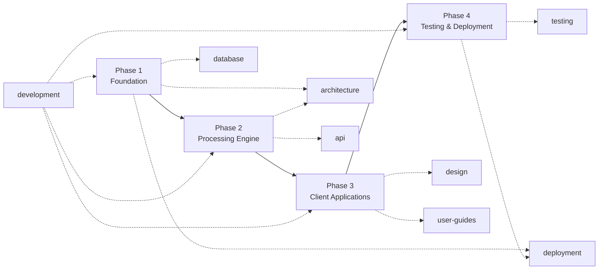
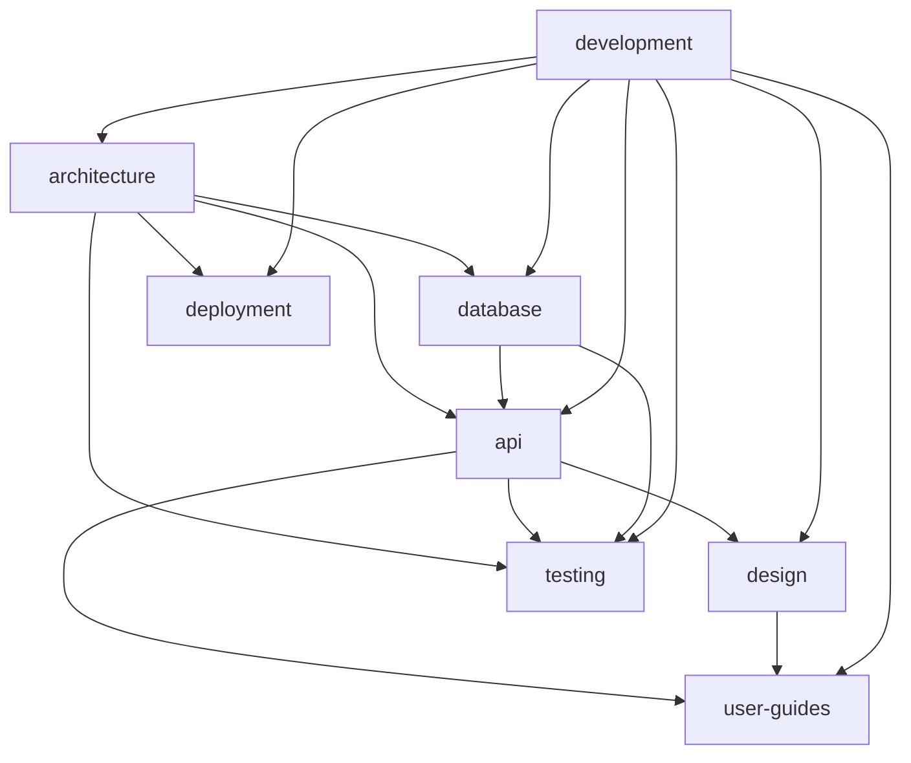

<!--
  Title           : Helix Thready — MVP Documentation (Master Index & Roadmap)
  Classification  : PUBLIC
  Location        : docs/public/research/mvp/index.md
  Status          : Draft — v0.1 (scaffold)
  Revision        : 1 (2026-07-21)
  Author          : Helix Thready documentation swarm (orchestrator)
  Related         : ./CONVENTIONS.md, ../../../private/research/mvp/helix_thready_research_request_final.md
-->

# Helix Thready — MVP Documentation (Master Index & Roadmap)

| Rev | Date | Author | Change |
|-----|------|--------|--------|
| 1 | 2026-07-21 | orchestrator | Initial scaffold + roadmap |

This is the canonical entry point for the implementation-ready technical documentation of
**Helix Thready**. It is generated by an orchestrated subagent swarm in multiple passes from the
authoritative research documents. All authors follow **[CONVENTIONS.md](./CONVENTIONS.md)**.

## Authoritative sources (read-only)

- **Final answered request** — `../../../private/research/mvp/helix_thready_research_request_final.md`
  (technology decision matrix, architecture, Q1–Q45 answers, operator decisions).
- **Original request + Part II answers** — `../../../private/research/mvp/helix_thready_research_request.md`.
- **Subsystem gaps & improvements** — `../../../private/research/mvp/helix_thready_subsystem_gaps_and_improvements.md`.

## Documentation areas

| Area | Directory | Scope | Phase |
|------|-----------|-------|-------|
| Architecture | [architecture/](./architecture/index.md) | System overview, components, data & event flow, concurrency, discovery, security model | 1–2 |
| API | [api/](./api/index.md) | REST OpenAPI 3.1, WebSocket/SSE event contract, SDK strategy | 2 |
| Database | [database/](./database/index.md) | ERD, PostgreSQL + pgvector DDL, indexing, partitioning, migrations | 1–2 |
| Deployment | [deployment/](./deployment/index.md) | Rootless Podman Compose, 3 envs, Let's Encrypt, deploy/rollback, backup/DR | 1,4 |
| Development | [development/](./development/index.md) | Workable-items (ATM-NNN), agent orchestration, contribution, standards | all |
| Testing | [testing/](./testing/index.md) | 15 test types, TDD reproduce-first skeletons, HelixQA/Challenges, SonarQube/Snyk | 4 |
| Design | [design/](./design/index.md) | OpenDesign/Figma wireframes, prototypes, UX flows, component library, brand assets | 3 |
| User Guides | [user-guides/](./user-guides/index.md) | Install, config, admin/user manuals, CLI/TUI ref, FAQ per consumer group & surface | 3 |

## Development phase mapping (from the final request §5.1.2)

**Explanation (for readers/models that cannot see the diagram):** the four development phases
run in sequence — Foundation, Processing Engine, Client Applications, then Testing & Deployment.
The documentation areas map onto them: Phase 1 (Foundation) is served by the architecture,
database and deployment docs; Phase 2 (Processing Engine) by the API and architecture docs;
Phase 3 (Client Applications) by the design and user-guides docs; Phase 4 (Testing & Deployment)
by the testing and deployment docs. The development area (workable-items, orchestration,
standards) spans all four phases.

## Cross-area dependency map

**Explanation (for readers/models that cannot see the diagram):** architecture is the root — API,
database, and deployment all derive from it. Database feeds the API (schemas back the endpoints);
API and design both feed the user guides; API feeds design (screens consume endpoints);
architecture, API and database all feed testing (tests target their contracts). The development
area underpins everything (it defines the workable items and standards that produce each section).

## Status tracker

| Area | Pass 1 (draft) | Pass 2 (review) | Pass 3 (polish) | Integrated |
|------|:---:|:---:|:---:|:---:|
| Architecture | ☐ | ☐ | ☐ | ☐ |
| API | ☐ | ☐ | ☐ | ☐ |
| Database | ☐ | ☐ | ☐ | ☐ |
| Deployment | ☐ | ☐ | ☐ | ☐ |
| Development | ☐ | ☐ | ☐ | ☐ |
| Testing | ☐ | ☐ | ☐ | ☐ |
| Design | ☐ | ☐ | ☐ | ☐ |
| User Guides | ☐ | ☐ | ☐ | ☐ |

*(The orchestrator updates this tracker after each wave.)*

---

*Made with love ♥ by Helix Development.*
