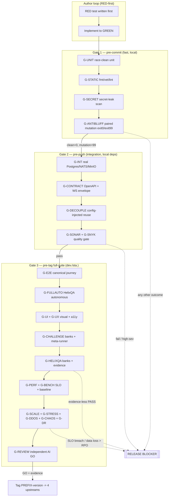

<!--
  Title           : Helix Thready — Per-Test-Type Acceptance Gates
  Classification  : PUBLIC
  Location        : docs/public/research/mvp/testing/acceptance-gates.md
  Status          : Draft — v0.3
  Revision        : 2 (2026-07-22)
  Author          : Helix Thready documentation swarm (testing)
  Related         : ./index.md, ./test-strategy.md, ./test-types.md, ./tdd-skeletons.md,
                    ./helixqa-banks.md, ./challenges-scenarios.md, ./static-analysis.md,
                    ./performance-and-chaos.md
-->

# Helix Thready — Per-Test-Type Acceptance Gates

| Rev | Date | Author | Change |
|-----|------|--------|--------|
| 1 | 2026-07-22 | swarm (testing) | Initial draft — one machine-checkable acceptance gate per mandated test type, the three-tier gate ladder, evidence contracts, blocking-severity policy |
| 2 | 2026-07-22 | swarm (testing) | Pass 4 (critic) — `G-CONTRACT` now names all four pinned contracts (embeddings/search/downloads/WS); §4 wires the FLAKY outcome + no-retry-for-blocker-gates rule to test-strategy §12 |

This document turns the qualitative "gate" line of each of the **15 mandated test types**
([test-types.md](./test-types.md)) into a single **machine-checkable acceptance-gate register**.
Every gate has a stable **gate ID**, an exact **precondition**, a **pass condition** written so a
script (not a human's judgement) decides GREEN/RED, the **runtime evidence** it must emit
`[CONSTITUTION §11.4]`, the **tier** it runs on, and its **blocking severity**. The gates are the
enforcement surface of the [test-strategy.md](./test-strategy.md) covenant and the concrete
contract the [deployment](../deployment/index.md) area's pre-tag retest evaluates.

## Table of contents

- [1. The gate ladder](#1-the-gate-ladder)
- [2. Gate register (one row per type)](#2-gate-register-one-row-per-type)
- [3. Evidence contract per gate](#3-evidence-contract-per-gate)
- [4. Blocking-severity policy](#4-blocking-severity-policy)
- [5. The anti-bluff meta-gate](#5-the-anti-bluff-meta-gate)
- [6. Gate exit-code protocol](#6-gate-exit-code-protocol)
- [7. Waivers](#7-waivers)
- [8. Gap-register items addressed](#8-gap-register-items-addressed)

## 1. The gate ladder

Gates are not a flat list; they run at three escalating tiers so the **cheapest** gate that can
catch a defect runs **first** and most often, and the expensive whole-system gates run only on
the release path. This is the CI-equivalent enforcement of
[test-strategy.md §8](./test-strategy.md#8-ci-equivalent-gating-no-server-side-ci) — all local,
no server-side CI `[CONSTITUTION §11.4.156]`.

> Rendered PNG/SVG exported via Docs Chain (§11.4.65). Source:
> [`diagrams/acceptance-gate-ladder.mmd`](./diagrams/acceptance-gate-ladder.mmd).

**Explanation (for readers/models that cannot see the diagram).** Work always begins in the
author loop at top: a **RED** test is written first and the author implements only enough to
reach **GREEN** ([tdd-skeletons.md §1](./tdd-skeletons.md#1-the-redgreen-loop)). From there the
change descends three gate tiers. **Gate 1 (pre-commit)** is the fast local band that runs on
every commit: race-clean unit tests (`G-UNIT`), formatting/vet/lint (`G-STATIC`), a secret-leak
scan (`G-SECRET`), and the anti-bluff paired-mutation gate (`G-ANTIBLUFF`), which must exit 0 on
the clean run and 99 on the planted-mutation run before the change may advance.

**Gate 2 (pre-push)** stands up the real local dependency stack and runs the integration band:
cross-module integration against real Postgres/NATS/MinIO (`G-INT`), the wire-contract tests for
the OpenAPI 3.1 responses and the WebSocket/SSE envelope (`G-CONTRACT`), the decoupling audit
that proves each reused submodule is config-injected and project-unaware (`G-DECOUPLE`), and the
SonarQube + Snyk quality gate (`G-SONAR`/`G-SNYK`). A failure here bounces the change back to the
author or, for a high-severity security finding, straight to the release-blocker terminal.

**Gate 3 (pre-tag full-suite)** runs on the `dev.` and `sta.` tiers before any release tag and is
the widest band: the end-to-end canonical journey (`G-E2E`), the unattended HelixQA autonomous
session (`G-FULLAUTO`), the visual-regression and accessibility gates (`G-UI`/`G-UX`), the
Challenges banks plus their meta-runner (`G-CHALLENGE`), the evidence-backed HelixQA banks
(`G-HELIXQA`), the performance/benchmark SLO gates (`G-PERF`/`G-BENCH`), the load-and-resilience
family (`G-SCALE`/`G-STRESS`/`G-DDOS`/`G-CHAOS`/`G-DR`), and finally the independent AI review
(`G-REVIEW`) which must emit **GO**. Only a fully green, evidence-backed Gate-3 pass tags a
project-prefixed release and fans it out to the four upstreams. The dashed edges are the
short-circuits to the **release-blocker** terminal: any non-{0,99} anti-bluff outcome, a failed
quality gate or high-severity finding, an **evidence-less PASS** from HelixQA, or an SLO breach /
data loss beyond RPO each block the tag immediately regardless of the other gates.

## 2. Gate register (one row per type)

`●` mandatory · pass conditions are written to be script-decidable. "Tier" is the ladder band
from §1. Gate IDs are stable and referenced from the other testing docs and from the
[development](../development/index.md) ATM-NNN items.

| Gate ID | Type | Tier | Precondition | Pass condition (script-decidable) | Blocking |
|---------|------|:----:|--------------|-----------------------------------|:--------:|
| `G-UNIT` | Unit | 1 | package compiles | `go test -race ./...` exit 0; no data race; `go-mutesting` survivors triaged/waived | ● |
| `G-STATIC` | (all) | 1 | working tree | `gofmt -l` empty, `go vet` clean, TS/Kotlin/Swift/Rust lint clean | ● |
| `G-SECRET` | Security | 1 | working tree | secret-leak scan finds 0 credentials in code/tests/logs (`security/pkg/pii`) | ● |
| `G-ANTIBLUFF` | (scaffold deps) | 1 | touched scaffold module | clean run exit 0 **and** planted-mutation run exit 99; any other outcome blocks | ● |
| `G-INT` | Integration | 2 | local deps up (Podman) | all cross-module contract + critical-path integration tests GREEN against real deps; no fakes beyond unit | ● |
| `G-CONTRACT` | Integration | 2 | API area OpenAPI/event spec | responses validate against `../api/openapi.yaml`: `/v1/embeddings` OpenAI envelope + index order + config dimension; `/v1/search` ranked envelope + real-embedder + 503-on-hash; `/v1/downloads` enqueue `{job_id,state}` + standardized completion callback; WS `ProcessingEvent` envelope | ● |
| `G-DECOUPLE` | Integration | 2 | reused submodule under test | module constructed from config only; no Thready-specific globals/imports; project-unaware | ● |
| `G-SONAR` | Security/quality | 2 | scanner + server up | Quality Gate PASS on new code (0 new Blocker/Critical vuln/bug, hotspots 100% reviewed, dup < 3%, new-code line cov ≥ 80%) | ● |
| `G-SNYK` | Security | 2 | manifests resolved | 0 new high/critical dependency or `snyk code` findings; container image scan clean | ● |
| `G-E2E` | E2E | 3 | `dev.` stack live | canonical journey *add thread → classify → dispatch Skill → status reply + asset + embedding → find via `/v1/search`* passes with evidence | ● |
| `G-FULLAUTO` | Full-automation | 3 | `dev.` + banks | `helixqa autonomous` reaches configured coverage target unattended; findings ticketed; 0 unresolved critical | ● |
| `G-UI` | UI | 3 | built clients | 0 unreviewed visual diff on design-system components + key screens, light+dark (Panoptic/VisualRegression/ScreenDiff) | ● (clients) |
| `G-UX` | UX | 3 | built clients | 0 critical WCAG a11y violations (`cypress-axe`); documented flows dead-end-free; issuedetector 0 unresolved critical | ● (clients) |
| `G-CHALLENGE` | Challenges | 3 | banks registered | every Thready bank runs GREEN with ≥1 passing assertion **and** ≥1 recorded action (`ValidateAntiBluff`); meta-gate clean=0 / mutation=99 | ● |
| `G-HELIXQA` | HelixQA | 3 | banks + target app | every PASS carries the bank's `required_evidence`; 0 evidence-less PASS; 0 crash/ANR from `detector` | ● |
| `G-PERF` | Performance | 3 | `sta.` prod-like | k6 thresholds hold: API p95 < 150 ms, search p95 < 500 ms, page < 1.5 s; corroborated by ClickHouse histograms | ● |
| `G-BENCH` | Benchmarking | 3 | baseline stored | `benchstat baseline new` shows no significant regression without a waiver | ● |
| `G-SCALE` | Scaling | 3 | `sta.` at scale | throughput scales ~linearly with workers/replicas; search < 500 ms at 50 TB-class index; single-claim holds under storm | ● (svc) |
| `G-STRESS` | Stress | 3 | `sta.` | beyond-capacity ramp degrades gracefully (queues/429/back-pressure), no OOM/crash, auto-recovers; no `pprof` leak at the knee | ● (svc) |
| `G-DDOS` | DDoS | 3 | `sta.` + ratelimiter | under flood the rate-limiter sheds deterministically (429 + `Retry-After`), legit p95 within SLO or graceful, no crash/OOM | ● (svc) |
| `G-CHAOS` | Chaos | 3 | `sta.` + injectors | mid-flight kill → exactly-once resume (no dup reply/asset/embedding); durable consumers replay on reconnect | ● (svc) |
| `G-DR` | Chaos/DR | 3 | `sta.` + backups | full restore from daily-full + hourly-incrementals completes within **RTO ≈ 4 h**, loses ≤ **RPO ≈ 1 h** | ● (svc) |
| `G-REVIEW` | (all) | 3 | gates 1–3 green | independent AI review (Fable @ xhigh, Opus xhigh fallback) emits **GO** across the 8 mandated angles | ● |

## 3. Evidence contract per gate

`[CONSTITUTION §11.4]` — beyond unit, a green result is a **critical defect** unless it carries
positive runtime evidence. The evidence a gate must emit is a fixed contract so the pre-tag
retest can assert its **presence**, not merely trust the summary line. Evidence artifact types
are the verified HelixQA `evidence.Type` set — `screenshot`, `video`, `logcat`, `stacktrace`,
`console_log`, `audio` `[IN-HOUSE: helix_qa pkg/evidence/collector.go]` — plus the
challenge-layer `RecordedActions` action trace `[IN-HOUSE: challenges pkg/challenge/antibluff.go]`.

| Gate | Minimum evidence emitted | Where consumed |
|------|--------------------------|----------------|
| `G-UNIT`/`G-STATIC`/`G-SECRET`/`G-ANTIBLUFF` | exit codes + JUnit/`go test -json` logs; mutation exit-pair record | git-hook log, SonarQube |
| `G-INT`/`G-CONTRACT`/`G-DECOUPLE` | request/response transcripts (`LogPaths.APIRequests`/`APIResponses`), container logs | Challenge report, coverage matrix |
| `G-SONAR`/`G-SNYK` | Quality-Gate JSON + Snyk SARIF; waiver records | quality dashboard, risk register |
| `G-E2E`/`G-FULLAUTO` | `video` timeline + `screenshot` per step + `console_log`; ticket Markdown for any failure | HelixQA reporter, AI fix pipeline |
| `G-UI`/`G-UX` | before/after `screenshot` diffs (light+dark), a11y violation report | visual-regression review |
| `G-CHALLENGE` | `challenge.Result` JSON: `Assertions[]` (≥1 `Passed`), `RecordedActions[]` (≥1), `Metrics`, `Outputs`, `Logs` | `report.Reporter`, meta-runner |
| `G-HELIXQA` | the case's declared `required_evidence` items (e.g. `[screenshot, video]`) all present | HelixQA validator, pre-tag gate |
| `G-PERF`/`G-BENCH` | k6 threshold JSON, `benchstat` delta, `pprof` profiles, ClickHouse histogram export | SLO gate, benchmark baseline store |
| `G-SCALE`/`G-STRESS`/`G-DDOS` | load histograms (SLO-bucketed), rate-limiter 429 counts, `pprof` heap/goroutine at knee | performance report |
| `G-CHAOS`/`G-DR` | experiment log (injection → observed behavior), restore timing vs RTO/RPO, reconcile diff | DR drill report, deployment runbook |

The `required_evidence` field is a **first-class YAML field** on every HelixQA test case
(`schema.go` `RequiredEvidence []string`), so a bank author declares per case exactly which
artifacts a PASS must produce; the validator fails the case if any declared artifact is missing —
this is the mechanical realization of the anti-bluff Operative Rule at the bank layer.

## 4. Blocking-severity policy

Not every red result blocks a release tag identically. The policy classifies gate failures so
the pre-tag retest and the AI fix pipeline can triage deterministically:

- **Release blocker (hard stop).** `G-ANTIBLUFF` non-{0,99}; any `G-HELIXQA` **evidence-less
  PASS**; a new Blocker/Critical security finding (`G-SONAR`/`G-SNYK`); an SLO breach at `G-PERF`;
  data loss beyond RPO or restore beyond RTO at `G-DR`; a `G-CHAOS` duplicate-processing
  observation. These map to `[CONSTITUTION CONST-035 / Art. XI §11.9]` — a bluff is treated as
  severe as a missing feature.
- **Iterate (return to author).** `G-UNIT`/`G-INT`/`G-E2E`/`G-CONTRACT` red, `G-BENCH` regression
  without waiver, `G-UX` critical a11y, `G-UI` unreviewed diff. The change re-enters the ladder
  after a fix.
- **Track (waiver-eligible).** `G-BENCH` regression with an approved waiver, a Sonar code-smell
  below Blocker, a `G-STRESS` knee below the Large-scale target that is documented and scheduled,
  and a **FLAKY** outcome (a case that needed a bounded retry to pass, per
  [test-strategy.md §12](./test-strategy.md#12-test-determinism--flaky-test-policy)). These become
  tracked risks in the workable-item register `[RESEARCH: final §22.4]`.

**Retries never mask a blocker.** The bounded-retry policy (test-strategy §12) is explicitly
**forbidden** for `G-ANTIBLUFF`, `G-CONTRACT`, `G-SECRET`/`G-SONAR`/`G-SNYK` and `G-DR`: a bluff, a
broken wire contract, a leaked secret or a missed RPO/RTO is never flaky. A case that flakes on
≥ 2 of the last 20 recorded runs is auto-quarantined and reported as an **open coverage hole** for
its cell — it cannot count toward GREEN while quarantined.

## 5. The anti-bluff meta-gate

The bank engines are themselves test infrastructure, so their honesty is gated **meta**: the
banks that validate features are themselves validated. Two verified in-house realizations back
`G-ANTIBLUFF` and `G-CHALLENGE`:

1. **Challenge-result validation** — `challenge.ValidateAntiBluff(r)` returns `ErrBluffPass`
   unless a `Status=Passed` result carries **≥1 `RecordedAction`** *and* **≥1 passing
   `AssertionResult`**; a metadata-only "pass" is rejected in-engine
   `[IN-HOUSE: challenges pkg/challenge/antibluff.go]`. Thready challenges therefore cannot report
   green without proof the runtime actually did something.
2. **Bank-inventory mutation** — the challenges repo ships `scripts/anti-bluff/bluff-scanner.sh`
   and a `pre-commit-hook.sh` (`scripts/anti-bluff/install-hooks.sh` wires them), and HelixQA
   ships `challenges/scripts/mutation_ratchet_challenge.sh` and
   `challenges/scripts/helixqa_orchestrator_challenge.sh` (an 8-phase orchestrator-surface
   validator with a built-in paired mutation) `[IN-HOUSE: challenges, helix_qa]`. Thready's
   describe-Challenge meta-runner ([challenges-scenarios.md §7](./challenges-scenarios.md#7-the-describe-challenge-meta-runner-anti-bluff))
   is realized by these: a clean tree exits 0, a planted inventory mismatch exits 99.

## 6. Gate exit-code protocol

Every gate script obeys a uniform exit-code protocol so the ladder driver can compose them
without parsing prose:

| Exit | Meaning | Ladder action |
|------|---------|---------------|
| `0` | gate passed with required evidence | advance |
| `1` | gate failed (ordinary red) | iterate → author |
| `77` | gate skipped (missing tier/tooling, e.g. no device farm, no pandoc) | record SKIP, do not block; open item |
| `99` | anti-bluff violation / bluff detected / evidence-less PASS | **release blocker** |

Exit `77` is the SKIP channel for the genuinely-blocked open items
([§8](#8-gap-register-items-addressed)): a gate that cannot run because its tier is unprovisioned
(HarmonyOS/Aurora device farm, `pandoc`/`weasyprint` for the docs export) emits `77` and is
recorded as a tracked SKIP rather than a false GREEN or a spurious block. Exit `99` is reserved
exclusively for the anti-bluff class so a bluff can never be confused with an ordinary failure.

## 7. Waivers

A waiver is the only way past a non-blocker gate failure and is itself audited. A waiver MUST
record: the gate ID, the exact finding, the justification, the owner, an expiry, and a linked
workable item. Waivers surface in the pre-tag report and in the SonarQube/risk dashboards
`[RESEARCH: final §22.4]`. **Release-blocker gates (§4) are never waivable** — a bluff, an
evidence-less PASS, a Critical vulnerability, an SLO breach or RPO/RTO miss cannot be waived,
only fixed.

## 8. Gap-register items addressed

- `[GAP: §9.4]` DocProcessor feature-map → coverage — each gate row annotates the coverage cell
  it fills ([test-strategy.md §10](./test-strategy.md#10-feature-map--coverage-tracking-docprocessor)).
- `[GAP: §12 anti-bluff sweep]` — `G-ANTIBLUFF` + the §5 meta-gate, backed by verified
  `ValidateAntiBluff` and the real anti-bluff scripts.
- `[GAP: §12 CI-equivalent gating]` — the three-tier ladder is entirely local hooks/timers.
- `[GAP: §9.1]` HelixQA evidence — `G-HELIXQA` enforces per-case `required_evidence`.
- `[GAP: §9.3]` visual-regression family — `G-UI` wires Panoptic/VisualRegression/ScreenDiff
  into Gate 3 (and pre-commit for touched UI).

Open items and their SKIP (`77`) channels are tracked in [index.md §7](./index.md#7-open-items-tracked-in-this-area).

---

*Made with love ♥ by Helix Development.*
