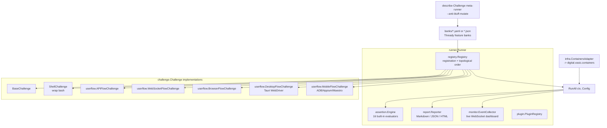

<!--
  Title           : Helix Thready — Challenges Scenarios (digital.vasic.challenges)
  Classification  : PUBLIC
  Location        : docs/public/research/mvp/testing/challenges-scenarios.md
  Status          : Draft — v0.1
  Revision        : 1 (2026-07-21)
  Author          : Helix Thready documentation swarm (testing)
  Related         : ./test-strategy.md, ./test-types.md, ./helixqa-banks.md,
                    ./performance-and-chaos.md
-->

# Helix Thready — Challenges Scenarios (`digital.vasic.challenges`)

| Rev | Date | Author | Change |
|-----|------|--------|--------|
| 1 | 2026-07-21 | swarm (testing) | Initial draft — challenge engine, Go/YAML banks, userflow adapters, describe-Challenge meta-runner |

**Challenges** (`vasic-digital/challenges`, module `digital.vasic.challenges`) is the generic,
reusable Go module for defining, registering, executing and reporting on **structured test
scenarios** — the constitution's per-feature **real-use-case test bank** `[IN-HOUSE: challenges]`
`[CONSTITUTION §11.4.27]`. It is test type **#14** and the execution substrate HelixQA reuses.

## Table of contents

- [1. Engine architecture](#1-engine-architecture)
- [2. Defining a Thready challenge (Go)](#2-defining-a-thready-challenge-go)
- [3. Banks from YAML/JSON](#3-banks-from-yamljson)
- [4. Built-in assertion evaluators](#4-built-in-assertion-evaluators)
- [5. User-flow automation adapters](#5-user-flow-automation-adapters)
- [6. Thready challenge bank inventory](#6-thready-challenge-bank-inventory)
- [7. The describe-Challenge meta-runner (anti-bluff)](#7-the-describe-challenge-meta-runner-anti-bluff)
- [8. Local gating for the visual-regression family](#8-local-gating-for-the-visual-regression-family)
- [9. Gap-register items addressed](#9-gap-register-items-addressed)

## 1. Engine architecture



> Rendered PNG/SVG exported via Docs Chain (§11.4.65). Source:
> [`diagrams/challenges-runner-arch.mmd`](./diagrams/challenges-runner-arch.mmd).

**Explanation (for readers/models that cannot see the diagram).** The `runner.Runner` is the
core; it composes a `registry.Registry` (challenge registration with automatic topological
ordering by Kahn's algorithm over dependency edges), an `assertion.Engine` (16 built-in
evaluators plus custom ones), a `report.Reporter` (Markdown/JSON/HTML), a
`monitor.EventCollector` (a live WebSocket dashboard) and a `plugin.PluginRegistry` for
extension. Thready feature banks — authored as YAML or JSON under `banks/` — are loaded into the
registry, and `RunAll(ctx, Config)` executes them, feeding the assertion engine, the live
monitor and the reporter. Each registered item implements the `challenge.Challenge` interface;
Thready uses `BaseChallenge` (template-method base), `ShellChallenge` (wraps existing bash
scripts) and the `userflow` templates (`APIFlowChallenge`, `WebSocketFlowChallenge`,
`BrowserFlowChallenge`, `DesktopFlowChallenge` via Tauri WebDriver, `MobileFlowChallenge` via
ADB/Appium/Maestro). An `infra.ContainersAdapter` bridges to `digital.vasic.containers` so a
challenge can stand up real dependencies. Finally, the **describe-Challenge meta-runner**
inspects the banks themselves — with `--anti-bluff-mutate` it plants an inventory mismatch and
asserts the gate fails, so the banks that validate features are themselves validated.

## 2. Defining a Thready challenge (Go)

Real API (from the `challenges` README) — an API-flow challenge for the ingest→process→reply
path:

```go
package threadybanks

import (
	"context"
	"time"

	"digital.vasic.challenges/pkg/challenge"
	"digital.vasic.challenges/pkg/registry"
	"digital.vasic.challenges/pkg/runner"
)

// IngestProcessReplyChallenge asserts the canonical journey end-to-end (real system).
type IngestProcessReplyChallenge struct{ challenge.BaseChallenge }

func NewIngestProcessReply() *IngestProcessReplyChallenge {
	return &IngestProcessReplyChallenge{
		BaseChallenge: *challenge.NewBaseChallenge(
			"ingest_process_reply", "Ingest → Process → Reply",
			"Add a thread, run its Skill(s), post a status reply, embed the result", "thready",
			[]string{ /* deps: */ "infra_up"}, // topological order
		),
	}
}

func (c *IngestProcessReplyChallenge) Execute(ctx context.Context) (*challenge.Result, error) {
	result := c.CreateResult()
	// ... drive REST /v1 against the running dev. stack, capture timings ...
	result.Status = challenge.StatusPassed
	result.Assertions = []challenge.AssertionResult{
		{Type: "not_mock", Target: "status_reply", Passed: true, Message: "real reply posted"},
		{Type: "max_latency", Target: "search_ms", Passed: true, Message: "search < 500ms"},
		{Type: "min_count", Target: "embeddings_written", Passed: true, Message: ">=1 vector"},
	}
	return result, nil
}

func RunThreadyBanks(ctx context.Context) ([]*challenge.Result, error) {
	reg := registry.NewRegistry()
	reg.Register(NewIngestProcessReply())
	// reg.Register(NewDownloadCallback()); reg.Register(NewRbacNegative()); ...
	r := runner.NewRunner(runner.WithRegistry(reg), runner.WithTimeout(10*time.Minute))
	return r.RunAll(ctx, &challenge.Config{Verbose: true})
}
```

`not_mock` / `no_mock_responses` are the anti-bluff evaluators — they assert a response is not a
placeholder, enforcing the no-fakes-beyond-unit rule at the challenge layer.

## 3. Banks from YAML/JSON

Challenges also loads bank definitions from files (`pkg/bank`). A Thready download-callback bank:

```yaml
# banks/thready/download_callback.yaml
name: "Thready — Download Manager callback"
challenges:
  - id: download_resume_callback
    type: api_flow
    description: "Enqueue a large download, kill mid-transfer, resume, receive callback"
    depends_on: [infra_up]
    steps:
      - request: { method: POST, path: /v1/downloads, body: { url: "${BIG_FILE_URL}" } }
        assert: [ { type: http_status_created } ]
      - action: kill_worker
      - action: resume
      - await_callback: { path: /hooks/download, timeout_s: 120 }
        assert:
          - { type: contains, target: state, value: "completed" }
          - { type: not_empty, target: result_asset_ref }
```

## 4. Built-in assertion evaluators

The engine ships 16 evaluators (README-verified). Thready-relevant subset:

| Evaluator | Thready use |
|-----------|-------------|
| `not_empty` | status reply / asset ref present |
| `not_mock`, `no_mock_responses` | **anti-bluff** — response is real, not a stub |
| `contains`, `contains_any` | callback state, hashtag presence |
| `min_length` | OCR text non-trivial |
| `quality_score`, `min_score` | research-doc quality threshold |
| `reasoning_present` | LLM research output contains reasoning |
| `code_valid` | generated Skill/plugin code parses |
| `min_count`, `exact_count` | embeddings written, replies assembled |
| `max_latency` | **SLO** — search < 500 ms, API p95 < 150 ms |
| `all_valid`, `no_duplicates` | asset dedup, playlist ordering |

Userflow adds 12 more (`http_status_ok/created/unauthorized`, `http_json_valid`,
`browser_element_visible`, `browser_url_matches`, `mobile_activity_visible`,
`mobile_element_exists`, `build_success`, `test_pass_rate`).

## 5. User-flow automation adapters

`pkg/userflow` provides the adapter-per-platform pattern (8 interfaces, 21 implementations)
Thready uses for e2e (type #3) and full-automation (type #4):

| Interface | Adapter Thready uses | Surface |
|-----------|----------------------|---------|
| `BrowserAdapter` | PlaywrightCLI / Cypress | Angular Web portal |
| `APIAdapter` | HTTPAPIAdapter (`pkg/httpclient`) | REST `/v1` |
| `WebSocketFlowAdapter` | GorillaWebSocket | live event subscription |
| `GRPCAdapter` | GRPCCLIAdapter (`grpcurl`) | internal service contracts (if exposed) |
| `DesktopAdapter` | TauriCLI (Tauri WebDriver) | Desktop client |
| `MobileAdapter` | ADB / Appium / Maestro | native mobile (as clients land) |
| `RecorderAdapter` | PanopticRecorder (CDP screencast) | UI video evidence |
| `BuildAdapter` | Cargo / NPM / Gradle | build-as-challenge (Tauri, Angular, Android) |

Challenge templates used: `APIFlowChallenge`, `BrowserFlowChallenge`, `WebSocketFlowChallenge`,
`DesktopFlowChallenge`, `MobileFlowChallenge`, plus **Recorded** variants with video
verification.

## 6. Thready challenge bank inventory

`[GAP: §9.3]` One bank per feature; registered for topological ordering (infra_up →
feature challenges):

| Bank | Type | Asserts |
|------|------|---------|
| `infra_up` | shell/infra | Postgres+pgvector, NATS, MinIO, HelixLLM healthy (ContainersAdapter) |
| `ingest_process_reply` | api_flow | canonical journey, real reply (`not_mock`) |
| `classify_indirect` | api_flow | indirect hashtag determination, never-drop fallback |
| `dispatch_precedence` | api_flow | multi-hashtag additive Skills in precedence order |
| `download_callback` | api_flow | resume + standardized callback (`§6.3/§6.5`) |
| `search_slo` | api_flow | semantic search `max_latency` < 500 ms, semantic-not-hash |
| `auth_rbac` | api_flow | three-tier RBAC negative cases |
| `events_ws` | ws_flow | sticky/one-time events, durable replay on reconnect |
| `ui_web` | browser_flow (recorded) | key screens render; visual evidence |

## 7. The describe-Challenge meta-runner (anti-bluff)

`[GAP: §12 anti-bluff sweep]`. Because the bank is itself test infrastructure, its anti-bluff
posture is **meta** — the bank validates the banks (challenges round-304, CONST-035). The
describe-runner asserts every Thready bank is present, readable, parseable, and (for shell
banks) executable with the exec-bit set; `--anti-bluff-mutate` plants a deliberate inventory
mismatch (renames a tracked bank file in a tmp tree) and asserts the gate FAILS with **exit 99**:

```bash
bash challenges_describe_challenge.sh                     # clean PASS -> exit 0
bash challenges_describe_challenge.sh --anti-bluff-mutate # planted mismatch -> exit 99
```

A clean tree MUST yield exit 0; the mutation MUST yield exit 99. Any other outcome is a release
blocker `[CONSTITUTION CONST-035 / Art. XI §11.9]`. A 5-locale fixture (en/de/es/ja/sr — Latin +
German + Spanish + CJK + Cyrillic) drives the bank loader so non-ASCII survives load → execute →
report — matching Thready's UI locales (en/ru/sr-Cyrl) per `[RESEARCH: final §18 Q35]`.

## 8. Local gating for the visual-regression family

`[GAP: §9.3]`. Panoptic / VisualRegression / ScreenDiff are library-grade with **no CI**.
Thready wraps their runners as `ShellChallenge`s in the `ui_web` bank and runs them in the local
`pre-commit` git-hook for touched UI — bringing the visual-regression family under the
CI-equivalent gate without server-side CI (see
[test-strategy.md §8](./test-strategy.md#8-ci-equivalent-gating-no-server-side-ci)).

## 9. Gap-register items addressed

- `[GAP: §9.3]` author Thready `challenges` scenario banks + wire visual-regression family into
  local gating — §6, §8.
- `[GAP: §12 anti-bluff sweep]` describe-Challenge meta-runner (exit 99) — §7.
- `[GAP: §6.3/§6.5]` download-callback bank proves push callback + resume — §3, §6.
- `[GAP: §2.1]` `search_slo` bank asserts semantic-not-hash + latency — §6.

---

*Made with love ♥ by Helix Development.*
