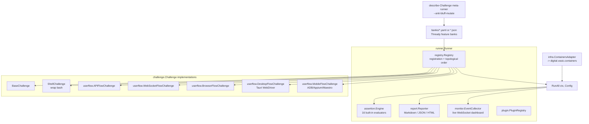

<!--
  Title           : Helix Thready — Challenges Scenarios (digital.vasic.challenges)
  Classification  : PUBLIC
  Location        : docs/public/research/mvp/testing/challenges-scenarios.md
  Status          : Draft — v0.2
  Revision        : 2 (2026-07-22)
  Author          : Helix Thready documentation swarm (testing)
  Related         : ./test-strategy.md, ./test-types.md, ./helixqa-banks.md,
                    ./performance-and-chaos.md, ./acceptance-gates.md
-->

# Helix Thready — Challenges Scenarios (`digital.vasic.challenges`)

| Rev | Date | Author | Change |
|-----|------|--------|--------|
| 1 | 2026-07-21 | swarm (testing) | Initial draft — challenge engine, Go/YAML banks, userflow adapters, describe-Challenge meta-runner |
| 2 | 2026-07-22 | swarm (testing) | Pass 3 — verified pkg/{assertion,challenge,registry,runner} surface from source; real `challenge.Result`/`AssertionResult`/`ValidateAntiBluff`; corrected 16 evaluators + real anti-bluff scripts; expanded Thready bank definitions |

**Challenges** (`vasic-digital/challenges`, module `digital.vasic.challenges`) is the generic,
reusable Go module for defining, registering, executing and reporting on **structured test
scenarios** — the constitution's per-feature **real-use-case test bank** `[IN-HOUSE: challenges]`
`[CONSTITUTION §11.4.27]`. It is test type **#14** and the execution substrate HelixQA reuses.

## Table of contents

- [1. Engine architecture](#1-engine-architecture)
- [1.1 Verified pkg surface (from source)](#11-verified-pkg-surface-from-source)
- [2. Defining a Thready challenge (Go)](#2-defining-a-thready-challenge-go)
- [2.1 The `challenge.Result` contract & anti-bluff types](#21-the-challengeresult-contract--anti-bluff-types)
- [3. Banks from YAML/JSON](#3-banks-from-yamljson)
- [4. Built-in assertion evaluators](#4-built-in-assertion-evaluators)
- [5. User-flow automation adapters](#5-user-flow-automation-adapters)
- [6. Thready challenge bank inventory](#6-thready-challenge-bank-inventory)
- [6.1 Concrete bank definitions (Go + YAML)](#61-concrete-bank-definitions-go--yaml)
- [7. The describe-Challenge meta-runner (anti-bluff)](#7-the-describe-challenge-meta-runner-anti-bluff)
- [8. Local gating for the visual-regression family](#8-local-gating-for-the-visual-regression-family)
- [9. Gap-register items addressed](#9-gap-register-items-addressed)

## 1. Engine architecture



> Rendered PNG/SVG exported via Docs Chain (§11.4.65). Source:
> [`diagrams/challenges-runner-arch.mmd`](./diagrams/challenges-runner-arch.mmd).

**Explanation (for readers/models that cannot see the diagram).** The `runner.Runner` is the
core; it composes a `registry.Registry` (challenge registration with automatic topological
ordering by Kahn's algorithm over dependency edges), an `assertion.Engine` (16 built-in
evaluators plus custom ones), a `report.Reporter` (Markdown/JSON/HTML), a
`monitor.EventCollector` (a live WebSocket dashboard) and a `plugin.PluginRegistry` for
extension. Thready feature banks — authored as YAML or JSON under `banks/` — are loaded into the
registry, and `RunAll(ctx, Config)` executes them, feeding the assertion engine, the live
monitor and the reporter.

Each registered item implements the `challenge.Challenge` interface; Thready uses `BaseChallenge`
(template-method base), `ShellChallenge` (wraps existing bash scripts) and the `userflow`
templates (`APIFlowChallenge`, `WebSocketFlowChallenge`, `BrowserFlowChallenge`,
`DesktopFlowChallenge` via Tauri WebDriver, `MobileFlowChallenge` via ADB/Appium/Maestro). An
`infra.ContainersAdapter` bridges to `digital.vasic.containers` so a challenge can stand up real
dependencies.

Finally, the **describe-Challenge meta-runner** inspects the banks themselves — with a planted
inventory mismatch it asserts the gate fails (exit 99), so the banks that validate features are
themselves validated. The verified constructors and the `challenge.Result` shape these components
exchange are enumerated in §1.1 and §2.1.

## 1.1 Verified pkg surface (from source)

The package layout below is read directly from `vasic-digital/challenges` (module
`digital.vasic.challenges`, `go 1.25.0`) so Thready skeletons import real symbols, not guesses
`[IN-HOUSE: challenges]`:

| Package | Verified files (excerpt) | What Thready uses |
|---------|--------------------------|-------------------|
| `pkg/challenge` | `base.go`, `challenge.go`, `result.go`, `antibluff.go`, `shell.go`, `progress.go`, `config.go`, `definition.go`, `chaos_test.go`, `stress_test.go` | `BaseChallenge`, `Result`, `ValidateAntiBluff`, `ShellChallenge` |
| `pkg/assertion` | `builtin.go`, `composite.go`, `engine.go`, `evaluator.go`, `parser.go`, `definition.go` | the 16 built-in evaluators (§4) + composite/parser |
| `pkg/registry` | `registry.go`, `dependency.go`, `loader.go` | `NewRegistry()`, dependency (Kahn topological) ordering, bank loader |
| `pkg/runner` | `runner.go`, `options.go`, `pipeline.go`, `parallel.go`, `liveness.go`, `antibluff_runner_test.go` | `NewRunner(opts...)`, `RunAll`, liveness/stuck detection, parallel exec |
| `pkg/userflow` | `challenge_api_flow.go`, `challenge_browser.go`, `challenge_websocket_flow.go`, `challenge_desktop.go`, `challenge_mobile.go`, `http_api_adapter.go`, `playwright_cli_adapter.go`, `tauri_cli_adapter.go`, `appium_adapter.go`, `maestro_adapter.go`, … | the flow challenges + adapters (§5) |
| `pkg/{infra,monitor,report,panoptic,i18n,container}` | `infra.ContainersAdapter`, `monitor.EventCollector`, `report.Reporter` | real-dep bring-up, live dashboard, reporting |

The verified constructor signatures Thready targets — copy-paste-accurate:

```go
// pkg/challenge/base.go
func NewBaseChallenge(id ID, name, description, category string, deps []ID) BaseChallenge
func (b *BaseChallenge) CreateResult() *Result          // pre-populated with id/name/StartTime

// pkg/registry/registry.go
func NewRegistry() *DefaultRegistry                       // implements the Registry interface

// pkg/runner/runner.go + options.go
func NewRunner(opts ...RunnerOption) *DefaultRunner
func (r *DefaultRunner) RunAll(ctx context.Context, cfg *challenge.Config) ([]*challenge.Result, error)
// options: WithRegistry, WithLogger, WithTimeout, WithResultsDir, WithPreHook, WithPostHook,
//          WithStaleThreshold, WithExecuteHook, WithEventCollector
```

`WithStaleThreshold` + `pkg/runner/liveness.go` back the `StatusStuck`/`StatusTimedOut` outcomes
(§2.1): a challenge that stops making progress is failed as **stuck**, not silently hung — a
liveness guarantee the anti-bluff posture depends on.

## 2. Defining a Thready challenge (Go)

Real API (from the `challenges` README) — an API-flow challenge for the ingest→process→reply
path:

```go
package threadybanks

import (
	"context"
	"time"

	"digital.vasic.challenges/pkg/challenge"
	"digital.vasic.challenges/pkg/registry"
	"digital.vasic.challenges/pkg/runner"
)

// IngestProcessReplyChallenge asserts the canonical journey end-to-end (real system).
type IngestProcessReplyChallenge struct{ challenge.BaseChallenge }

func NewIngestProcessReply() *IngestProcessReplyChallenge {
	return &IngestProcessReplyChallenge{
		BaseChallenge: *challenge.NewBaseChallenge(
			"ingest_process_reply", "Ingest → Process → Reply",
			"Add a thread, run its Skill(s), post a status reply, embed the result", "thready",
			[]string{ /* deps: */ "infra_up"}, // topological order
		),
	}
}

func (c *IngestProcessReplyChallenge) Execute(ctx context.Context) (*challenge.Result, error) {
	result := c.CreateResult()
	// ... drive REST /v1 against the running dev. stack, capture timings ...
	result.Status = challenge.StatusPassed
	result.Assertions = []challenge.AssertionResult{
		{Type: "not_mock", Target: "status_reply", Passed: true, Message: "real reply posted"},
		{Type: "max_latency", Target: "search_ms", Passed: true, Message: "search < 500ms"},
		{Type: "min_count", Target: "embeddings_written", Passed: true, Message: ">=1 vector"},
	}
	return result, nil
}

func RunThreadyBanks(ctx context.Context) ([]*challenge.Result, error) {
	reg := registry.NewRegistry()
	reg.Register(NewIngestProcessReply())
	// reg.Register(NewDownloadCallback()); reg.Register(NewRbacNegative()); ...
	r := runner.NewRunner(runner.WithRegistry(reg), runner.WithTimeout(10*time.Minute))
	return r.RunAll(ctx, &challenge.Config{Verbose: true})
}
```

`not_mock` / `no_mock_responses` are the anti-bluff evaluators — they assert a response is not a
placeholder, enforcing the no-fakes-beyond-unit rule at the challenge layer.

## 2.1 The `challenge.Result` contract & anti-bluff types

`Execute` returns a `*challenge.Result` whose shape is fixed by `pkg/challenge/result.go`
`[IN-HOUSE: challenges]`. Thready banks populate it exactly as below so the reporter, the live
monitor and the anti-bluff validator all read the same structure:

```go
// pkg/challenge/result.go (verbatim field set)
type Result struct {
    ChallengeID     ID                       `json:"challenge_id"`
    ChallengeName   string                   `json:"challenge_name"`
    Status          string                   `json:"status"`           // Status* constant
    StartTime       time.Time                `json:"start_time"`
    EndTime         time.Time                `json:"end_time"`
    Duration        time.Duration            `json:"duration"`
    Assertions      []AssertionResult        `json:"assertions"`
    Metrics         map[string]MetricValue   `json:"metrics"`
    Outputs         map[string]string        `json:"outputs"`
    Logs            LogPaths                  `json:"logs"`             // ChallengeLog/OutputLog/APIRequests/APIResponses
    Error           string                   `json:"error,omitempty"`
    RecordedActions []string                 `json:"recorded_actions,omitempty"` // anti-bluff action trace
}

type AssertionResult struct {
    Type     string `json:"type"`      // evaluator id, e.g. "max_latency"
    Target   string `json:"target"`
    Expected any    `json:"expected"`
    Actual   any    `json:"actual"`
    Passed   bool   `json:"passed"`
    Message  string `json:"message"`
}
// Status constants: pending, running, passed, failed, skipped, timed_out, stuck, error.
```

The **anti-bluff guarantee is enforced in-engine**, not merely by convention. `pkg/challenge/antibluff.go`
provides `RecordAction` and `ValidateAntiBluff` (verified source):

```go
// A Challenge calls RecordAction BEFORE each user-visible action it performs.
c.RecordAction("POST /v1/downloads (enqueue big file)")
c.RecordAction("kill worker; resume; await callback")
// ...
// ValidateAntiBluff returns ErrBluffPass if a Status=Passed Result lacks:
//   - a non-empty RecordedActions trace (the runtime actually DID something), AND
//   - at least one Assertion with Passed==true (something was positively confirmed).
if err := challenge.ValidateAntiBluff(result); err != nil {
    return nil, err // a metadata-only "pass" is rejected here — CONST-035 / §11.4
}
```

This means a Thready challenge **cannot** report `StatusPassed` from an empty run or a
stubbed dependency: with no recorded actions or no passing assertion the engine itself returns
`ErrBluffPass`. It is the Go-side parallel of the on-device `tests/lib/anti_bluff.sh` covenant and
the mechanical backing for the `G-CHALLENGE` acceptance gate
([acceptance-gates.md §5](./acceptance-gates.md#5-the-anti-bluff-meta-gate)).

## 3. Banks from YAML/JSON

Challenges also loads bank definitions from files (`pkg/bank`). A Thready download-callback bank:

```yaml
# banks/thready/download_callback.yaml
name: "Thready — Download Manager callback"
challenges:
  - id: download_resume_callback
    type: api_flow
    description: "Enqueue a large download, kill mid-transfer, resume, receive callback"
    depends_on: [infra_up]
    steps:
      - request: { method: POST, path: /v1/downloads, body: { url: "${BIG_FILE_URL}" } }
        assert: [ { type: http_status_created } ]
      - action: kill_worker
      - action: resume
      - await_callback: { path: /hooks/download, timeout_s: 120 }
        assert:
          - { type: contains, target: state, value: "completed" }
          - { type: not_empty, target: result_asset_ref }
```

## 4. Built-in assertion evaluators

The engine ships **exactly 16** built-in evaluators — enumerated here from the source
(`pkg/assertion/builtin.go`, one `evaluate<Name>` func each), so the set is verified, not
paraphrased `[IN-HOUSE: challenges]`:

| # | Evaluator (`type`) | Source func | Thready use |
|---|--------------------|-------------|-------------|
| 1 | `not_empty` | `evaluateNotEmpty` | status reply / asset ref present |
| 2 | `not_mock` | `evaluateNotMock` | **anti-bluff** — rejects `placeholder`/`TODO`/`dummy`/mock markers |
| 3 | `contains` | `evaluateContains` | callback `state=="completed"`, hashtag presence |
| 4 | `contains_any` | `evaluateContainsAny` | any-of tag set present |
| 5 | `min_length` | `evaluateMinLength` | OCR text non-trivial |
| 6 | `quality_score` | `evaluateQualityScore` | research-doc quality threshold |
| 7 | `reasoning_present` | `evaluateReasoningPresent` | LLM research output contains reasoning tokens |
| 8 | `code_valid` | `evaluateCodeValid` | generated Skill/plugin code parses |
| 9 | `min_count` | `evaluateMinCount` | embeddings written ≥ 1 |
| 10 | `exact_count` | `evaluateExactCount` | replies assembled == N |
| 11 | `max_latency` | `evaluateMaxLatency` | **SLO** — search < 500 ms, API p95 < 150 ms |
| 12 | `all_valid` | `evaluateAllValid` | asset set all valid |
| 13 | `no_duplicates` | `evaluateNoDuplicates` | asset dedup, playlist ordering |
| 14 | `all_pass` | `evaluateAllPass` | a set of sub-results each carry `passed==true` |
| 15 | `no_mock_responses` | `evaluateNoMockResponses` | **anti-bluff** — batch form of `not_mock` |
| 16 | `min_score` | `evaluateMinScore` | numeric score ≥ threshold |

Beyond these, `pkg/userflow/evaluators.go` adds flow-specific evaluators
(`http_status_ok`/`http_status_created`/`http_status_unauthorized`, `http_json_valid`,
`browser_element_visible`, `browser_url_matches`, `mobile_activity_visible`,
`mobile_element_exists`, `build_success`, `test_pass_rate`) which Thready's userflow challenges use
for the Web/API/mobile surfaces. Composite assertions (`pkg/assertion/composite.go`) collapse a
group into a single `AssertionResult`, which `ValidateAntiBluff` (§2.1) counts as one passing
assertion.

## 5. User-flow automation adapters

`pkg/userflow` provides the adapter-per-platform pattern (8 interfaces, 21 implementations)
Thready uses for e2e (type #3) and full-automation (type #4):

| Interface | Adapter Thready uses | Surface |
|-----------|----------------------|---------|
| `BrowserAdapter` | PlaywrightCLI / Cypress | Angular Web portal |
| `APIAdapter` | HTTPAPIAdapter (`pkg/httpclient`) | REST `/v1` |
| `WebSocketFlowAdapter` | GorillaWebSocket | live event subscription |
| `GRPCAdapter` | GRPCCLIAdapter (`grpcurl`) | internal service contracts (if exposed) |
| `DesktopAdapter` | TauriCLI (Tauri WebDriver) | Desktop client |
| `MobileAdapter` | ADB / Appium / Maestro | native mobile (as clients land) |
| `RecorderAdapter` | PanopticRecorder (CDP screencast) | UI video evidence |
| `BuildAdapter` | Cargo / NPM / Gradle | build-as-challenge (Tauri, Angular, Android) |

Challenge templates used: `APIFlowChallenge`, `BrowserFlowChallenge`, `WebSocketFlowChallenge`,
`DesktopFlowChallenge`, `MobileFlowChallenge`, plus **Recorded** variants with video
verification.

## 6. Thready challenge bank inventory

`[GAP: §9.3]` One bank per feature; registered for topological ordering (infra_up →
feature challenges):

| Bank | Type | Asserts |
|------|------|---------|
| `infra_up` | shell/infra | Postgres+pgvector, NATS, MinIO, HelixLLM healthy (ContainersAdapter) |
| `ingest_process_reply` | api_flow | canonical journey, real reply (`not_mock`) |
| `classify_indirect` | api_flow | indirect hashtag determination, never-drop fallback |
| `dispatch_precedence` | api_flow | multi-hashtag additive Skills in precedence order |
| `download_callback` | api_flow | resume + standardized callback (`§6.3/§6.5`) |
| `search_slo` | api_flow | semantic search `max_latency` < 500 ms, semantic-not-hash |
| `auth_rbac` | api_flow | three-tier RBAC negative cases |
| `events_ws` | ws_flow | sticky/one-time events, durable replay on reconnect |
| `ui_web` | browser_flow (recorded) | key screens render; visual evidence |

## 6.1 Concrete bank definitions (Go + YAML)

The three banks below complete the inventory the Rev-1 draft only named. Each uses the verified
API (§1.1, §2.1); each records actions and emits ≥1 passing assertion so `ValidateAntiBluff`
accepts the PASS.

**`dispatch_precedence` (Go)** — proves multi-hashtag additive Skills run in precedence order:

```go
// DispatchPrecedenceChallenge — additive categories, ordered execution (§3.3).
type DispatchPrecedenceChallenge struct{ challenge.BaseChallenge }

func NewDispatchPrecedence() *DispatchPrecedenceChallenge {
    return &DispatchPrecedenceChallenge{BaseChallenge: *challenge.NewBaseChallenge(
        "dispatch_precedence", "Multi-hashtag dispatch precedence",
        "A #Research #Video #ToDownload post runs download before research, reply last",
        "thready", []challenge.ID{"infra_up", "ingest_process_reply"})}
}

func (c *DispatchPrecedenceChallenge) Execute(ctx context.Context) (*challenge.Result, error) {
    r := c.CreateResult()
    c.RecordAction("POST /v1/posts with #Research #Video #ToDownload")
    order := postAndCollectSkillOrder(ctx) // e.g. ["video.download","research.deep","status.reply"]
    c.RecordAction("collected executed skill order: " + strings.Join(order, ","))
    r.Assertions = []challenge.AssertionResult{
        {Type: "contains_any", Target: "order", Expected: []string{"video.download"},
            Actual: order, Passed: contains(order, "video.download"), Message: "download skill ran"},
        {Type: "all_pass", Target: "precedence",
            Passed: indexOf(order, "video.download") < indexOf(order, "research.deep") &&
                order[len(order)-1] == "status.reply",
            Message: "download < research; status.reply terminal"},
    }
    r.Status = challenge.StatusPassed
    return r, challenge.ValidateAntiBluff(r)
}
```

**`auth_rbac` (YAML)** — three-tier negative RBAC via the api_flow template:

```yaml
# banks/thready/auth_rbac.yaml
name: "Thready — Auth & RBAC (negative)"
challenges:
  - id: rbac_user_cannot_admin
    type: api_flow
    description: "A plain user is refused account-admin and root actions"
    depends_on: [infra_up]
    steps:
      - request: { method: POST, path: /v1/auth/login, body: { user: "${USER_A}", pass: "${PW_A}" } }
        assert: [ { type: http_status_ok }, { type: not_empty, target: access_token } ]
      - request: { method: PUT, path: /v1/account/settings, auth: bearer, body: { name: "x" } }
        assert: [ { type: http_status_unauthorized } ]      # 403 for a 'user' tier
      - request: { method: POST, path: /v1/system/accounts, auth: bearer, body: { name: "acct2" } }
        assert: [ { type: http_status_unauthorized } ]      # only root creates accounts
```

**`events_ws` (YAML)** — sticky + durable replay on reconnect via the ws_flow template:

```yaml
# banks/thready/events_ws.yaml
name: "Thready — Processing events (WS/SSE)"
challenges:
  - id: events_sticky_durable
    type: ws_flow
    description: "Late subscriber gets last-value; reconnect replays missed events"
    depends_on: [infra_up]
    steps:
      - ws_connect: { path: /v1/events?topic=post.processing }
      - trigger: { method: POST, path: /v1/posts, body: { url: "${LINK}" } }
      - await_event:
          assert:
            - { type: contains, target: event, value: "post.processing" }
            - { type: contains_any, target: state,
                value: [received, claimed, downloading, analyzing, replied] }
      - ws_reconnect_from_cursor: {}
      - await_event:
          assert: [ { type: not_empty, target: state } ]     # durable replay, no gap
```

## 7. The describe-Challenge meta-runner (anti-bluff)

`[GAP: §12 anti-bluff sweep]`. Because the bank is itself test infrastructure, its anti-bluff
posture is **meta** — the bank validates the banks (challenges round-304, CONST-035). The
meta-runner asserts every Thready bank is present, readable, parseable, and (for shell banks)
executable with the exec-bit set; a planted inventory mismatch (rename a tracked bank in a tmp
tree) MUST make the gate FAIL with **exit 99**.

This is **not** a Thready-invented script — it is realized by verified in-house tooling
`[IN-HOUSE: challenges, helix_qa]`:

- `challenges` ships the anti-bluff harness under **`scripts/anti-bluff/`** —
  `bluff-scanner.sh` (scans results/banks for bluff patterns), `pre-commit-hook.sh` (the
  git-hook), and `install-hooks.sh` (wires the hook into a repo).
- `helix_qa` ships **`challenges/scripts/mutation_ratchet_challenge.sh`** (the mutation-ratchet
  gate) and **`challenges/scripts/helixqa_orchestrator_challenge.sh`** (an 8-phase
  orchestrator-surface validator with a built-in §1.1 paired mutation).

Thready registers its bank tree with these and adds a thin driver mirroring the exit protocol
([acceptance-gates.md §6](./acceptance-gates.md#6-gate-exit-code-protocol)):

```bash
# Thready meta-gate driver (composes the verified in-house scripts)
bash challenges/scripts/anti-bluff/bluff-scanner.sh banks/thready/   ; clean=$?     # -> 0
THREADY_MUTATE=inventory bash challenges/scripts/mutation_ratchet_challenge.sh ; mut=$?  # -> 99
[[ $clean -eq 0 && $mut -eq 99 ]] || { echo "META anti-bluff FAIL clean=$clean mut=$mut"; exit 99; }
```

A clean tree MUST yield exit 0; the mutation MUST yield exit 99. Any other outcome is a release
blocker `[CONSTITUTION CONST-035 / Art. XI §11.9]`. A 5-locale fixture (en/de/es/ja/sr — Latin +
German + Spanish + CJK + Cyrillic) drives the bank loader so non-ASCII survives load → execute →
report — matching Thready's UI locales (en/ru/sr-Cyrl) per `[RESEARCH: final §18 Q35]`.

## 8. Local gating for the visual-regression family

`[GAP: §9.3]`. Panoptic / VisualRegression / ScreenDiff are library-grade with **no CI**.
Thready wraps their runners as `ShellChallenge`s in the `ui_web` bank and runs them in the local
`pre-commit` git-hook for touched UI — bringing the visual-regression family under the
CI-equivalent gate without server-side CI (see
[test-strategy.md §8](./test-strategy.md#8-ci-equivalent-gating-no-server-side-ci)).

## 9. Gap-register items addressed

- `[GAP: §9.3]` author Thready `challenges` scenario banks + wire visual-regression family into
  local gating — §6, §8.
- `[GAP: §12 anti-bluff sweep]` describe-Challenge meta-runner (exit 99) — §7.
- `[GAP: §6.3/§6.5]` download-callback bank proves push callback + resume — §3, §6.
- `[GAP: §2.1]` `search_slo` bank asserts semantic-not-hash + latency — §6.

---

*Made with love ♥ by Helix Development.*
