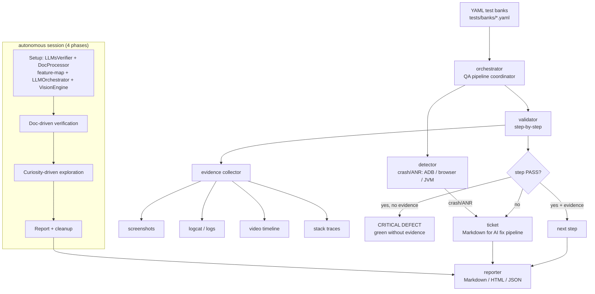

<!--
  Title           : Helix Thready — HelixQA YAML Test Banks
  Classification  : PUBLIC
  Location        : docs/public/research/mvp/testing/helixqa-banks.md
  Status          : Draft — v0.2
  Revision        : 2 (2026-07-22)
  Author          : Helix Thready documentation swarm (testing)
  Related         : ./test-strategy.md, ./test-types.md, ./challenges-scenarios.md,
                    ./acceptance-gates.md, ../user-guides/index.md, ../design/index.md
-->

# Helix Thready — HelixQA YAML Test Banks

| Rev | Date | Author | Change |
|-----|------|--------|--------|
| 1 | 2026-07-21 | swarm (testing) | Initial draft — YAML bank format, evidence rule, Thready banks, autonomous session |
| 2 | 2026-07-22 | swarm (testing) | Pass 3 — verified `pkg/testbank/schema.go` full bank schema, real `config.Platform`/`evidence.Type`/`issuedetector` sets, `helixqa-verify-*` harnesses, closed canonical-repo + ios-xctest opens |

**HelixQA** (`HelixDevelopment/helix_qa`) is the org's **anti-bluff QA orchestration framework**
for cross-platform testing with real-time crash detection, step validation, **evidence
collection** and automated ticket generation `[IN-HOUSE: HelixQA]` `[CONSTITUTION §11.4.27]`.
It is built on `digital.vasic.challenges` + `digital.vasic.containers` (incorporated at the
parent root; nested own-org chains forbidden `[CONSTITUTION §11.4.28/CONST-051]`).

> **The Operative Rule.** The bar for shipping is not "tests pass" but **"users can use the
> feature."** Every PASS HelixQA emits MUST carry positive **runtime evidence** captured during
> execution. A green summary line without that evidence is a critical defect of equal severity
> to a missing feature. `[CONSTITUTION §11.4]` (verbatim operator mandate, 2026-05-19).

## Table of contents

- [1. Where HelixQA fits](#1-where-helixqa-fits)
- [2. Evidence & anti-bluff flow](#2-evidence--anti-bluff-flow)
- [3. YAML test-bank format](#3-yaml-test-bank-format)
- [3.1 Verified full bank schema (from source)](#31-verified-full-bank-schema-from-source)
- [4. Thready bank set](#4-thready-bank-set)
- [5. Concrete banks](#5-concrete-banks)
- [6. Running & CLI](#6-running--cli)
- [6.1 Behavior-proving verifier harnesses (helixqa-verify)](#61-behavior-proving-verifier-harnesses-helixqa-verify)
- [7. Autonomous QA session](#7-autonomous-qa-session)
- [8. Platform coverage & caveats](#8-platform-coverage--caveats)
- [9. Gap-register items addressed](#9-gap-register-items-addressed)
- [10. Open items](#10-open-items)

## 1. Where HelixQA fits

HelixQA is test type **#15** and the engine for type **#4 (full-automation)**. It targets the
running clients (Web + Desktop first, `[OPERATOR: Web+CLI first]`) and drives real
navigation via ADB (Android), Playwright (Web) and X11 (Desktop). Its architecture (from the
repo): `cmd/helixqa` CLI (`run`/`list`/`report`/`autonomous`/`version`); `pkg/testbank`
(YAML banks with platform/priority filtering); `pkg/detector` (ADB/browser/JVM crash+ANR);
`pkg/validator` (step-by-step with evidence); `pkg/evidence` (screenshots/video/logs);
`pkg/ticket` (Markdown tickets); `pkg/reporter` (reuses `challenges/pkg/report`);
`pkg/orchestrator`; and the `pkg/autonomous`/`navigator`/`issuedetector`/`session` set for the
autonomous mode.

## 2. Evidence & anti-bluff flow



> Rendered PNG/SVG exported via Docs Chain (§11.4.65). Source:
> [`diagrams/helixqa-evidence-flow.mmd`](./diagrams/helixqa-evidence-flow.mmd).

**Explanation (for readers/models that cannot see the diagram).** The orchestrator loads YAML
test banks and coordinates two subsystems per run: the **detector** (which watches for
crashes/ANRs via ADB on Android, process monitoring in the browser, and JVM monitoring on
desktop) and the **validator** (which walks each test-case step). At every step the validator
drives the **evidence collector**, which captures screenshots, logcat/logs, a video timeline and
stack traces.

The step-PASS decision has three branches: a step that passes **with** evidence advances to the
next; a step that "passes" but produced **no** evidence is flagged a **critical defect** (the
anti-bluff rule — a green line without evidence is treated as severe as a missing feature); and a
failing step (or any crash/ANR from the detector) generates a **Markdown ticket** for the AI fix
pipeline. All outcomes feed the reporter, which emits Markdown/HTML/JSON with links from findings
to video timestamps.

The **autonomous session** (bottom) runs four phases — Setup (LLMsVerifier picks models,
DocProcessor builds a feature-map, LLMOrchestrator spawns CLI agents, VisionEngine initializes),
Doc-Driven Verification, Curiosity-Driven Exploration, then Report & Cleanup — and its report
merges into the same reporter output.

## 3. YAML test-bank format

The bank schema (from the HelixQA repo) — Thready banks live under `tests/banks/`:

```yaml
version: "1.0"
name: "Thready Core — Ingest & Processing"
test_cases:
  - id: TC-ING-001
    name: "Add Telegram channel and read a thread"
    category: functional          # functional | security | ux | accessibility | performance
    priority: critical            # critical | high | medium | low
    platforms: [web, desktop]     # target surfaces
    steps:
      - name: "Open Add-Channel wizard"
        action: "Navigate to Channels > Add, submit THREADY_TG_TEST_THREAD"
        expected: "Channel appears with status 'connecting'"
      - name: "Wait for thread backfill"
        action: "Observe processing status"
        expected: "Root post + organic replies visible; system replies excluded"
    tags: [ingest, smoke, anti-bluff]
    documentation_refs:
      - type: user_guide
        section: "3.1"
        path: "docs/public/research/mvp/user-guides/index.md"
```

Every field maps to `pkg/testbank` filtering: `--platform` filters `platforms`, `--priority`
filters `priority`; `documentation_refs` back the DocProcessor feature-map → coverage link
(see [test-strategy.md §10](./test-strategy.md#10-feature-map--coverage-tracking-docprocessor)).

## 3.1 Verified full bank schema (from source)

The Rev-1 example above is the common subset. The **authoritative** schema is
`pkg/testbank/schema.go` in `HelixDevelopment/helix_qa` (module `digital.vasic.helixqa`,
`go 1.26`) `[IN-HOUSE: helix_qa]`. Thready banks may use every field below — the load-bearing
additions over the subset are `challenge_id`, `dispatches_to`, `required_evidence`,
`requires_env`, `dependencies`, `estimated_duration`, `expected_result`, `domains`, and the
structured HTTP step fields (`expect_status`/`expect_json_path`/`expect_body_contains`/`auth`):

```go
// pkg/testbank/schema.go (verbatim field set)
type BankFile struct {
    Version     string     `yaml:"version"`
    Name        string     `yaml:"name"`
    Description string     `yaml:"description"`
    TestCases   []TestCase `yaml:"test_cases"`
    Metadata    map[string]any `yaml:"metadata,omitempty"`
}

type TestCase struct {
    ID                   string            `yaml:"id"`
    Name                 string            `yaml:"name"`
    Description          string            `yaml:"description"`
    Category             string            `yaml:"category"`     // functional|security|ux|accessibility|performance
    Priority             Priority          `yaml:"priority"`     // critical|high|medium|low
    Platforms            []config.Platform `yaml:"platforms"`    // see §8 enum
    Steps                []TestStep        `yaml:"steps"`
    Dependencies         []string          `yaml:"dependencies"`
    DocumentationRefs    []DocRef          `yaml:"documentation_refs"`
    Tags                 []string          `yaml:"tags"`
    EstimatedDuration    string            `yaml:"estimated_duration"`
    ExpectedResult       string            `yaml:"expected_result"`
    AllowForegroundLeave bool              `yaml:"allow_foreground_leave,omitempty"`
    RequiresEnv          []string          `yaml:"requires_env,omitempty"`
    ChallengeID          string            `yaml:"challenge_id,omitempty"`   // bridge to a challenges bank
    DispatchesTo         string            `yaml:"dispatches_to,omitempty"`  // delegate to another executor
    Domains              []string          `yaml:"domains,omitempty"`
    RequiredEvidence     []string          `yaml:"required_evidence,omitempty"` // anti-bluff: PASS must emit these
    Metadata             map[string]any    `yaml:"metadata,omitempty"`
}

type TestStep struct {
    Name               string          `yaml:"name"`
    Action             string          `yaml:"action"`
    Expected           string          `yaml:"expected"`
    Platform           config.Platform `yaml:"platform,omitempty"`
    Timeout            int             `yaml:"timeout,omitempty"`
    VisionVerify       bool            `yaml:"vision_verify,omitempty"`     // LLM-vision confirms the screen
    Body               any             `yaml:"body,omitempty"`
    Headers            map[string]string `yaml:"headers,omitempty"`
    AuthMode           string          `yaml:"auth,omitempty"`
    ExpectStatus       int             `yaml:"expect_status,omitempty"`
    ExpectJSONPath     string          `yaml:"expect_json_path,omitempty"`
    ExpectBodyContains string          `yaml:"expect_body_contains,omitempty"`
    Skip               bool            `yaml:"_skip,omitempty"`
    SkipReason         string          `yaml:"_skip_reason,omitempty"`
}

type DocRef struct {
    Type    string `yaml:"type"`     // user_guide|api_spec|...
    Section string `yaml:"section"`
    Path    string `yaml:"path,omitempty"`
}
```

Two fields deserve emphasis for Thready:

- **`challenge_id`** bridges a HelixQA case to a `digital.vasic.challenges` bank — the same
  scenario can run under the HelixQA orchestrator (with evidence/detector) *and* the Challenges
  runner (with the `assertion.Engine`), so the two engines share one source of truth rather than
  drifting. This is how test type #14 (Challenges) and #15 (HelixQA) stay consistent.
- **`required_evidence`** is the per-case anti-bluff contract: it lists the `evidence.Type`
  artifacts (`screenshot`, `video`, `logcat`, `stacktrace`, `console_log`, `audio`) a PASS MUST
  produce. The validator fails the case if any is missing — the mechanical backing for the
  `G-HELIXQA` gate ([acceptance-gates.md §3](./acceptance-gates.md#3-evidence-contract-per-gate)).

## 4. Thready bank set

`[GAP: §9.1]` One bank per service + client, Web + CLI/Desktop first:

| Bank file | Feature | Priority | Platforms |
|-----------|---------|----------|-----------|
| `ingest_core.yaml` | Herald thread reader (Telegram, Max) | critical | web, desktop |
| `classify.yaml` | Hashtag + indirect determination | high | web |
| `dispatch.yaml` | Skill dispatch, multi-hashtag precedence | critical | web, desktop |
| `download_asset.yaml` | Download Manager → callback → Asset Service | critical | web, desktop |
| `search.yaml` | Semantic `/v1/search` (< 500 ms) + UI | critical | web, desktop |
| `auth_rbac.yaml` | Three-tier login, MFA, negative RBAC | critical | web, desktop |
| `events_ws.yaml` | WebSocket/SSE live processing events | high | web |
| `ocr_comic.yaml` | OCR transcription of a comic fixture | high | web |
| `ux_a11y.yaml` | Onboarding flow + WCAG a11y | high | web, desktop |

## 5. Concrete banks

`search.yaml` — the SLO + anti-bluff bank for semantic search:

```yaml
version: "1.0"
name: "Thready — Semantic Search"
test_cases:
  - id: TC-SRCH-001
    name: "Search returns semantic matches within 500ms"
    category: performance
    priority: critical
    platforms: [web, desktop]
    steps:
      - name: "Seed known corpus"
        action: "Ensure fixture posts about 'download backoff' are processed + embedded"
        expected: "Corpus present in pgvector"
      - name: "Run paraphrase query"
        action: "Search 'exponential backoff for downloads'"
        expected: "Top result is the 'download backoff' post; latency badge < 500ms"
      - name: "Anti-bluff — semantic not hash"
        action: "Search an unrelated phrase 'price of tea'"
        expected: "The download-backoff post does NOT rank top (real embedder, not HashEmbedder)"
    tags: [search, slo, anti-bluff, gap-2.1]
    documentation_refs:
      - type: api
        section: "/v1/search"
        path: "docs/public/research/mvp/api/index.md"
```

`auth_rbac.yaml` — negative RBAC with evidence:

```yaml
version: "1.0"
name: "Thready — Auth & RBAC"
test_cases:
  - id: TC-AUTH-003
    name: "A 'user' cannot reach account-admin settings"
    category: security
    priority: critical
    platforms: [web, desktop]
    steps:
      - name: "Login as user"
        action: "Authenticate with a plain user of Account A"
        expected: "Dashboard visible; no Admin nav item"
      - name: "Attempt admin route directly"
        action: "Navigate to /account/settings by URL"
        expected: "403 / redirect; screenshot proves the block (evidence, not just a green tick)"
    tags: [auth, rbac, negative, security]
```

`download_asset.yaml` — full-schema bank showing `challenge_id` bridging, `required_evidence`,
`requires_env`, and structured HTTP step assertions:

```yaml
version: "1.0"
name: "Thready — Download Manager → Asset Service"
test_cases:
  - id: TC-DL-001
    name: "Enqueue, kill mid-transfer, resume, receive callback, asset served"
    category: functional
    priority: critical
    platforms: [web, desktop]
    estimated_duration: "3m"
    requires_env: [BIG_FILE_URL, THREADY_API_BASE]
    challenge_id: download_resume_callback        # same scenario as the challenges bank (§3 there)
    dependencies: [TC-ING-001]                    # ingest must work first
    required_evidence: [screenshot, video, console_log]   # PASS MUST emit all three
    steps:
      - name: "Enqueue large download"
        action: "POST ${THREADY_API_BASE}/v1/downloads {url: BIG_FILE_URL}"
        auth: bearer
        body: { url: "${BIG_FILE_URL}" }
        expect_status: 201
        expect_json_path: "$.job_id"
        expected: "202/201 with a job id"
      - name: "Kill worker mid-transfer then resume"
        action: "dm.KillWorker(job); dm.Resume(job)"
        expected: "transfer resumes from offset, not from zero"
      - name: "Await completion callback"
        action: "Observe /hooks/download push callback"
        expect_json_path: "$.result_asset_ref"
        expect_body_contains: "completed"
        vision_verify: true
        expected: "callback state=completed, carries asset ref; UI shows the asset"
    expected_result: "Resumable transfer + standardized push callback + asset served"
    tags: [download, callback, resume, anti-bluff, gap-6.3, gap-6.5]
    documentation_refs:
      - type: api_spec
        section: "/v1/downloads"
        path: "docs/public/research/mvp/api/index.md"
```

## 6. Running & CLI

```bash
# Run the full Thready bank set on Web (dev. stack) with evidence
helixqa run --banks tests/banks/ --platform web --env .env

# Desktop (Tauri) with a specific process target
helixqa run --banks tests/banks/ --platform desktop --process thready-desktop

# List/plan cases for a platform
helixqa list --banks tests/banks/ --platform web

# Report from collected results (evidence-linked)
helixqa report --input qa-results --format markdown,html,json
```

The run is a gate: a red case, a crash/ANR, or an **evidence-less PASS** blocks the pre-tag
retest (see [test-strategy.md §8](./test-strategy.md#8-ci-equivalent-gating-no-server-side-ci)).

## 6.1 Behavior-proving verifier harnesses (helixqa-verify)

HelixQA ships a fleet of **single-purpose behavior verifiers** under `cmd/` that prove a specific
capability really works — exactly the anti-bluff obligations Thready inherits from the gap
register `[IN-HOUSE: helix_qa]`. Rather than re-invent them, Thready wires these as
`ShellChallenge`s / bank cases and reuses them as the runtime proof behind its scaffold-trap
gates ([test-types.md §16](./test-types.md#16-anti-bluff-obligations-per-type)):

| Verifier (`cmd/…`) | Proves | Thready trap it guards `[GAP]` |
|--------------------|--------|--------------------------------|
| `helixqa-verify-embeddings` | real semantic embeddings, not a hash stub | HashEmbedder (§2.1) |
| `helixqa-verify-rag` | end-to-end RAG retrieval returns relevant chunks | RAG dim hardcode / search (§2.1) |
| `helixqa-verify-tesseract` | OCR returns real recognized text | VisionEngine no-OCR (§2.6) |
| `helixqa-verify-vision` | LLM-vision describes a real image | vision escalation (§2.6) |
| `helixqa-verify-whisper` | ASR transcribes real audio | media transcription |
| `helixqa-verify-translate-nllb` | NLLB translation is real | i18n/translation (§18 Q35) |
| `helixqa-verify-mcp-gateway` / `-netprov` / `-a2a` | MCP/provider/agent transports work | LLMProvider adapters (§2.3) |
| `helixqa-verify-coder-{ddos,chaos,memory,race,concurrency,bench}` | service survives fault/load classes | perf/chaos parity (§3.x) |

These already back real HelixQA banks (`helixllm_embeddings.yaml`, `helixllm_rag.yaml`,
`helixllm_tesseract.yaml`, `helixllm_vision.yaml`, `helixllm_whisper.yaml`,
`helixllm_coder_ddos.yaml`, …), so Thready's `search.yaml`/`ocr_comic.yaml` banks point their
`challenge_id`/`dispatches_to` at the corresponding verifier and gain a proven anti-bluff harness
for free. Running one directly:

```bash
# Anti-bluff proof the local embedder is semantic (fails loudly on the HashEmbedder stub)
go run ./cmd/helixqa-verify-embeddings --provider "${HELIX_EMBEDDING_PROVIDER:-llama}" --evidence qa-results/
# OCR proof over a Thready comic fixture
go run ./cmd/helixqa-verify-tesseract --image tests/fixtures/comic_panel_en.png --expect "HELIX THREADY 2026"
```

## 7. Autonomous QA session

The autonomous mode runs unattended (test type #4) in four phases: **Setup** (LLMsVerifier
selects models, **DocProcessor** builds the feature-map from Thready docs `[GAP: §9.4]`,
LLMOrchestrator spawns CLI agents, VisionEngine initializes), **Doc-Driven Verification** (every
documented feature verified against the running app with screenshot/video evidence),
**Curiosity-Driven Exploration** (edge cases — empty inputs, rapid interactions, undocumented
behavior), and **Report & Cleanup**:

```bash
helixqa autonomous --project . \
  --platforms web,desktop \
  --env .env \
  --timeout 2h \
  --coverage-target 0.9 \
  --output qa-results/ \
  --report markdown,html,json
```

The autonomous session's `issuedetector` classifies findings across the **six** verified
`IssueCategory` values (`pkg/issuedetector/categories.go`) — **visual, ux, accessibility,
functional, performance, crash** — each at one of four `IssueSeverity` levels (**critical, high,
medium, low**) `[IN-HOUSE: helix_qa]`. That single classifier therefore satisfies UI (#12, via
`visual`), UX (#13, via `ux`/`accessibility`), and contributes performance and crash findings to
the other gates — all with LLM-vision, so a rendered-but-wrong screen is caught even when the DOM
asserts "present".

The autonomous pipeline is real, not aspirational — its executor tier is source-verified
(`pkg/autonomous/`): an `executor_factory.go` selects among `real_executor.go`,
`playwright_executor.go`, `http_executor.go` and `structured_executor.go`; a `coordinator.go`
drives `worker.go`s through the four `phase.go` phases; and `stagnation.go` guards the
Curiosity-Driven Exploration phase so the explorer is failed as **stuck** (not left to spin) when
it stops discovering new states — the same liveness posture the Challenges runner enforces via
`WithStaleThreshold`. The `allow_foreground_leave` bank field (§3.1) opts a case out of the
structured-phase foreground guard when a step legitimately backgrounds the app.

## 8. Platform coverage & caveats

The valid targets are the verified `config.Platform` enum (`pkg/config/config.go`) —
`android`, `androidtv`, `web`, `desktop`, `cli`, `api`, `all`, `linux`, `tui`, `ios`
`[IN-HOUSE: helix_qa]`. There is **no `harmonyos` or `aurora` constant** — a precise, load-bearing
fact for the device-farm open item below: those surfaces are blocked not only by missing clients
but by a missing framework binding, so their gates emit SKIP (exit `77`,
[acceptance-gates.md §6](./acceptance-gates.md#6-gate-exit-code-protocol)) rather than a false
GREEN.

- **Web + Desktop** (`web`, `desktop`, `linux`): fully exercisable now — Playwright executor +
  X11/JVM detector; the `dev.` stack is the target `[OPERATOR: Web+CLI first]`.
- **CLI + TUI** (`cli`, `tui`): driven through the process/CLI executor and the `challenges`
  userflow adapters; the Cobra CLI and Bubble Tea TUI banks live here.
- **Android** (`android`, `androidtv`): `pkg/detector/android.go` (+ `android_dual_display.go`)
  ADB crash/ANR detection + navigator; requires an emulator/device.
- **iOS** (`ios`): **RESOLVED** `[OPEN: ios-xctest]` → the iOS unit framework is **XCTest**,
  fixed authoritatively by the final research request `[RESEARCH: final §9.4]` ("Swift/iOS —
  XCTest"); HelixQA's iOS **e2e** binding is **Appium + XCUITest**, source-verified by the real
  `banks/nexus-mobile-ios.yaml` bank (`mobile.NewIOSCaps` + `AppiumClient.NewSession`, XCUITest
  profile build, `Gestures{platform: ios}.Tap`, real-device caps require `XcodeOrgID` +
  `XcodeSigningID` together). Blocked only on a native iOS Thready client + a mac/simulator farm
  (`[OPEN: mobile-device-farm]`), not on a framework decision.
- **HarmonyOS / Aurora**: native ArkTS/Qt clients are **scaffolds** `[GAP: §8.5]`, and — per the
  enum above — HelixQA has no platform binding for them yet; on-device evidence is blocked until
  both land `[OPEN: mobile-device-farm]`.

## 9. Gap-register items addressed

- `[GAP: §9.1]` Thready YAML banks with mandatory runtime evidence — §3.1/§4/§5; the
  canonical-repo question (register §9.1: "mirror relationship inferred, not diffed") is now
  **diffed and resolved** — see §10.
- `[GAP: §9.4]` DocProcessor feature-map drives the autonomous Setup phase — §7.
- `[GAP: §8.5]` HarmonyOS/Aurora native-client scaffolds (+ no `config.Platform` binding) block
  on-device QA — §8.
- `[GAP: §2.1]` anti-bluff semantic-search evidence bank + `helixqa-verify-embeddings` — §5, §6.1.
- `[GAP: §2.6]` OCR anti-bluff via `helixqa-verify-tesseract`/`-vision` — §6.1.

## 10. Open items

- `[RESOLVED: canonical-helixqa-repo]` — **diffed.** Both `HelixDevelopment/helix_qa` and
  `vasic-digital/HelixQA` are **non-fork** repos (no GitHub `parent`), carry the **same** Go
  module path `module digital.vasic.helixqa` in `go.mod`, share the identical description
  ("AI-driven QA orchestration for multi-platform testing"), and both show recent **sync**
  commits ("sync: recursive push …" / "chore: update nested tools/opensource submodules after
  merge"). They are therefore **co-equal, synchronized upstream mirrors** of one submodule under
  the multi-remote fan-out `[CONSTITUTION §2.1]`, not a canonical/fork split with a stale side.
  Thready imports HelixQA **by module path** (`digital.vasic.helixqa`), so bank wiring is
  unaffected by which host mirror is fetched; commits fan out to all upstreams as usual.
- `[RESOLVED: ios-xctest]` — iOS unit framework is **XCTest** `[RESEARCH: final §9.4]`; HelixQA
  iOS e2e is **Appium + XCUITest**, verified by `banks/nexus-mobile-ios.yaml` (§8).
- `[OPEN: mobile-device-farm]` — provision device/emulator/simulator targets for Android + iOS
  now, and HarmonyOS/Aurora once native clients + a `config.Platform` binding land. Until then
  those cells emit SKIP (exit `77`). Checked: `pkg/config/config.go` has no HarmonyOS/Aurora
  constant (§8).

---

*Made with love ♥ by Helix Development.*
