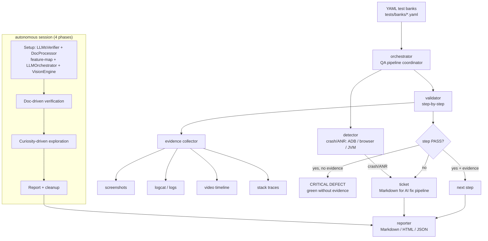

<!--
  Title           : Helix Thready — HelixQA YAML Test Banks
  Classification  : PUBLIC
  Location        : docs/public/research/mvp/testing/helixqa-banks.md
  Status          : Draft — v0.1
  Revision        : 1 (2026-07-21)
  Author          : Helix Thready documentation swarm (testing)
  Related         : ./test-strategy.md, ./test-types.md, ./challenges-scenarios.md,
                    ../user-guides/index.md, ../design/index.md
-->

# Helix Thready — HelixQA YAML Test Banks

| Rev | Date | Author | Change |
|-----|------|--------|--------|
| 1 | 2026-07-21 | swarm (testing) | Initial draft — YAML bank format, evidence rule, Thready banks, autonomous session |

**HelixQA** (`HelixDevelopment/helix_qa`) is the org's **anti-bluff QA orchestration framework**
for cross-platform testing with real-time crash detection, step validation, **evidence
collection** and automated ticket generation `[IN-HOUSE: HelixQA]` `[CONSTITUTION §11.4.27]`.
It is built on `digital.vasic.challenges` + `digital.vasic.containers` (incorporated at the
parent root; nested own-org chains forbidden `[CONSTITUTION §11.4.28/CONST-051]`).

> **The Operative Rule.** The bar for shipping is not "tests pass" but **"users can use the
> feature."** Every PASS HelixQA emits MUST carry positive **runtime evidence** captured during
> execution. A green summary line without that evidence is a critical defect of equal severity
> to a missing feature. `[CONSTITUTION §11.4]` (verbatim operator mandate, 2026-05-19).

## Table of contents

- [1. Where HelixQA fits](#1-where-helixqa-fits)
- [2. Evidence & anti-bluff flow](#2-evidence--anti-bluff-flow)
- [3. YAML test-bank format](#3-yaml-test-bank-format)
- [4. Thready bank set](#4-thready-bank-set)
- [5. Concrete banks](#5-concrete-banks)
- [6. Running & CLI](#6-running--cli)
- [7. Autonomous QA session](#7-autonomous-qa-session)
- [8. Platform coverage & caveats](#8-platform-coverage--caveats)
- [9. Gap-register items addressed](#9-gap-register-items-addressed)
- [10. Open items](#10-open-items)

## 1. Where HelixQA fits

HelixQA is test type **#15** and the engine for type **#4 (full-automation)**. It targets the
running clients (Web + Desktop first, `[OPERATOR: Web+CLI first]`) and drives real
navigation via ADB (Android), Playwright (Web) and X11 (Desktop). Its architecture (from the
repo): `cmd/helixqa` CLI (`run`/`list`/`report`/`autonomous`/`version`); `pkg/testbank`
(YAML banks with platform/priority filtering); `pkg/detector` (ADB/browser/JVM crash+ANR);
`pkg/validator` (step-by-step with evidence); `pkg/evidence` (screenshots/video/logs);
`pkg/ticket` (Markdown tickets); `pkg/reporter` (reuses `challenges/pkg/report`);
`pkg/orchestrator`; and the `pkg/autonomous`/`navigator`/`issuedetector`/`session` set for the
autonomous mode.

## 2. Evidence & anti-bluff flow



> Rendered PNG/SVG exported via Docs Chain (§11.4.65). Source:
> [`diagrams/helixqa-evidence-flow.mmd`](./diagrams/helixqa-evidence-flow.mmd).

**Explanation (for readers/models that cannot see the diagram).** The orchestrator loads YAML
test banks and coordinates two subsystems per run: the **detector** (which watches for
crashes/ANRs via ADB on Android, process monitoring in the browser, and JVM monitoring on
desktop) and the **validator** (which walks each test-case step). At every step the validator
drives the **evidence collector**, which captures screenshots, logcat/logs, a video timeline and
stack traces. The step-PASS decision has three branches: a step that passes **with** evidence
advances to the next; a step that "passes" but produced **no** evidence is flagged a **critical
defect** (the anti-bluff rule — a green line without evidence is treated as severe as a missing
feature); and a failing step (or any crash/ANR from the detector) generates a **Markdown
ticket** for the AI fix pipeline. All outcomes feed the reporter, which emits Markdown/HTML/JSON
with links from findings to video timestamps. The **autonomous session** (bottom) runs four
phases — Setup (LLMsVerifier picks models, DocProcessor builds a feature-map, LLMOrchestrator
spawns CLI agents, VisionEngine initializes), Doc-Driven Verification, Curiosity-Driven
Exploration, then Report & Cleanup — and its report merges into the same reporter output.

## 3. YAML test-bank format

The bank schema (from the HelixQA repo) — Thready banks live under `tests/banks/`:

```yaml
version: "1.0"
name: "Thready Core — Ingest & Processing"
test_cases:
  - id: TC-ING-001
    name: "Add Telegram channel and read a thread"
    category: functional          # functional | security | ux | accessibility | performance
    priority: critical            # critical | high | medium | low
    platforms: [web, desktop]     # target surfaces
    steps:
      - name: "Open Add-Channel wizard"
        action: "Navigate to Channels > Add, submit THREADY_TG_TEST_THREAD"
        expected: "Channel appears with status 'connecting'"
      - name: "Wait for thread backfill"
        action: "Observe processing status"
        expected: "Root post + organic replies visible; system replies excluded"
    tags: [ingest, smoke, anti-bluff]
    documentation_refs:
      - type: user_guide
        section: "3.1"
        path: "docs/public/research/mvp/user-guides/index.md"
```

Every field maps to `pkg/testbank` filtering: `--platform` filters `platforms`, `--priority`
filters `priority`; `documentation_refs` back the DocProcessor feature-map → coverage link
(see [test-strategy.md §10](./test-strategy.md#10-feature-map--coverage-tracking-docprocessor)).

## 4. Thready bank set

`[GAP: §9.1]` One bank per service + client, Web + CLI/Desktop first:

| Bank file | Feature | Priority | Platforms |
|-----------|---------|----------|-----------|
| `ingest_core.yaml` | Herald thread reader (Telegram, Max) | critical | web, desktop |
| `classify.yaml` | Hashtag + indirect determination | high | web |
| `dispatch.yaml` | Skill dispatch, multi-hashtag precedence | critical | web, desktop |
| `download_asset.yaml` | Download Manager → callback → Asset Service | critical | web, desktop |
| `search.yaml` | Semantic `/v1/search` (< 500 ms) + UI | critical | web, desktop |
| `auth_rbac.yaml` | Three-tier login, MFA, negative RBAC | critical | web, desktop |
| `events_ws.yaml` | WebSocket/SSE live processing events | high | web |
| `ocr_comic.yaml` | OCR transcription of a comic fixture | high | web |
| `ux_a11y.yaml` | Onboarding flow + WCAG a11y | high | web, desktop |

## 5. Concrete banks

`search.yaml` — the SLO + anti-bluff bank for semantic search:

```yaml
version: "1.0"
name: "Thready — Semantic Search"
test_cases:
  - id: TC-SRCH-001
    name: "Search returns semantic matches within 500ms"
    category: performance
    priority: critical
    platforms: [web, desktop]
    steps:
      - name: "Seed known corpus"
        action: "Ensure fixture posts about 'download backoff' are processed + embedded"
        expected: "Corpus present in pgvector"
      - name: "Run paraphrase query"
        action: "Search 'exponential backoff for downloads'"
        expected: "Top result is the 'download backoff' post; latency badge < 500ms"
      - name: "Anti-bluff — semantic not hash"
        action: "Search an unrelated phrase 'price of tea'"
        expected: "The download-backoff post does NOT rank top (real embedder, not HashEmbedder)"
    tags: [search, slo, anti-bluff, gap-2.1]
    documentation_refs:
      - type: api
        section: "/v1/search"
        path: "docs/public/research/mvp/api/index.md"
```

`auth_rbac.yaml` — negative RBAC with evidence:

```yaml
version: "1.0"
name: "Thready — Auth & RBAC"
test_cases:
  - id: TC-AUTH-003
    name: "A 'user' cannot reach account-admin settings"
    category: security
    priority: critical
    platforms: [web, desktop]
    steps:
      - name: "Login as user"
        action: "Authenticate with a plain user of Account A"
        expected: "Dashboard visible; no Admin nav item"
      - name: "Attempt admin route directly"
        action: "Navigate to /account/settings by URL"
        expected: "403 / redirect; screenshot proves the block (evidence, not just a green tick)"
    tags: [auth, rbac, negative, security]
```

## 6. Running & CLI

```bash
# Run the full Thready bank set on Web (dev. stack) with evidence
helixqa run --banks tests/banks/ --platform web --env .env

# Desktop (Tauri) with a specific process target
helixqa run --banks tests/banks/ --platform desktop --process thready-desktop

# List/plan cases for a platform
helixqa list --banks tests/banks/ --platform web

# Report from collected results (evidence-linked)
helixqa report --input qa-results --format markdown,html,json
```

The run is a gate: a red case, a crash/ANR, or an **evidence-less PASS** blocks the pre-tag
retest (see [test-strategy.md §8](./test-strategy.md#8-ci-equivalent-gating-no-server-side-ci)).

## 7. Autonomous QA session

The autonomous mode runs unattended (test type #4) in four phases: **Setup** (LLMsVerifier
selects models, **DocProcessor** builds the feature-map from Thready docs `[GAP: §9.4]`,
LLMOrchestrator spawns CLI agents, VisionEngine initializes), **Doc-Driven Verification** (every
documented feature verified against the running app with screenshot/video evidence),
**Curiosity-Driven Exploration** (edge cases — empty inputs, rapid interactions, undocumented
behavior), and **Report & Cleanup**:

```bash
helixqa autonomous --project . \
  --platforms web,desktop \
  --env .env \
  --timeout 2h \
  --coverage-target 0.9 \
  --output qa-results/ \
  --report markdown,html,json
```

The autonomous session's `issuedetector` classifies findings across **visual / UX /
accessibility / functional** categories — satisfying UI (#12) and UX (#13) with LLM-vision.

## 8. Platform coverage & caveats

- **Web + Desktop**: fully exercisable now (Playwright + X11).
- **Android**: ADB detector + navigator ready; requires an emulator/device.
- **iOS**: XCTest/XCUITest path `[OPEN: ios-xctest]` — framework inferred, confirm before wiring.
- **HarmonyOS / Aurora**: native clients are **scaffolds** `[GAP: §8.5]` — on-device HelixQA
  evidence is blocked until the ArkTS/Qt clients exist `[OPEN: mobile-device-farm]`.

## 9. Gap-register items addressed

- `[GAP: §9.1]` Thready YAML banks with mandatory runtime evidence — §4/§5; canonical-repo
  open item below.
- `[GAP: §9.4]` DocProcessor feature-map drives the autonomous Setup phase — §7.
- `[GAP: §8.5]` HarmonyOS/Aurora native-client scaffolds block on-device QA — §8.
- `[GAP: §2.1]` anti-bluff semantic-search evidence bank — §5 (`search.yaml`).

## 10. Open items

- `[OPEN: canonical-helixqa-repo]` — confirm `HelixDevelopment/helix_qa` vs
  `vasic-digital/HelixQA` canonical/mirror before committing Thready banks upstream (§9.1).
- `[OPEN: ios-xctest]` — confirm the iOS framework binding for HelixQA.
- `[OPEN: mobile-device-farm]` — provision device/emulator targets for Android + (later)
  HarmonyOS/Aurora once native clients land.

---

*Made with love ♥ by Helix Development.*
