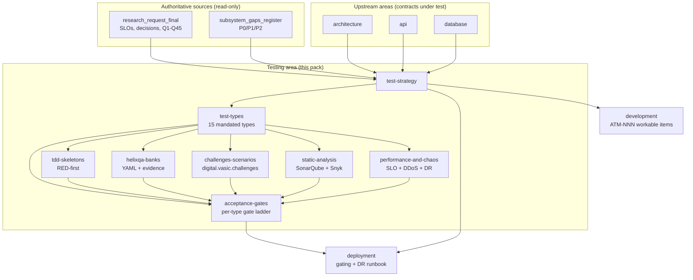

<!--
  Title           : Helix Thready — Testing Strategy (Area Index)
  Classification  : PUBLIC
  Location        : docs/public/research/mvp/testing/index.md
  Status          : Draft — v0.3
  Revision        : 3 (2026-07-22)
  Author          : Helix Thready documentation swarm (testing)
  Related         : ./test-strategy.md, ./test-types.md, ./tdd-skeletons.md,
                    ./helixqa-banks.md, ./challenges-scenarios.md, ./static-analysis.md,
                    ./performance-and-chaos.md, ./acceptance-gates.md, ../CONVENTIONS.md, ../index.md
-->

# Helix Thready — Testing Strategy (Area Index)

| Rev | Date | Author | Change |
|-----|------|--------|--------|
| 1 | 2026-07-21 | swarm (testing) | Initial draft — full 15-type strategy, TDD skeletons, HelixQA/Challenges banks, static analysis, performance & chaos |
| 2 | 2026-07-22 | swarm (testing) | Pass 3 — added acceptance-gates.md; verified challenges/helix_qa source; closed canonical-helixqa-repo + ios-xctest opens; expanded TDD/bank/scenario depth |
| 3 | 2026-07-22 | swarm (testing) | Pass 4 (critic) — added test-determinism & flaky-test policy + coverage-matrix DDL (test-strategy); pinned `/v1/downloads` + completion-callback OpenAPI 3.1 contract (tdd-skeletons §13.5); G-CONTRACT names all four contracts |

This is the canonical entry point for the **Testing Strategy** documentation area of Helix
Thready. It implements the mandatory testing covenant `[CONSTITUTION §11.4.27]` — the **15
mandated test types**, **TDD reproduce-first**, **100 % test-type coverage** (per feature ×
platform, not a line percentage), the **anti-bluff / no-fakes-beyond-unit** rule, and the
**SonarQube + Snyk** continuous-quality columns — as resolved in the final research request
(`§9`, `§18 Q23/Q24`, `§0.1` operator decisions) and the subsystem gap register.

All files in this area follow **[../CONVENTIONS.md](../CONVENTIONS.md)** exactly: metadata
header, revision table, ToC, provenance tags, the diagram + prose-explanation rule (with
`.mmd` sources in [`diagrams/`](./diagrams/)), and the code/DDL/YAML/TDD requirements.

## Table of contents

- [1. Upstream / downstream dependencies](#1-upstream--downstream-dependencies)
- [2. Area map](#2-area-map)
- [3. Documents in this area](#3-documents-in-this-area)
- [4. The 15 mandated test types at a glance](#4-the-15-mandated-test-types-at-a-glance)
- [5. Provenance & authoritative decisions honored here](#5-provenance--authoritative-decisions-honored-here)
- [6. Gap-register items addressed by this area](#6-gap-register-items-addressed-by-this-area)
- [7. Open items tracked in this area](#7-open-items-tracked-in-this-area)

## 1. Upstream / downstream dependencies

**Upstream (contracts this area tests — read these first):**

- [../architecture/index.md](../architecture/index.md) — components, event model, concurrency
  and idempotency model, security model. Tests target these contracts.
- [../api/index.md](../api/index.md) — REST OpenAPI 3.1, the WebSocket/SSE event contract, SDK
  surface. Integration/e2e/contract tests are written against these.
- [../database/index.md](../database/index.md) — ERD, PostgreSQL + pgvector DDL, migrations.
  Migration up/down tests, partitioning/scaling tests and the < 500 ms semantic-search SLO test
  derive from here.

**Downstream (areas that consume this area's outputs):**

- [../deployment/index.md](../deployment/index.md) — consumes the CI-equivalent gating
  (local git-hooks + pre-tag full-suite retest), the chaos/DR validation, and the SonarQube
  rootless-Podman server topology.
- [../development/index.md](../development/index.md) — every test plan below becomes one or more
  **ATM-NNN** workable items; the TDD RED-first skeletons are the first artifact of each item.

## 2. Area map

> Rendered PNG/SVG exported via Docs Chain (§11.4.65). Source:
> [`diagrams/testing-area-map.mmd`](./diagrams/testing-area-map.mmd).

**Explanation (for readers/models that cannot see the diagram).** Two authoritative,
read-only sources feed this area: the final research request (which fixes the Aggressive SLOs,
the operator decisions, and the Q1–Q45 answers) and the private subsystem gap register (which
enumerates every P0/P1/P2 gap the tests must guard against). Both flow into `test-strategy`, the
governing document.

`test-strategy` derives `test-types` (the catalogue of all 15 mandated types with scope, tooling
and gates), which in turn drives the five concrete implementation documents: `tdd-skeletons`
(RED-first Go/TypeScript skeletons), `helixqa-banks` (YAML QA banks with mandatory runtime
evidence), `challenges-scenarios` (the `digital.vasic.challenges` scenario engine),
`static-analysis` (SonarQube + Snyk quality gates) and `performance-and-chaos` (SLO/DDoS/scaling/
chaos/DR plans). All five implementation documents, together with `test-types` and
`tdd-skeletons`, converge on `acceptance-gates` — the per-test-type gate register and the
three-tier gate ladder that turns every "gate" line into a single machine-checkable pass/fail
with a stable gate ID.

The three upstream areas — architecture, API and database — supply the contracts the tests
target, so a change in any of them re-triggers this area. Downstream, `acceptance-gates` (and the
governing strategy) feed deployment (the pre-tag gating and the DR runbook) and development (each
plan becomes an ATM-NNN workable item).

## 3. Documents in this area

| Doc | Scope |
|-----|-------|
| [test-strategy.md](./test-strategy.md) | Governing strategy: TDD reproduce-first, 100 % test-type coverage model (+ coverage-matrix DDL), no-fakes-beyond-unit, anti-bluff covenant, test-determinism & flaky-test policy, CI-equivalent gating, review integration, environments, fixtures (test threads), tooling map, per-language framework matrix |
| [test-types.md](./test-types.md) | The **15 mandated test types** — unit, integration, e2e, full-automation, security, DDoS, scaling, chaos, stress, performance, benchmarking, UI, UX, Challenges, HelixQA — each with scope / tools / gates / exit criteria, mapped to Thready components |
| [tdd-skeletons.md](./tdd-skeletons.md) | Reproduce-first RED test skeletons (Go / TypeScript / SQL / YAML) for every major component, incl. the paired-mutation anti-bluff gate |
| [helixqa-banks.md](./helixqa-banks.md) | HelixQA YAML test banks with mandatory runtime evidence (screenshots/logcat/video/stacktrace), the autonomous QA session, anti-bluff rule |
| [challenges-scenarios.md](./challenges-scenarios.md) | `digital.vasic.challenges` scenario engine: Go challenge definitions, YAML/JSON banks, userflow adapters, the describe-Challenge meta-runner (exit 99) |
| [static-analysis.md](./static-analysis.md) | SonarQube (CLI + rootless-Podman server, `[CONSTITUTION §11.4.184]`) + Snyk quality gates, cadence, independent AI review |
| [performance-and-chaos.md](./performance-and-chaos.md) | Performance, benchmarking, stress, scaling, chaos and DDoS plans for the Aggressive SLOs; DR validation (RPO ≈ 1 h / RTO ≈ 4 h) |
| [acceptance-gates.md](./acceptance-gates.md) | Per-test-type acceptance gates: one machine-checkable gate (ID, precondition, script-decidable pass condition, evidence, blocking severity) per mandated type; the three-tier gate ladder; exit-code protocol; waiver policy |

## 4. The 15 mandated test types at a glance

`[CONSTITUTION §11.4.27]` mandates all fifteen for **every feature × platform** cell. Mocks,
stubs and TODOs are permitted **only in unit tests**; every other type exercises the real
system. Full definitions, tooling and gates are in [test-types.md](./test-types.md).

| # | Type | One-line scope | Primary tooling |
|---|------|----------------|-----------------|
| 1 | Unit | Single function/method in isolation | Go `testing`+`testify`, Jasmine/Karma, Kotest, XCTest, `cargo test`, `flutter_test` |
| 2 | Integration | Cross-module contracts, critical paths first | `testcontainers`-style real Postgres/NATS/MinIO |
| 3 | E2E | Whole user journey through real services | Cypress/Playwright, `challenges/pkg/userflow` |
| 4 | Full-automation | Unattended run of all suites, evidence-collected | HelixQA autonomous session |
| 5 | Security | authn/authz, secret-leak, fuzz, CVE, SSRF | Snyk, SonarQube, `go-fuzz`, `security/pkg/*` |
| 6 | DDoS | Attack simulation vs rate-limiter/HTTP-3 | vegeta/k6 flood, `ratelimiter` assertions |
| 7 | Scaling | Horizontal scale-out under Large-scale load | Postgres partitioning + replica, NATS cluster |
| 8 | Chaos | Fault injection, kill nodes, validate DR | Podman kill, netem, DR restore drill |
| 9 | Stress | Beyond-capacity, find the knee | k6 ramp-to-break |
| 10 | Performance | SLO assertion (p95 < 150 ms etc.) | k6 thresholds, `pprof` |
| 11 | Benchmarking | Regression-tracked micro/macro benchmarks | `go test -bench`, `benchstat` |
| 12 | UI | Rendering, visual regression | Panoptic / VisualRegression / ScreenDiff |
| 13 | UX | Flows, a11y, latency-of-interaction | `cypress-axe`, HelixQA UX issue-detector |
| 14 | Challenges | Real-use-case scenario banks | `digital.vasic.challenges` |
| 15 | HelixQA | AI-driven multi-platform QA w/ evidence | `HelixDevelopment/helix_qa` |

## 5. Provenance & authoritative decisions honored here

- **Aggressive SLOs** `[OPERATOR]` — API p95 < 150 ms, semantic search < 500 ms, page < 1.5 s;
  processing async with progress events (final request `§0.1`, `§18 Q14`). Enforced in
  [performance-and-chaos.md](./performance-and-chaos.md).
- **Large / multi-tenant scale** `[OPERATOR]` — 100+ channels, 10k+ posts/day, 100+ users,
  50 TB+ assets (`§0.1`, `§18 Q2`). Drives scaling & stress plans.
- **Web + CLI first** `[OPERATOR]` — critical paths for the Angular portal and the Cobra CLI are
  tested first, then TUI → Desktop → Mobile (`§18 Q13/Q23/Q24`).
- **Backup/DR** `[OPERATOR]` — daily full + hourly DB incrementals; RPO ≈ 1 h, RTO ≈ 4 h,
  validated by chaos tests (`§18 Q41/Q45`).
- **In-house first** — the two test-bank engines are owned modules: `vasic-digital/challenges`
  and `HelixDevelopment/helix_qa`, both built on `digital.vasic.containers`
  `[IN-HOUSE]` `[CONSTITUTION §11.4.27]`.

## 6. Gap-register items addressed by this area

Each is expanded (design plan or tracked workable item) in the linked document and tagged
`[GAP: id]` inline. Public docs describe the **test that proves real behavior**; the private
register holds the danger-zone detail.

| Gap-register item | How this area addresses it | Where |
|-------------------|----------------------------|-------|
| §9.1 HelixQA — add Thready YAML banks w/ runtime evidence; confirm canonical repo vs mirror | Full Thready QA bank set + anti-bluff evidence rule; canonical-repo open item | [helixqa-banks.md](./helixqa-banks.md) |
| §9.3 Panoptic/VisualRegression/ScreenDiff/challenges — add CI-equiv gating; author Thready scenario banks | Local git-hook gating for the visual-regression family; Thready `challenges` banks | [challenges-scenarios.md](./challenges-scenarios.md), [test-types.md](./test-types.md) |
| §9.4 DocProcessor — wire feature-map → coverage | Feature-map → test-type coverage matrix wired into the gate | [test-strategy.md](./test-strategy.md) |
| §2.1 `/v1/embeddings` OpenAI-shape + config-driven dimension; §2.3 LLMProvider per-adapter contracts | OpenAPI 3.1 + provider RED contract-test skeletons | [tdd-skeletons.md](./tdd-skeletons.md) |
| §9.2 HelixStream — defer unless streaming-app testing needed | Explicitly deferred as an open item | [test-strategy.md](./test-strategy.md) |
| §12 Anti-bluff sweep (paired-mutation gates) | Paired-mutation gate pattern mandated for every SCAFFOLD/DESIGN-ONLY dep | [tdd-skeletons.md](./tdd-skeletons.md), [challenges-scenarios.md](./challenges-scenarios.md) |
| §12 CI-equivalent gating (no server CI) | Local git-hook + pre-tag full-suite retest pipeline | [test-strategy.md](./test-strategy.md), [static-analysis.md](./static-analysis.md) |
| §12 Decoupling audit | Contract tests assert project-not-aware/config-injected reuse | [test-types.md](./test-types.md) |
| P0 scaffold traps (HashEmbedder, OCR, Security-KMP, Herald MTProto/Max, MeTube, Download Mgr, Skill dispatch, VectorDB Qdrant) | Anti-bluff / behavior-proving tests specified before reliance | [tdd-skeletons.md](./tdd-skeletons.md), [test-types.md](./test-types.md) |

## 7. Open items tracked in this area

**Resolved in Pass 3 (source-verified):**

- `[RESOLVED: canonical-helixqa-repo]` — **diffed.** `HelixDevelopment/helix_qa` and
  `vasic-digital/HelixQA` are both non-fork, share the module path `digital.vasic.helixqa`,
  carry the same description, and both show recent sync commits: they are co-equal synchronized
  upstream mirrors of one submodule, not a canonical/fork split. Thready imports by module path.
  Detail + citations in [helixqa-banks.md §10](./helixqa-banks.md#10-open-items).
- `[RESOLVED: ios-xctest]` — iOS unit framework is **XCTest** `[RESEARCH: final §9.4]`; HelixQA
  iOS e2e is **Appium + XCUITest** (verified `banks/nexus-mobile-ios.yaml`). See
  [helixqa-banks.md §8](./helixqa-banks.md#8-platform-coverage--caveats).

**Still open (with what was checked):**

- `[OPEN: helixstream-scope]` — decide whether streaming-app testing (HelixStream) is in Thready
  MVP scope; deferred by default (register §9.2). Checked: `HelixDevelopment/HelixStream` exists
  but is listed among the early scaffolds needing hardening `[RESEARCH: final §"early scaffolds"]`.
- `[OPEN: docs-chain-tooling]` — `pandoc`/`weasyprint` absent on some hosts; md→HTML/PDF siblings
  and the docs↔tests coverage export SKIP (exit `77`) until provisioned (register §10.1). Checked:
  the export tooling itself works in-org (helix_qa ships committed `.html`/`.pdf` siblings), so
  this is host provisioning, not missing tooling.
- `[OPEN: mobile-device-farm]` — HarmonyOS/Aurora native clients are scaffolds **and** HelixQA has
  no `config.Platform` binding for them (verified `pkg/config/config.go`); Android + iOS need a
  device/simulator farm. On-device evidence for those cells emits SKIP until provisioned (§8.5).
- `[OPEN: sonarqube-edition]` / `[OPEN: snyk-license]` — analyzer/seat confirmations, tracked in
  [static-analysis.md §9](./static-analysis.md#9-open-items).
- `[OPEN: gpu-perf-baseline]` / `[OPEN: nats-cluster-size]` — load-baseline/topology decisions,
  tracked in [performance-and-chaos.md §9](./performance-and-chaos.md#9-open-items).

---

*Made with love ♥ by Helix Development.*
