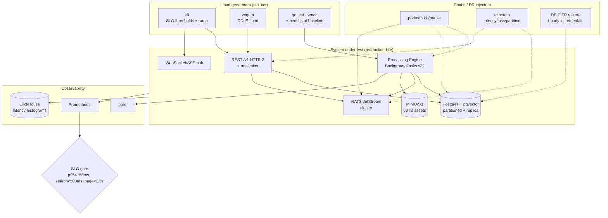

<!--
  Title           : Helix Thready — Performance, Scaling, Stress, Chaos & DDoS
  Classification  : PUBLIC
  Location        : docs/public/research/mvp/testing/performance-and-chaos.md
  Status          : Draft — v0.1
  Revision        : 1 (2026-07-21)
  Author          : Helix Thready documentation swarm (testing)
  Related         : ./test-strategy.md, ./test-types.md, ./acceptance-gates.md,
                    ../architecture/index.md, ../database/index.md, ../deployment/index.md
-->

# Helix Thready — Performance, Scaling, Stress, Chaos & DDoS

| Rev | Date | Author | Change |
|-----|------|--------|--------|
| 1 | 2026-07-21 | swarm (testing) | Initial draft — SLO/benchmark/stress/scaling/chaos/DDoS plans + DR validation |
| 2 | 2026-07-22 | swarm (testing) | Pass 3 — cited reusable helix_qa perf/chaos banks + verifier harnesses; linked G-PERF/G-BENCH/G-SCALE/G-STRESS/G-DDOS/G-CHAOS/G-DR gate IDs |

This document covers the six load-and-resilience test types (**scaling, chaos, stress,
performance, benchmarking, DDoS**) against the **Aggressive SLOs** and **Large / multi-tenant
scale** `[OPERATOR §0.1]` `[RESEARCH: final §18 Q2/Q14/Q45]`. All non-unit runs execute on the
production-like `sta.` tier against the real system.

**Target SLOs** `[OPERATOR]`: **API p95 < 150 ms · semantic search < 500 ms · page < 1.5 s**;
processing is async with progress events. **Scale**: 100+ channels, 10k+ posts/day, 100+ users,
50 TB+ assets. **DR**: **RPO ≈ 1 h, RTO ≈ 4 h**.

The pass/fail lines below map to the acceptance-gate IDs `G-PERF`, `G-BENCH`, `G-SCALE`,
`G-STRESS`, `G-DDOS`, `G-CHAOS` and `G-DR`
([acceptance-gates.md §2](./acceptance-gates.md#2-gate-register-one-row-per-type)). Thready does
not start these banks from scratch: HelixQA already ships **reusable load-and-resilience banks**
Thready parameterizes for its own services `[IN-HOUSE: helix_qa]` — `benchmarking-baselines.yaml`
(benchstat baselines), `ddos-ratelimit-comprehensive.yaml` (rate-limiter flood), and the
`helixllm_coder_{ddos,chaos,memory,race,concurrency,bench}.yaml` family (per-fault-class service
banks), each backed by a `helixqa-verify-coder-*` harness
([helixqa-banks.md §6.1](./helixqa-banks.md#61-behavior-proving-verifier-harnesses-helixqa-verify)).

## Table of contents

- [1. Test topology](#1-test-topology)
- [2. Benchmarking (regression baselines)](#2-benchmarking-regression-baselines)
- [3. Performance SLO tests](#3-performance-slo-tests)
- [4. Scaling tests](#4-scaling-tests)
- [5. Stress tests](#5-stress-tests)
- [6. DDoS & abuse simulation](#6-ddos--abuse-simulation)
- [7. Chaos & DR validation](#7-chaos--dr-validation)
- [8. Gap-register items addressed](#8-gap-register-items-addressed)
- [9. Open items](#9-open-items)

## 1. Test topology



> Rendered PNG/SVG exported via Docs Chain (§11.4.65). Source:
> [`diagrams/perf-chaos-topology.mmd`](./diagrams/perf-chaos-topology.mmd).

**Explanation (for readers/models that cannot see the diagram).** On the `sta.` tier, three load
generators drive the system: **k6** applies SLO-threshold and ramp profiles to the REST `/v1`
HTTP-3 API and the WebSocket/SSE hub; **vegeta** produces DDoS floods against the API; and
`go test -bench` with a `benchstat` baseline exercises the hot paths in the Processing Engine.
The **system under test** is production-like: the API (with the rate-limiter), the WS/SSE hub,
the Processing Engine (BackgroundTasks worker pool, default 32), Postgres+pgvector (time-
partitioned with a read replica), a NATS JetStream cluster, and MinIO/S3 holding 50 TB of
assets.

A separate **chaos/DR injector** set can `podman kill`/`pause` the Processing Engine, Postgres or
NATS; apply `tc netem` latency/loss/partition to NATS and the API; and drive a DB point-in-time
restore from hourly incrementals. **Observability** (Prometheus, `pprof`, ClickHouse latency
histograms via `digital.vasic.observability`) feeds the **SLO gate**, which asserts p95 < 150 ms
for the API, < 500 ms for search, and < 1.5 s page load. A breach fails the run and blocks the
production tag (gate `G-PERF`; the injector experiments map to `G-CHAOS`/`G-DR`).

## 2. Benchmarking (regression baselines)

Type #11. `go test -bench` + `benchstat` compares against a versioned baseline; a statistically
significant regression blocks without a waiver.

```bash
go test -bench=. -benchmem -count=10 ./... > new.txt
benchstat baseline.txt new.txt        # fail the gate on significant regression
```

Hot paths benchmarked: embedding + pgvector upsert throughput; pgvector `<=>` cosine query at
representative index sizes; hashtag parse; the AST/tree-sitter + Markdown chunker; JSON
(de)serialization at the API boundary; JWT verify. Web bundle/perf budgets tracked via Lighthouse
and Angular budgets.

## 3. Performance SLO tests

Type #10. k6 thresholds turn the SLOs into pass/fail:

```javascript
// perf/api_slo.js
import http from 'k6/http';
import { check } from 'k6';
export const options = {
  scenarios: { steady: { executor: 'constant-arrival-rate', rate: 200, timeUnit: '1s',
                         duration: '5m', preAllocatedVUs: 100 } },
  thresholds: {
    'http_req_duration{group:api}':    ['p(95)<150'],   // API p95 < 150 ms
    'http_req_duration{group:search}': ['p(95)<500'],   // semantic search < 500 ms
  },
};
export default function () {
  check(http.get(`${__ENV.BASE}/v1/channels`, { tags: { group: 'api' } }),
        { 'api 200': r => r.status === 200 });
  check(http.post(`${__ENV.BASE}/v1/search`, JSON.stringify({ q: 'backoff config' }),
        { headers: { 'Content-Type': 'application/json' }, tags: { group: 'search' } }),
        { 'search 200': r => r.status === 200 });
}
```

Page-load (< 1.5 s) is asserted via Lighthouse/`web-vitals` in the Cypress e2e run
([tdd-skeletons.md §11](./tdd-skeletons.md#11-angular-web-portal-typescript)). Server-side
percentiles are corroborated from ClickHouse histograms so the gate does not rely on the load
generator alone. Async processing is measured by **progress-event latency**, not request
latency, since long work is delegated with callbacks.

## 4. Scaling tests

Type #7 `[OPERATOR: Large scale]` `[RESEARCH: final §19.8]`. Validate horizontal scale-out:

- **Postgres** — time-partitioned `posts` (see
  [tdd-skeletons.md §10](./tdd-skeletons.md#10-migration-updown-sql--go)) + **read replicas**;
  assert query latency stays flat as partitions grow to 10k+ posts/day × retention.
- **pgvector** — ANN index tuning (lists/probes) so `/v1/search` holds < 500 ms as the index
  grows toward 50 TB-scale corpora `[GAP: §3.1 tune for < 500 ms SLO]`.
- **BackgroundTasks** — scale the worker pool (default 32) and assert throughput scales ~linearly
  and the **idempotent single-claim** holds under a post-event storm (no double processing).
- **NATS JetStream** — cluster; assert durable consumers replay after a node loss with no message
  loss.
- **Assets** — MinIO/S3 tiering; signed-URL serving latency flat as object count grows; confirm
  MinIO signed-URL parity with the CloudFront-style path `[GAP: §3.2]`.

## 5. Stress tests

Type #9. Push beyond rated capacity with a k6 ramp-to-break and confirm **graceful
degradation**, not collapse:

```javascript
// stress/ramp.js — ramp arrival rate until the knee
export const options = { scenarios: { ramp: { executor: 'ramping-arrival-rate',
  startRate: 100, timeUnit: '1s', stages: [
    { target: 500, duration: '3m' }, { target: 2000, duration: '3m' },
    { target: 5000, duration: '3m' } ], preAllocatedVUs: 500 } } };
```

Pass condition: queues grow and back-pressure/429s engage while progress events keep flowing;
no OOM/crash; automatic recovery when load drops. `pprof` heap/goroutine snapshots taken at the
knee to catch leaks (memory-leak prevention is a mandated review angle, §9.3).

## 6. DDoS & abuse simulation

Type #6 `[RESEARCH: request §Testing]` "DDoS and other common/less-common attacks resistance with
exhaustive simulations":

- **Volumetric flood** — `vegeta attack -rate=20000/s` against `/v1/*`; assert the rate-limiter
  (`digital.vasic.ratelimiter`) sheds excess deterministically (429 + `Retry-After`), legitimate
  p95 stays within SLO or degrades gracefully, no crash/OOM.
- **Connection storm** — mass WebSocket connect/subscribe/drop; assert the hub bounds resources.
- **Credential stuffing** — high-rate login attempts; assert lockout/back-off and MFA hold; no
  user-enumeration timing leak.
- **Slowloris / slow-body** — assert HTTP/3 + server timeouts reject slow-drip connections.
- **Amplification via search** — expensive `/v1/search` queries at rate; assert per-tenant query
  cost limits.

```bash
echo "GET https://sta.thready.example/v1/channels" | vegeta attack -rate=20000 -duration=60s \
  | vegeta report -type='hist[0,50ms,100ms,150ms,300ms,1s]'   # SLO-bucketed histogram
```

Network/security angle also covers firewall rules, TLS 1.3, encryption-at-rest and CVE scanning;
a pen-test pass runs via HelixQA security tests `[RESEARCH: final §19.14]`.

## 7. Chaos & DR validation

Type #8 `[RESEARCH: final §18 Q45]`. Fault injection + the documented restore runbook, validated
in-test:

| Experiment | Injection | Pass condition |
|-----------|-----------|----------------|
| Worker kill mid-flight | `podman kill` a BackgroundTasks worker holding a claim | another worker resumes the post **exactly once**; no duplicate reply/asset/embedding |
| Postgres loss | kill primary | replica promoted or PITR restore; reconcile; ≤ RPO data loss |
| NATS node loss | kill a JetStream node | durable consumers replay missed events on reconnect; clients reconcile via REST snapshot |
| Network partition | `tc netem` partition NATS↔proc | at-least-once + idempotent consumers → no double processing |
| Asset store loss | pause MinIO | serving degrades gracefully; re-hydrate from snapshot or re-download |
| **Full DR drill** | destroy `sta.` DB + assets | restore from **daily full + hourly DB incrementals**; complete within **RTO ≈ 4 h**, lose ≤ **RPO ≈ 1 h** |

The DR drill is a scheduled, evidence-collected chaos run — its report is the proof the recovery
plan (`§18 Q45`) actually works, not just documented. The **idempotent single-claim** anti-double-
processing property is the same one unit/integration tests assert
([tdd-skeletons.md §3](./tdd-skeletons.md#3-idempotent-single-claim-go)); chaos proves it under
real fault.

## 8. Gap-register items addressed

- `[GAP: §3.1]` pgvector/Qdrant ANN tuning + benchmark for the < 500 ms SLO — §3, §4.
- `[GAP: §3.2]` Postgres partitioning/replicas + MinIO signed-URL parity — §4.
- `[GAP: §12 CI-equivalent gating]` — SLO/chaos gates run on `sta.` via local orchestration,
  not server CI — §1.

## 9. Open items

- `[OPEN: gpu-perf-baseline]` — HelixLLM embedding/inference throughput depends on the GPU node
  (workstation 32 GB vs Hetzner GPU); pin a baseline before asserting search-pipeline SLOs at
  scale (`§18 Q5`).
- `[OPEN: nats-cluster-size]` — JetStream cluster node count for the Large-scale target is a
  deployment decision; scaling tests parameterize it.

---

*Made with love ♥ by Helix Development.*
