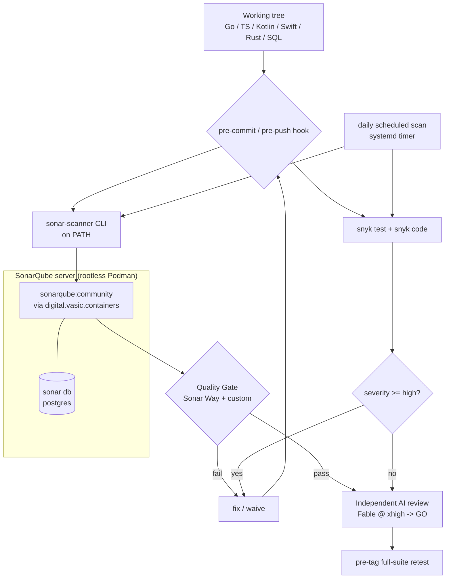

<!--
  Title           : Helix Thready — Static Analysis & Continuous Quality (SonarQube + Snyk)
  Classification  : PUBLIC
  Location        : docs/public/research/mvp/testing/static-analysis.md
  Status          : Draft — v0.1
  Revision        : 1 (2026-07-21)
  Author          : Helix Thready documentation swarm (testing)
  Related         : ./test-strategy.md, ./test-types.md, ../deployment/index.md
-->

# Helix Thready — Static Analysis & Continuous Quality (SonarQube + Snyk)

| Rev | Date | Author | Change |
|-----|------|--------|--------|
| 1 | 2026-07-21 | swarm (testing) | Initial draft — SonarQube (CLI + rootless server), Snyk, quality gates, cadence, AI review |

SonarQube + Snyk are the **two major columns of product quality and real-time checks**
`[RESEARCH: request §Testing]`. All technical documentation and code MUST pass comprehensive
SonarQube and Snyk checks plus independent AI review from every angle — Security, Stability,
Gaps, Danger zones, Weak spots, Performance, Memory management/leak prevention, and DDoS/attack
resistance `[RESEARCH: final §9.3]` `[CONSTITUTION §11.4.184]`.

## Table of contents

- [1. Quality-gate topology](#1-quality-gate-topology)
- [2. SonarQube — CLI + rootless-Podman server](#2-sonarqube--cli--rootless-podman-server)
- [3. Project configuration](#3-project-configuration)
- [4. Quality Gate definition](#4-quality-gate-definition)
- [5. Snyk](#5-snyk)
- [6. Cadence & automation](#6-cadence--automation)
- [7. Independent AI review](#7-independent-ai-review)
- [8. Gap-register items addressed](#8-gap-register-items-addressed)
- [9. Open items](#9-open-items)

## 1. Quality-gate topology



> Rendered PNG/SVG exported via Docs Chain (§11.4.65). Source:
> [`diagrams/static-analysis-quality-gate.mmd`](./diagrams/static-analysis-quality-gate.mmd).

**Explanation (for readers/models that cannot see the diagram).** The working tree (Go,
TypeScript, Kotlin, Swift, Rust and SQL) is scanned by the local `pre-commit`/`pre-push`
git-hook, which invokes two tools in parallel: the `sonar-scanner` CLI (on PATH per
`[CONSTITUTION §11.4.184]`) and Snyk (`snyk test` for dependencies + `snyk code` for SAST). The
scanner reports to a **SonarQube server run in rootless Podman** (the `sonarqube:community`
image plus its Postgres, stood up via `digital.vasic.containers`), which evaluates the change
against its **Quality Gate** (the built-in Sonar Way plus Thready custom conditions). Snyk
evaluates severity. If the Quality Gate fails or Snyk finds a high/critical issue, the change is
bounced to fix/waive and re-enters the hook. When both pass, the change proceeds to
**independent AI review** (Fable @ xhigh → GO) and then the pre-tag full-suite retest. A **daily
scheduled scan** (systemd timer) re-runs both tools independently of commits so newly disclosed
CVEs and rule updates surface even without a code change. There is no server-side CI — the
server is a local rootless container, and all orchestration is local hooks/timers
`[CONSTITUTION §11.4.156/161]`.

## 2. SonarQube — CLI + rootless-Podman server

`[CONSTITUTION §11.4.184/161]`. Both the CLI and the server are mandated; both come from the
Constitution's shared tooling (`constitution/scripts/sonarqube/`) so every project reusing the
Constitution inherits them.

- **CLI** — `sonar-scanner` installed on PATH (added in `.bashrc`/`.zshrc`) so Claude Code and
  other CLI agents/skills/MCPs can invoke it. `[RESEARCH: final §9.3]`
- **Server** — a local **rootless Podman** container (`sonarqube:community` + Postgres), stood
  up via `vasic-digital/containers` (`pkg/boot`/`compose`/`health`), never as a root daemon and
  never as server-side CI. The server holds history, the Quality Gate and issue triage state.

```bash
# Stand up the local server (rootless Podman, via containers submodule tooling)
bash constitution/scripts/sonarqube/up.sh          # boots sonarqube + db, waits for health
# Scan (CLI on PATH) — run by the git-hook and by the daily timer
sonar-scanner -Dproject.settings=sonar-project.properties
```

## 3. Project configuration

`sonar-project.properties` (illustrative — multi-language monorepo):

```properties
sonar.projectKey=helix_thready
sonar.host.url=http://localhost:9000
sonar.sources=services,clients,packages
sonar.tests=.
sonar.test.inclusions=**/*_test.go,**/*.spec.ts,**/*Test.kt,**/*Tests.swift
sonar.exclusions=**/vendor/**,**/node_modules/**,**/*.mmd,**/testdata/**
# Coverage feeds (line/branch is secondary to test-type coverage — test-strategy §3)
sonar.go.coverage.reportPaths=coverage/go-coverage.out
sonar.javascript.lcov.reportPaths=coverage/lcov.info
sonar.qualitygate.wait=true
```

Coverage reports are produced by `go test -coverprofile` and Karma/`nyc`; they feed Sonar for
regression tracking but do **not** replace the 100 % test-type coverage model
([test-strategy.md §3](./test-strategy.md#3-coverage-model-100--test-type-coverage)).

## 4. Quality Gate definition

The Thready Quality Gate (on top of Sonar Way) blocks a change when, on **new code**:

| Condition | Threshold |
|-----------|-----------|
| Security: new Blocker/Critical vulnerabilities | **0** |
| Security hotspots reviewed | **100 %** |
| New bugs Blocker/Critical | **0** |
| New code smells Blocker | **0** |
| Duplicated lines on new code | **< 3 %** |
| New-code line coverage (secondary signal) | **≥ 80 %** |

A failing gate returns the change to the author (pipeline in
[test-strategy.md §4](./test-strategy.md#4-tdd-reproduce-first)). Waivers require a documented
justification and appear as a tracked risk in the workable-item register `[RESEARCH: final §22.4]`.

## 5. Snyk

Snyk is the second quality column `[RESEARCH: request §Testing]` (the Constitution is silent on
Snyk; it is added as a project quality column per the original request).

```bash
snyk test                 # dependency vulnerabilities (Go modules, npm, Gradle, Cargo)
snyk code test            # SAST over first-party code
snyk monitor              # snapshot for continuous re-evaluation as new CVEs land
snyk container test  # scan the rootless Podman images before deploy
```

- **Gate.** No new **high/critical** dependency or code finding; the SSRF/secret classes must be
  clean (paired with `security/pkg/*` runtime tests, [test-types.md §5](./test-types.md#5-security-tests)).
- **Container scan.** Every image built for deployment is Snyk-scanned before it can be tagged.

## 6. Cadence & automation

`[RESEARCH: request §Testing]` — "regular continuous use is planned; discovered issues tackled
ASAP":

- **Per-commit / per-push** — SonarQube scan + `snyk test`/`snyk code` in the local git-hook;
  block on gate failure.
- **Daily** — a systemd timer runs `snyk test`/`snyk monitor` and a full `sonar-scanner` sweep,
  so newly disclosed CVEs and rule changes surface without a code change; findings auto-open a
  workable item.
- **Pre-tag** — a clean SonarQube Quality Gate + zero high/critical Snyk findings is a
  precondition of the pre-tag full-suite retest.
- **Docs** — all technical documentation passes SonarQube/Snyk-adjacent link/secret/lint checks
  and the independent AI review before publish `[RESEARCH: request §Testing]`.

## 7. Independent AI review

In addition to the tools, every change passes **independent AI review on Fable @ xhigh (Opus
xhigh fallback)**, iterating to **GO** `[CONSTITUTION §11.4.209/142/194/134]`. The mandated
angles are exactly the original request's list: Security, Stability, Gaps, Danger zones, Weak
spots, Performance, Memory management & leak prevention, and DDoS/attack resistance. Review runs
after the tool gates and before the pre-tag retest; it is a gate, not advisory.

## 8. Gap-register items addressed

- `[GAP: §7.1]` `security/pkg/scanner` integrates Snyk/SonarQube via adapters — wire them:
  this doc specifies the CLI + rootless server + gate that the scanner adapters drive.
- `[GAP: §12 CI-equivalent gating]` — SonarQube/Snyk run in local hooks + timers, never
  server-side CI — §1, §6.

## 9. Open items

- `[OPEN: sonarqube-edition]` — Community edition covers Go/TS/Kotlin/Python; confirm analyzer
  support for Swift/Rust or supplement with `swiftlint`/`clippy` feeding Sonar generic issues.
- `[OPEN: snyk-license]` — confirm the Snyk plan/seat for the org before wiring `snyk monitor`
  into the daily timer.

---

*Made with love ♥ by Helix Development.*
