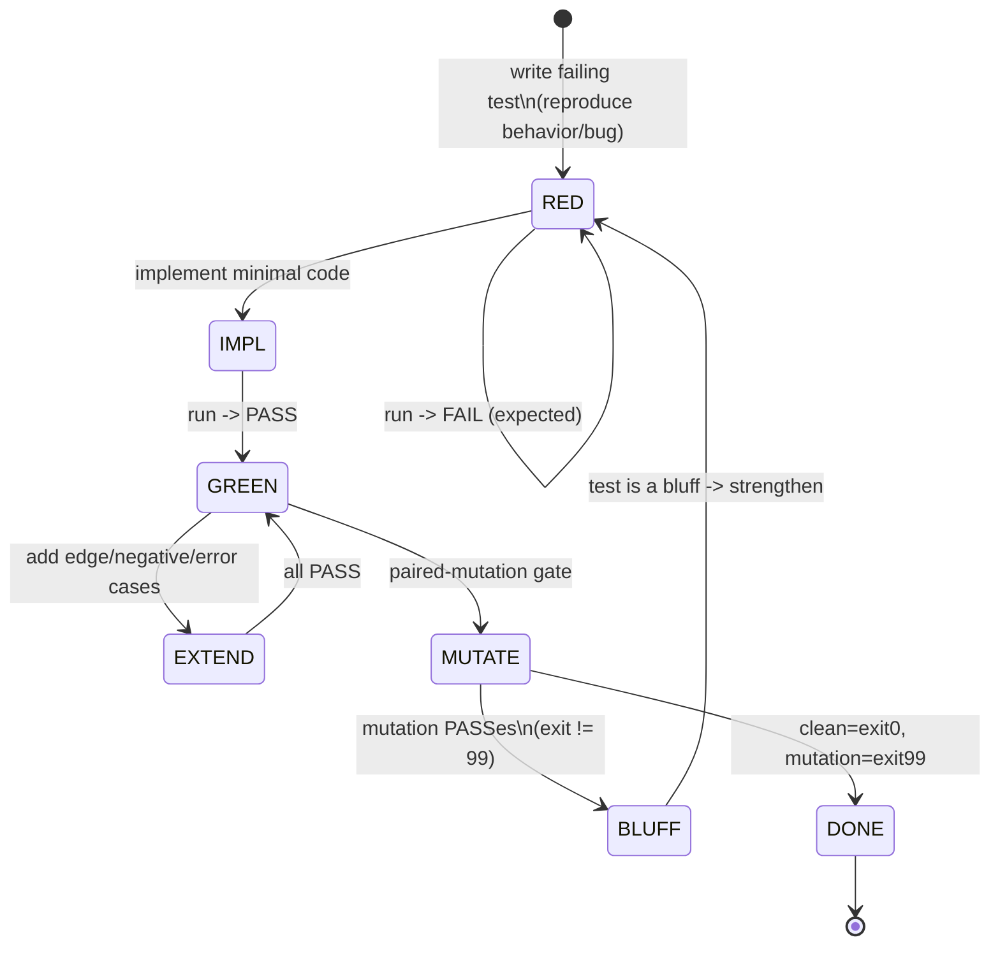

<!--
  Title           : Helix Thready — TDD Reproduce-First Skeletons
  Classification  : PUBLIC
  Location        : docs/public/research/mvp/testing/tdd-skeletons.md
  Status          : Draft — v0.1
  Revision        : 1 (2026-07-21)
  Author          : Helix Thready documentation swarm (testing)
  Related         : ./test-strategy.md, ./test-types.md, ./challenges-scenarios.md,
                    ./helixqa-banks.md, ../architecture/index.md, ../api/index.md,
                    ../database/index.md
-->

# Helix Thready — TDD Reproduce-First Skeletons

| Rev | Date | Author | Change |
|-----|------|--------|--------|
| 1 | 2026-07-21 | swarm (testing) | Initial draft — RED-first Go/TS/SQL skeletons per component + anti-bluff gates |

Reproduce-first: **a failing RED test is the first artifact of any change**
`[CONSTITUTION §11.4.43/146/115]` `[RESEARCH: request §Testing]`. This document gives concrete,
copy-p-ready RED skeletons for every major Thready component, plus the paired-mutation
anti-bluff gate. Skeletons are **illustrative** — import paths follow the decision matrix
(`digital.vasic.*` / `dev.helix.*`); where a module is a scaffold, the skeleton's job is to be
the gate that proves real behavior before Thready relies on it.

> **Convention.** Every skeleton is written to **FAIL first** against the not-yet-built (or
> stubbed) code, then pass once the real implementation lands. Test names encode the behavior:
> `Test<Unit>_<condition>_<expectation>`.

## Table of contents

- [1. The RED→GREEN loop](#1-the-redgreen-loop)
- [2. Herald ThreadReader (Go)](#2-herald-threadreader-go)
- [3. Idempotent single-claim (Go)](#3-idempotent-single-claim-go)
- [4. Skill dispatch engine (Go)](#4-skill-dispatch-engine-go)
- [5. Hashtag classification & indirect determination (Go)](#5-hashtag-classification--indirect-determination-go)
- [6. OCR adapter (Go)](#6-ocr-adapter-go)
- [7. Semantic search / embeddings (Go)](#7-semantic-search--embeddings-go)
- [8. Download Manager callback (Go)](#8-download-manager-callback-go)
- [9. Auth / RBAC three-tier (Go)](#9-auth--rbac-three-tier-go)
- [10. Migration up/down (SQL + Go)](#10-migration-updown-sql--go)
- [11. Angular Web portal (TypeScript)](#11-angular-web-portal-typescript)
- [12. Anti-bluff paired-mutation gates](#12-anti-bluff-paired-mutation-gates)
- [13. API and event contract tests](#13-api-and-event-contract-tests)
- [14. Gap-register items addressed](#14-gap-register-items-addressed)

## 1. The RED→GREEN loop



> Rendered PNG/SVG exported via Docs Chain (§11.4.65). Source:
> [`diagrams/tdd-red-green-loop.mmd`](./diagrams/tdd-red-green-loop.mmd).

**Explanation (for readers/models that cannot see the diagram).** The loop starts in **RED**:
you write a test that reproduces the desired behavior or the bug, and running it FAILS — that
failure is expected and required (a test that passes before any code exists proves nothing).
You then implement the **minimal** code to reach **GREEN**. From GREEN you **EXTEND** with edge,
negative and error cases, keeping everything green. Finally the **paired-mutation gate** runs:
the suite is executed once clean and once with a deliberately planted defect. If the mutated run
still PASSes (exit ≠ 99) the test is a **BLUFF** and you return to RED to strengthen it; only
when the clean run exits 0 and the mutated run exits 99 is the change **DONE**. This is the
`challenges` round-304 / CONST-035 contract applied to every scaffold-touching change.

## 2. Herald ThreadReader (Go)

Proves the thread reader assembles the **complete post = root + full organic reply chain**,
**excluding the system's own replies** `[RESEARCH: final §3.1/§3.2.1]`, and — critically — that
the real MTProto user client backfills channel/thread history (not the Bot-API stub that
*cannot* backfill) `[GAP: §5.1 Herald MTProto trap]`. `[IN-HOUSE: herald]`

```go
package threadreader_test

import (
	"context"
	"testing"

	"github.com/stretchr/testify/require"
	"github.com/vasic-digital/herald/pkg/threadreader" // promoted from qaherald (BUILD/EXTEND)
)

// RED: fails until the MTProto user client is promoted to a first-class channel and the
// ThreadReader assembles root + organic replies, excluding system replies.
func TestThreadReader_AssemblesRootPlusOrganicReplies_ExcludesSystemReplies(t *testing.T) {
	ctx := context.Background()
	// Real live fixture; URL injected via env (never committed) — see test-strategy §7.
	reader := threadreader.NewTelegram(threadreader.Config{
		Session:   testSessionFromEnv(t), // gotd/td user session
		ChannelID: testChannelFromEnv(t, "THREADY_TG_TEST_THREAD"),
	})

	thread, err := reader.ReadThread(ctx, rootMessageIDFromEnv(t))
	require.NoError(t, err)

	// Root present, replies are the organic human chain in order.
	require.NotEmpty(t, thread.Root.Text, "root post must be backfilled (not a Bot-API stub)")
	require.GreaterOrEqual(t, len(thread.Replies), 1, "organic reply chain must be assembled")
	require.True(t, thread.RepliesInOrder(), "replies preserve conversational order")

	// Anti-bluff: the system's OWN status replies must be excluded from processing input.
	for _, r := range thread.Replies {
		require.False(t, r.IsSystemAuthored(), "system replies must be excluded (§3.2.3)")
	}

	// Hashtags frequently arrive as a reply to a link-only root — the reader must surface them.
	require.Contains(t, thread.AllHashtags(), "#ToDownload",
		"tags added in replies must be visible on the assembled thread (§3.2.1)")
}
```

## 3. Idempotent single-claim (Go)

Proves **exactly-once processing** under a "new post" event storm via the Postgres row/advisory
lock in `digital.vasic.background` `[RESEARCH: final §3.3]`, the in-house analogue of an
exactly-once claim registry `[CONSTITUTION §11.4.176]`. `[IN-HOUSE: background]`

```go
package processing_test

import (
	"context"
	"sync"
	"sync/atomic"
	"testing"

	"github.com/stretchr/testify/require"
)

// RED: fails until claim uses a Postgres row lock / advisory lock so a post is claimed once.
func TestClaim_ConcurrentWorkers_ProcessPostExactlyOnce(t *testing.T) {
	ctx := context.Background()
	q := newRealQueue(t) // real Postgres (no mock beyond unit) — integration tier
	postID := seedPost(t, q)

	const workers = 32 // matches default worker pool (§18 Q4)
	var processed int64
	var wg sync.WaitGroup
	wg.Add(workers)
	for i := 0; i < workers; i++ {
		go func() {
			defer wg.Done()
			claim, ok, err := q.TryClaim(ctx, postID)
			require.NoError(t, err)
			if ok { // only ONE worker may win the claim
				atomic.AddInt64(&processed, 1)
				require.NoError(t, claim.Complete(ctx))
			}
		}()
	}
	wg.Wait()

	require.Equal(t, int64(1), atomic.LoadInt64(&processed),
		"a post must be processed exactly once under an event storm (§3.3)")
}
```

## 4. Skill dispatch engine (Go)

The Skill-Graph gives knowledge/ordering, **not** task execution — Thready builds the
**dispatch engine** on top `[GAP: §4.1 helix_skills no execution engine]`. This proves a
multi-hashtag post runs **every** matching Skill in the precedence order
`download > convert > analyze > research > reply` `[RESEARCH: final §3.3/§18 Q33]`.
`[IN-HOUSE: helix_skills]` `[BUILD-NEW: dispatch engine]`

```go
package dispatch_test

import (
	"context"
	"testing"

	"github.com/stretchr/testify/require"
)

// RED: fails until the dispatch engine (not just DAG resolution) runs ordered Skills.
func TestDispatch_MultiHashtagPost_RunsAllSkillsInPrecedenceOrder(t *testing.T) {
	ctx := context.Background()
	eng := newDispatchEngine(t) // real Skill-Graph + BackgroundTasks

	// #Research #Video #TODO #ToDownload → video download AND deep tech research (§3.2.2).
	post := postWithTags("#Research", "#Video", "#ToDownload")
	run, err := eng.Dispatch(ctx, post)
	require.NoError(t, err)

	got := run.ExecutedSkillOrder() // e.g. ["video.download","research.deep","status.reply"]
	require.Subset(t, got, []string{"video.download", "research.deep"},
		"additive categories: every matching Skill runs (§3.3)")
	require.Less(t, indexOf(got, "video.download"), indexOf(got, "research.deep"),
		"download-type Skills run before analysis/research Skills so research can consume media")
	require.Equal(t, "status.reply", got[len(got)-1],
		"a status reply to the original post is the terminal step (§3.2.3)")
}
```

## 5. Hashtag classification & indirect determination (Go)

Proves explicit tags are extracted **and** absent/insufficient tags are derived
`[RESEARCH: final §3.5/§18 Q32]`; unclassifiable content is never silently dropped.

```go
// RED: fails until indirect determination + never-drop fallback exist.
func TestClassify_IndirectDetermination(t *testing.T) {
	cases := []struct {
		name    string
		link    string
		wantTag []string
	}{
		{"torrent link", "magnet:?xt=urn:btih:abc", []string{"#Torrent", "#ToDownload"}},
		{"github repo", "https://github.com/x/y", []string{"#Research", "#Technology"}},
		{"youtube", "https://youtu.be/abc", []string{"#Video", "#ToDownload"}},
	}
	for _, c := range cases {
		t.Run(c.name, func(t *testing.T) {
			tags := Classify(postWithLink(c.link)) // no explicit hashtags present
			require.Subset(t, tags, c.wantTag, "indirect determination (§3.5)")
		})
	}
}

func TestClassify_Unclassifiable_QueuesForReviewNeverDrops(t *testing.T) {
	res := Classify(postPlainText("no tags, no links"))
	require.True(t, res.QueuedForManualReview, "never silently drop (§18 Q32)")
	require.True(t, res.StoredAndEmbedded, "generic ingest: store + embed + index")
}
```

## 6. OCR adapter (Go)

VisionEngine has **no OCR engine** `[GAP: §2.6]` — Thready adds a Tesseract/PaddleOCR adapter
behind the `OCRProvider` seam `[BUILD-NEW: OCR adapter]` `[RESEARCH: final §18 Q37]`. This RED
test is the anti-bluff gate: it must return **real recognized text + bounding boxes**, not an
empty `TextRegion`.

```go
package ocr_test

import (
	"context"
	"testing"

	"github.com/stretchr/testify/require"
)

// RED: fails while "text extraction" is a TextRegion type with no recognizer behind it.
func TestOCR_KnownFixtureImage_ReturnsRealTextAndBoxes(t *testing.T) {
	ctx := context.Background()
	ocr := newTesseractAdapter(t) // offline, deterministic

	// Fixture PNG contains the exact string "HELIX THREADY 2026".
	res, err := ocr.Recognize(ctx, fixtureImage(t, "comic_panel_en.png"))
	require.NoError(t, err)

	require.Contains(t, res.FullText, "HELIX THREADY 2026",
		"OCR must return real recognized text (§2.6 anti-bluff)")
	require.NotEmpty(t, res.Words, "per-word bounding boxes are required")
	for _, w := range res.Words {
		require.NotZero(t, w.BBox.W*w.BBox.H, "each word has a non-degenerate bounding box")
	}
}

// Hybrid: Tesseract first pass → LLM-vision second pass over low-confidence regions (§18 Q37).
func TestOCR_HybridEscalation_LowConfidenceGoesToVision(t *testing.T) {
	// ... asserts regions below a confidence threshold are re-read by LLM-vision.
}
```

## 7. Semantic search / embeddings (Go)

HelixLLM's default local embedder is a non-semantic `HashEmbedder` stub `[GAP: §2.1]`. The gate:
prove vectors are **semantic** (with `HELIX_EMBEDDING_PROVIDER=llama`), and that
`/v1/search` meets the **< 500 ms** SLO `[RESEARCH: final §19.1/§18 Q14]`.
`[IN-HOUSE: embeddings, vectordb, rag]`

```go
package semantic_test

import (
	"context"
	"testing"
	"time"

	"github.com/stretchr/testify/require"
)

// RED: fails if the HashEmbedder stub is active (pseudo-vectors have no semantic locality).
func TestEmbeddings_SemanticNotHash_NearDuplicatesRankClose(t *testing.T) {
	ctx := context.Background()
	svc := newSemanticService(t) // must be HELIX_EMBEDDING_PROVIDER=llama (fail loudly if hash)

	require.NotEqual(t, "hash", svc.ActiveProvider(),
		"the non-semantic HashEmbedder must not back a search workload (§2.1)")

	a := svc.Embed(ctx, "how to configure the download manager retry backoff")
	b := svc.Embed(ctx, "download manager exponential backoff settings") // paraphrase
	c := svc.Embed(ctx, "the price of tea in a distant city")            // unrelated

	require.Greater(t, cosine(a, b), cosine(a, c),
		"a real embedder ranks paraphrases closer than unrelated text (anti-HashEmbedder)")
}

func TestSearch_P95_Under500ms(t *testing.T) {
	ctx := context.Background()
	svc := newSemanticService(t)
	seedCorpus(t, svc, 100_000) // Large-scale-representative

	lat := measureP95(func() { _, _ = svc.Search(ctx, "backoff config", 10) }, 200)
	require.Less(t, lat, 500*time.Millisecond, "semantic search SLO < 500 ms (§18 Q14)")
}
```

## 8. Download Manager callback (Go)

`BUILD-NEW` generic multi-protocol Download Manager with queue/resume/segmentation/progress and
a **standardized completion callback** `[GAP: §6.3/§6.6]`. Proves resumable transfer and that
the callback actually fires (MeTube is poll-only today `[GAP: §6.5]`).

```go
// RED: fails until the Download Manager exists with a standardized callback.
func TestDownload_ResumableWithStandardizedCallback(t *testing.T) {
	ctx := context.Background()
	dm := newDownloadManager(t) // reuses filesystem for FTP/SMB/NFS/WebDav; adds HTTP(S)
	sink := newCallbackSink(t)  // receives {job_id,state,progress,result_asset_ref,error}

	job := dm.Enqueue(ctx, DownloadJob{URL: bigTestFileURL(t), CallbackURL: sink.URL()})

	// Kill mid-transfer, then resume — segmented/resumable transfer must not restart from 0.
	dm.KillWorker(job.ID)
	require.NoError(t, dm.Resume(ctx, job.ID))

	cb := sink.WaitForCompletion(t, job.ID)
	require.Equal(t, "completed", cb.State, "outbound completion callback must fire (§6.5/§6.6)")
	require.NotEmpty(t, cb.ResultAssetRef, "callback carries the asset ref for the Asset Service")
	require.True(t, dm.Metrics(job.ID).Resumed, "transfer resumed, not restarted (§6.3)")
}
```

## 9. Auth / RBAC three-tier (Go)

Proves the three-tier RBAC (root / account-admin / user) with negative tests, and asymmetric
JWT signing for multi-service verification `[GAP: §7.2 HMAC default]` `[RESEARCH: final §18
Q9/Q10]`. `[IN-HOUSE: auth, security/pkg/policy]`

```go
func TestRBAC_UserCannotPerformAdminActions(t *testing.T) {
	svc := newUserService(t) // auth + security/pkg/policy + Catalogizer RBAC pattern
	userTok := svc.Login(t, "user@acct")

	err := svc.Do(userTok, Action{Kind: "account.settings.update"})
	require.ErrorIs(t, err, ErrForbidden, "a user must not perform account-admin actions (§18 Q10)")

	err = svc.Do(userTok, Action{Kind: "system.account.create"})
	require.ErrorIs(t, err, ErrForbidden, "only root creates accounts")
}

func TestJWT_AsymmetricSigning_VerifiableAcrossServices(t *testing.T) {
	tok := issueAccessToken(t) // RS256/EdDSA, not HMAC-SHA256 (§7.2 improvement)
	require.NoError(t, verifyWithPublicJWKS(t, tok),
		"multi-service verification needs asymmetric keys + JWKS rotation")
}

func TestSession_Expiry(t *testing.T) {
	// access 15m / refresh 7d / idle 30m (§18 Q9) — clock-advanced assertions.
}
```

## 10. Migration up/down (SQL + Go)

Expand-contract, versioned, **tested rollback** via `database/pkg/migration.Runner`
`[RESEARCH: final §18 Q30]`. Illustrative forward migration for the posts partitioning:

```sql
-- migrations/000012_posts_time_partition.up.sql  (expand-contract, zero-downtime)
CREATE TABLE IF NOT EXISTS posts_p (
    id            BIGINT       NOT NULL,
    thread_id     BIGINT       NOT NULL,
    channel_id    BIGINT       NOT NULL,
    received_at   TIMESTAMPTZ  NOT NULL,
    processed     BOOLEAN      NOT NULL DEFAULT FALSE,
    PRIMARY KEY (id, received_at)
) PARTITION BY RANGE (received_at);           -- Large-scale: time-partitioned (§19.8)

CREATE TABLE IF NOT EXISTS posts_p_2026_07
    PARTITION OF posts_p FOR VALUES FROM ('2026-07-01') TO ('2026-08-01');
```

```sql
-- migrations/000012_posts_time_partition.down.sql  (tested rollback)
DROP TABLE IF EXISTS posts_p_2026_07;
DROP TABLE IF EXISTS posts_p;
```

```go
// RED: fails until up/down both apply cleanly and are round-trip safe.
func TestMigration_UpDown_RoundTrips(t *testing.T) {
	db := realPostgres(t)
	r := migration.NewRunner(db)
	require.NoError(t, r.Apply(ctx))                      // up to latest
	require.NoError(t, r.Rollback(ctx, 1))                // one step down
	require.NoError(t, r.Apply(ctx))                      // and back up — idempotent
	require.Equal(t, wantSchemaHash, schemaHash(t, db), "expand-contract preserves schema hash")
}
```

## 11. Angular Web portal (TypeScript)

Jasmine/Karma unit + Cypress e2e with a11y `[RESEARCH: final §9.4]`. `[IN-HOUSE: design_system]`

```typescript
// search.component.spec.ts — Jasmine/Karma (unit)
// RED: fails until the search component renders results and reports <500ms latency.
describe('SearchComponent', () => {
  it('renders semantic results and surfaces the latency badge', fakeAsync(() => {
    const fixture = TestBed.createComponent(SearchComponent);
    const svc = TestBed.inject(SearchService);
    spyOn(svc, 'search').and.returnValue(of({ items: [{ id: '1', title: 'backoff' }], ms: 120 }));

    fixture.componentInstance.query.set('backoff');
    fixture.componentInstance.run();
    tick();
    fixture.detectChanges();

    const rows = fixture.nativeElement.querySelectorAll('[data-test=result-row]');
    expect(rows.length).toBe(1);
    expect(fixture.nativeElement.querySelector('[data-test=latency]').textContent).toContain('120');
  }));
});
```

```typescript
// e2e/search.cy.ts — Cypress + cypress-axe (e2e, real backend on dev.)
// RED: fails until the whole journey works against a running stack.
describe('search journey', () => {
  it('adds a channel, waits for processing, finds the asset, passes a11y', () => {
    cy.login('account-admin');
    cy.addChannel(Cypress.env('THREADY_TG_TEST_THREAD'));
    cy.contains('[data-test=proc-status]', 'processed', { timeout: 120_000 });
    cy.search('backoff config');
    cy.get('[data-test=result-row]').should('have.length.greaterThan', 0);
    cy.injectAxe();
    cy.checkA11y();                                    // zero critical WCAG violations (UX)
  });
});
```

## 12. Anti-bluff paired-mutation gates

`[GAP: §12 anti-bluff sweep]`. Every SCAFFOLD/DESIGN-ONLY/BUILD-NEW dependency gets a gate that
proves a green test reflects real behavior. The gate follows the `challenges` round-304 /
CONST-035 contract: **clean run MUST exit 0; a planted mutation MUST exit 99**; any other
outcome is a release blocker `[CONSTITUTION Art. XI §11.9]`.

Go harness pattern (the mutation deliberately breaks the real behavior and asserts the suite
catches it):

```go
// paired_mutation_test.go
// Invoked twice by the gate script:
//   go test -run TestPairedMutation                     # clean  -> exit 0
//   THREADY_MUTATE=hash go test -run TestPairedMutation  # planted -> must FAIL -> gate maps to 99
func TestPairedMutation_Embeddings(t *testing.T) {
	if os.Getenv("THREADY_MUTATE") == "hash" {
		// Plant the exact scaffold trap: force the non-semantic HashEmbedder.
		t.Setenv("HELIX_EMBEDDING_PROVIDER", "hash")
	}
	svc := newSemanticService(t)
	a, b, c := svc.Embed(ctx, "download retry backoff"),
		svc.Embed(ctx, "backoff for downloads"),
		svc.Embed(ctx, "unrelated tea prices")
	// With the mutation planted this assertion MUST fail — proving the test is not a bluff.
	require.Greater(t, cosine(a, b), cosine(a, c))
}
```

Gate driver (git-hook / pre-tag), mirroring `challenges_describe_challenge.sh`:

```bash
#!/usr/bin/env bash
# thready_anti_bluff.sh  — clean MUST be exit 0; mutation MUST be exit 99.
set -uo pipefail
go test ./... -run TestPairedMutation ; clean=$?
THREADY_MUTATE=hash go test ./... -run TestPairedMutation ; mutated=$?
if [[ $clean -eq 0 && $mutated -ne 0 ]]; then
  exit 0                     # good: clean passed, mutation was caught
else
  echo "ANTI-BLUFF FAIL: clean=$clean mutated=$mutated (a green stub is a bluff)"
  exit 99                    # release blocker
fi
```

Gates required (one per trap, from [test-types.md §16](./test-types.md#16-anti-bluff-obligations-per-type)):
embeddings (HashEmbedder), OCR (empty `TextRegion`), Security-KMP (in-memory secret store),
Herald MTProto/Max (Bot-API-can't-backfill), MeTube (poll-only), Download Manager (no
resume/callback), Skill dispatch (DAG-order-only), VectorDB Qdrant (unverified parity).

## 13. API and event contract tests

Integration tests assert not only *behavior* but the exact **wire contract** the clients and the
in-house consumers depend on. Two contracts are pinned here as RED-first skeletons: the REST
**OpenAPI 3.1** response shapes and the **WebSocket/SSE** processing-event envelope. These close
two gap-register items that the behavior skeletons above do not: the `/v1/embeddings` OpenAI
response shape and its configurable dimension `[GAP: §2.1 contract test / RAG dim hardcode]`, and
per-adapter provider contracts `[GAP: §2.3 LLMProvider per-adapter contract tests]`.
`[IN-HOUSE: embeddings, llmprovider, eventbus]` `[RESEARCH: final §19.11 SDK/OpenAPI 3.1]`

### 13.1 `/v1/embeddings` OpenAI-shape contract `[GAP: §2.1]`

The gap register flags that HelixLLM's `/v1/embeddings` must return the OpenAI
`{data:[{embedding,index}]}` envelope — consumers (Lumen-style search) sort by `index`, so an
out-of-order or reshaped payload silently corrupts results — and that the RAG path must stop
hard-coding 768 dims and instead validate the returned vector length against the configured
model. The contract fragment under test (owned by the [API area](../api/openapi.yaml), quoted
here so the test is self-describing):

```yaml
# OpenAPI 3.1 — fragment the contract test validates against (source of truth: ../api/openapi.yaml)
openapi: 3.1.0
info: { title: Helix Thready Semantic API, version: "1.0.0" }
paths:
  /v1/embeddings:
    post:
      operationId: createEmbeddings
      requestBody:
        required: true
        content:
          application/json:
            schema:
              type: object
              required: [input, model]
              properties:
                input: { type: array, items: { type: string }, minItems: 1 }
                model: { type: string, examples: ["voyage-code-3"] }
      responses:
        "200":
          description: OpenAI-compatible embeddings envelope
          content:
            application/json:
              schema:
                type: object
                required: [object, data, model]
                properties:
                  object: { const: list }
                  model:  { type: string }
                  data:
                    type: array
                    items:
                      type: object
                      required: [object, index, embedding]
                      properties:
                        object:    { const: embedding }
                        index:     { type: integer, minimum: 0 }
                        embedding: { type: array, items: { type: number }, minItems: 1 }
```

```go
package apicontract_test

import (
	"context"
	"sort"
	"testing"

	"github.com/stretchr/testify/require"
)

// RED: fails until /v1/embeddings returns the OpenAI {data:[{embedding,index}]} shape,
// preserves the request→index mapping, and reports a dimension that matches the configured model.
func TestEmbeddingsContract_OpenAIShape_IndexOrderedAndDimensionValidated(t *testing.T) {
	ctx := context.Background()
	c := newSemanticAPIClient(t) // real HelixLLM /v1/embeddings (no fakes beyond unit)

	inputs := []string{"alpha text", "bravo text", "charlie text"}
	resp, err := c.CreateEmbeddings(ctx, EmbeddingsRequest{Model: cfgModel(t), Input: inputs})
	require.NoError(t, err)

	// Envelope shape (validated against the OpenAPI 3.1 schema above).
	require.Equal(t, "list", resp.Object)
	require.Len(t, resp.Data, len(inputs), "one embedding object per input")

	// Consumers sort by index — the mapping request[i] -> data.index==i MUST hold.
	sort.Slice(resp.Data, func(a, b int) bool { return resp.Data[a].Index < resp.Data[b].Index })
	for i, d := range resp.Data {
		require.Equal(t, i, d.Index, "data[i].index preserves request order (§2.1 Lumen sort)")
		require.Equal(t, "embedding", d.Object)
	}

	// Dimension is config-driven, not the hard-coded 768 — assert it matches the model card.
	wantDim := cfgModelDimension(t) // discovered from the model, not a literal
	require.Equal(t, wantDim, len(resp.Data[0].Embedding),
		"embedding dimension must match the configured model, not a 768 hardcode (§2.1)")
	require.NotEqual(t, 0, wantDim)
}
```

### 13.2 Per-adapter LLMProvider contract `[GAP: §2.3]`

`digital.vasic.llmprovider` ships 40+ adapters that the gap register flags as not individually
audited. Every adapter Thready actually relies on gets a table-driven contract test proving it
honors the shared provider interface (retry, health, and the embeddings/completion response
envelope) against a real or record-replay endpoint:

```go
// RED: fails until each relied-on adapter satisfies the shared provider contract.
func TestLLMProviderContract_ReliedAdaptersHonorInterface(t *testing.T) {
	for _, name := range reliedAdapters(t) { // e.g. "helixllm", "voyage", "openai-compat"
		t.Run(name, func(t *testing.T) {
			p := newProvider(t, name)
			require.NoError(t, p.Health(context.Background()), "adapter reports health")
			out, err := p.Embed(context.Background(), []string{"contract probe"})
			require.NoError(t, err)
			require.Len(t, out, 1)
			require.NotEmpty(t, out[0], "adapter returns a non-empty vector (not a stub)")
		})
	}
}
```

### 13.3 WebSocket/SSE processing-event contract

The live processing events (async progress, `[RESEARCH: final §19.5]`) have a fixed envelope
the Web/CLI/TUI clients subscribe to. The contract test asserts the event schema, sticky
last-value delivery, and durable replay on reconnect — the same properties the chaos suite
proves under fault ([performance-and-chaos.md §7](./performance-and-chaos.md#7-chaos--dr-validation)).

```yaml
# WS/SSE event contract fragment (source of truth: ../api/event-bus-contract.md)
components:
  schemas:
    ProcessingEvent:
      type: object
      required: [event, post_id, state, ts]
      properties:
        event:   { const: post.processing }
        post_id: { type: integer }
        state:   { type: string, enum: [received, claimed, downloading, analyzing, replied, failed] }
        pct:     { type: integer, minimum: 0, maximum: 100 }
        ts:      { type: string, format: date-time }
```

```go
// RED: fails until the WS hub emits the fixed envelope and replays missed events on reconnect.
func TestEvents_ProcessingEnvelope_StickyAndDurableReplay(t *testing.T) {
	ctx := context.Background()
	hub := newRealEventHub(t) // real NATS JetStream-backed hub (no fakes beyond unit)

	sub := hub.Subscribe(ctx, "post.processing")
	postID := triggerProcessing(t, hub)

	ev := sub.Next(t)
	require.Equal(t, "post.processing", ev.Event)
	require.Equal(t, postID, ev.PostID)
	require.Contains(t, []string{"received", "claimed", "downloading", "analyzing", "replied"}, ev.State)

	// Sticky: a late subscriber immediately receives the last-value state.
	late := hub.Subscribe(ctx, "post.processing")
	require.Equal(t, ev.State, late.LastValue(t).State, "sticky last-value delivery (§19.5)")

	// Durable replay: drop + reconnect must not lose events (chaos proves this under fault).
	sub.Drop()
	sub2 := hub.Resubscribe(ctx, sub.Cursor())
	require.NotEmpty(t, sub2.DrainUntilTerminal(t, postID), "durable consumer replays missed events")
}
```

## 14. Gap-register items addressed

- `[GAP: §5.1]` Herald MTProto/Max — §2 skeleton + §12 gate.
- `[GAP: §4.1]` Skill dispatch engine — §4 skeleton.
- `[GAP: §2.6]` OCR adapter — §6 skeleton + §12 gate.
- `[GAP: §2.1]` HashEmbedder (semantic-not-hash) — §7 skeleton + §12 gate; `/v1/embeddings`
  OpenAI-shape + config-driven dimension contract — §13.1.
- `[GAP: §2.3]` LLMProvider per-adapter contract tests — §13.2.
- `[GAP: §6.3/§6.5/§6.6]` Download Manager + callbacks — §8 skeleton + §12 gate.
- `[GAP: §7.2]` asymmetric JWT / RBAC — §9 skeleton.
- `[GAP: §3.1]` Qdrant parity — §12 gate.
- `[GAP: §7.3]` Security-KMP native storage — §12 gate (device-tier integration).
- `[GAP: §12 anti-bluff sweep]` — §12 whole section.

---

*Made with love ♥ by Helix Development.*
