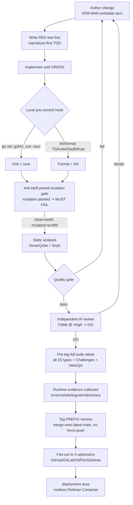

<!--
  Title           : Helix Thready — Test Strategy (governing document)
  Classification  : PUBLIC
  Location        : docs/public/research/mvp/testing/test-strategy.md
  Status          : Draft — v0.3
  Revision        : 3 (2026-07-22)
  Author          : Helix Thready documentation swarm (testing)
  Related         : ./index.md, ./test-types.md, ./tdd-skeletons.md, ./static-analysis.md,
                    ./performance-and-chaos.md, ./acceptance-gates.md, ../architecture/index.md,
                    ../api/index.md, ../database/index.md, ../CONVENTIONS.md
-->

# Helix Thready — Test Strategy (governing document)

| Rev | Date | Author | Change |
|-----|------|--------|--------|
| 1 | 2026-07-21 | swarm (testing) | Initial draft — TDD covenant, coverage model, no-fakes rule, gating, fixtures, framework matrix |
| 2 | 2026-07-22 | swarm (testing) | Pass 3 — linked per-type acceptance-gates ladder; closed ios-xctest + canonical-helixqa-repo opens (source-verified) |
| 3 | 2026-07-22 | swarm (testing) | Pass 4 (critic) — added §12 test-determinism & flaky-test policy; added real coverage-matrix DDL + `coverage_holes` view to §10 |

## Table of contents

- [1. Purpose & scope](#1-purpose--scope)
- [2. Testing philosophy — the covenant](#2-testing-philosophy--the-covenant)
- [3. Coverage model: 100 % test-type coverage](#3-coverage-model-100--test-type-coverage)
- [4. TDD reproduce-first](#4-tdd-reproduce-first)
- [5. No-fakes-beyond-unit & the anti-bluff rule](#5-no-fakes-beyond-unit--the-anti-bluff-rule)
- [6. Per-language framework matrix](#6-per-language-framework-matrix)
- [7. Test environments & fixtures](#7-test-environments--fixtures)
- [8. CI-equivalent gating (no server-side CI)](#8-ci-equivalent-gating-no-server-side-ci)
- [9. Independent AI review integration](#9-independent-ai-review-integration)
- [10. Feature-map → coverage tracking (DocProcessor)](#10-feature-map--coverage-tracking-docprocessor)
- [11. Priority & sequencing](#11-priority--sequencing)
- [12. Test determinism & flaky-test policy](#12-test-determinism--flaky-test-policy)
- [13. Gap-register items addressed](#13-gap-register-items-addressed)
- [14. Open items](#14-open-items)

## 1. Purpose & scope

This document governs **all** testing for Helix Thready. It is the parent of every other
document in this area. It fixes the non-negotiable rules `[CONSTITUTION §11.4.27/43/146/115]`
and the operator/SLO decisions from the final research request (`§9`, `§0.1`, `§18 Q14/Q23/Q24`),
and it defines the process that turns each into an executable, evidence-backed test.

Scope covers every Thready surface: the Go services (Herald thread readers, Processing Engine
/ Skill-dispatch, Download Manager, Asset Service, User Service, Event Bus service, semantic-
search service), the data layer (PostgreSQL + pgvector, migrations), the REST/HTTP-3 API and
WebSocket/SSE event contract, and every client (Angular Web, Cobra CLI, Bubble Tea TUI, Tauri
Desktop, native Mobile). `[RESEARCH: final §2, §10]`

## 2. Testing philosophy — the covenant

Three rules override everything else:

1. **The bar for shipping is not "tests pass" but "users can use the feature."** Every PASS
   MUST carry positive **runtime evidence** captured during execution. A green summary line
   without evidence is a critical defect of equal severity to a missing feature. This is the
   HelixQA Operative Rule `[CONSTITUTION §11.4]` and the operator's 2026-05-19 anti-bluff
   mandate (verbatim in the `challenges`/`helix_qa` repos): *"execution of tests and Challenges
   MUST guarantee the quality, the completion and full usability by end users of the product."*
2. **Reproduce-first TDD leads every change** — a failing **RED** test is the first artifact of
   any feature, fix or improvement `[CONSTITUTION §11.4.43/146/115]` (§4 below).
3. **Mocks/stubs/TODO are permitted only in unit tests.** Every other of the 15 mandated types
   exercises the **real system** `[CONSTITUTION §11.4.27]` (§5 below).

## 3. Coverage model: 100 % test-type coverage

The coverage target is **100 % test-type coverage** — every `feature × platform` cell has
**every applicable test type** — *not* a line-percentage `[CONSTITUTION §11.4.27]`,
`[RESEARCH: final §9.1]`. Line/branch coverage is still measured (SonarQube, `go test -cover`)
and tracked for regression, but it is a secondary signal; the primary gate is the test-type
matrix.

The coverage unit is the **feature-map cell**. Features come from the DocProcessor feature-map
(built from the docs); platforms are the §10.1 application matrix. A cell is GREEN only when
each applicable type for that cell exists, runs, and (for non-unit types) produces evidence.

```
coverage_cell(feature f, platform p) = GREEN
  iff  for every test_type t applicable to (f, p):
         exists(t) AND runs_green(t) AND (t == unit OR has_runtime_evidence(t))
```

The full applicability rules (which types apply to which cell) are in
[test-types.md §17](./test-types.md#17-applicability-matrix). The mechanical wiring of the
feature-map to this matrix is §10.

## 4. TDD reproduce-first

Every implementation of functionality, change, improvement or fix **starts with a faulty
test** `[RESEARCH: request §Testing]`:



> Rendered PNG/SVG exported via Docs Chain (§11.4.65). Source:
> [`diagrams/test-gating-pipeline.mmd`](./diagrams/test-gating-pipeline.mmd).

**Explanation (for readers/models that cannot see the diagram).** Work begins from an ATM-NNN
workable item. The first artifact is a **RED** test that reproduces the missing behavior or the
bug; the author then implements only enough to turn it **GREEN**. On commit, a local pre-commit
git-hook runs the fast gates — `go vet`, `gofmt`, race-enabled unit tests on the Go side, and
format/lint on the TypeScript, Kotlin, Swift and Rust sides.

Both feed the **anti-bluff paired-mutation gate**: the suite is run once clean (must exit 0) and
once with a deliberately planted mutation (must exit 99); a suite that passes its own mutation is
itself a bluff and blocks. Passing that, static analysis (SonarQube + Snyk) runs and the
**quality gate** either bounces the change back to the author or forwards it to **independent AI
review** (Fable at xhigh, Opus xhigh fallback), which iterates until it emits **GO**.

Only then does the **pre-tag full-suite retest** run — all 15 test types plus the Challenges and
HelixQA banks — collecting runtime evidence (screenshots, logcat, video, stack traces). A green,
evidence-backed suite tags a project-prefixed release `PREFIX-version`, merged onto the latest
main with no force-push, then fanned out to all four upstreams, from where the deployment area
picks it up for rootless Podman Compose rollout. There is **no server-side CI** anywhere in this
chain (§8).

Concrete RED-first skeletons per component are in [tdd-skeletons.md](./tdd-skeletons.md).

## 5. No-fakes-beyond-unit & the anti-bluff rule

- **Unit tests** may use `go-sqlmock`, `miniredis`, hand-rolled fakes, table-driven stubs, and
  may carry `TODO` markers for not-yet-covered branches.
- **Every other type** (integration, e2e, full-automation, security, DDoS, scaling, chaos,
  stress, performance, benchmarking, UI, UX, Challenges, HelixQA) runs against the **real
  system**: real Postgres + pgvector, real NATS JetStream, real MinIO, real HelixLLM
  `/v1/embeddings`, real Herald against the live [test threads](#7-test-environments--fixtures).
- **Anti-bluff paired-mutation gate** `[GAP: §12 anti-bluff sweep]` — for every module Thready
  depends on that is `SCAFFOLD`/`DESIGN-ONLY`/`BUILD-NEW`, a green test MUST prove *real*
  behavior, not a stub. The gate is the `challenges` round-304 pattern: a `--anti-bluff-mutate`
  run plants a deliberate defect and asserts the suite FAILS with **exit 99**; a clean run MUST
  exit 0. Any other outcome is a release blocker `[CONSTITUTION CONST-035 / Art. XI §11.9]`.
  The specific behaviors each gate must prove (real embeddings not `HashEmbedder`, real OCR
  text not an empty `TextRegion`, native Keychain/KeyStore not in-memory, MTProto thread
  backfill not a Bot-API stub, MeTube push webhook not poll-only, real Skill dispatch not just
  DAG ordering, Qdrant parity with pgvector) are enumerated with skeletons in
  [tdd-skeletons.md §12](./tdd-skeletons.md#12-anti-bluff-paired-mutation-gates).

## 6. Per-language framework matrix

`[RESEARCH: final §9.4]` `[DEFAULT — adjustable]`. Frameworks are chosen to match what the
owned modules already use, so tests are portable across the org.

| Language / surface | Unit | Integration / E2E | Mutation / anti-bluff | Notes |
|--------------------|------|-------------------|-----------------------|-------|
| **Go** (services) | stdlib `testing` + `testify`; `go test -race` | `testcontainers`-style real deps; `httptest` for handlers, real Postgres/NATS/MinIO for integration | **`go-mutesting`**; paired-mutation gates | `go-sqlmock`/`miniredis` for unit isolation only |
| **TypeScript / Angular** | **Jasmine + Karma** (unit + coverage) | **Cypress** (e2e, `cypress-axe` a11y) / Playwright | Stryker (optional) | Visual regression via Panoptic / VisualRegression / ScreenDiff `[§11.4.162]` |
| **Kotlin / Android** | JUnit; Compose UI tests | instrumented `androidTest`; HelixQA ADB | — | crash/ANR via HelixQA `detector/android.go` |
| **KMP** (shared logic) | **Kotest** / kotlin-test | shared-module contract tests | — | `Security-KMP`/`Database-KMP` are scaffolds → anti-bluff gate first |
| **Swift / iOS** | **XCTest** | XCUITest; HelixQA (Appium+XCUITest) | — | confirmed `[RESEARCH: final §9.4]`; HelixQA iOS via `nexus-mobile-ios` bank |
| **Rust** (Tauri core) | **`cargo test`** | Tauri WebDriver via `challenges` DesktopAdapter | — | |
| **Flutter** (alt family) | **`flutter_test`** | `integration_test` | — | only if HarmonyOS/Aurora deprioritized |

**Cross-cutting test-bank engines (owned):** `digital.vasic.challenges` (scenario engine —
register/run/assert/report; see [challenges-scenarios.md](./challenges-scenarios.md)),
**HelixQA** (`HelixDevelopment/helix_qa` — YAML banks with mandatory runtime evidence; see
[helixqa-banks.md](./helixqa-banks.md)), and **DocProcessor** (feature-map → coverage, §10).

## 7. Test environments & fixtures

**Environments** — three fully separated container stacks on one Hetzner host behind subdomains
(`dev.` / `sta.` / `thready.`), rootless Podman Compose, dynamic ports, per-subdomain Let's
Encrypt `[RESEARCH: final §18 Q8]`. Tests run against:

| Tier | Target | Used for |
|------|--------|----------|
| Local | ephemeral Podman deps (Postgres+pgvector, NATS, MinIO, HelixLLM) | unit, integration, benchmarking, anti-bluff gates |
| `dev.` | full stack, mutable | e2e, full-automation, chaos, UI/UX, HelixQA |
| `sta.` | production-like, immutable data | scaling, stress, DDoS, performance-SLO, DR drill |
| `thready.` | production | smoke + synthetic monitoring only (non-destructive) |

**Live fixtures (test threads)** `[RESEARCH: final §18 Q6/Appendix A]` — the operator-provided
invite links are live fixtures whose content type is auto-recognized. They are the canonical
integration/e2e inputs for the Herald thread readers and the Processing Engine. The concrete
invite URLs are **credentials/PII and live only in the private research doc and the gitignored
`.env`** — they are never committed to public docs or logs `[CONSTITUTION §11.4.10]`. Public
test code references them by env var (`THREADY_TG_TEST_THREAD`, `THREADY_MAX_TEST_THREAD_*`).

**Sensitive data in tests** — secret/credential fixtures use `security/pkg/pii` redaction; the
"encrypted-yet-semantically-searchable" path is tested over a redacted/tokenized representation
so no raw secret is embedded or logged `[RESEARCH: final §3.6]`.

## 8. CI-equivalent gating (no server-side CI)

`[CONSTITUTION §11.4.156/75/40]` `[GAP: §12 CI-equivalent gating]`. Server-side CI (GitHub
Actions / GitLab CI / Jenkins) is **forbidden**. Enforcement is entirely local:

1. **Local git-hooks** (`pre-commit`, `pre-push`) — fast gates: `gofmt`/`go vet`, race unit
   tests, TS/Kotlin/Swift/Rust format+lint, secret-leak scan, and the anti-bluff paired-mutation
   gate for touched scaffold modules.
2. **Pre-tag full-suite retest** (`§11.4.40`) — before any release tag, the **entire** 15-type
   suite plus Challenges + HelixQA banks run GREEN with evidence; a red or evidence-less suite
   blocks the tag.
3. **All-upstreams push** (`§2.1`) — tags fan out to GitHub/GitLab/GitFlic/GitVerse; merge onto
   latest main, **no force-push** (`§11.4.113`).

The visual-regression family (Panoptic / VisualRegression / ScreenDiff) currently has **no CI**
`[GAP: §9.3]`; Thready wires it into the same local git-hook gate so it runs pre-commit for
touched UI, closing that gap without introducing server CI.

The exact gate that runs at each of these local tiers — one machine-checkable gate per mandated
test type, with a stable gate ID, precondition, script-decidable pass condition, required
evidence, blocking severity and the uniform exit-code protocol (0 pass / 1 iterate / 77 skip /
99 anti-bluff blocker) — is the **acceptance-gate register** in
[acceptance-gates.md](./acceptance-gates.md). The pre-commit / pre-push / pre-tag bands above map
one-to-one to the three tiers of that document's gate ladder.

## 9. Independent AI review integration

Every change also passes **independent AI review on Fable @ xhigh (Opus xhigh fallback)**
`[CONSTITUTION §11.4.209/142/194]`, iterating to **GO** `[§11.4.134]`. Review angles are
mandated by the original request `[RESEARCH: request §Testing]`: Security, Stability, Gaps,
Danger zones, Weak spots, Performance, Memory management & leak prevention, and DDoS/attack
resistance. Review is a gate *in addition to* the automated suites, not a replacement — it runs
after static analysis and before the pre-tag retest (see the pipeline in §4).

## 10. Feature-map → coverage tracking (DocProcessor)

`[GAP: §9.4]`. **DocProcessor** builds a **feature-map** from the project docs (the same map the
HelixQA autonomous session uses in its Setup phase) and tracks coverage against it. Thready
wires DocProcessor so that:

- every documented feature becomes a row in the coverage matrix (§3);
- each row is annotated with the test types that exist and their last GREEN + evidence
  timestamp;
- a feature documented but missing a mandated type surfaces as a coverage hole in the pre-tag
  gate — the docs↔tests sync signal `[CONSTITUTION §11.4.65/106]`.

The matrix is a real, queryable artifact, not prose — one row per `(feature, platform, type)`
cell, so the pre-tag gate can `SELECT` the holes rather than eyeball a table. The store is SQLite
(portable, no server, committed alongside results); the schema `[DEFAULT — adjustable]`:

```sql
-- coverage.sqlite — DocProcessor feature-map → test-type coverage (one row per cube cell)
CREATE TABLE IF NOT EXISTS coverage_cell (
    feature       TEXT     NOT NULL,               -- from the DocProcessor feature-map
    platform      TEXT     NOT NULL,               -- svc|web|cli|tui|desktop|mobile (§17 app matrix)
    test_type     TEXT     NOT NULL,               -- one of the 15 mandated types
    applicable    INTEGER  NOT NULL DEFAULT 1,     -- 1 if the type applies to this cell (§17 matrix)
    exists_test   INTEGER  NOT NULL DEFAULT 0,     -- a test of this type exists for the cell
    last_green    TEXT,                            -- ISO-8601 of last GREEN run (NULL = never green)
    has_evidence  INTEGER  NOT NULL DEFAULT 0,     -- non-unit types: runtime evidence captured
    evidence_ref  TEXT,                            -- path/URI into qa-results (screenshot/video/…)
    gate_id       TEXT,                            -- the acceptance-gate that adjudicates the cell
    doc_ref       TEXT,                            -- documentation_refs path backing the feature
    updated_at    TEXT     NOT NULL,
    PRIMARY KEY (feature, platform, test_type)
);

-- A cell is a coverage HOLE (blocks the pre-tag gate) when an applicable type is missing,
-- never went green, or — beyond unit — produced no evidence. The gate runs exactly this query:
CREATE VIEW IF NOT EXISTS coverage_holes AS
    SELECT feature, platform, test_type, gate_id, doc_ref
    FROM   coverage_cell
    WHERE  applicable = 1
      AND (exists_test = 0
           OR last_green IS NULL
           OR (test_type <> 'unit' AND has_evidence = 0));
```

A non-empty `coverage_holes` result is a red pre-tag gate; each row names the missing
`(feature, platform, type)`, the `gate_id` that would adjudicate it, and the `doc_ref` that
documented the feature — closing the docs↔tests loop mechanically. This is the SQL realization of
the GREEN predicate in §3.

`[OPEN: docs-chain-tooling]` the HTML/PDF export of the coverage report SKIPs on hosts without
pandoc/weasyprint; the matrix itself (the SQLite table above + a rendered Markdown view) is always
produced.

## 11. Priority & sequencing

`[RESEARCH: final §18 Q23/Q24]` `[OPERATOR: Web+CLI first]`:

1. **Critical-path + security first**, TDD reproduce-first — the ingest→process→reply path and
   authn/authz.
2. **All cross-module contracts + critical paths** for integration, then expand to full
   combinations; no fakes beyond unit.
3. **All 15 mandated types to 100 % test-type coverage**, Web + CLI surfaces first, then TUI →
   Desktop → Mobile.
4. **Performance/scaling/DDoS/chaos** validated on `sta.` before the first production tag.

## 12. Test determinism & flaky-test policy

The evidence covenant (§2) has a silent adversary: **non-determinism**. A test that passes only
sometimes, or is quietly retried until it goes green, manufactures a green summary line without a
reliable behavioral proof behind it — which is exactly the bluff class §5 forbids. A flaky test is
therefore treated **not** as a nuisance to paper over with a blanket retry, but as a first-class
defect on the same severity ladder as a missing feature until it is either fixed or explicitly
quarantined `[CONSTITUTION §11.4]` `[DEFAULT — adjustable]`.

**Determinism-first construction.** Tests are written to be deterministic by default: no wall-clock
`sleep`-based waits (use event/poll-until conditions and the `challenges` liveness/stale-threshold
guard, see [challenges-scenarios.md §1.1](./challenges-scenarios.md#11-verified-pkg-surface-from-source));
no shared mutable fixtures across parallel cases (each integration case owns an ephemeral
schema/bucket/subject, per §7); seeded randomness (a fixed `-seed`, logged in the evidence so a
failure is replayable); and no order-dependence (`go test -shuffle=on` is on in the pre-push band).
Race is always on for Go (`-race`, `G-UNIT`).

**Retry policy — bounded, visible, evidence-preserving.** Non-unit suites MAY retry a failed case
at most **twice**, and only under three hard rules: (1) every attempt captures its own runtime
evidence — a case that passes on retry still carries the passing attempt's evidence, and the
failed attempts' evidence is retained, never discarded; (2) a case that needed a retry to pass is
recorded as **FLAKY** (a distinct outcome from PASS) and emitted in the pre-tag report, not folded
into the green count; (3) retries are **forbidden** for the anti-bluff (`G-ANTIBLUFF`), contract
(`G-CONTRACT`), security (`G-SECRET`/`G-SONAR`/`G-SNYK`) and DR (`G-DR`) gates — a bluff, a broken
wire contract, a leaked secret or a missed RPO/RTO is never flaky, it is simply failing.

**Flake budget & quarantine.** The FLAKY outcome feeds a budget: a case that flakes on **≥ 2 of
the last 20 recorded runs** is auto-quarantined — moved behind a `flaky` build tag, filed as an
`ATM-NNN` workable item with the retained failed-attempt evidence attached, and **excluded from the
green count but reported as an open coverage hole** for its cell (§10, `has_evidence`/`last_green`
stay unsatisfied). Quarantine is a tracked risk with an owner and expiry — never a silent skip; the
cell it belongs to cannot report GREEN while the quarantine is open. This makes flakiness a
**visible debt** that blocks coverage completion rather than an invisible tax on the green bar.

**Determinism as an anti-bluff signal.** A suite whose result flips under `-shuffle`, `-race`, or a
seed change is, by the §5 definition, not proving stable behavior; the paired-mutation gate and the
`challenges` `StatusStuck`/`StatusTimedOut` liveness outcomes are the mechanical backstops that
turn "hangs / flips / spins" into a deterministic RED rather than an intermittent, ignorable amber.

## 13. Gap-register items addressed

- `[GAP: §9.4]` DocProcessor feature-map → coverage — §10.
- `[GAP: §9.2]` HelixStream (SCAFFOLD) — deferred; `[OPEN: helixstream-scope]` in §14.
- `[GAP: §12 anti-bluff sweep]` — paired-mutation gate mandated for every scaffold dep — §5.
- `[GAP: §12 CI-equivalent gating]` — local git-hook + pre-tag retest — §8.
- `[GAP: §12 decoupling audit]` — contract tests assert config-injected/project-not-aware reuse
  (detailed in [test-types.md §2](./test-types.md#2-integration-tests)).
- `[GAP: §9.3]` visual-regression family has no CI — wired into local git-hook gate — §8.

## 14. Open items

- `[RESOLVED: ios-xctest]` — the iOS unit framework is **XCTest**, fixed authoritatively by the
  final research request framework matrix `[RESEARCH: final §9.4]` ("Swift/iOS — XCTest"); HelixQA
  iOS e2e is **Appium + XCUITest** (verified `helix_qa banks/nexus-mobile-ios.yaml`). See
  [helixqa-banks.md §8](./helixqa-banks.md#8-platform-coverage--caveats). The §6 framework matrix
  no longer carries an `[OPEN]` on the iOS row.
- `[RESOLVED: canonical-helixqa-repo]` — `helix_qa` and `HelixQA` **diffed**: both non-fork, same
  module path `digital.vasic.helixqa`, same description, both actively synced → co-equal mirror
  upstreams; import by module path. See
  [helixqa-banks.md §10](./helixqa-banks.md#10-open-items).
- `[OPEN: helixstream-scope]` — is streaming-app testing in MVP scope? Deferred by default
  (§9.2 register); `HelixDevelopment/HelixStream` exists but is an early scaffold.
- `[OPEN: docs-chain-tooling]` — provision pandoc/weasyprint so coverage/report siblings stop
  SKIPping (§10.1 register); the export tooling itself is proven in-org (committed `.html`/`.pdf`
  siblings in helix_qa), so this is host provisioning only.

---

*Made with love ♥ by Helix Development.*
