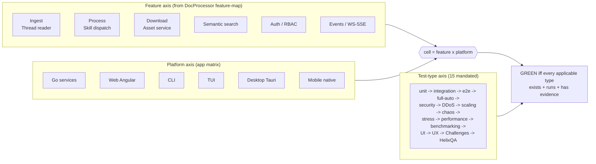

<!--
  Title           : Helix Thready — The 15 Mandated Test Types
  Classification  : PUBLIC
  Location        : docs/public/research/mvp/testing/test-types.md
  Status          : Draft — v0.1
  Revision        : 1 (2026-07-21)
  Author          : Helix Thready documentation swarm (testing)
  Related         : ./test-strategy.md, ./tdd-skeletons.md, ./performance-and-chaos.md,
                    ./helixqa-banks.md, ./challenges-scenarios.md, ./static-analysis.md,
                    ./acceptance-gates.md
-->

# Helix Thready — The 15 Mandated Test Types

| Rev | Date | Author | Change |
|-----|------|--------|--------|
| 1 | 2026-07-21 | swarm (testing) | Initial draft — all 15 types with scope/tools/gates + applicability matrix |
| 2 | 2026-07-22 | swarm (testing) | Pass 3 — each type's "Gate" line now carries a stable gate ID resolved in acceptance-gates.md |

`[CONSTITUTION §11.4.27]` mandates all fifteen test types for **every feature × platform**
cell, to **100 % test-type coverage**. Mocks/stubs/TODO are allowed **only in unit tests**;
every other type exercises the **real system**. This document defines each type's **scope**,
**tools**, **gate** (the pass condition that blocks a release when unmet) and **Thready mapping**.

> **Gate IDs.** Each "Gate" line below is made machine-checkable — a stable gate ID, precondition,
> script-decidable pass condition, required runtime evidence, tier and blocking severity — in the
> [acceptance-gates.md](./acceptance-gates.md) register: unit → `G-UNIT`, integration → `G-INT`/
> `G-CONTRACT`/`G-DECOUPLE`, e2e → `G-E2E`, full-automation → `G-FULLAUTO`, security →
> `G-SECRET`/`G-SONAR`/`G-SNYK`, DDoS → `G-DDOS`, scaling → `G-SCALE`, chaos → `G-CHAOS`/`G-DR`,
> stress → `G-STRESS`, performance → `G-PERF`, benchmarking → `G-BENCH`, UI → `G-UI`, UX →
> `G-UX`, Challenges → `G-CHALLENGE`, HelixQA → `G-HELIXQA`.

## Table of contents

- [0. The coverage cube](#0-the-coverage-cube)
- [1. Unit](#1-unit-tests) · [2. Integration](#2-integration-tests) · [3. E2E](#3-e2e-tests) ·
  [4. Full-automation](#4-full-automation-tests) · [5. Security](#5-security-tests) ·
  [6. DDoS](#6-ddos-tests) · [7. Scaling](#7-scaling-tests) · [8. Chaos](#8-chaos-tests) ·
  [9. Stress](#9-stress-tests) · [10. Performance](#10-performance-tests) ·
  [11. Benchmarking](#11-benchmarking-tests) · [12. UI](#12-ui-tests) · [13. UX](#13-ux-tests) ·
  [14. Challenges](#14-challenges) · [15. HelixQA](#15-helixqa)
- [16. Anti-bluff obligations per type](#16-anti-bluff-obligations-per-type)
- [17. Applicability matrix](#17-applicability-matrix)
- [18. Gap-register items addressed](#18-gap-register-items-addressed)

## 0. The coverage cube

> Rendered PNG/SVG exported via Docs Chain (§11.4.65). Source:
> [`diagrams/test-type-coverage-cube.mmd`](./diagrams/test-type-coverage-cube.mmd).

**Explanation (for readers/models that cannot see the diagram).** Coverage is a three-axis
cube. The **feature axis** lists Thready's capabilities (ingest/thread-reader, process/Skill-
dispatch, download/asset-service, semantic search, auth/RBAC, events over WebSocket/SSE),
sourced from the DocProcessor feature-map. The **platform axis** lists the application matrix
(Go services, Angular web, CLI, TUI, Tauri desktop, native mobile). The **test-type axis** is the
ordered list of all 15 mandated types.

A **cell** is the intersection of one feature and one platform. A cell is GREEN only when every
test type *applicable to that cell* exists, runs green, and — for every type except unit —
produces runtime evidence. The applicability of each type to each cell is fixed by the matrix in
§17; the cube, not a line-percentage, is the release gate, and each cell's per-type pass/fail is
adjudicated by the gate IDs in [acceptance-gates.md](./acceptance-gates.md).

---

## 1. Unit tests

- **Scope.** A single function/method/branch in isolation; the only type where fakes are
  allowed. Table-driven, deterministic, sub-millisecond.
- **Tools.** Go `testing`+`testify`, `go test -race`, `go-sqlmock`/`miniredis`;
  Jasmine/Karma; Kotest; XCTest; `cargo test`; `flutter_test`.
- **Gate.** Green + `-race` clean on every commit (pre-commit hook); `go-mutesting` survivors
  triaged. Line coverage tracked (secondary).
- **Thready mapping.** Every exported symbol of every service and shared package — e.g. hashtag
  parser, precedence-table resolver, back-off calculator, RBAC permission check, chunker.

## 2. Integration tests

- **Scope.** Cross-module contracts and critical paths, against **real** dependencies. Includes
  the **decoupling audit** `[GAP: §12 decoupling]`: assert each reused submodule is
  project-not-aware and config-injected (constructed from config with no Thready-specific
  globals).
- **Tools.** Real Podman-run Postgres+pgvector, NATS JetStream, MinIO, HelixLLM
  `/v1/embeddings`; `httptest` only at the HTTP boundary of the module under test.
- **Gate.** All cross-module contracts + critical paths GREEN before expanding to full
  combinations; **no fakes beyond unit** `[RESEARCH: final §18 Q24]`. Contract tests confirm
  the OpenAPI 3.1 request/response shapes and the WS/SSE event contract from the API area —
  concrete RED skeletons (the `/v1/embeddings` OpenAI envelope `[GAP: §2.1]`, per-adapter
  LLMProvider contracts `[GAP: §2.3]`, and the processing-event envelope) are in
  [tdd-skeletons.md §13](./tdd-skeletons.md#13-api-and-event-contract-tests).
- **Thready mapping.** Herald→Postgres→EventBus; EventBus→BackgroundTasks→Skill dispatch;
  Skill→LLMProvider→pgvector; Download Manager→callback→Asset Service; Auth→User Service RBAC.

## 3. E2E tests

- **Scope.** A whole user journey through the running system, no internal shortcuts.
- **Tools.** Cypress/Playwright (Web), `challenges/pkg/userflow` adapters
  (`APIFlowChallenge`, `BrowserFlowChallenge`, `GRPCFlowChallenge`, `WebSocketFlowChallenge`,
  `DesktopFlowChallenge` via Tauri WebDriver, `MobileFlowChallenge` via ADB/Appium/Maestro).
- **Gate.** The canonical journey — *add a Telegram thread → auto-classify → run Skill → produce
  status reply + asset + embedding → find it via `/v1/search`* — passes end-to-end against
  `dev.` with evidence.
- **Thready mapping.** Web portal login→add channel→watch processing events→open asset→search;
  CLI equivalent; TUI equivalent.

## 4. Full-automation tests

- **Scope.** Unattended execution of the entire suite (all types) with evidence collection and
  auto-ticketing; the CONST-048 full-automation coverage.
- **Tools.** **HelixQA autonomous session** (4 phases: Setup → Doc-Driven Verification →
  Curiosity-Driven Exploration → Report) — see [helixqa-banks.md](./helixqa-banks.md).
- **Gate.** A single command runs Web+CLI (then all platforms) to the configured coverage
  target with video/log evidence; failures become Markdown tickets for the AI fix pipeline.
- **Thready mapping.** `helixqa autonomous --project . --platforms web,desktop --coverage-target 0.9`.

## 5. Security tests

- **Scope.** authn/authz, secret-leak, fuzzing, dependency-CVE, SSRF, injection, and attack
  simulation `[RESEARCH: request §Testing]`.
- **Tools.** **Snyk** (deps + code) + **SonarQube** (SAST) — see
  [static-analysis.md](./static-analysis.md); `go-fuzz`/native `testing.F` fuzzing;
  `security/pkg/pii`, `security/pkg/policy`, `security/pkg/headers`, SSRF guard from `security`.
- **Gate.** Zero high/critical Snyk or SonarQube security findings; no secret leaks in code or
  logs; RBAC negative tests (a `user` cannot perform `account-admin`/`root` actions) all green;
  JWT/refresh/session-expiry enforced (access 15 m / refresh 7 d / idle 30 m, `§18 Q9`).
- **Thready mapping.** JWT/API-key/OAuth2 flows; MFA (TOTP) for admin tiers; the encrypted-yet-
  searchable credential path (embed over redacted form, raw never leaks, `§3.6`);
  QR-code/screenshot sensitivity classification.

## 6. DDoS tests

- **Scope.** Volumetric and application-layer flood against the HTTP/3 API and the WS/SSE hub;
  validate the rate-limiter, back-pressure and circuit-breakers hold.
- **Tools.** `vegeta`/`k6` flood generators; assertions on `digital.vasic.ratelimiter`;
  connection-storm against WebSocket. Full plan in
  [performance-and-chaos.md §6](./performance-and-chaos.md#6-ddos--abuse-simulation).
- **Gate.** Under flood, legitimate p95 stays within SLO or degrades gracefully (429 with
  `Retry-After`), no OOM, no crash; the rate-limiter sheds excess deterministically.
- **Thready mapping.** `/v1/*` endpoints, `/v1/search`, WS event subscription, login endpoint
  (credential-stuffing simulation).

## 7. Scaling tests

- **Scope.** Horizontal scale-out under Large-scale load (100+ channels, 10k+ posts/day, 100+
  users, 50 TB+) `[OPERATOR]`.
- **Tools.** Postgres **partitioning** (time-partitioned posts) + **read replicas**; pgvector
  ANN index tuning; NATS JetStream clustering; MinIO/S3 tiering; `cache` L1/L2.
- **Gate.** Throughput scales ~linearly as workers/replicas are added; the < 500 ms semantic-
  search SLO holds at 50 TB-scale index sizes; no lock contention on the idempotent single-claim
  under a post-event storm.
- **Thready mapping.** BackgroundTasks worker-pool scale (default 32, `§18 Q4`); pgvector search
  latency vs index size; JetStream consumer replay under partition.

## 8. Chaos tests

- **Scope.** Fault injection — kill a worker/DB/replica/NATS node mid-processing; partition the
  network; validate **DR** (RPO ≈ 1 h / RTO ≈ 4 h, `§18 Q45`).
- **Tools.** `podman kill`/`pause`, `tc netem` (latency/loss/partition), disk-full injection;
  DB PITR restore from hourly incrementals; asset re-hydrate/re-download drill.
- **Gate.** No duplicate processing after a mid-flight kill (idempotent claim proven); durable
  JetStream consumers replay missed events on reconnect; a full DR restore completes within RTO
  and loses ≤ RPO of data.
- **Thready mapping.** Kill a BackgroundTasks worker holding a post claim → another worker
  resumes exactly once; kill Postgres → restore → reconcile; DR runbook validated in-test.

## 9. Stress tests

- **Scope.** Push beyond rated capacity to find the knee and confirm graceful degradation.
- **Tools.** `k6` ramp-to-break; monitor with Prometheus/`pprof`.
- **Gate.** The system degrades gracefully (queues grow, back-pressure engages, progress events
  keep flowing) rather than crashing; recovery is automatic when load drops.
- **Thready mapping.** Post-ingest burst 100× nominal; search QPS ramp; download-queue
  saturation with delegated 3rd-party callbacks.

## 10. Performance tests

- **Scope.** Assert the **Aggressive SLOs** `[OPERATOR §0.1/§18 Q14]`: **API p95 < 150 ms**,
  **semantic search < 500 ms**, **page < 1.5 s**; processing async with progress events.
- **Tools.** `k6` thresholds (fail the run when a percentile breaches); `pprof` CPU/heap;
  ClickHouse latency histograms via `observability`.
- **Gate.** Every SLO met on `sta.` (production-like) before a production tag; a regression that
  breaches a threshold blocks. Detailed budgets in
  [performance-and-chaos.md §3](./performance-and-chaos.md#3-performance-slo-tests).
- **Thready mapping.** `/v1/*` p95; `/v1/search` p95; Angular first-contentful-paint / LCP.

## 11. Benchmarking tests

- **Scope.** Regression-tracked micro/macro benchmarks for hot paths.
- **Tools.** `go test -bench` + `benchstat` (compare against a stored baseline); Angular bundle-
  size/perf budgets; Lighthouse for the web page budget.
- **Gate.** No statistically significant regression vs baseline (benchstat) without an approved
  waiver; baselines versioned alongside the code.
- **Thready mapping.** Embedding+upsert throughput; pgvector `<=>` query; hashtag parse; chunker;
  JSON (de)serialization on the API boundary.

## 12. UI tests

- **Scope.** Rendering correctness and **visual regression** across themes/viewports
  `[CONSTITUTION §11.4.162]`.
- **Tools.** **Panoptic** (CDP screencast + LLM-vision), **VisualRegression** (LLM-vision diff),
  **ScreenDiff** (pixel diff); Angular component tests. The visual-regression family has **no
  CI** today `[GAP: §9.3]` → wired into the local git-hook gate (see
  [test-strategy.md §8](./test-strategy.md#8-ci-equivalent-gating-no-server-side-ci)).
- **Gate.** No unreviewed visual diff on the design-system components and key screens, light +
  dark; a11y contrast passes.
- **Thready mapping.** Portal dashboard, thread view, asset viewer, search results, admin RBAC
  screens; the Thready brand theme on the helix-green base.

## 13. UX tests

- **Scope.** Flow correctness, accessibility, and interaction latency — the felt experience.
- **Tools.** `cypress-axe` (WCAG a11y); HelixQA `issuedetector` (LLM-powered UX/accessibility/
  functional bug detection); interaction-latency assertions.
- **Gate.** Zero critical a11y violations; documented flows complete without dead-ends; the
  autonomous session's UX category surfaces no unresolved critical issue.
- **Thready mapping.** Onboarding (Root bootstrap → create Account → invite user), add-channel
  wizard, processing-progress feedback, search-and-open-asset.

## 14. Challenges

- **Scope.** Per-feature **real-use-case** scenario banks — the constitution test-bank engine.
- **Tools.** **`digital.vasic.challenges`** (`registry` + `runner` + `assertion` engine with 16
  built-in evaluators; `userflow` adapters; JSON/YAML banks; Markdown/JSON/HTML reports;
  live-monitor). Full treatment in [challenges-scenarios.md](./challenges-scenarios.md).
- **Gate.** Every Thready feature has a Challenge bank that runs GREEN; the **describe-Challenge
  meta-runner** proves the banks themselves are present/executable (clean = exit 0, planted
  mutation = exit 99) `[GAP: §9.3]`.
- **Thready mapping.** Ingest, classify, dispatch, download-callback, asset-serve, search,
  auth/RBAC, events — one bank each.

## 15. HelixQA

- **Scope.** AI-driven multi-platform QA with real-time crash detection, step validation and
  **mandatory runtime evidence**.
- **Tools.** **`HelixDevelopment/helix_qa`** — YAML test banks; `detector` (ADB/browser/JVM
  crash+ANR); `evidence` (screenshots/logcat/video/stacktrace); `ticket` (Markdown for AI fix);
  autonomous session. Full treatment in [helixqa-banks.md](./helixqa-banks.md).
- **Gate.** Every PASS carries positive runtime evidence; a green line without evidence is a
  critical defect `[CONSTITUTION §11.4]`. `[GAP: §9.1]` Thready YAML banks authored for every
  service + client.
- **Thready mapping.** Web + Desktop first (Android/iOS/HarmonyOS/Aurora as native clients land,
  `[OPEN: mobile-device-farm]`).

## 16. Anti-bluff obligations per type

Beyond unit, each type must prove *real* behavior. The specific traps the gates guard (from the
gap register) and the behavior each must assert:

| Trap `[GAP]` | Type(s) that must prove real behavior | Assertion |
|--------------|---------------------------------------|-----------|
| HashEmbedder stub (§2.1) | integration, performance, Challenges | embeddings are semantic (near-duplicate texts rank close; `HELIX_EMBEDDING_PROVIDER=llama`), not deterministic pseudo-vectors |
| VisionEngine no OCR (§2.6) | integration, e2e, Challenges | OCR returns real recognized text + bounding boxes for a fixture image, not an empty `TextRegion` |
| Security-KMP in-memory stub (§7.3) | integration (device), security | secret round-trips through native Keychain/KeyStore, survives process restart; not plaintext memory |
| Herald MTProto trap + Max stub (§5.1) | integration, e2e | real channel/thread backfill via `messages.getReplies`/`getForumTopics`; Max reads real history |
| MeTube poll-only (§6.5) | integration | an outbound completion webhook is received (push), not just a poll endpoint |
| Download Manager BUILD-NEW (§6.3) | integration, chaos | resumable/segmented transfer + standardized callback actually fire; resume after kill |
| helix_skills no execution engine (§4.1) | integration, e2e | the Thready dispatch engine actually runs ordered Skills, not just resolves DAG order |
| VectorDB Qdrant unverified (§3.1) | integration, scaling | Qdrant backend reaches parity with pgvector behind the same interface |

Skeletons for these gates: [tdd-skeletons.md §12](./tdd-skeletons.md#12-anti-bluff-paired-mutation-gates).

## 17. Applicability matrix

Which types apply to which feature × platform class. `●` = mandatory, `○` = where surface
exists, `—` = n/a. "Svc" = Go services/API; "Web/CLI/TUI/Desk/Mob" = clients.

| Type | Svc | Web | CLI | TUI | Desk | Mob |
|------|:---:|:---:|:---:|:---:|:---:|:---:|
| Unit | ● | ● | ● | ● | ● | ● |
| Integration | ● | ● | ● | ● | ● | ● |
| E2E | ● | ● | ● | ● | ● | ● |
| Full-automation | ● | ● | ● | ○ | ● | ● |
| Security | ● | ● | ● | ○ | ● | ● |
| DDoS | ● | ○ | ○ | — | — | — |
| Scaling | ● | — | — | — | — | — |
| Chaos | ● | ○ | ○ | — | ○ | ○ |
| Stress | ● | ○ | ○ | — | — | — |
| Performance | ● | ● | ● | ○ | ● | ● |
| Benchmarking | ● | ● | ○ | — | ○ | ○ |
| UI | — | ● | ○ | ● | ● | ● |
| UX | — | ● | ● | ● | ● | ● |
| Challenges | ● | ● | ● | ● | ● | ● |
| HelixQA | ○ | ● | ○ | ○ | ● | ● |

DDoS/scaling/stress are server-side properties (client cells inherit them via the shared API);
UI/UX are client-side; the rest are universal. Web + CLI cells are filled first
`[OPERATOR: Web+CLI first]`.

## 18. Gap-register items addressed

- `[GAP: §9.1]` HelixQA Thready banks + evidence — types 4, 15.
- `[GAP: §9.3]` visual-regression family CI + Thready Challenge banks — types 12, 14.
- `[GAP: §12 decoupling audit]` — type 2.
- `[GAP: §2.1 contract test / §2.3 per-adapter]` OpenAPI 3.1 + provider contract tests — type 2
  ([tdd-skeletons.md §13](./tdd-skeletons.md#13-api-and-event-contract-tests)).
- `[GAP: §2.1/§2.6/§7.3/§5.1/§6.5/§6.3/§4.1/§3.1]` scaffold-trap anti-bluff — §16.

---

*Made with love ♥ by Helix Development.*
