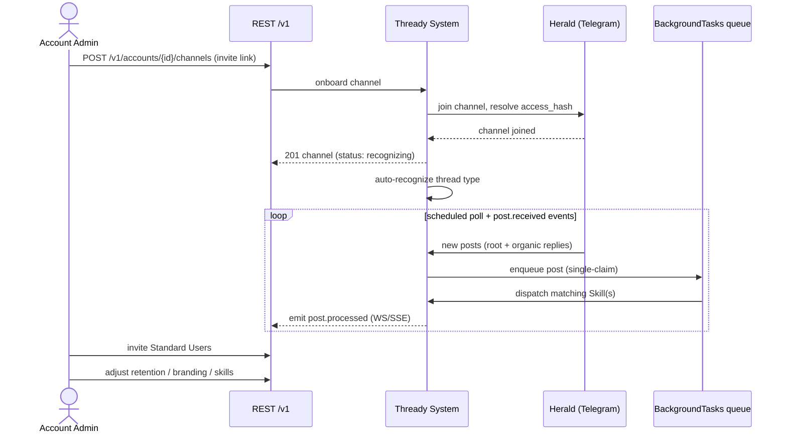

<!--
  Title           : Helix Thready — Account Admin Guide
  Classification  : PUBLIC
  Location        : docs/public/research/mvp/user-guides/account-admin-guide.md
  Status          : Draft — v0.1 (zero-version)
  Revision        : 1 (2026-07-21)
  Author          : Helix Thready documentation swarm (user-guides)
  Related         : ./root-admin-guide.md, ./end-user-manual.md, ./configuration.md,
                    ./web-portal-guide.md
-->

# Helix Thready — Account Admin Guide

| Rev | Date | Author | Change |
|-----|------|--------|--------|
| 1 | 2026-07-21 | swarm (user-guides) | Initial Account Admin operations guide |
| 2 | 2026-07-22 | swarm (user-guides, Pass 3) | Depth pass: split the onboarding sequence-diagram explanation into multi-paragraph form; added the VERIFIED `SKILL.md` frontmatter schema (`name`/`description`/`version` + `register.sh`) read from `helix_skills` source; added a channel-onboarding checklist |

An **Account Admin** has full control of **one Account** and its members (final request §6.1). This
guide covers managing members, onboarding channels/groups, configuring skills & hashtag recipes,
per-account retention and branding, and reading the Account's usage. System-wide powers belong to the
[Root Admin](./root-admin-guide.md); day-to-day consumption is the
[End-User manual](./end-user-manual.md).

## Table of contents

1. [What an Account Admin can do](#1-what-an-account-admin-can-do)
2. [The Account model](#2-the-account-model)
3. [Getting started (accept invite, MFA)](#3-getting-started)
4. [Managing members](#4-managing-members)
5. [Onboarding channels & groups (diagram)](#5-onboarding-channels--groups)
6. [Skills and hashtag recipes](#6-skills-and-hashtag-recipes)
7. [Per-account retention & branding](#7-per-account-retention--branding)
8. [Pausing your account's processing](#8-pausing-your-accounts-processing)
9. [Usage & billing view](#9-usage--billing-view)
10. [Tutorials](#10-tutorials)
11. [Open items](#11-open-items)

## 1. What an Account Admin can do

| Capability | Scope |
|-----------|-------|
| Invite / remove / role members | Own Account only |
| Onboard messenger channels & groups | Own Account |
| Enable/disable & tune skills (hashtag recipes) | Own Account |
| Set per-account retention (within Root's cap) | Own Account |
| Set per-account white-label branding | Own Account (if Root allows) |
| Pause/resume processing | Own Account |
| View usage & billing meter | Own Account |
| Edit **other** Accounts / global defaults | ❌ (Root Admin only) |

## 2. The Account model

An Account is a **multi-tenant boundary**: its channels, posts, assets, users and branding are
isolated from other Accounts. Membership is flexible (final request §6.1):

- A user may belong to **multiple** Accounts with different roles in each.
- A Standard User can **create their own Account** and become its Admin (self-service).
- An Account Admin can be a Standard User elsewhere.

```go
// Illustrative membership type (VERIFIED design; final API in ../api/index.md)
type Membership struct {
    UserID    string    `json:"user_id"`
    AccountID string    `json:"account_id"`
    Role      Role      `json:"role"` // account_admin | user
    JoinedAt  time.Time `json:"joined_at"`
}
```

## 3. Getting started

1. Accept the invite email → set password (≥12 chars, Argon2id, breach-checked).
2. **Enrol TOTP MFA** — mandatory for Account Admins (`THREADY_MFA_REQUIRED_TIERS`).
3. Land on the Account dashboard (portal) or run `thready account use <name>` (CLI).

## 4. Managing members

```bash
# Invite a user into YOUR account
thready member invite --account Acme --email "jane@acme.example" --role user

# Promote to co-admin
thready member set-role --account Acme --email "jane@acme.example" --role account_admin

# Remove
thready member remove --account Acme --email "leaver@acme.example"

thready member list --account Acme
```

You cannot touch users outside your Account. All actions are audited and visible to the Root Admin.

## 5. Onboarding channels & groups

`[GAP: 3]` **Before you start:** Telegram channel reading works via Herald's `gotd/td` MTProto user
client (being promoted from the `qaherald` harness, `[BUILD-NEW]` P0). **Max is not available yet**
(adapter is `[BUILD-NEW]` P0). Onboard Telegram channels for the zero version.



> Rendered PNG/SVG exported via Docs Chain (§11.4.65). Source: [diagrams/account-onboarding.mmd](./diagrams/account-onboarding.mmd).

**Explanation (for readers/models that cannot see the diagram).** The sequence begins with the Account
Admin POSTing a Telegram invite link to `/v1/accounts/{id}/channels`. The REST API hands the request to
the Thready System, which asks Herald's **MTProto user client** (`HERALD_MTPROTO_*`) to join the
channel and resolve its `access_hash`. The user client — not a bot token — is used here precisely
because only it can subsequently read the channel's full history; a bot could post but never backfill.

Once joined, the API returns `201` with the channel in a `recognizing` state while the system
auto-detects the thread type (Notes/everything vs project-management, etc.). This recognizing phase is
why a freshly-added channel does not immediately show categorized posts: the system is first deciding
*what kind* of channel it is before it decides *how* to process each post.

From then on a steady-state loop runs. On each scheduled poll (`THREADY_POLL_INTERVAL`) **and** on
`post.received` push events, Herald delivers new posts, each assembled as a **complete post** — root
message plus the full organic reply chain, excluding the system's own status replies. The two triggers
(poll and event) are intentionally redundant so a missed push is caught by the next poll and vice
versa.

The system enqueues every post into the BackgroundTasks queue, which **claims it exactly once** via a
Postgres lock, dispatches the matching Skill(s) for its hashtags/content type, and emits a
`post.processed` event over WebSocket/SSE that the Admin's clients receive in real time. The
single-claim step is the load-bearing guarantee of the whole diagram: because both a poll and an event
can independently observe the same new post, the exactly-once claim is what prevents double-processing.

In parallel with all of this, the Admin invites Standard Users and tunes the Account's retention,
branding, and skills — these are independent of the ingest loop and can happen at any time. The
diagram's essential message is that ingest is **continuous and idempotent**, and onboarding is just the
one-time act that starts the loop.

```bash
# CLI equivalent
thready channel add --account Acme --messenger telegram \
  --invite "https://t.me/+622y04wzy_YzOTA0"
thready channel list --account Acme
thready channel set --account Acme --id <chan> --poll-interval 2m
```

**Auto-recognition** (final request §21.6 / "To be researched"): you can just add a channel and let
Thready recognize what kind of content it holds and how to process its posts. Override the recognized
type per channel if needed.

## 6. Skills and hashtag recipes

`[GAP: 6]` **VERIFIED status.** HelixSkills stores Skills as **knowledge units in a DAG**
(atomic→composite→umbrella) — it is **not** a job/execution engine. Thready's per-hashtag "recipes"
run on a **Skill-dispatch engine** built on top (`[BUILD-NEW]` P0) that maps hashtag/content-type →
Skill(s) and orders them `download → convert → analyze → research → reply`. As an Account Admin you
**enable/disable and tune** recipes; you do not author the execution engine.

Supported hashtag categories (all built in parallel, Q31) — enable per Account:

`#Video` · `#ToDownload` · `#Torrent`/`#Magnet` · `#Serial`/`#Series` · `#Movie`/`#Movies` ·
`#Research` · `#Documentary` · `#Concert` · `#Game`/`#Games` · `#Software` · `#Channel` · `#Playlist` ·
`#Music` · `#Book`/`#Books` · `#Comic`/`#Comics` · `#Netflix` · `#Training` · `#Technology`.

```bash
# List recipes and their state for your account
thready skill list --account Acme
# Tune a recipe's parameters (e.g. research depth, download quality profile)
thready skill set --account Acme --hashtag Research --param passes=3
thready skill disable --account Acme --hashtag Netflix     # opt out of a category
```

**Multi-category posts are additive** (VERIFIED, inconsistency #2): a post tagged `#Research #Video
#ToDownload` runs *both* the video-download recipe and the mandatory deep research, ordered by the
precedence `download > convert > analyze > research > reply`. See
[end-user-manual.md §5](./end-user-manual.md#5-hashtag-categories) for what each category does.

> **Skill file format caveat** `[GAP: 6]`. HelixSkills currently has inconsistent Skill files (some
> `SKILL.md` with YAML frontmatter, some without). A canonical `SKILL.md` schema is being standardized;
> if you author custom recipes, use the frontmatter form.

**VERIFIED `SKILL.md` schema (read at source in `helix_skills`).** A Skill is a directory containing a
`SKILL.md` (the knowledge unit) and a `register.sh` (activation script). The `SKILL.md` opens with
YAML frontmatter whose fields are exactly `name`, `description` (a *"Use when …"* trigger phrase), and
`version`; the body is Markdown prose. Real example (VERIFIED — `constitution/skills/…/SKILL.md`):

```markdown
---
name: Workable Item Lifecycle
description: Use when moving a tracked item through its lifecycle — starting work, marking it ready
  for testing, closing it, reopening it, marking it obsolete or operator-blocked…
version: 1.0.0
---

# Workable Item Lifecycle

<Markdown body: the knowledge the Skill encodes.>
```

When you author a custom Thready recipe, use this exact frontmatter form (`name`/`description`/
`version`) so it registers cleanly. Skills carry a **complexity** level in the catalog index
(`intermediate` / `advanced`) and are organized `atomic → composite → umbrella` in the DAG. Note the
distinction the gap register draws `[GAP: 6]`: this is the *knowledge-unit* format — the thing that
maps a hashtag to instructions — **not** an execution engine. Thready's Skill-dispatch engine
(`[BUILD-NEW]` P0) is what actually *runs* the ordered steps; the `SKILL.md` only describes them.

## 7. Per-account retention & branding

```bash
# Retention — you may SHORTEN below the global default, never exceed Root's cap
thready retention set-account Acme --default 180d
thready retention show --account Acme

# Branding — only if the Root Admin enabled per-account white-label
thready brand set --account Acme --primary-color "#0A7CFF" --logo ./acme.svg --slogan "Acme Intel"
```

The Helix Development attribution remains in footers regardless (§8.3). Light + dark logo variants
are required.

## 8. Pausing your account's processing

```bash
thready processing pause  --scope account:Acme
thready processing resume --scope account:Acme
thready processing status --account Acme
#   account:Acme RUNNING  in-flight: 3  queued: 12  dlq: 0
```

Pausing only affects **your** Account. In-flight posts finish; queued posts resume on `resume`.

## 9. Usage & billing view

```bash
thready billing meter show --account Acme --period 2026-07
#   posts_processed: 8,421   assets_stored_gb: 512   search_calls: 19,003
thready billing summary --account Acme
```

You see only your Account's meter. Rating/invoicing is Root/deployment-scoped
([root-admin-guide.md §11](./root-admin-guide.md#11-billing-oversight)).

## 10. Tutorials

**Tutorial A — Stand up a research-focused channel.**
1. `thready channel add --account Acme --messenger telegram --invite "<link>"`
2. Ensure the `#Research`/`#Technology` recipes are enabled: `thready skill list --account Acme`.
3. Set research depth: `thready skill set --account Acme --hashtag Research --param passes=3`.
4. Invite analysts as users: `thready member invite --account Acme --email a@acme.example --role user`.
5. Watch it work: `thready events tail --account Acme --type post.processed`.

**Tutorial B — Opt a channel out of downloads (metadata-only).**
1. Disable download recipes: `thready skill disable --account Acme --hashtag ToDownload`.
2. Keep analysis/research on. Posts are still stored, embedded, and searchable, but no media is fetched.
3. Verify a `#Video` post now produces a research/analysis reply without an asset.

## 11. Open items

- `[OPEN: acct-1]` The `SKILL.md` **frontmatter schema is now VERIFIED** from `helix_skills` source
  (`name`/`description`/`version` + `register.sh`, documented in §6). What remains open is the
  authoring **UX** and enforcing the schema consistently across the existing mixed Skill files
  `[GAP: 6]`. Tracked: **ATM — lint/normalize existing Skill files to the verified schema + editing UI**.
- `[OPEN: acct-2]` Max channel onboarding blocked on the `[BUILD-NEW]` Max adapter `[GAP: 3]`.
  Tracked: **ATM — Max adapter**, then add a Max onboarding path to §5.
- `[OPEN: acct-3]` Per-account branding availability is gated by a Root toggle whose exact policy
  surface is finalized with the User Service `[GAP: 20]`.

---

*Made with love ♥ by Helix Development.*
