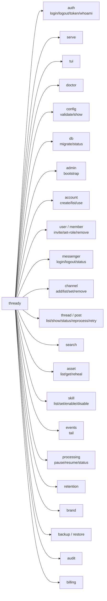

<!--
  Title           : Helix Thready — CLI Reference
  Classification  : PUBLIC
  Location        : docs/public/research/mvp/user-guides/cli-reference.md
  Status          : Draft — v0.1 (zero-version)
  Revision        : 1 (2026-07-21)
  Author          : Helix Thready documentation swarm (user-guides)
  Related         : ./tui-usage.md, ./configuration.md, ./end-user-manual.md, ../api/index.md
-->

# Helix Thready — CLI Reference

| Rev | Date | Author | Change |
|-----|------|--------|--------|
| 1 | 2026-07-21 | swarm (user-guides) | Initial `thready` CLI reference |
| 2 | 2026-07-22 | swarm (user-guides, Pass 3) | Depth pass: split the command-tree diagram explanation into multi-paragraph form; added VERIFIED `helix_track_cli` reference facts (Go+Cobra, `~/.config/<app>/config.yaml`, keyboard-driven — read at source, FOUNDATION/design-first); added a command↔REST↔RBAC mapping table and a scripting cookbook |

The `thready` CLI is a **headless, pipeline-friendly** Go/Cobra binary that shares its SDK with the
[TUI](./tui-usage.md). "Everything possible from the Web works from the CLI" (final request § CLI).
It talks to the same REST `/v1` + event surface as every other client. `[IN-HOUSE: Cobra]`
`[IN-HOUSE: helix_track_cli pattern]`.

> **VERIFIED vs ASSUMPTION.** The framework (Cobra) and the "CLI shares SDK with TUI" design are
> VERIFIED from the decision matrix. The exact command/flag **names** below are this guide's proposal
> `[DEFAULT — adjustable]`, to be reconciled with the implemented command surface — see
> [Open items](#7-open-items). They map 1:1 onto the REST endpoints in [../api/index.md](../api/index.md).

## Table of contents

1. [Install & global flags](#1-install--global-flags)
2. [Command tree (diagram)](#2-command-tree-diagram)
3. [Authentication commands](#3-authentication-commands)
4. [Content commands (channels, threads, search, assets)](#4-content-commands)
5. [Admin commands](#5-admin-commands)
6. [Config commands](#57-config-commands)
7. [Doctor & diagnostics](#58-doctor--diagnostics)
8. [Exit codes & scripting](#6-exit-codes--scripting)
9. [Open items](#7-open-items)

## 1. Install & global flags

```bash
go install github.com/HelixDevelopment/helix_thready/cmd/thready@latest
# or download a release binary; project-prefixed tags e.g. THREADY-1.0.0 [CONSTITUTION §11.4.151]
thready --version
```

**Global flags** (apply to every subcommand):

| Flag | Env | Default | Meaning |
|------|-----|---------|---------|
| `--server` | `THREADY_SERVER` | `https://thready.hxd3v.com` | API base URL. |
| `--account` | `THREADY_ACCOUNT` | last used | Scope commands to an Account. |
| `--output`, `-o` | `THREADY_OUTPUT` | `table` | `table\|json\|yaml` (use `json` in pipelines). |
| `--token` | `THREADY_TOKEN` | keyring | API key / bearer token; falls back to stored session. |
| `--quiet`, `-q` | — | off | Suppress non-error chrome (pipeline mode). |
| `--no-color` | `NO_COLOR` | off | Disable ANSI. |

> **VERIFIED reference pattern (`vasic-digital/helix_track_cli`).** Read at source: the CLI+TUI
> reference is **Go + [Cobra](https://github.com/spf13/cobra)** for the command layer and
> **Bubble Tea + Lip Gloss** for the TUI, persisting config at `~/.config/<app>/config.yaml`, with
> auth by API token / login against the Core REST API and an optional offline cache. Its own README is
> explicit and anti-bluff: the repo is **FOUNDATION / design-first — "no functional code yet"**, and
> its `docs/CLI_SPEC.md` holds the full planned Cobra command tree + Bubble Tea screen map. Thready
> inherits this *pattern* (hence the command names here are `[DEFAULT — adjustable]`, to be frozen
> against the implemented tree — `[OPEN: cli-1]`), but must not assume the reference itself is a shipped
> client. The `~/.config/<app>/config.yaml` convention is why `--server`/`--account`/`--token` fall
> back to a stored session rather than requiring flags every call.

## 2. Command tree (diagram)



> Rendered PNG/SVG exported via Docs Chain (§11.4.65). Source: [diagrams/cli-command-tree.mmd](./diagrams/cli-command-tree.mmd).

**Explanation (for readers/models that cannot see the diagram).** The tree shows the full `thready`
command surface grouped by concern, all hanging off the single `thready` root binary. The grouping is
the important structure to internalize: rather than a flat list of verbs, the CLI is organized into a
handful of concern-areas that each map to a slice of the platform, so you can predict where a command
lives from what it does.

Three groups are about the local process and platform rather than remote resources: authentication
(`auth`), process lifecycle (`serve` to run the API, `tui` to launch the terminal UI, `doctor` for
readiness), and local ops (`config`, `db`). These are the commands you run *before* the system is
serving traffic — bootstrapping, validating, migrating.

The remaining groups mirror the REST resources one-to-one: `admin`/`account`/`user`/`member` for
identity and tenancy, `messenger`/`channel` for ingest, `thread`/`post`/`search`/`asset` for
consumption, `skill` for recipes, `events` for the live stream, and the operational verbs
`processing`, `retention`, `brand`, `backup`/`restore`, `audit`, and `billing`. Because this mirror is
deliberate, an operationId in the OpenAPI surface predicts a CLI subcommand and vice-versa.

Command *availability* is RBAC-gated, and the gate is enforced server-side, not by hiding commands: a
Standard User effectively sees `search`/`thread`/`asset` and read-only status; an Account Admin
additionally sees `channel`/`member`/`skill` scoped to their Account; and the Root Admin sees the
global `admin`/`retention`/`backup`/`billing` verbs. Running a verb you lack permission for does not
"work locally then fail silently" — it returns exit `77` (Forbidden) with no partial action.

The tree is intentionally isomorphic to the API and the portal navigation, so a workflow learned in one
surface transfers directly to the others. This is the same design the VERIFIED `helix_track_cli`
reference follows (see the note below §1): a thin Cobra command layer over the REST API, with the TUI
sharing the same client.

## 3. Authentication commands

```bash
thready auth login                       # interactive; stores session in OS keyring
thready auth login --api-key "$KEY"      # non-interactive (CI/pipelines)
thready auth whoami                      # prints identity + roles per account
thready auth token --scopes read:search  # mint a scoped API key (for SDK/CLI automation)
thready auth logout
```

Auth model (Q10): JWT access+refresh for interactive login; **scoped API keys** for automation;
OAuth2 for linking external services. `[GAP: 10]` tokens are HS256 today; RS256/EdDSA is the target
for multi-service verification.

## 4. Content commands

```bash
# Channels (Account Admin+)
thready channel add --messenger telegram --invite "<t.me link>"
thready channel list [--account Acme]
thready channel set --id <chan> --poll-interval 2m
thready channel remove --id <chan>

# Threads / posts (all users)
thready thread list --channel <chan> [--since 7d]
thready thread show <post-id>
thready post status <post-id>
thready post reprocess <post-id>
thready post retry <post-id> --step download|convert|analyze|research|reply

# Search (all users) — semantic over posts + generated materials
thready search "<query>" [--kind post|asset|research] [--since 90d] [--limit 20]

# Assets (all users)
thready asset list --post <post-id>
thready asset get <asset-id> --rendition raw|web -o ./out
thready asset reheal <asset-id>          # re-download a broken physical link

# Live events (all users) — WS/SSE stream
thready events tail [--type post.processed] [--account Acme]
```

> **Event topics.** `--type` accepts any topic from the consolidated
> [event catalog](./sdk-quickstart.md#61-event-catalog-topics--payloads--semantics) (`post.received`,
> `skill.dispatch`, `download.error`, `download.complete`, `post.processed`, `post.failed`,
> `config.changed`, `processing.paused`/`.resumed`); omit `--type` to tail all topics your scope allows.

### 4.1 Command ↔ REST ↔ RBAC map

Every command maps onto a REST operation and a minimum role. Use this when scripting against the API
directly or when a command returns exit `77` and you need to know which role unlocks it.

| Command | REST operation | Min role |
|---------|----------------|----------|
| `thready search` | `POST /v1/search` | user |
| `thready thread list/show` | `GET /v1/threads`, `GET /v1/posts/{id}` | user |
| `thready post reprocess/retry` | `POST /v1/posts/{id}/reprocess`, `.../retry` | user (own account) |
| `thready asset get/reheal` | `GET /v1/assets/{id}`, `POST /v1/assets/{id}/reheal` | user |
| `thready events tail` | `GET /v1/events` (WS/SSE) | user |
| `thready channel add/set/remove` | `POST/PATCH/DELETE /v1/accounts/{id}/channels` | account_admin |
| `thready member invite/set-role/remove` | `POST/PATCH/DELETE /v1/accounts/{id}/members` | account_admin |
| `thready skill list/set/enable/disable` | `GET/PATCH /v1/accounts/{id}/skills` | account_admin |
| `thready processing pause/resume` (account) | `POST /v1/accounts/{id}/processing:{pause,resume}` | account_admin |
| `thready account create` | `POST /v1/accounts` | root |
| `thready user set-role/disable` (any account) | `PATCH /v1/users/{id}` | root |
| `thready retention set-global` | `PUT /v1/retention/global` | root |
| `thready processing pause/resume` (global) | `POST /v1/processing:{pause,resume}` | root |
| `thready backup run` / `restore` | `POST /v1/backup:run`, `/v1/restore` | root |
| `thready audit query/export` | `GET /v1/audit` | root |
| `thready billing summary` (all) | `GET /v1/billing/summary` | root |

Exact paths/operationIds are frozen with [../api/index.md](../api/index.md) (`[OPEN: cli-1]`).

## 5. Admin commands

```bash
# Root Admin
thready admin bootstrap --email "$ROOT_EMAIL" --from-secret THREADY_ROOT_PASSWORD
thready account create --name Acme --admin-email admin@acme.example
thready retention set-global --default indefinite --max-per-account 365d
thready processing pause|resume --scope global|account:Acme
thready brand set --account Acme --primary-color "#0A7CFF" --logo ./l.svg --slogan "…"
thready backup run --type full
thready restore db --to "2026-07-21T09:00:00Z"
thready audit query --actor a@x --since 24h --action "user.*"
thready billing summary --all-accounts --period 2026-07

# Account Admin (scoped)
thready member invite --account Acme --email u@acme.example --role user
thready skill list|set|enable|disable --account Acme --hashtag Research
```

RBAC is enforced server-side — a scoped call you're not permitted to make returns exit code `77`
(see §6), never a partial action.

## 5.7 Config commands

```bash
thready config validate            # check .env resolves & required vars present (no service start)
thready config validate --file ./staging.env
thready config show --redacted     # dump effective config with secrets masked
```

`config validate` implements the boot-time validation described in
[configuration.md §17](./configuration.md#17-precedence-validation--change-management) without
starting the server — ideal for a pre-deploy hook.

## 5.8 Doctor & diagnostics

```bash
thready doctor                     # full readiness matrix
thready doctor embeddings          # [GAP: 1] asserts a REAL embedder (aborts on hash stub)
thready doctor messenger           # [GAP: 3] Telegram session valid? Max = not-implemented notice
thready doctor storage             # asset store writable, signed URLs
```

`doctor` is the anti-bluff gate: it fails loudly on the known scaffold traps (hash embedder, missing
Max adapter, poll-only MeTube) so you find out before onboarding, not after.

## 6. Exit codes & scripting

| Code | Meaning |
|------|---------|
| `0` | Success |
| `1` | Generic error |
| `2` | Usage / bad flags |
| `3` | Config invalid / required var missing |
| `4` | Not authenticated |
| `5` | Server unreachable / timeout |
| `6` | Resource not found |
| `77` | Forbidden (RBAC denied) |
| `75` | Temporary failure — retriable (back-off then retry) |

**Pipeline example** — fail a CI job if any post in a channel failed processing:

```bash
set -euo pipefail
failed=$(thready thread list --channel "$CHAN" -o json \
  | jq '[.[] | select(.status=="failed")] | length')
[ "$failed" -eq 0 ] || { echo "::error::$failed posts failed"; exit 1; }
```

**Streaming events into a pipeline:**

```bash
thready events tail --type post.processed -o json \
  | jq -r '.post_id' \
  | while read -r id; do thready thread show "$id" -o json | ./ingest.sh; done
```

## 7. Open items

- `[OPEN: cli-1]` Command/flag names are `[DEFAULT — adjustable]`; reconcile with the implemented
  Cobra command tree and the OpenAPI operationIds. Tracked: **ATM — freeze CLI command surface vs API**.
- `[OPEN: cli-2]` `thready serve`/`db migrate` overlap with the deployment tooling; confirm which
  lives in the CLI vs deploy scripts. Tracked: **ATM — CLI vs deploy responsibility split**.
- `[OPEN: cli-3]` `helix_track_cli` (the Bubble Tea/Cobra reference) is **VERIFIED as FOUNDATION /
  design-first — its own README states "no functional code yet"** (`vasic-digital/helix_track_cli`).
  The *pattern* (Go+Cobra, Bubble Tea+Lip Gloss, `~/.config/<app>/config.yaml`, API-token auth) is
  confirmed and adopted here; the reference client itself is not shippable, so shared-SDK boundaries
  must be validated against Thready's own implementation, not borrowed from the reference. Tracked:
  **ATM — freeze shared CLI/TUI SDK boundary against implemented `thready` binary**.

---

*Made with love ♥ by Helix Development.*
