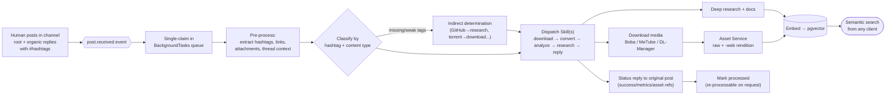

<!--
  Title           : Helix Thready — End-User Manual
  Classification  : PUBLIC
  Location        : docs/public/research/mvp/user-guides/end-user-manual.md
  Status          : Draft — v0.1 (zero-version)
  Revision        : 1 (2026-07-21)
  Author          : Helix Thready documentation swarm (user-guides)
  Related         : ./account-admin-guide.md, ./web-portal-guide.md, ./cli-reference.md,
                    ./troubleshooting.md
-->

# Helix Thready — End-User Manual

| Rev | Date | Author | Change |
|-----|------|--------|--------|
| 1 | 2026-07-21 | swarm (user-guides) | Initial Standard User manual |
| 2 | 2026-07-22 | swarm (user-guides, Pass 3) | Depth pass: split the life-of-a-post diagram explanation into multi-paragraph form; added a hashtag-category quick-reference note and download-status clarity |

This manual is for **Standard Users** — the consumers of Helix Thready. It explains what the system
does with your channels' posts, how the hashtag categories behave, how to run **semantic search**,
how downloaded **assets** work, and how to trigger **re-processing**. Administration is in the
[Account Admin](./account-admin-guide.md) and [Root Admin](./root-admin-guide.md) guides.

## Table of contents

1. [What Helix Thready does for you](#1-what-helix-thready-does-for-you)
2. [The life of a post (diagram)](#2-the-life-of-a-post-diagram)
3. [Complete posts: root + reply chain](#3-complete-posts-root--reply-chain)
4. [Reading processed threads](#4-reading-processed-threads)
5. [Hashtag categories](#5-hashtag-categories)
6. [Semantic search](#6-semantic-search)
7. [Media, assets and downloads](#7-media-assets-and-downloads)
8. [Status replies & re-processing](#8-status-replies--re-processing)
9. [Sensitive content](#9-sensitive-content)
10. [Tutorials](#10-tutorials)
11. [Open items](#11-open-items)

## 1. What Helix Thready does for you

You add messaging channels/groups (or an Admin does); Thready reads every human post, figures out
what it is from its **hashtags** and content, runs the right **AI recipe (Skill)** on it — downloading
media, doing deep research, transcribing comics, etc. — and makes everything **searchable by meaning**
across both the original posts and the generated materials. It replies to the original post with a
status summary and keeps all downloaded media as managed **assets**.

## 2. The life of a post (diagram)



> Rendered PNG/SVG exported via Docs Chain (§11.4.65). Source: [diagrams/post-journey.mmd](./diagrams/post-journey.mmd).

**Explanation (for readers/models that cannot see the diagram).** A post's life begins when a human
posts in a channel. Thready always works with the **complete post** — the root message plus its full
chain of organic replies, never the system's own status replies. This "complete post" framing is the
first thing to understand, because it is why a hashtag added in a *reply* still steers processing: the
reply is part of the same logical post.

The arrival raises a `post.received` event, and the BackgroundTasks queue **claims the post exactly
once** so an event storm cannot process it twice. Pre-processing then extracts every hashtag, link,
attachment, and the full thread context — everything downstream steps will need.

The post is then **classified** by hashtag and content type. If the tags are missing or too weak, an
**indirect-determination** step infers intent from the content itself: a GitHub link implies research,
a torrent link implies download, a YouTube link implies video. If it still cannot be classified, the
post is not dropped — it is generically ingested (stored, embedded, indexed) and queued for manual
review.

Classification produces a **dispatch** of one or more Skills, ordered `download → convert → analyze →
research → reply`. Categories are **additive**, which is the single most important behaviour here: a
post tagged `#Research #Video` both downloads the video *and* runs deep research, rather than one
winning over the other. The ordering only sequences the steps; it does not make them exclusive.

The work then fans out. Downloads go to Boba (torrents), MeTube (video), or the generic Download
Manager, landing in the **Asset Service** as a raw file plus a web-optimized `-web` rendition. Research
produces documents. Both the assets/metadata and the generated text are **embedded into pgvector** —
this embedding step is precisely what makes everything **searchable by meaning** afterwards, and it is
the step that silently produces garbage if the hash embedder is in use `[GAP: 1]`.

Finally the system posts a **status reply** to the original message (success/failure, metrics, asset
references), marks the post processed (still re-processable on request), and the semantic index becomes
queryable from any client. The diagram's backbone is that single idea: an additive, ordered dispatch
feeding one semantic index, with a status reply closing the loop back to where the human is looking.

## 3. Complete posts: root + reply chain

**Critical behaviour (VERIFIED, final request §3.2.1).** Hashtags are frequently added as a *reply*
to a link-only or text-only root post. Thready therefore assembles the **root post + the full chain
of organic replies** into one logical "complete post" before classifying it. This means:

- A root post with just a YouTube link, plus a reply `#Video #Research`, is processed as a
  video-download **and** research post.
- Replies **you or the system posts about processing results are excluded** — only organic human
  content is processed.

## 4. Reading processed threads

From any client you can browse a channel's threads and see, per post: its detected categories, the
status reply, linked assets, generated research, and processing state.

```bash
thready thread list --channel <chan>
thready thread show <post-id>          # full complete-post view + assets + research links
thready post status <post-id>          # processed | queued | failed | retrying
```

Portal equivalents: [web-portal-guide.md §4](./web-portal-guide.md#4-threads--posts).

## 5. Hashtag categories

Each category has a written Skill (recipe). A post may belong to **several at once** — all matching
recipes run, ordered by precedence. Summary of behaviour (final request §3.2.2):

| Hashtag(s) | What happens |
|-----------|--------------|
| `#Video` `#Videos` (± `#ToDownload`) | Download every video; keep raw + generate `-web` rendition; maintain post↔asset links; re-downloadable via API. |
| `#Torrent` `#Magnet` | Use the torrent/magnet, or find it via Boba if absent; download with callback. |
| `#Serial` `#Series` | Find all seasons via 3rd-party search; download all with callbacks. |
| `#Movie` `#Movies` | As Series, movie-oriented. |
| `#Research` (± `#Technology`) | Multi-pass deep web research → comprehensive docs → Skills/embeddings; semantic + CodeGraph ingest. |
| `#Documentary` | As Movies; without `#ToDownload`, full processing + a documentation/book. |
| `#Concert` `#Concerts` | Live music/artist media (video/audio). |
| `#Game` `#Games` | Seek per platform (default PC-Windows/PS4/Android; all others supported); PC default OS Windows unless `#macOS`/`#Linux`. |
| `#Software` | As games; default OS Windows/Linux/macOS. |
| `#Channel` | Download full channel; raw + web; IT content → research. |
| `#Playlist` | As channels; grouped with ordering-number prefixes for correct watch order. |
| `#Music` | MP3/OPUS/FLAC + majors; locate if no links. |
| `#Book` `#Books` | Determine author, download full bibliography; if IT → research + Skills. |
| `#Comic` `#Comics` | Download; **OCR full transcription**; semantic ingest (no research/Skills). |
| `#Netflix` | Find first (unless links provided); as movies/series. |
| `#Training` | Full course download (Udemy/Coursera etc.); analyze; docs + Skills. |
| `#Technology` (± `#Research`) | Mandatory deep research + analysis; download all media; grow Skills; powerful semantic search. |

**Indirect determination** (§3.5): if tags are missing/weak — torrent links → `Torrent`+`ToDownload`;
GitHub/coding links → deep research + docs + Skill growth; YouTube/streaming/media → download +
research if IT-related. If still unclassified, the post is **generically ingested** (stored + embedded
+ indexed) and queued for manual review — **never silently dropped** (Q32).

## 6. Semantic search

Thready re-implements the "Lumen-style" search-by-meaning in-house (final request §15) over **both**
original posts and generated materials, backed by pgvector + a real llama.cpp embedding model.

```bash
# Simple query
thready search "kubernetes operator retry backoff"
# Filtered
thready search "invoice signature" --kind asset --account Acme --since 90d --limit 20
```

Or via REST (`GET/POST /v1/search`) and the MCP tool for CLI agents (final request §21.3). Target
latency < 500 ms (Aggressive SLO). Results return source ids that are hydrated from the relational
store, so you always get the full post/asset context, not just a vector hit.

> `[GAP: 1]` **If search results look irrelevant**, the system was likely started on HelixLLM's
> **default hash embedder** (non-semantic). Real search requires `HELIX_EMBEDDING_PROVIDER=llama`.
> See [troubleshooting.md §5](./troubleshooting.md#5-semantic-search-returns-irrelevant-results).

## 7. Media, assets and downloads

**Assets, not file paths.** Links from clients to downloaded media are **never** direct file paths —
they resolve through the **Asset Service** (built on Catalogizer), which enforces auth/RBAC and maps
to real or virtual content. Every video is kept as the **raw original** plus a web-optimized `-web`
rendition. The **target** media profile (Q36, `[DEFAULT — adjustable]`) is H.264/AAC fMP4 baseline +
H.265/AV1; adaptive 1080p/720p/480p delivered via HLS/DASH; audio MP3 320k + Opus 128k + FLAC.

> `[GAP: 9]` **Honest status of streaming/transcoding.** Catalogizer is mature but is **not yet
> decoupled** into a standalone Asset Service, and its `Streaming` submodule is a **WebSocket hub, not
> media byte/transcode streaming** — actual media serving is a REST API plus a *separate* transcoder.
> Full **adaptive HLS/DASH + the transcoder integration is a `P1` improvement** on the decoupled Asset
> Service, not a shipped capability. For the zero version, expect the **raw original + a single `-web`
> rendition + HTTP Range (`OpenSeekable`) serving**; the multi-bitrate HLS/DASH ladder above is the
> target the `P1` work delivers. Content-hash dedup + integrity checksums land with the same `P1`
> (see `THREADY_ASSET_DEDUP`, [configuration.md §13](./configuration.md#13-assets--media-directories)).

```bash
thready asset list --post <post-id>
thready asset get <asset-id> --rendition web -o ./out.mp4    # resolves a signed URL via Asset Service
thready asset reheal <asset-id>                              # re-download if the physical link broke
```

**Honest status of the download stack** (so you know what works today):

| Path | Status | Note |
|------|--------|------|
| Torrents (`#Torrent`) via **Boba** | FOUNDATION | SSE + `POST /api/v1/hooks` callbacks exist; contract being standardized `[GAP: 6.4]`. |
| Video (`#Video`, `#Channel`, …) via **MeTube** | FOUNDATION | `[GAP: 5]` MeTube is **poll-only** — no completion webhook yet; Thready polls status until the outbound webhook `[BUILD-NEW]` lands. Downloads still complete; completion notification is slower. |
| Direct file URLs (HTTP/FTP/SMB/NFS/WebDav) via **Download Manager** | `[BUILD-NEW]` | `[GAP: 4]` The generic multi-protocol Download Manager **does not exist yet**; `filesystem` lacks an HTTP source. Direct-URL downloads are not available until it ships. |
| OCR for `#Comic`/`#Screenshot` | `[BUILD-NEW]` OCR adapter | `[GAP: 2]` VisionEngine has **no OCR engine**; comic transcription currently falls back to LLM-vision (lower fidelity) until the Tesseract/PaddleOCR adapter lands. |

If a download never completes, see [troubleshooting.md §6](./troubleshooting.md#6-a-download-never-completes).

## 8. Status replies & re-processing

After processing, Thready posts a **status reply** to the original post (from the Robot or User
account, `THREADY_REPLY_ACCOUNT`) with success/failure, metrics, and asset references. The system
**never processes its own replies**.

You can **re-process (refresh)** a post explicitly — client → REST API → System (final request §3.2.3):

```bash
thready post reprocess <post-id>            # full refresh
thready post retry <post-id> --step download # retry a single failed step
```

Failed steps auto-retry with exponential back-off (max 5, base 2 s, factor 2, cap 5 min —
`[DEFAULT — adjustable]`); you can also retry manually. Nothing is lost — a failed post sits
retriable, and persistently failing work lands in a dead-letter queue an Admin can inspect.

## 9. Sensitive content

Thready handles sensitive material carefully (final request §3.6):

- **Credentials/tokens/keys** in posts → persisted **encrypted** (AES-256-GCM), never logged.
  `[GAP: 7]` They are intended to be **semantically searchable via a redacted representation**, but
  that searchable-but-sealed embedding is `[BUILD-NEW]` — until it lands, credential *content* is
  stored encrypted but not yet indexed for search.
- **Credit cards / contracts / signed docs / QR codes / screenshots** → stored in a specially
  encrypted asset directory; only the Asset Service decrypts. PII is detected/redacted
  (`security/pkg/pii`). QR codes are decoded (target + metadata extracted) and treated as sensitive.
  Screenshots get OCR + Vision to extract meaning for search (subject to the OCR gap above).

## 10. Tutorials

**Tutorial A — Find everything about a topic across posts and research.**
1. `thready search "rust async runtime" --limit 25`
2. Narrow: add `--kind research --since 180d`.
3. Open a hit: `thready thread show <post-id>` to see the source post + generated research + assets.

**Tutorial B — Re-download a broken video and get the web version.**
1. `thready asset list --post <post-id>` → note the asset is `missing`.
2. `thready asset reheal <asset-id>` → re-downloads the raw original.
3. `thready asset get <asset-id> --rendition web -o ./clip-web.mp4`.

**Tutorial C — Turn a link-only post into a research doc.**
1. Confirm the reply added `#Research`/`#Technology` (the tag can live in a reply — it still counts).
2. `thready post reprocess <post-id>` if it predates the tag.
3. Watch `thready events tail --type post.processed`; then `thready search` the new material.

## 11. Open items

- `[OPEN: user-1]` Direct-URL downloads unavailable until the `[BUILD-NEW]` Download Manager ships
  `[GAP: 4]`. Tracked: **ATM — Download Manager (HTTP/2/3 + queue/resume/callback)**.
- `[OPEN: user-2]` Comic/screenshot OCR fidelity limited until the OCR adapter lands `[GAP: 2]`.
  Tracked: **ATM — Tesseract/PaddleOCR adapter behind VisionEngine**.
- `[OPEN: user-3]` Credential semantic search pending the sealed-embedding work `[GAP: 7]`.
  Tracked: **ATM — redacted-token embeddings**.
- `[OPEN: user-4]` MeTube completion is poll-based until its outbound webhook lands `[GAP: 5]`.
  Tracked: **ATM — MeTube completion webhook**.
- `[OPEN: user-5]` Adaptive HLS/DASH streaming + content-hash dedup depend on decoupling the Asset
  Service from Catalogizer and wiring the transcoder `[GAP: 9]`; zero version serves raw + a single
  `-web` rendition over HTTP Range. Tracked: **ATM — decouple Asset Service + HLS/DASH transcoder +
  dedup**.

---

*Made with love ♥ by Helix Development.*
