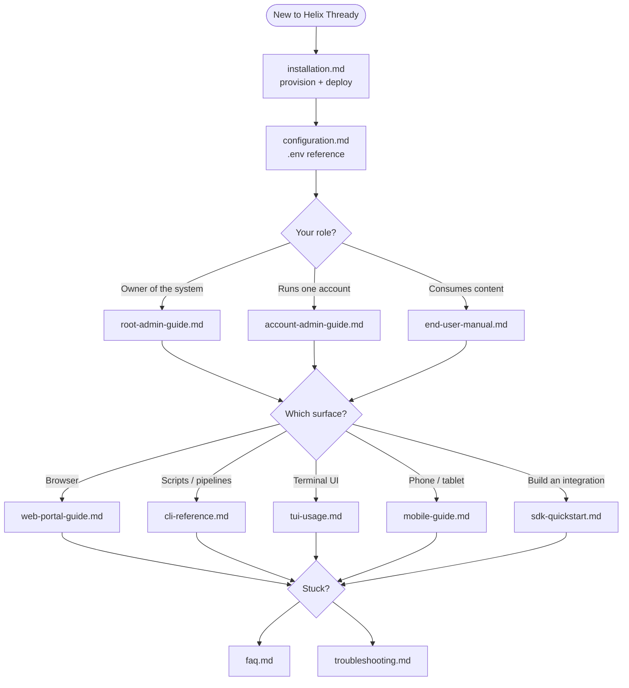

<!--
  Title           : Helix Thready — User Guides (Area Index)
  Classification  : PUBLIC
  Location        : docs/public/research/mvp/user-guides/index.md
  Status          : Draft — v0.1 (zero-version user documentation)
  Revision        : 1 (2026-07-21)
  Author          : Helix Thready documentation swarm (user-guides)
  Related         : ../index.md, ../CONVENTIONS.md, ../api/index.md, ../architecture/index.md,
                    ../deployment/index.md, ../design/index.md
-->

# Helix Thready — User Guides (Area Index)

| Rev | Date | Author | Change |
|-----|------|--------|--------|
| 1 | 2026-07-21 | swarm (user-guides) | Initial zero-version user documentation set |
| 2 | 2026-07-21 | orchestrator (integration) | Integration pass — all upstream sibling area indexes now committed; cross-area links verified to resolve; status caveat in §4 updated |
| 3 | 2026-07-22 | swarm (user-guides, Pass 3) | Depth pass: added [quickstart.md](./quickstart.md); recorded the VERIFIED messenger-name correction (`HERALD_MTPROTO_*` / `HERALD_TGRAM_*`) read from `vasic-digital/herald`; split the reading-path diagram explanation into multi-paragraph form; refreshed the gap table wording |
| 4 | 2026-07-22 | swarm (user-guides, Critic pass) | Completeness pass: added the consolidated [event catalog](./sdk-quickstart.md#61-event-catalog-topics--payloads--semantics) (final request §3.4) cross-linked from CLI/TUI/Web; added the user-visible `[GAP: 11]` (native/Qt-Aurora theming) row to §6; noted the events catalog under the anti-bluff coverage |

This is the canonical entry point for **consumer-facing** documentation of Helix Thready: how to
install it, configure it, and operate it from every surface (Web, CLI, TUI, Desktop, Mobile, SDK)
as every consumer group (Root Admin, Account Admin, Standard User). It is authored from the
authoritative research documents and follows [CONVENTIONS.md](../CONVENTIONS.md) exactly.

> **Zero-version notice.** Per the original request (§ "User manuals, guides, FAQs"), this is the
> **zero version** written before implementation begins. It documents the system **as designed and
> decided** in the technology decision matrix, not a shipped product. Where a subsystem is a
> scaffold/stub in the [gap register](../../../../private/research/mvp/helix_thready_subsystem_gaps_and_improvements.md),
> the guide says so plainly and points to the plan that closes it — it never claims a stub "works".
> All values tagged `[DEFAULT — adjustable]` are enterprise defaults the operator may override.

## Table of contents

1. [Who these guides are for](#1-who-these-guides-are-for)
2. [The document set](#2-the-document-set)
3. [Reading path (diagram)](#3-reading-path-diagram)
4. [Upstream / Downstream dependencies](#4-upstream--downstream-dependencies)
5. [Verified vs. assumed — how to read the tags](#5-verified-vs-assumed--how-to-read-the-tags)
6. [Gaps addressed in this area](#6-gaps-addressed-in-this-area)
7. [How these guides are verified (anti-bluff TDD)](#7-how-these-guides-are-verified-anti-bluff-tdd)
8. [Open items tracked in this area](#8-open-items-tracked-in-this-area)

## 1. Who these guides are for

Helix Thready has a **three-tier user hierarchy** `[CONSTITUTION]` (final request §6.1):

| Tier | Role | What they do | Primary guide |
|------|------|--------------|---------------|
| 1 | **Root Admin** | Owns the whole system; exactly one exists; edits all accounts/users/roles/permissions; sets global defaults and white-label branding | [root-admin-guide.md](./root-admin-guide.md) |
| 2 | **Account Admin** | Full control of one Account and its members; manages channels, skills, retention overrides, billing view | [account-admin-guide.md](./account-admin-guide.md) |
| 3 | **Standard User** | Consumes assigned accounts: browses processed threads, runs semantic search, downloads assets, triggers re-processing | [end-user-manual.md](./end-user-manual.md) |

A single person may hold different tiers in different Accounts (a Standard User in one Account can
create their own Account and become its Admin) — see [account-admin-guide.md](./account-admin-guide.md#2-the-account-model).

## 2. The document set

| Guide | Scope |
|-------|-------|
| [quickstart.md](./quickstart.md) | **Fast on-ramp** — a ~5-minute quickstart per surface (Web, CLI, TUI, SDK, Mobile) plus Admin bootstrap, each cross-linked to its deep guide |
| [installation.md](./installation.md) | Prerequisites, local (dev) bring-up with rootless Podman Compose, and the 3-environment Hetzner deploy; Root Admin bootstrap; first-run verification matrix |
| [configuration.md](./configuration.md) | **Complete documented environment-variable reference** — every `.env` variable the system supports, plus config-resolution precedence and messenger sign-in |
| [root-admin-guide.md](./root-admin-guide.md) | System ownership: accounts, global retention, white-label branding, MFA policy, pause/resume, audit, backup/DR runbook |
| [account-admin-guide.md](./account-admin-guide.md) | Account operations: members, channel/group onboarding, skills & hashtag recipes, per-account retention, branding, billing |
| [end-user-manual.md](./end-user-manual.md) | Everyday use: reading threads, hashtag categories, semantic search, assets & downloads, status replies, re-processing |
| [cli-reference.md](./cli-reference.md) | Headless `thready` CLI — every command, flag, exit code, and pipeline recipe |
| [tui-usage.md](./tui-usage.md) | Bubble Tea terminal UI — panes, keybindings, live event stream |
| [web-portal-guide.md](./web-portal-guide.md) | Angular portal — information architecture, every screen, tutorials |
| [mobile-guide.md](./mobile-guide.md) | Native mobile clients (Android/iOS/HarmonyOS/Aurora) + KMP shared logic; security caveats |
| [sdk-quickstart.md](./sdk-quickstart.md) | SDK quickstart (Go primary; TS/Python/Java/Kotlin/Swift/Rust surface), auth, first request, event subscription |
| [faq.md](./faq.md) | Frequently asked questions across install, config, processing, search, security |
| [troubleshooting.md](./troubleshooting.md) | Symptom → cause → fix decision trees; log locations; known scaffold-related failure modes |

## 3. Reading path (diagram)



> Rendered PNG/SVG exported via Docs Chain (§11.4.65). Source: [diagrams/user-guide-map.mmd](./diagrams/user-guide-map.mmd).

**Explanation (for readers/models that cannot see the diagram).** The map shows the intended order in
which a newcomer consumes this area. Everyone starts at **installation**, which gets a running system —
locally for evaluation, or on the Hetzner host for real use. Readers who want the shortest possible
path can instead jump to [quickstart.md](./quickstart.md), which collapses install→configure→first
success into a five-minute per-surface on-ramp; the map below is the thorough route, the quickstart is
the express one.

Installation flows into **configuration**, because nothing works until the `.env` is populated —
messenger credentials, database DSNs, the embedding provider, and storage all come from there. This
ordering is not cosmetic: the embedder gate `[GAP: 1]` and the messenger sign-in both live in
configuration, and skipping it is the single most common cause of "it installed but does nothing".

From configuration the reader branches by **role**: the system owner reads the Root Admin guide, an
account operator reads the Account Admin guide, and a consumer reads the End-User manual. The role
guides answer *what* you are allowed to do and *why* — they are the authority on the permission model,
retention, branding, and the account hierarchy.

All three roles then converge on a **surface** choice — Web, CLI, TUI, Mobile, or the SDK — each with
its own dedicated guide. Surface guides answer *where and how*: the same capability (say, reprocessing
a post) is described once per surface in the idiom of that surface. Role and surface guides are meant
to be read **together** — an Account Admin driving the Web portal reads both `account-admin-guide.md`
and `web-portal-guide.md`.

Every surface path terminates at a shared **help** decision that routes to the FAQ for conceptual
questions and to troubleshooting for concrete failures. The diagram is deliberately a funnel: role
guides describe *what*, surface guides describe *where and how*, and help closes the loop when either
leaves you stuck.

## 4. Upstream / Downstream dependencies

**Upstream (this area consumes / must not contradict):**

- **[architecture/](../architecture/index.md)** — component topology, event model, concurrency &
  idempotency guarantees. User guides describe behaviour the architecture defines.
- **[api/](../api/index.md)** — the REST `/v1` OpenAPI surface and the WebSocket/SSE event
  contract. Every CLI command, portal action and SDK call ultimately hits these endpoints.
- **[database/](../database/index.md)** — the entities (posts, threads, accounts, assets, …)
  that the guides let users read and search.
- **[deployment/](../deployment/index.md)** — the rootless Podman Compose stacks, subdomain
  routing, Let's Encrypt and backup/DR runbook that `installation.md` and the Root Admin guide
  reference.
- **[design/](../design/index.md)** — the OpenDesign screens, flows and brand tokens that the
  Web/Mobile/TUI guides annotate.

**Downstream (consumes this area):**

- **End operators and end users** — the human audience.
- **[testing/](../testing/index.md)** — HelixQA/Challenges banks assert the tutorials in these
  guides actually work (anti-bluff runtime evidence per `[CONSTITUTION §11.4.27]`).
- **Docs Chain** — renders every `.md` here to HTML/PDF/DOCX siblings `[CONSTITUTION §11.4.65/106]`.

> **Cross-area status note.** The upstream area indexes (`architecture/`, `api/`, `database/`,
> `deployment/`, `design/`) are all now committed and every link above resolves — verified in the
> integration pass (see [INTEGRATION_REPORT.md](../INTEGRATION_REPORT.md)). Links are the canonical
> relative paths per the [master index](../index.md). This user-guides area is self-contained; its
> endpoint/entity names are the ones those areas publish.

## 5. Verified vs. assumed — how to read the tags

Per [CONVENTIONS.md §7](../CONVENTIONS.md) these guides never bluff. Two markers appear throughout:

- **VERIFIED** — read at source (in-house module code, the decision matrix, or the gap register).
- **ASSUMPTION** / `[DEFAULT — adjustable]` — an enterprise default proposed here that the
  operator may override; not yet a shipped fact.

Provenance tags from the source docs are reused inline: `[CONSTITUTION §x]`, `[IN-HOUSE: module]`,
`[RESEARCH]`, `[OPERATOR]`, `[DEFAULT — adjustable]`, `[BUILD-NEW]`, and `[GAP: id]` (addresses a
gap-register item). `[OPEN: …]` marks anything unresolved plus a tracked workable item.

> **Verification updates (Pass 3, Rev 3).** The following were promoted from ASSUMPTION to **VERIFIED**
> by reading module source: the Telegram/Max **messenger env-var names** (`HERALD_MTPROTO_*` /
> `HERALD_TGRAM_*` / reserved `HERALD_MAX_*`, from `vasic-digital/herald/.env.example` +
> `docs/guides/messengers/`); the **VisionEngine** variables (`HELIX_VISION_*`, `HELIX_OLLAMA_*`,
> `HELIX_LLAMACPP_RPC_*`, from `helix_track/vision_engine/.env.example`); additional **LLMProvider**
> keys and **`CONTAINERS_REMOTE_*`** variables; the CLI/TUI stack and config-path convention
> (`vasic-digital/helix_track_cli` — VERIFIED FOUNDATION/design-first); and the **`SKILL.md`** frontmatter
> schema (`helix_skills`). See each guide's Rev 2 revision row for specifics.

> **Gap-reference numbering scheme.** The gap register carries two coordinate systems and both are
> cited here: a **Priority Summary Matrix** with rows numbered **1–20**, and per-subsystem
> **sections** numbered `§N.M`. Accordingly, `[GAP: 9]` (a bare integer) means **matrix row 9**
> (Catalogizer/Asset Service), while `[GAP: 6.4]` (a dotted number) means **register section §6.4**
> (Boba callback). The two are not the same axis — `[GAP: 3]` is matrix row 3 (Herald) whereas
> `[GAP: 3.2]` is register §3.2 (database/cache/storage). When a bare-integer and a dotted tag look
> adjacent, read the dot as "section, not row". This mirrors how the source register is structured
> and is intentional, not a typo.

## 6. Gaps addressed in this area

Every gap-register item with a user-visible consequence is surfaced honestly in the relevant guide:

| Gap | Where addressed |
|-----|-----------------|
| `[GAP: 1]` HelixLLM default `HashEmbedder` returns garbage relevance | [configuration.md §Embeddings](./configuration.md#8-embeddings-llm--vision), [troubleshooting.md](./troubleshooting.md#5-semantic-search-returns-irrelevant-results) |
| `[GAP: 2]` VisionEngine has no OCR engine | [end-user-manual.md §Comics/Screenshots](./end-user-manual.md#7-media-assets-and-downloads), [configuration.md §Vision/OCR](./configuration.md#8-embeddings-llm--vision) |
| `[GAP: 3]` Herald Telegram reader trapped in QA harness; Max is an empty stub | [configuration.md §Messengers](./configuration.md#9-messengers-herald), [installation.md §Sign-in](./installation.md#7-messenger-sign-in-first-channel), [faq.md](./faq.md) |
| `[GAP: 4]` No HTTP download source / Download Manager does not exist | [end-user-manual.md §Downloads](./end-user-manual.md#7-media-assets-and-downloads) |
| `[GAP: 5]` MeTube has no completion webhook (poll-only) | [end-user-manual.md §Downloads](./end-user-manual.md#7-media-assets-and-downloads), [troubleshooting.md](./troubleshooting.md#6-a-download-never-completes) |
| `[GAP: 6]` helix_skills has no execution engine | [account-admin-guide.md §Skills](./account-admin-guide.md#6-skills-and-hashtag-recipes) |
| `[GAP: 7]` Security-KMP mobile secure storage is an in-memory stub | [mobile-guide.md §Security](./mobile-guide.md#3-security-status-read-before-you-ship) |
| `[GAP: 8]` Only pgvector wired; Qdrant/others unverified | [configuration.md §Vector DB](./configuration.md#7-datastores) |
| `[GAP: 9]` Asset Service not decoupled from Catalogizer; `Streaming` is a WebSocket hub, **not** media byte/transcode streaming (HLS/DASH is a `P1` transcoder-integration item) | [end-user-manual.md §Assets](./end-user-manual.md#7-media-assets-and-downloads), [configuration.md §Assets](./configuration.md#13-assets--media-directories) |
| `[GAP: 10]` auth JWT default HMAC-SHA256; asymmetric keys planned | [configuration.md §Auth](./configuration.md#11-authentication--security), [sdk-quickstart.md §Auth](./sdk-quickstart.md#4-authentication) |
| `[GAP: 11]` `helix_design` non-web (Flutter/Qt-Aurora/CSS) token packages are a SCAFFOLD — native clients derive brand tokens ad hoc | [mobile-guide.md §Open items](./mobile-guide.md#8-open-items) (`mob-5`), [web-portal-guide.md §Open items](./web-portal-guide.md#11-open-items) (`web-2`) |
| `[GAP: 20]` New subsystems (Asset Service, Download Manager, User Service, Max adapter, OCR, MeTube webhook) | flagged `[BUILD-NEW]` wherever a feature depends on them |

## 7. How these guides are verified (anti-bluff TDD)

Per [CONVENTIONS.md §6](../CONVENTIONS.md) and `[CONSTITUTION §11.4.27/43]`, a tutorial in these guides
is not "done" because the prose reads well — it is done when a **reproduce-first (RED-first) test**
executes the documented steps against the real system and asserts the documented outcome, with runtime
evidence (the org's anti-bluff rule). The [testing area](../testing/index.md) owns the full banks;
below is the reproduce-first pattern every user-guide tutorial is held to, so the guide and its proof
stay in lockstep.

The single most load-bearing claim in this area is the anti-bluff embedder gate `[GAP: 1]`
([configuration.md §8.1](./configuration.md#8-embeddings-llm--vision)): the guide promises that a
deployment on HelixLLM's default `HashEmbedder` **fails loudly** rather than silently returning garbage
search. That promise is only credible if a test reproduces the failure first. In Go
(`testing` + `testify`, the VERIFIED stack per final request §9.4):

```go
// RED FIRST: reproduces the documented guarantee before the guard exists.
// Ref: configuration.md §8.1 and troubleshooting.md §5 — hash embedder MUST abort, not warn.
func TestSearchContext_RejectsHashEmbedder(t *testing.T) {
    cfg := testConfig(t)
    cfg.Set("HELIX_EMBEDDING_PROVIDER", "hash") // the P0 scaffold trap [GAP: 1]

    _, err := app.NewSearchService(cfg) // constructing a SEARCH context on 'hash' must fail
    require.Error(t, err, "search on the hash embedder must fail loudly, never warn-and-continue")
    require.ErrorIs(t, err, app.ErrNonSemanticEmbedder)
    require.Contains(t, err.Error(), "HELIX_EMBEDDING_PROVIDER=llama",
        "the error must tell the operator exactly how to fix it (matches the doctor output)")
}
```

Run RED first (`go test ./... -run TestSearchContext_RejectsHashEmbedder` fails because the guard is
absent) → implement the abort in `NewSearchService` → the same test asserts GREEN → extend to the other
documented invariants (single-claim idempotency never double-processes a post; `thready doctor`
red-lines the Max/OCR/Download-Manager `[BUILD-NEW]` gaps; RBAC returns `403`/exit `77`, never a partial
action; the [event catalog](./sdk-quickstart.md#61-event-catalog-topics--payloads--semantics)'s
sticky/one-time + at-least-once replay semantics hold — a replayed event is a no-op and a fresh
subscriber receives sticky last-values). Each tutorial's assertion becomes a HelixQA YAML bank case + a `challenges` scenario carrying
mandatory runtime evidence (logs/screenshots), so a green suite proves the documented behaviour is real,
not a stub. This is the mechanism behind the "never claims a stub works" promise at the top of this
index.

## 8. Open items tracked in this area

See each guide's final section. The consolidated list is reproduced in the returned manifest.
Every `[OPEN: …]` marker is a tracked workable item, never a papered-over gap.

> **Docs-rendering honesty note** `[GAP: 19]`. The per-diagram "Rendered PNG/SVG exported via Docs
> Chain (§11.4.65)" notes describe the intended pipeline. `docs_chain` performs an **honest SKIP** when
> `pandoc`/`weasyprint` are absent from the host (register §10.1) — including some current dev hosts —
> so the HTML/PDF/PNG/SVG siblings generate only where that tooling is provisioned. The Markdown here is
> the source of truth; the rendered siblings are a downstream product, not a precondition for reading.

---

*Made with love ♥ by Helix Development.*
