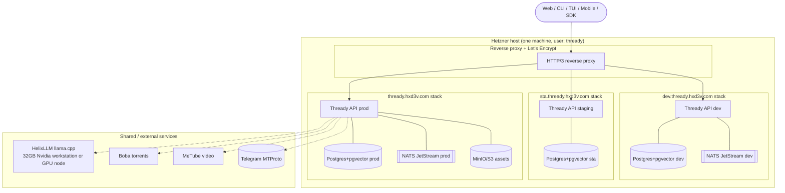

<!--
  Title           : Helix Thready — Installation Guide
  Classification  : PUBLIC
  Location        : docs/public/research/mvp/user-guides/installation.md
  Status          : Draft — v0.1 (zero-version)
  Revision        : 1 (2026-07-21)
  Author          : Helix Thready documentation swarm (user-guides)
  Related         : ./configuration.md, ./root-admin-guide.md, ../deployment/index.md,
                    ./troubleshooting.md
-->

# Helix Thready — Installation Guide

| Rev | Date | Author | Change |
|-----|------|--------|--------|
| 1 | 2026-07-21 | swarm (user-guides) | Initial local + Hetzner install procedures |

This guide takes you from nothing to a running Helix Thready system — first a **local development**
stack for evaluation, then the **three-environment Hetzner deployment** (dev/staging/production).
It stops where [configuration.md](./configuration.md) begins for the deep `.env` reference and where
[../deployment/index.md](../deployment/index.md) begins for the full ops runbook.

> **Zero-version scope.** Several subsystems are `[BUILD-NEW]` per the
> [gap register](../../../../private/research/mvp/helix_thready_subsystem_gaps_and_improvements.md). This
> guide installs the platform and the VERIFIED-production modules; features that depend on a
> scaffold (Max reading, generic HTTP downloads, OCR) are called out where you'd expect them.

## Table of contents

1. [Prerequisites](#1-prerequisites)
2. [Installation topology (diagram)](#2-installation-topology-diagram)
3. [Local development install](#3-local-development-install)
4. [Verifying the local install](#4-verifying-the-local-install)
5. [Hetzner production install](#5-hetzner-production-install)
6. [Root Admin bootstrap](#6-root-admin-bootstrap)
7. [Messenger sign-in & first channel](#7-messenger-sign-in--first-channel)
8. [Client installs (CLI/TUI/Desktop/Mobile)](#8-client-installs)
9. [Uninstall / teardown](#9-uninstall--teardown)
10. [Open items](#10-open-items)

## 1. Prerequisites

| Requirement | Version / spec | Provenance |
|-------------|----------------|------------|
| OS | Linux (x86-64/arm64); rootless-capable kernel | `[CONSTITUTION §11.4.76]` |
| Container runtime | **rootless Podman** + `podman compose` (no Docker daemon, no root) | `[CONSTITUTION §11.4.76/161]` |
| Go | **1.26.x** (to build from source / CLI) | `[CONSTITUTION silent → project]` |
| PostgreSQL | 16+ with the **pgvector** extension | `[IN-HOUSE: vectordb]` |
| HelixLLM host | llama.cpp server reachable; GPU recommended (workstation 32 GB Nvidia) | `[IN-HOUSE: HelixLLM]` |
| Node.js | 20+ (only to build the Angular portal) | `[IN-HOUSE: design_system]` |
| Disk | dev: ~20 GB; prod: object storage for **50 TB+** assets (MinIO/S3) | `[OPERATOR: scale]` |

**Production hardware baseline** `[DEFAULT — adjustable]` (Q5): ≥16 vCPU, ≥64 GB RAM, NVMe for
Postgres/pgvector, large object storage (MinIO/S3), plus a GPU node (or the workstation) for HelixLLM.

> **Credentials.** You need Telegram `api_id`/`api_hash` (from my.telegram.org) and the operator
> account phone. These live only in `.env` / `$HOME/api_keys.sh` / the private repo — never in a
> public repo `[CONSTITUTION §11.4.10]`.

## 2. Installation topology (diagram)



> Rendered PNG/SVG exported via Docs Chain (§11.4.65). Source: [diagrams/install-topology.mmd](./diagrams/install-topology.mmd).

**Explanation (for readers/models that cannot see the diagram).** A single Hetzner host runs three
**fully separated** container stacks — `dev.`, `sta.` and `thready.` (production) — each with its
own Postgres+pgvector database and, for the busier environments, its own NATS JetStream bus; the
production stack additionally has a MinIO/S3 object tier for the 50 TB+ asset scale. A single HTTP/3
reverse proxy terminates TLS (one Let's Encrypt certificate per subdomain) and routes each subdomain
to its isolated stack, so the three environments never share data or ports. Outside the host sit the
**shared services** the platform delegates to: HelixLLM (llama.cpp) for embeddings/research/vision —
typically the operator's 32 GB Nvidia workstation or a dedicated GPU node; Boba for torrents; MeTube
for video downloads; and the Telegram MTProto endpoint that Herald's user client connects to. All
clients (Web, CLI, TUI, Mobile, SDK) reach the platform only through the reverse proxy — they never
touch a stack directly. This is the topology `installation.md` provisions; the full
compose/rollback/backup detail lives in [../deployment/index.md](../deployment/index.md).

## 3. Local development install

The fastest path to a running system for evaluation. Uses SQLite, the in-process bus, and a local
llama.cpp embedder.

**Step 1 — Clone with submodules.**

```bash
git clone git@github.com:HelixDevelopment/helix_thready.git
cd helix_thready
git submodule update --init --recursive   # pulls docs/private if you have access
```

**Step 2 — Start HelixLLM (real embedder).** `[GAP: 1]` The default HelixLLM embedder is a
non-semantic hash stub. Start llama.cpp with a real embedding model and point Thready at it:

```bash
# example: llama.cpp server exposing an OpenAI-compatible /v1
llama-server --embedding --host 0.0.0.0 --port 8080 \
  -m ./models/jina-embeddings-v2-base-code.gguf
export HELIX_EMBEDDING_PROVIDER=llama      # NEVER leave this on 'hash' for search
```

**Step 3 — Create your `.env`.** Copy the template and fill it (see
[configuration.md §3](./configuration.md#3-quick-start-minimal-env)):

```bash
cp .env.example .env
chmod 600 .env
$EDITOR .env
```

**Step 4 — Bring up datastores (rootless Podman).**

```bash
# Postgres + pgvector for the vector store (SQLite handles relational in dev)
podman compose -f deploy/compose.dev.yml up -d postgres
```

**Step 5 — Run migrations and start the API.**

```bash
./thready db migrate up          # digital.vasic.database migration.Runner
./thready serve                  # REST /v1 + WS/SSE on THREADY_HTTP_ADDR
```

If a required variable is missing the process **fails loudly and lists it** — fix `.env` and retry.

## 4. Verifying the local install

```bash
# 1. Liveness / readiness (observability/pkg/health)
curl -k https://localhost:8443/health/ready

# 2. API version handshake
curl -k https://localhost:8443/v1/meta/version

# 3. Embedding sanity — MUST be a real model, not the hash stub [GAP: 1]
./thready doctor embeddings
#   ✔ provider=llama  model=jina-embeddings-v2-base-code  dim=1024
#   ✖ provider=hash → ABORT: non-semantic embedder blocked for search
```

`thready doctor` (see [cli-reference.md §5.8](./cli-reference.md#58-doctor--diagnostics)) runs the
full readiness matrix: DB reachable, pgvector present, embedder real, NATS reachable (prod),
storage writable, and messenger session valid. A green `doctor` is the gate before onboarding a
channel.

## 5. Hetzner production install

> Full runbook: [../deployment/index.md](../deployment/index.md). Summary here.

**Step 1 — Provision the `thready` user (root, one time).** Root SSH provisions the unprivileged
`thready` user with home `/home/thready`; all three environments run under it (final request §14.2).

```bash
ssh -p "$SSH_PORT_HXDEV" root@"$ADDRESS_HXDEV"
adduser --home /home/thready thready
loginctl enable-linger thready          # rootless Podman services survive logout
```

**Step 2 — Deploy the three stacks.** As `thready`, run the deployment script; it stands up the
isolated dev/staging/prod compose stacks, requests Let's Encrypt certs per subdomain, and wires the
reverse proxy:

```bash
su - thready
git clone git@github.com:HelixDevelopment/helix_thready.git && cd helix_thready
./deploy/deploy.sh production            # also: development | staging
```

**Step 3 — Secrets.** Production secrets come from the private-repo mount + `$HOME/api_keys.sh`, never
the public repo. The deploy script sources them at runtime and validates the required set before
starting each service.

**Step 4 — Verify each environment.**

```bash
for e in dev sta ""; do
  curl -sf "https://${e:+$e.}thready.hxd3v.com/health/ready" && echo " ✔ ${e:-prod}"
done
```

## 6. Root Admin bootstrap

Exactly **one** Root Admin exists and is created at deploy time, owner-only (final request §21.7).
The bootstrap is idempotent and refuses to run twice.

```bash
# Runs only if no root admin exists; credentials from env/secrets, never printed
./thready admin bootstrap \
  --email "$THREADY_ROOT_EMAIL" \
  --from-secret THREADY_ROOT_PASSWORD
#   ✔ Root Admin created. MFA enrolment required at first login (TOTP).
```

After bootstrap, the Root Admin logs into the Web portal (or CLI) and **must enrol TOTP MFA**
(mandatory for admin tiers, `[DEFAULT — adjustable]` Q9). Next steps for the Root Admin — creating
Accounts, setting global retention, and white-label branding — are in the
[root-admin-guide.md](./root-admin-guide.md).

## 7. Messenger sign-in & first channel

`[GAP: 3]` **VERIFIED status before you start.** Telegram reading uses the `gotd/td` MTProto **user**
client that is being promoted from Herald's `qaherald` QA harness to a first-class channel
(`[BUILD-NEW]` P0). **Max reading is not available yet** — the adapter (Bot API + Go OneMe
user-WebSocket port) is `[BUILD-NEW]` P0; only reserved env vars exist. Plan around Telegram for the
zero version.

### 7.1 Telegram (interactive sign-in)

```bash
./thready messenger login telegram
#   → sends a login code to the Telegram account
#   Enter code: 12345
#   Enter 2FA password (if enabled): ********
#   ✔ Session saved to HERALD_TELEGRAM_SESSION_PATH (encrypted)
```

### 7.2 Telegram (non-interactive / headless)

For headless deploy, set `THREADY_MESSENGER_SIGNIN_MODE=noninteractive` and provide
`HERALD_TELEGRAM_*` in the environment; the first run establishes the session, later runs reuse it.

### 7.3 Onboard the first channel

```bash
# Test fixture from the final request Appendix A
./thready channel add --messenger telegram --invite "https://t.me/+622y04wzy_YzOTA0"
#   ✔ Channel joined. Auto-recognition queued. Poll interval: 5m.
./thready channel list
```

Once a channel is added, Thready assembles each **complete post** (root + the full organic reply
chain, excluding the system's own replies), stores it, and begins processing per hashtag/content
type. What happens next — categories, status replies, search — is the
[end-user-manual.md](./end-user-manual.md).

## 8. Client installs

| Client | Install | Guide |
|--------|---------|-------|
| **CLI** | `go install github.com/HelixDevelopment/helix_thready/cmd/thready@latest` (or download a release binary) | [cli-reference.md](./cli-reference.md) |
| **TUI** | Same binary: `thready tui` | [tui-usage.md](./tui-usage.md) |
| **Web portal** | Served by the deploy at `https://thready.hxd3v.com`; nothing to install | [web-portal-guide.md](./web-portal-guide.md) |
| **Desktop** | Tauri 2 bundle per OS (`.AppImage`/`.dmg`/`.msi`) from releases | [web-portal-guide.md §Desktop](./web-portal-guide.md#9-desktop-tauri-notes) |
| **Mobile** | Firebase App Distribution (dev/staging) or store builds | [mobile-guide.md](./mobile-guide.md) |

> **Desktop/Mobile caveat.** The Tauri desktop shell wraps the Angular portal (org standard). Mobile
> native clients depend on `Security-KMP`, whose mobile secure storage is currently an **in-memory
> stub** `[GAP: 7]` — see [mobile-guide.md §3](./mobile-guide.md#3-security-status-read-before-you-ship)
> before installing on a real device.

## 9. Uninstall / teardown

```bash
# Local
podman compose -f deploy/compose.dev.yml down -v
rm -rf ./data

# Hetzner (per environment, preserves the other two)
./deploy/teardown.sh staging            # dev | staging | production
```

Teardown is environment-scoped and never touches a sibling environment (the isolation guarantee).
Backups are retained per the backup policy ([configuration.md §14](./configuration.md#14-observability-logging--backup)).

## 10. Open items

- `[OPEN: inst-1]` Max messenger sign-in cannot be documented end-to-end until the `[BUILD-NEW]` Max
  adapter exists `[GAP: 3]`. Workable item: **ATM — Max adapter (Bot API + OneMe WebSocket)**, then
  add a §7.4 Max sign-in flow here.
- `[OPEN: inst-2]` The `deploy/deploy.sh` / `compose.*.yml` filenames are placeholders pending the
  deployment area's canonical script names. Workable item: **ATM — reconcile deploy script names with
  deployment/**.
- `[OPEN: inst-3]` `thready doctor` sub-checks assume the diagnostics command surface in
  [cli-reference.md](./cli-reference.md); keep the two in sync once the CLI is implemented.

---

*Made with love ♥ by Helix Development.*
