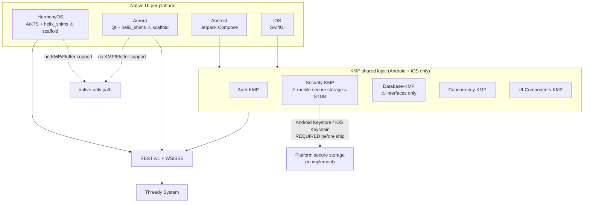

<!--
  Title           : Helix Thready — Mobile Guide
  Classification  : PUBLIC
  Location        : docs/public/research/mvp/user-guides/mobile-guide.md
  Status          : Draft — v0.1 (zero-version)
  Revision        : 1 (2026-07-21)
  Author          : Helix Thready documentation swarm (user-guides)
  Related         : ./web-portal-guide.md, ./installation.md, ./sdk-quickstart.md
-->

# Helix Thready — Mobile Guide

| Rev | Date | Author | Change |
|-----|------|--------|--------|
| 1 | 2026-07-21 | swarm (user-guides) | Initial mobile clients guide + security caveats |
| 2 | 2026-07-22 | swarm (user-guides, Pass 3) | Depth pass: split the architecture diagram explanation into multi-paragraph form; added a pre-ship security gate checklist |

Helix Thready's mobile clients are **native per platform** — Jetpack Compose (Android), SwiftUI (iOS),
ArkTS (HarmonyOS), Qt (Aurora) — with **KMP** shared logic on Android/iOS `[IN-HOUSE]`
`[DEFAULT — adjustable]` (Q19). Mobile is the **last** client priority (Web + CLI first); this guide
is a zero-version orientation with the **security status you must read before shipping**.

> **Why native, not Flutter/one-codebase (VERIFIED, Q19).** The org uses both Flutter (`helix_ui`) and
> KMP families, but **neither Flutter nor KMP can target HarmonyOS or Aurora**. Because Thready must
> reach HarmonyOS + Aurora, the clients are native per platform + KMP shared logic on Android/iOS.
> Flutter is the alternative only if HarmonyOS/Aurora are dropped.

## Table of contents

1. [Platforms & shared logic](#1-platforms--shared-logic)
2. [Architecture (diagram)](#2-architecture-diagram)
3. [Security status — read before you ship](#3-security-status-read-before-you-ship)
4. [Installing (App Distribution)](#4-installing-app-distribution)
5. [Feature parity & offline](#5-feature-parity--offline)
6. [Push notifications](#6-push-notifications)
7. [Tutorials](#7-tutorials)
8. [Open items](#8-open-items)

## 1. Platforms & shared logic

| Platform | UI tech | Shared logic | Status (gap register) |
|----------|---------|--------------|-----------------------|
| Android | Jetpack Compose | KMP (`Auth-/Security-/Database-/Concurrency-/UI-Components-KMP`) | KMP fleet = SCAFFOLD `[GAP register §8.4]` |
| iOS | SwiftUI | KMP (same) | KMP fleet = SCAFFOLD |
| HarmonyOS | ArkTS + `helix_shims` | native only (no KMP) | shims/client = SCAFFOLD `[GAP register §8.5]` |
| Aurora | Qt + `helix_shims` | native only (no KMP) | shims/client = SCAFFOLD |

## 2. Architecture (diagram)

> Rendered PNG/SVG exported via Docs Chain (§11.4.65). Source: [diagrams/mobile-architecture.mmd](./diagrams/mobile-architecture.mmd).

**Explanation (for readers/models that cannot see the diagram).** Android and iOS share a KMP logic
layer — `Auth-KMP`, `Security-KMP`, `Database-KMP`, `Concurrency-KMP`, `UI-Components-KMP` — beneath
their native Compose/SwiftUI UIs, so business logic (auth flows, models, concurrency) is written once
for those two platforms and consumed by two different native UIs. This is the "shared logic, native
shell" pattern that keeps behaviour consistent while letting each platform use its idiomatic toolkit.

HarmonyOS (ArkTS) and Aurora (Qt) **cannot** consume KMP or Flutter, which is the whole reason the
mobile strategy is native-per-platform rather than one cross-platform codebase. They take a native-only
path with `helix_shims` and re-implement the shared logic natively. The diagram marks both
`helix_shims` and the HarmonyOS/Aurora clients as scaffolds — they exist as skeletons, not shippable
clients.

All four platforms ultimately speak to the **same** REST `/v1` + WebSocket/SSE surface and thence the
Thready System. This convergence matters: whatever the UI toolkit, the server contract is identical, so
the backend never special-cases a platform and RBAC/rate-limiting apply uniformly.

The critical annotation is on `Security-KMP`. Its mobile secure storage is currently an **in-memory
stub**, and the edge to "Platform secure storage (to implement)" marks the **Android Keystore / iOS
Keychain** work that is **required before any real-device ship** — without it, JWT/refresh tokens and
secrets would sit in plaintext memory. The diagram therefore encodes two things at once: the
"native-because-of-HarmonyOS/Aurora" *decision*, and the hard security *prerequisite* that gates any
production mobile release. The first is why the architecture looks the way it does; the second is why
§3 says do not ship yet.

## 3. Security status — read before you ship

`[GAP: 7]` **P0 (mobile) — VERIFIED danger zone.** `Security-KMP`'s Android/iOS/Wasm secure storage is
an **in-memory stub**. Only the JVM/desktop path is real AES-256-GCM. **Shipping a mobile client on the
current `Security-KMP` would store JWT/refresh tokens and secrets in plaintext memory.**

**Do not release mobile clients until:**
- **Android Keystore** and **iOS Keychain** implementations replace the stub, and
- an on-device contract test proves round-trip encryption of a stored token, and
- `Database-KMP` is implemented (it is **interfaces-only** today — no SQLDelight/Room) so offline
  state has a real store.

**Pre-ship security gate (all rows must be ✅ before a store release).**

| Gate | Requirement | Verify | Blocking gap |
|------|-------------|--------|--------------|
| Secure storage (Android) | Android Keystore replaces the stub | on-device test round-trips an encrypted token | `[GAP: 7]` |
| Secure storage (iOS) | iOS Keychain replaces the stub | on-device test round-trips an encrypted token | `[GAP: 7]` |
| Secure storage (Wasm) | Real store replaces the stub | round-trip test | `[GAP: 7]` |
| Offline store | `Database-KMP` implemented (SQLDelight/Room) | offline read/write works | `[GAP register §8.4]` |
| Diagnostics honesty | In-app *Secure storage backend* reads a real backend, not `in-memory (stub)` | manual check | `[GAP: 7]` |
| KMP CI/publish | KMP fleet has CI + Maven publish | pipeline green | `[GAP register §8.4]` |

Until every row is ✅, mobile builds are for **internal evaluation on non-sensitive accounts only**
(Firebase App Distribution, dev/staging), never production tenants. The Web/CLI/TUI surfaces have no
such caveat and are the recommended clients for the zero version.

## 4. Installing (App Distribution)

Dev/staging builds are distributed via **Firebase App Distribution** (3 projects dev/staging/prod ×
debug/release) `[CONSTITUTION §11.4.47]`. You receive an invite; install the tester build; it points at
the matching environment subdomain. Store builds await the security prerequisites in §3.

## 5. Feature parity & offline

Target parity with the portal for consumption: browse threads, semantic search, view/download assets,
receive live events, trigger reprocess. Admin actions (members/branding/retention) are available to
Admin tiers but are more comfortable on Web. Offline caching depends on `Database-KMP` (not yet
implemented) — treat the zero-version mobile app as **online-only**.

## 6. Push notifications

`post.processed` and error notifications use Firebase Cloud Messaging (Android) / APNs (iOS). Delivery
mirrors the event bus; the app reconciles via REST snapshots on foreground (durable replay covers
missed events). HarmonyOS uses its Push Kit via `helix_shims` (scaffold).

## 7. Tutorials

**Tutorial A — Evaluate on Android (internal).**
1. Accept the Firebase App Distribution invite; install the staging build.
2. Sign in against `sta.thready.hxd3v.com`; enrol TOTP if you're an Admin.
3. Browse a channel, run a search, open an asset. Note: this is evaluation-only per §3.

**Tutorial B — Confirm you are NOT on a shippable secret store.**
1. In a debug build, check the in-app diagnostics screen → *Secure storage backend*.
2. If it reads `in-memory (stub)`, the security prerequisite in §3 is unmet — do not use a real
   account. Report to the Root Admin.

## 8. Open items

- `[OPEN: mob-1]` `Security-KMP` mobile secure storage stub `[GAP: 7]` — **blocks mobile release**.
  Tracked: **ATM — implement Android Keystore + iOS Keychain + Wasm store + device contract tests**.
- `[OPEN: mob-2]` `Database-KMP` interfaces-only `[GAP register §8.4]` — no offline. Tracked:
  **ATM — implement Database-KMP (SQLDelight)**.
- `[OPEN: mob-3]` HarmonyOS/Aurora clients + `helix_shims` are scaffolds `[GAP register §8.5]`.
  Tracked: **ATM — build ArkTS + Qt clients**.
- `[OPEN: mob-4]` KMP fleet has no CI/publishing `[GAP register §8.4]`. Tracked: **ATM — KMP CI +
  Maven publish + convention plugin**.
- `[OPEN: mob-5]` Native/Qt-Aurora theming depends on `helix_design`, whose Flutter/Qt-Aurora/CSS token
  packages **do not exist yet** (SCAFFOLD, `[GAP: 11]` / register §8.2) — only the web `design_system`
  is real. Native clients derive brand tokens ad hoc until then. Tracked: **ATM — implement helix_design
  per-platform token packages from the OpenDesign source**.

---

*Made with love ♥ by Helix Development.*
