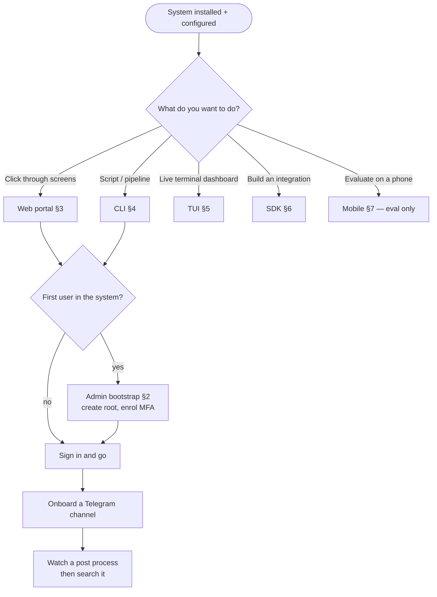

<!--
  Title           : Helix Thready — Per-Surface Quickstarts
  Classification  : PUBLIC
  Location        : docs/public/research/mvp/user-guides/quickstart.md
  Status          : Draft — v0.1 (zero-version)
  Revision        : 1 (2026-07-22)
  Author          : Helix Thready documentation swarm (user-guides, Pass 3)
  Related         : ./index.md, ./installation.md, ./configuration.md, ./cli-reference.md,
                    ./tui-usage.md, ./web-portal-guide.md, ./mobile-guide.md, ./sdk-quickstart.md
-->

# Helix Thready — Per-Surface Quickstarts

| Rev | Date | Author | Change |
|-----|------|--------|--------|
| 1 | 2026-07-22 | swarm (user-guides, Pass 3) | New: one five-minute quickstart per surface, consolidated |

This page is the **fast on-ramp**: a self-contained ~5-minute quickstart for **each surface** (Web,
CLI, TUI, Mobile, SDK) plus the Admin bootstrap, each cross-linked to its deep guide. It assumes a
system is already installed and reachable ([installation.md](./installation.md)) and configured
([configuration.md](./configuration.md)). Every command here uses **VERIFIED** module names where one
exists; `[DEFAULT — adjustable]` where a Thready-specific name is proposed.

> **Zero-version reminder.** Where a surface depends on a `[BUILD-NEW]`/scaffold subsystem (mobile
> secure storage `[GAP: 7]`, Max reading `[GAP: 3]`, generic HTTP downloads `[GAP: 4]`), the
> quickstart calls it out and points at the honest status in the deep guide. Web + CLI are the
> recommended zero-version surfaces.

## Table of contents

1. [Choose your surface (diagram)](#1-choose-your-surface-diagram)
2. [Admin bootstrap (2 minutes)](#2-admin-bootstrap-2-minutes)
3. [Web portal quickstart](#3-web-portal-quickstart)
4. [CLI quickstart](#4-cli-quickstart)
5. [TUI quickstart](#5-tui-quickstart)
6. [SDK quickstart (Go)](#6-sdk-quickstart-go)
7. [Mobile quickstart (evaluation only)](#7-mobile-quickstart-evaluation-only)
8. [What to read next](#8-what-to-read-next)

## 1. Choose your surface (diagram)



> Rendered PNG/SVG exported via Docs Chain (§11.4.65). Source: [diagrams/quickstart-surface.mmd](./diagrams/quickstart-surface.mmd).

**Explanation (for readers/models that cannot see the diagram).** The quickstart map begins where
installation and configuration leave off — a system that is already running and reachable — and its
first decision is intentionally about *intent*, not *role*, because the surface you pick depends on
what you are trying to do rather than who you are. Clicking through screens routes to the Web portal;
scripting or CI routes to the CLI; a live terminal dashboard routes to the TUI; building software that
calls Thready routes to the SDK; and evaluating on a phone routes to the mobile path, which is flagged
"eval only" because of the secure-storage gap.

The second decision is whether you are the **first** human in the system. This matters because exactly
one Root Admin must be bootstrapped before anyone can be invited, and that bootstrap is a one-time,
owner-only action. If you are first, you pass through the Admin bootstrap (create the root account,
enrol TOTP MFA) before doing anything else; if the system already has users, you simply sign in.

From that point every surface converges on the same two-step "hello world" for Thready: **onboard a
Telegram channel** so the system has something to read, then **watch a post process and search it** so
you see the whole pipeline — ingest, classify, dispatch Skills, embed, reply — end to end. The map is
deliberately a funnel: different surfaces, same first success. Each numbered node maps to a section
below and, through it, to the full surface guide.

## 2. Admin bootstrap (2 minutes)

Run once, by the system owner, at deploy time. Idempotent — refuses to run twice.

```bash
./thready admin bootstrap \
  --email "$THREADY_ROOT_EMAIL" \
  --from-secret THREADY_ROOT_PASSWORD
#   ✔ Root Admin created. MFA enrolment required at first login (TOTP).
```

Then sign in (Web or CLI) and **enrol TOTP MFA** — the portal forces this before any other screen.
Full detail: [installation.md §6](./installation.md#6-root-admin-bootstrap) and
[root-admin-guide.md §3](./root-admin-guide.md#3-bootstrap--securing-the-root-account).

## 3. Web portal quickstart

1. Open your environment URL — production `https://thready.hxd3v.com`, staging
   `https://sta.thready.hxd3v.com`, dev `https://dev.thready.hxd3v.com`.
2. **Sign in** (email + password). If you are an Admin, complete **TOTP MFA** enrolment when prompted.
3. **Dashboard → Channels → Add channel** → paste a Telegram invite link → **Save**.
4. Watch the **live event feed** on the dashboard for `post.received` → `post.processed`.
5. **Search** box → type a query → open a result → it deep-links to the source post/asset.

If the dashboard shows an amber *"Semantic search degraded: non-semantic embedder"* banner, the server
is on the hash embedder `[GAP: 1]` — fix per [troubleshooting §5](./troubleshooting.md#5-semantic-search-returns-irrelevant-results).
Deep guide: [web-portal-guide.md](./web-portal-guide.md).

## 4. CLI quickstart

```bash
# 1. Install + authenticate (session stored in OS keyring)
go install github.com/HelixDevelopment/helix_thready/cmd/thready@latest
thready auth login
thready auth whoami                       # confirm identity + roles

# 2. Onboard a Telegram channel (Account Admin+)
thready channel add --messenger telegram --invite "https://t.me/+622y04wzy_YzOTA0"

# 3. Watch it process live, then search
thready events tail --type post.processed &
thready search "kubernetes operator retry backoff" -o json | jq '.[0]'
```

Everything the Web does, the CLI does (headless, pipeline-friendly). Exit codes drive automation
(`0` ok, `77` forbidden, `75` retriable). Deep guide: [cli-reference.md](./cli-reference.md).

## 5. TUI quickstart

```bash
thready auth login        # once
thready tui               # full-screen dashboard
```

Then: `gc` → Channels, `Enter` to open one; post a `#Research #Video` message in that Telegram channel
from your account; watch the bottom event stream go `post.received` → `skill.dispatch` →
`post.processed`; `gt` → Threads → open the post to see its status reply and new assets. Keys: `/`
search, `r` reprocess, `?` help, `q` quit. Deep guide: [tui-usage.md](./tui-usage.md).

## 6. SDK quickstart (Go)

```go
client, _ := thready.New(
    thready.WithServer("https://thready.hxd3v.com"),
    thready.WithAPIKeyFromEnv("THREADY_TOKEN"),   // mint via: thready auth token --scopes read:search
)
defer client.Close()

results, _ := client.Search(ctx, thready.SearchRequest{Query: "rust async runtime", Limit: 20})
for _, r := range results { fmt.Printf("%.3f %s %s\n", r.Score, r.Kind, r.Title) }
```

Use a **scoped API key** for automation, not an interactive JWT. If `results` come back with
`Degraded: true`, the server is on the hash embedder — don't trust the ranking. Deep guide:
[sdk-quickstart.md](./sdk-quickstart.md).

## 7. Mobile quickstart (evaluation only)

`[GAP: 7]` **Do not use a real account.** `Security-KMP` mobile secure storage is an in-memory stub;
mobile builds are for **internal evaluation on non-sensitive accounts** only.

1. Accept the **Firebase App Distribution** invite; install the staging build.
2. Sign in against `sta.thready.hxd3v.com`; enrol TOTP if you are an Admin.
3. Browse a channel, run a search, open an asset — evaluation only.
4. Confirm the store backend: in-app diagnostics → *Secure storage backend* should read
   `in-memory (stub)` today. Deep guide: [mobile-guide.md §3](./mobile-guide.md#3-security-status-read-before-you-ship).

## 8. What to read next

| You are a… | Read |
|------------|------|
| System owner | [root-admin-guide.md](./root-admin-guide.md) |
| Account operator | [account-admin-guide.md](./account-admin-guide.md) |
| Consumer | [end-user-manual.md](./end-user-manual.md) |
| Anyone stuck | [troubleshooting.md](./troubleshooting.md), [faq.md](./faq.md) |
| Configuring | [configuration.md](./configuration.md) |

---

*Made with love ♥ by Helix Development.*
