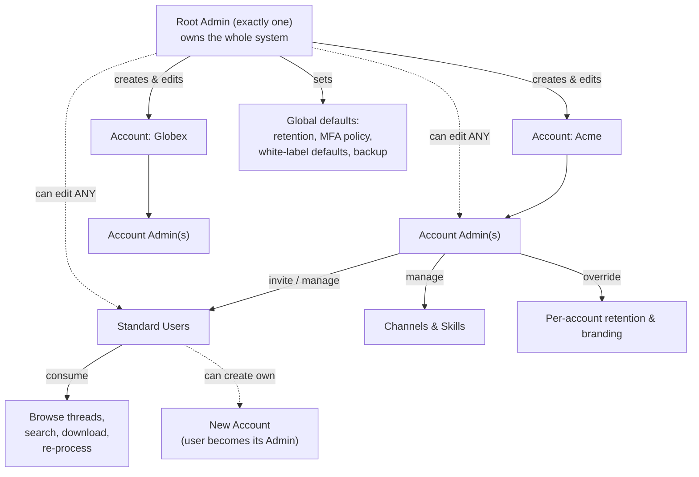

<!--
  Title           : Helix Thready — Root Admin Guide
  Classification  : PUBLIC
  Location        : docs/public/research/mvp/user-guides/root-admin-guide.md
  Status          : Draft — v0.1 (zero-version)
  Revision        : 1 (2026-07-21)
  Author          : Helix Thready documentation swarm (user-guides)
  Related         : ./account-admin-guide.md, ./configuration.md, ./installation.md,
                    ../deployment/index.md
-->

# Helix Thready — Root Admin Guide

| Rev | Date | Author | Change |
|-----|------|--------|--------|
| 1 | 2026-07-21 | swarm (user-guides) | Initial Root Admin operations guide |
| 2 | 2026-07-22 | swarm (user-guides, Pass 3) | Depth pass: split the hierarchy diagram explanation into multi-paragraph form; expanded the security-policy and DR sections; strengthened the User Service open item |

The Root Admin **owns the whole system**. Exactly one exists (final request §6.1). This guide covers
everything only the Root Admin can do: managing all Accounts, setting global defaults, white-label
branding, MFA policy, pausing/resuming processing, auditing, and the backup/DR runbook. Account-scoped
tasks are in [account-admin-guide.md](./account-admin-guide.md); the underlying knobs are in
[configuration.md](./configuration.md).

## Table of contents

1. [What "Root Admin" means](#1-what-root-admin-means)
2. [The three-tier hierarchy (diagram)](#2-the-three-tier-hierarchy-diagram)
3. [Bootstrap & securing the root account](#3-bootstrap--securing-the-root-account)
4. [Managing accounts & users](#4-managing-accounts--users)
5. [White-label branding](#5-white-label-branding)
6. [Global retention & data policy](#6-global-retention--data-policy)
7. [Security policy (MFA, sessions, keys)](#7-security-policy)
8. [Pause / resume / stop processing](#8-pause--resume--stop-processing)
9. [Audit trail & access logs](#9-audit-trail--access-logs)
10. [Backup & disaster recovery runbook](#10-backup--disaster-recovery-runbook)
11. [Billing oversight](#11-billing-oversight)
12. [Tutorials](#12-tutorials)
13. [Open items](#13-open-items)

## 1. What "Root Admin" means

| Capability | Root Admin | Account Admin | Standard User |
|-----------|:---------:|:-------------:|:-------------:|
| Edit **any** account/user/role/permission | ✅ | ❌ | ❌ |
| Set **global** defaults (retention, MFA, branding, backup) | ✅ | ❌ | ❌ |
| Create/delete Accounts | ✅ | (own, via self-service) | (own, via self-service) |
| Manage members of **an** account | ✅ | ✅ (own account) | ❌ |
| Onboard channels, edit skills/recipes | ✅ | ✅ (own account) | ❌ |
| Browse threads, search, download, re-process | ✅ | ✅ | ✅ |
| Pause/resume processing (global) | ✅ | (own account only) | ❌ |

RBAC is enforced by the **User Service** `[BUILD-NEW]` built on `digital.vasic.auth` +
`security/pkg/policy` + the Catalogizer RBAC pattern `[GAP: 20]`. Until the User Service is
decoupled, the policy enforcer runs in-process; the permission matrix above is the contract.

## 2. The three-tier hierarchy (diagram)



> Rendered PNG/SVG exported via Docs Chain (§11.4.65). Source: [diagrams/rbac-hierarchy.mmd](./diagrams/rbac-hierarchy.mmd).

**Explanation (for readers/models that cannot see the diagram).** At the top sits the single Root
Admin, who owns the entire system. There is exactly one, created once at deploy time, and its
singular-ness is a deliberate security property: system-wide powers cannot be diffused across many
accounts, so there is one throat to choke and one credential set to protect above all others.

The Root Admin creates and can edit every Account (Acme, Globex, …) and sets the **global defaults**
that every Account inherits: the default data-retention policy, the MFA policy, the white-label
branding defaults applied to new Accounts, and the backup schedule. These defaults cascade downward —
an Account starts from them and may only tighten, never loosen beyond the Root's caps.

Each Account has one or more **Account Admins**, who in turn invite and manage **Standard Users**,
onboard the Account's channels and skills, and may override the Account's own retention and branding
within the limits the Root Admin allows. This is the middle tier of delegation: an Account Admin has
full authority *inside* their Account and none outside it.

Standard Users consume the system — browsing threads, searching, downloading assets, and triggering
re-processing. They are the leaf of the authority graph but the primary audience of the product; most
day-to-day value flows through this tier.

Crucially, the membership graph is **not a strict tree**. A Standard User can create their own Account
and become its Admin (the dotted self-service edge), and a single person can be an Admin in one Account
while being a Standard User in another — role is per-Account, not global. The two dotted edges from
Root Admin down to any Account Admin or User express the **override power**: the Root Admin can edit
*any* node in the graph, which no other tier can do. That override is exactly the capability the
`[BUILD-NEW]` User Service `[GAP: 20]` must implement carefully, since it is the one edge that crosses
account boundaries.

## 3. Bootstrap & securing the root account

The root account is created once at deploy time (see
[installation.md §6](./installation.md#6-root-admin-bootstrap)). Immediately after first login:

1. **Enrol TOTP MFA** — mandatory for the root tier; the portal forces this before any other action.
2. **Set recovery** — register a recovery email/OTP path (account recovery via email/OTP, gap #6).
3. **Rotate the bootstrap password** if it came from a shared secret.
4. **Verify audit logging is on** (`thready audit tail` should show your login).

> **There is no "forgot root password" self-service.** Root recovery requires the owner-only private
> repo secrets. Losing root credentials + MFA seed is a DR event — keep the TOTP seed backup with the
> private-repo secrets.

## 4. Managing accounts & users

```bash
# Create an account (Root Admin only)
thready account create --name "Acme" --admin-email "admin@acme.example"
#   ✔ Account 'Acme' created. Invite sent to admin@acme.example.

# Promote / assign roles across ANY account (root-only override)
thready user set-role --account Acme --email "jane@acme.example" --role account_admin

# Edit any user (root override)
thready user disable --email "leaver@acme.example"

# List everything
thready account list --with-usage
```

Equivalent portal flows are in [web-portal-guide.md §6](./web-portal-guide.md#6-administration-screens).
All of these emit audit events (§9) and hit `POST/PATCH /v1/accounts` and `/v1/users`
([../api/index.md](../api/index.md)).

## 5. White-label branding

New Accounts default to Thready/Helix Development branding; the Root Admin may override per-Account
(final request §8.3). The **system default** is set via env
([configuration.md §16](./configuration.md#16-white-labeling--branding)); **per-Account overrides** are
stored in the DB and edited here:

```bash
thready brand set --account Acme \
  --primary-color "#0A7CFF" \
  --logo ./acme-logo.svg \
  --slogan "Acme Intelligence"
```

Rules (VERIFIED, inconsistency #5 resolved):
- Per-Account branding applies to that Account's portal, generated documents' headers/footers, and
  status replies.
- The **"Made with love ♥ by Helix Development"** attribution persists in footers even under a
  white-label — it is not removable by an Account.
- Light + dark variants are mandatory `[CONSTITUTION §11.4.162]`; upload both logo variants.

## 6. Global retention & data policy

Operator decision (Q12): **keep indefinitely, per-account overrides**. The Root Admin sets the global
default; each Account may **shorten** it (never lengthen beyond the global cap unless the Root Admin
raises it).

```bash
thready retention set-global --default indefinite
thready retention set-global --max-per-account 365d   # cap an account can't exceed
```

GDPR-aware erasure/export hooks exist by design (minimal compliance, Q7) — the Root Admin can execute
a subject erasure:

```bash
thready gdpr erase --subject "user@example.com" --dry-run   # preview affected rows/assets
thready gdpr erase --subject "user@example.com" --confirm
```

> `[OPEN: root-1]` Formal GDPR/CCPA certification is deferred for the MVP (design remains
> GDPR-aware). Workable item: **ATM — certify erasure/export coverage before any external tenancy**.

## 7. Security policy

| Policy | Default | Variable | Notes |
|--------|---------|----------|-------|
| MFA-required tiers | `root,account_admin` | `THREADY_MFA_REQUIRED_TIERS` | Users optional. |
| Access token TTL | 15 m | `THREADY_ACCESS_TOKEN_TTL` | Aggressive SLO posture. |
| Refresh token TTL | 7 d | `THREADY_REFRESH_TOKEN_TTL` | |
| Idle timeout (web) | 30 m | `THREADY_IDLE_TIMEOUT` | |
| Password min length | 12 | `THREADY_PASSWORD_MIN_LEN` | Argon2id + breach-list. |
| JWT signing | HS256 → **RS256 target** | `THREADY_JWT_SIGNING_ALG` | `[GAP: 10]` move to RS256/EdDSA for multi-service. |

`[GAP: 10]` **Action for the Root Admin:** before running multiple services that verify tokens,
provision an RS256/EdDSA keypair and set `THREADY_JWT_SIGNING_ALG=RS256`; HS256 is single-service
only. See [configuration.md §11](./configuration.md#11-authentication--security).

## 8. Pause / resume / stop processing

The original request requires pausing/stopping/resuming thread processing from the dashboard. The
Root Admin can act **globally**; an Account Admin only within their Account.

```bash
thready processing pause  --scope global            # stop claiming new posts everywhere
thready processing resume --scope global
thready processing pause  --scope account:Acme      # one account
thready processing status
#   global: RUNNING   in-flight: 12   queued: 47   dlq: 0
```

Pausing stops the BackgroundTasks queue from **claiming new** work; in-flight posts finish (or hit
their soft timeout). No post is lost — queued posts resume on `resume` (durable JetStream in prod).

## 9. Audit trail & access logs

All admin/user actions are logged append-only and queryable (final request §14.4), retained
`[DEFAULT — adjustable]` 1 year (`THREADY_AUDIT_RETENTION`).

```bash
thready audit tail --follow                      # live
thready audit query --actor "admin@acme.example" --since 24h --action "user.*"
thready audit export --format csv --since 30d > audit-30d.csv
```

Access logs flow through `observability` (logrus + ClickHouse); admin actions are audit-grade
(Q40). There is **no way to delete the audit trail** from any client — append-only by design.

## 10. Backup & disaster recovery runbook

Operator decision (Q41/Q45): **daily full + hourly DB incrementals**, assets daily snapshot;
**RPO ≈ 1 h, RTO ≈ 4 h**. Schedules are cron env vars
([configuration.md §14](./configuration.md#14-observability-logging--backup)).

**Backup (automatic, verify weekly):**

```bash
thready backup status                  # last full, last incremental, last asset snapshot
thready backup run --type full         # ad-hoc full (before a risky change)
```

**Restore (DR event):**

```bash
# 1. Stop processing to freeze state
thready processing pause --scope global
# 2. Point-in-time restore the DB from the latest full + incrementals (≤ ~1 h data loss = RPO)
thready restore db --to "2026-07-21T09:00:00Z"
# 3. Re-hydrate assets from the daily snapshot, or re-download broken links via REST
thready restore assets --from-snapshot latest
thready assets reheal --broken-only    # re-download physically-missing assets
# 4. Verify and resume (target RTO ≈ 4 h end-to-end)
thready doctor && thready processing resume --scope global
```

Chaos tests validate this runbook `[CONSTITUTION §11.4.27]`. The full ops-side runbook (host-level
snapshots, MinIO replication) is in [../deployment/index.md](../deployment/index.md).

## 11. Billing oversight

Billing is **subscription + metered** from day one (Q11). The Root Admin sees usage across all
Accounts; Account Admins see only their own.

```bash
thready billing summary --all-accounts --period 2026-07
thready billing meter show --account Acme          # posts processed, assets stored, search calls
```

Metering events flush every `THREADY_METERING_FLUSH`. Rating/invoicing integration is
`[OPEN: root-2]` — the meter is authoritative; the invoicing connector is a deployment-pack item.

## 12. Tutorials

**Tutorial A — Onboard a new tenant end-to-end.**
1. `thready account create --name "Acme" --admin-email admin@acme.example`
2. Brand it: `thready brand set --account Acme --primary-color "#0A7CFF" --logo ./acme.svg`
3. Cap retention: `thready retention set-account Acme --default 180d`
4. The Account Admin accepts the invite, enrols MFA, and onboards channels
   ([account-admin-guide.md §5](./account-admin-guide.md#5-onboarding-channels--groups)).
5. Verify: `thready account list --with-usage`.

**Tutorial B — Respond to a suspected key leak.**
1. `thready audit query --action "auth.token.*" --since 1h` to scope it.
2. Rotate the affected secret in `api_keys.sh`/private repo, restart services (secrets are not
   hot-reloaded — [troubleshooting.md §9](./troubleshooting.md#9-configuration-changes-not-taking-effect)).
3. `thready user sessions revoke --all --account Acme` to invalidate refresh tokens.
4. Document in the risk register.

## 13. Open items

- `[OPEN: root-1]` GDPR/CCPA certification deferred (Q7). Tracked: **ATM — certify erasure/export**.
- `[OPEN: root-2]` Invoicing connector over the metering data is a deployment-pack item. Tracked:
  **ATM — billing rating/invoicing integration**.
- `[OPEN: root-3]` User Service is `[BUILD-NEW]` `[GAP: 20]`; the RBAC matrix here is the contract but
  runs in-process until the service is decoupled. Tracked: **ATM — decouple User Service on
  auth + policy + Catalogizer RBAC**.

---

*Made with love ♥ by Helix Development.*
