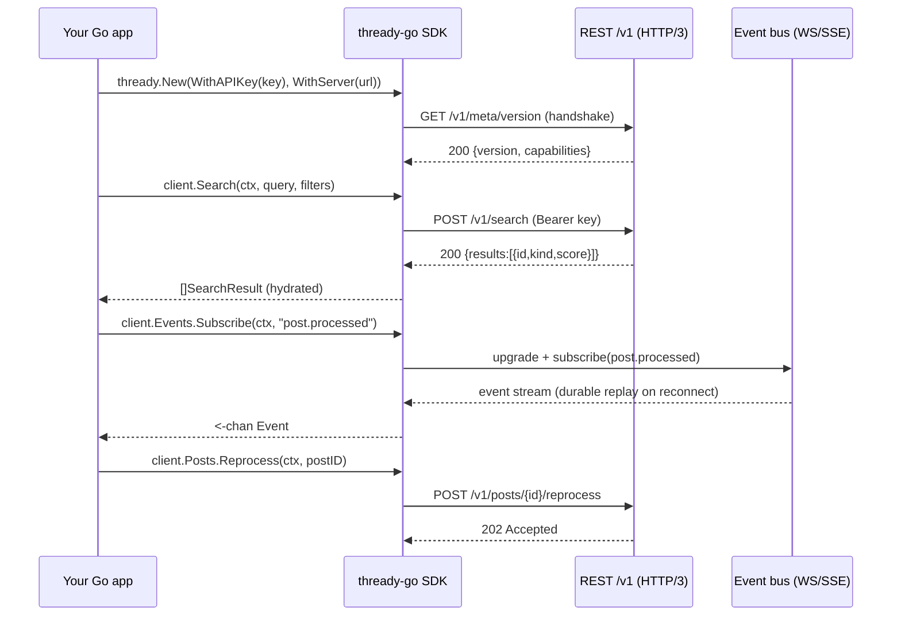

<!--
  Title           : Helix Thready — SDK Quickstart (Go primary)
  Classification  : PUBLIC
  Location        : docs/public/research/mvp/user-guides/sdk-quickstart.md
  Status          : Draft — v0.1 (zero-version)
  Revision        : 1 (2026-07-21)
  Author          : Helix Thready documentation swarm (user-guides)
  Related         : ./cli-reference.md, ./configuration.md, ../api/index.md
-->

# Helix Thready — SDK Quickstart (Go primary)

| Rev | Date | Author | Change |
|-----|------|--------|--------|
| 1 | 2026-07-21 | swarm (user-guides) | Initial SDK quickstart (Go + multi-language surface) |
| 2 | 2026-07-22 | swarm (user-guides, Pass 3) | Depth pass: split the request/event-flow diagram explanation into multi-paragraph form; linked [quickstart.md](./quickstart.md) |
| 3 | 2026-07-22 | swarm (user-guides, Critic pass) | Completeness pass: added the consolidated **§6.1 Event catalog** (every topic · when it fires · one-time vs sticky · payload · min scope) mandated by final request §3.4 — the single reference the CLI/TUI/Web event views point to; added the reconnect/replay contract note |

Helix Thready ships **native SDKs** wrapped per language. **Go is the primary language**
(final request §13.1). SDKs are generated from an **OpenAPI 3.1** REST surface + **Protobuf** event/DTO
contracts (the mature `helix_proto` pattern: `buf` → Go/Rust, `openapi-generator` → TS/Dart), with a
thin hand-written idiomatic layer per language `[DEFAULT — adjustable]`.

> **VERIFIED vs ASSUMPTION.** The codegen strategy (OpenAPI 3.1 + Protobuf via `helix_proto`) and the
> language priority are VERIFIED from the decision matrix. The Go API shapes below are illustrative and
> track [../api/index.md](../api/index.md); reconcile once the OpenAPI spec is published.

## Table of contents

1. [Language priority & install](#1-language-priority--install)
2. [Request/event flow (diagram)](#2-requestevent-flow-diagram)
3. [Go quickstart](#3-go-quickstart)
4. [Authentication](#4-authentication)
5. [Search](#5-search)
6. [Subscribing to events](#6-subscribing-to-events)
   - [6.1 Event catalog (topics · payloads · semantics)](#61-event-catalog-topics--payloads--semantics)
7. [Assets & reprocessing](#7-assets--reprocessing)
8. [Other languages (surface)](#8-other-languages-surface)
9. [Errors, retries & SLOs](#9-errors-retries--slos)
10. [Open items](#10-open-items)

## 1. Language priority & install

| Language | Priority | Install |
|----------|----------|---------|
| **Go** | Critical (primary) | `go get github.com/HelixDevelopment/helix_thready/sdk/go` |
| Java/Kotlin/Groovy/Scala | High | Maven/Gradle `dev.helix:thready-sdk` |
| Python | High | `pip install thready-sdk` |
| TypeScript/JavaScript | High | `npm i @helixdevelopment/thready-sdk` |
| Swift | Medium | SwiftPM |
| C++ / Rust / C# (Mono) | Medium | per-registry |
| Zig / Ruby / PHP | Low | per-registry |

## 2. Request/event flow (diagram)



> Rendered PNG/SVG exported via Docs Chain (§11.4.65). Source: [diagrams/sdk-sequence.mmd](./diagrams/sdk-sequence.mmd).

**Explanation (for readers/models that cannot see the diagram).** Your application constructs a client
with an API key and server URL. On construction the SDK performs a lightweight handshake
(`GET /v1/meta/version`) to negotiate version and capabilities and **fail fast on mismatch** — this is
deliberate, so an incompatible client/server pair errors at startup rather than deep inside a later
call where the failure is harder to diagnose.

A search call becomes a `POST /v1/search` with the key as a Bearer token. The API returns result ids
with kinds and scores, and the SDK **hydrates** them into typed `SearchResult` values by fetching the
full records from the relational store. This hydration is why the SDK returns rich objects rather than
bare ids — the caller gets the source post/asset, not just a vector hit.

To receive real-time updates the app subscribes to an event topic (`post.processed`). The SDK upgrades
to the WebSocket transport (or falls back to SSE where WS is blocked) and returns a Go channel the app
ranges over, with **durable replay on reconnect** so no event is lost across a dropped connection. The
channel abstraction hides the transport entirely — the app writes a `for range`, not socket-handling
code.

Finally a reprocess request is a `POST /v1/posts/{id}/reprocess` that returns `202 Accepted`.
Processing is **asynchronous**: the 202 means "accepted for processing", and the actual completion
arrives later as a `post.processed` event on the subscription, not as the response body. An app that
wants to know when reprocessing finished watches the event stream, it does not block on the HTTP call.

The sequence as a whole shows the **two-transport model** every Thready SDK follows: request/response
over REST for actions and queries, and a live event channel for push updates. Internalizing this split
is the key to using any of the SDKs — synchronous answers come back from REST, asynchronous outcomes
come back over events.

## 3. Go quickstart

```go
package main

import (
    "context"
    "fmt"
    "log"
    "time"

    thready "github.com/HelixDevelopment/helix_thready/sdk/go"
)

func main() {
    ctx := context.Background()

    // 1. Construct a client. Key comes from env/keyring, never hardcoded.
    client, err := thready.New(
        thready.WithServer("https://thready.hxd3v.com"),
        thready.WithAPIKeyFromEnv("THREADY_TOKEN"),
        thready.WithTimeout(5*time.Second), // Aggressive SLO: p95 < 150 ms
    )
    if err != nil {
        log.Fatalf("sdk init: %v", err)
    }
    defer client.Close()

    // 2. Semantic search over posts + generated materials.
    results, err := client.Search(ctx, thready.SearchRequest{
        Query: "kubernetes operator retry backoff",
        Kind:  thready.KindResearch, // post | asset | research
        Limit: 20,
    })
    if err != nil {
        log.Fatalf("search: %v", err)
    }
    for _, r := range results {
        fmt.Printf("%.3f  %s  %s\n", r.Score, r.Kind, r.Title)
    }
}
```

## 4. Authentication

`[GAP: 10]` Tokens are HS256 today; RS256/EdDSA is the multi-service target. For SDK/automation use a
**scoped API key** (mint via `thready auth token --scopes read:search`), not an interactive JWT.

```go
// Option A: scoped API key (recommended for services)
thready.WithAPIKeyFromEnv("THREADY_TOKEN")

// Option B: username/password → JWT (interactive tools); refreshes automatically
client, _ := thready.New(
    thready.WithServer(url),
    thready.WithPasswordLogin(user, passFromEnv), // performs MFA challenge if required
)
```

Never log the token; the SDK redacts it in errors. Keys carry scopes — a `read:search` key cannot
call admin endpoints (server returns `403`, SDK returns `thready.ErrForbidden`).

## 5. Search

```go
res, err := client.Search(ctx, thready.SearchRequest{
    Query:     "invoice signature",
    Kind:      thready.KindAsset,
    Account:   "Acme",
    Since:     thready.Days(90),
    Sensitive: false,
    Limit:     25,
})
```

Results return source ids hydrated from the relational store, so `res[i].Post` / `res[i].Asset` are
fully populated. Target latency < 500 ms. If the server runs the hash embedder `[GAP: 1]` the response
carries `Degraded: true` and a reason — surface it, don't trust the ranking.

**The contract behind the call (OpenAPI 3.1).** Every SDK method is generated from the REST surface
defined in **OpenAPI 3.1** (`buf`/`openapi-generator`, the `helix_proto` pattern). The `/v1/search`
operation the code above calls is, illustratively (canonical spec lives in
[../api/index.md](../api/index.md); reconcile on freeze — `[OPEN: sdk-1]`):

```yaml
openapi: 3.1.0
info: { title: Helix Thready API, version: "1.0.0" }
paths:
  /v1/search:
    post:
      operationId: search
      summary: Semantic search over posts + generated materials (pgvector, < 500 ms SLO)
      security: [ { apiKey: [ "read:search" ] } ]
      requestBody:
        required: true
        content:
          application/json:
            schema: { $ref: "#/components/schemas/SearchRequest" }
      responses:
        "200":
          description: Ranked results (source ids hydrated from the relational store)
          content:
            application/json:
              schema: { $ref: "#/components/schemas/SearchResponse" }
        "401": { description: Unauthorized }
        "403": { description: Forbidden — key lacks read:search scope }
        "429":
          description: Rate limited (THREADY_RATE_LIMIT_RPS)
          headers: { Retry-After: { schema: { type: integer } } }
components:
  securitySchemes:
    apiKey: { type: http, scheme: bearer, bearerFormat: "scoped-api-key | JWT" }
  schemas:
    SearchRequest:
      type: object
      required: [ query ]
      properties:
        query:     { type: string, minLength: 1 }
        kind:      { type: string, enum: [ post, asset, research ] }
        account:   { type: string }
        since:     { type: string, format: duration, description: "e.g. 90d" }
        sensitive: { type: boolean, default: false }
        limit:     { type: integer, minimum: 1, maximum: 100, default: 20 }
    SearchResponse:
      type: object
      required: [ results, degraded ]
      properties:
        degraded:      { type: boolean, description: "true if a non-semantic embedder was used [GAP: 1]" }
        degradedReason:{ type: [ string, "null" ] }
        results:
          type: array
          items:
            type: object
            required: [ id, kind, score ]
            properties:
              id:    { type: string }
              kind:  { type: string, enum: [ post, asset, research ] }
              score: { type: number, format: float }
              title: { type: string }
```

Note the OpenAPI 3.1 idioms: `type: [ string, "null" ]` for nullable, and the `Degraded` field wired
into the response schema so the `[GAP: 1]` hash-embedder condition is part of the contract, not an
afterthought.

## 6. Subscribing to events

```go
sub, err := client.Events.Subscribe(ctx, "post.processed", "download.error")
if err != nil {
    log.Fatal(err)
}
defer sub.Close()

for ev := range sub.C() { // durable replay backfills on reconnect
    switch e := ev.(type) {
    case *thready.PostProcessed:
        fmt.Printf("post %s done: %d assets, %d research\n", e.PostID, e.Assets, e.Research)
    case *thready.DownloadError:
        fmt.Printf("post %s step %s retry %d/%d\n", e.PostID, e.Step, e.Retry, e.Max)
    }
}
```

Event names + payloads are defined once in Protobuf and shared across SDKs. Sticky events replay
last-value on subscribe; one-time events fire once (final request §3.4).

**The real-time wire contract (WebSocket + SSE fallback).** The SDK negotiates a WebSocket upgrade at
`GET /v1/events` and transparently falls back to Server-Sent Events (`Accept: text/event-stream`) where
WS is blocked. Both carry the same JSON envelope generated from the Protobuf event schema; the SSE frame
form is:

```
GET /v1/events?topics=post.processed,download.error&replay=last-value
Authorization: Bearer <scoped-api-key>
Accept: text/event-stream

event: post.processed
id: 0197c3f2-8f3a-7c11-9a2e-000000000042      # JetStream sequence — resume token for durable replay
data: {"topic":"post.processed","postId":"8f3a…","account":"Acme","assets":1,"research":1,"tookMs":48000,"sticky":true}

event: download.error
id: 0197c3f2-8f3a-7c11-9a2e-000000000043
data: {"topic":"download.error","postId":"91b2…","step":"metube","retry":2,"max":5,"backoffMs":8000}
```

On reconnect the SDK sends `Last-Event-ID` (SSE) or the JetStream sequence (WS), and the durable
consumer **replays every missed event** from that point — this is the "no event lost across a dropped
connection" guarantee the diagram encodes (final request §3.4). Sticky topics (`"sticky": true`) also
deliver their last value immediately on subscribe so a fresh client rehydrates state without a REST
round-trip; clients still reconcile via REST snapshots for authoritative state.

### 6.1 Event catalog (topics · payloads · semantics)

The final request (§3.4) mandates that *"a dedicated document enumerates every system event, when it
fires, and how to subscribe."* This is that catalog — the **single consolidated reference** the
[CLI `events tail`](./cli-reference.md#4-content-commands), the
[TUI live stream](./tui-usage.md#5-the-live-event-stream), and the
[Web real-time updates](./web-portal-guide.md#7-real-time-updates) all surface. Every topic below is
subscribable over the same `GET /v1/events` WebSocket (SSE fallback) shown in §6; the `topics=` filter
takes any comma-separated subset.

> **VERIFIED vs ASSUMPTION.** The *transport* and *semantics* (in-process bus + NATS JetStream, at-least-once,
> idempotent consumers, sticky = last-value/compaction with invalidation, durable replay) are VERIFIED
> from the decision matrix and final request §3.4. The **topic names and payload field spellings below
> are this guide's proposal** `[DEFAULT — adjustable]`, to be frozen against the Protobuf event contract
> in [../api/index.md](../api/index.md) — see [Open items](#10-open-items) `[OPEN: sdk-4]`.

| Topic | Fires when | Delivery | Key payload fields | Min scope |
|-------|------------|----------|--------------------|-----------|
| `post.received` | A complete post (root + organic replies) is ingested and enqueued | one-time | `postId`, `channel`, `account`, `hashtags[]` | `read:events` (own account) |
| `skill.dispatch` | The matching Skill(s) are selected and ordered for a post | one-time | `postId`, `order[]` (e.g. `[download,research,reply]`) | `read:events` |
| `download.error` | A download step fails and is scheduled for retry/back-off | one-time | `postId`, `step` (`metube`\|`boba`\|`dlm`), `retry`, `max`, `backoffMs` | `read:events` |
| `download.complete` | A delegated 3rd-party download finishes (Boba SSE / MeTube poll → webhook `[GAP: 5]`) | one-time | `postId`, `step`, `assetId`, `bytes` | `read:events` |
| `post.processed` | All dispatched Skills for a post complete | **sticky** (last-value per `postId`) | `postId`, `account`, `assets`, `research`, `tookMs`, `sticky:true` | `read:events` |
| `post.failed` | A post exhausts the retry ceiling and lands in the DLQ | one-time | `postId`, `step`, `error`, `retry`, `max` | `read:events` |
| `config.changed` | A runtime-editable setting is changed (client → REST → System) | one-time | `key`, `scope` (`global`\|`account:<id>`), `actor` | `account_admin` (own) / `root` (global) |
| `processing.paused` / `processing.resumed` | Processing is paused/resumed for a scope | **sticky** (state per scope) | `scope`, `actor`, `at` | `account_admin` (own) / `root` (global) |

**How to read the two delivery modes.** *One-time* events fire once and are consumed; a client that was
offline receives them via durable JetStream replay on reconnect (`Last-Event-ID`), never a re-fire.
*Sticky* events retain their last value with explicit invalidation, so a **fresh** subscriber is handed
the current state immediately on subscribe (e.g. `post.processed` for a post it never saw process, or
the live `processing.paused` state) without a REST round-trip — the mechanism is a compacted JetStream
subject / last-value cache keyed by entity id (final request §3.4). Sticky entries are invalidated on
the next state change or TTL. Because delivery is **at-least-once**, consumers must be idempotent: key
side-effects on `postId` (or `scope`) so a replayed event is a no-op, exactly as the server's own
single-claim guarantee does for posts.

**Scopes.** Event visibility is RBAC-scoped like every other surface: a Standard User's `read:events`
key only receives events for accounts they belong to; `config.changed`/`processing.*` at global scope
require `root`. A key lacking the scope receives no frames for that topic (it is filtered server-side),
never a partial or unauthorized payload.

## 7. Assets & reprocessing

```go
// Resolve a signed URL via the Asset Service (never a direct file path)
url, err := client.Assets.SignedURL(ctx, assetID, thready.RenditionWeb)

// Re-download a broken physical link
_ = client.Assets.Reheal(ctx, assetID)

// Trigger a full re-process (async; completion arrives as an event)
_ = client.Posts.Reprocess(ctx, postID)                 // 202 Accepted
_ = client.Posts.RetryStep(ctx, postID, thready.StepDownload)
```

## 8. Other languages (surface)

The same operations exist in every SDK with idiomatic naming. TypeScript sketch:

```typescript
import { Thready } from "@helixdevelopment/thready-sdk";

const client = new Thready({ server: "https://thready.hxd3v.com", apiKey: process.env.THREADY_TOKEN });
const results = await client.search({ query: "rust async runtime", kind: "research", limit: 20 });
const sub = client.events.subscribe(["post.processed"]);
for await (const ev of sub) console.log(ev.postId, ev.assets);
```

Python sketch:

```python
from thready_sdk import Thready
client = Thready(server="https://thready.hxd3v.com", api_key=os.environ["THREADY_TOKEN"])
for r in client.search(query="signature contract", kind="asset", limit=25):
    print(r.score, r.title)
```

## 9. Errors, retries & SLOs

| SDK error | HTTP | Retry? |
|-----------|------|--------|
| `ErrUnauthorized` | 401 | No — refresh/re-auth |
| `ErrForbidden` | 403 | No — insufficient scope/role |
| `ErrNotFound` | 404 | No |
| `ErrRateLimited` | 429 | Yes — honor `Retry-After` |
| `ErrUnavailable` | 503 / timeout | Yes — exponential back-off |

The SDK applies back-off with jitter for retriable classes and honors the server rate limiter
(`THREADY_RATE_LIMIT_RPS`). SLO targets: API p95 < 150 ms, search < 500 ms. Use a per-call `context`
deadline; the SDK propagates cancellation.

## 10. Open items

- `[OPEN: sdk-1]` Go/TS/Python API shapes track the unpublished OpenAPI 3.1 spec + Protobuf contracts;
  reconcile once [../api/index.md](../api/index.md) is frozen. Tracked: **ATM — generate SDKs from the
  frozen OpenAPI+proto**.
- `[OPEN: sdk-2]` Token signing moves HS256 → RS256/EdDSA `[GAP: 10]`; SDK key/JWKS handling updates
  then. Tracked: **ATM — SDK JWKS verification support**.
- `[OPEN: sdk-3]` Lower-priority language SDKs (Zig/Ruby/PHP) are surface-only in the zero version.
  Tracked: **ATM — complete low-priority SDK wrappers**.
- `[OPEN: sdk-4]` The §6.1 event **topic names and payload spellings** are `[DEFAULT — adjustable]`;
  freeze them against the Protobuf event contract published in [../api/index.md](../api/index.md) (the
  transport/semantics are VERIFIED, the names are not). Tracked: **ATM — freeze event topic + payload
  schema against the api/ Protobuf contract**.

---

*Made with love ♥ by Helix Development.*
