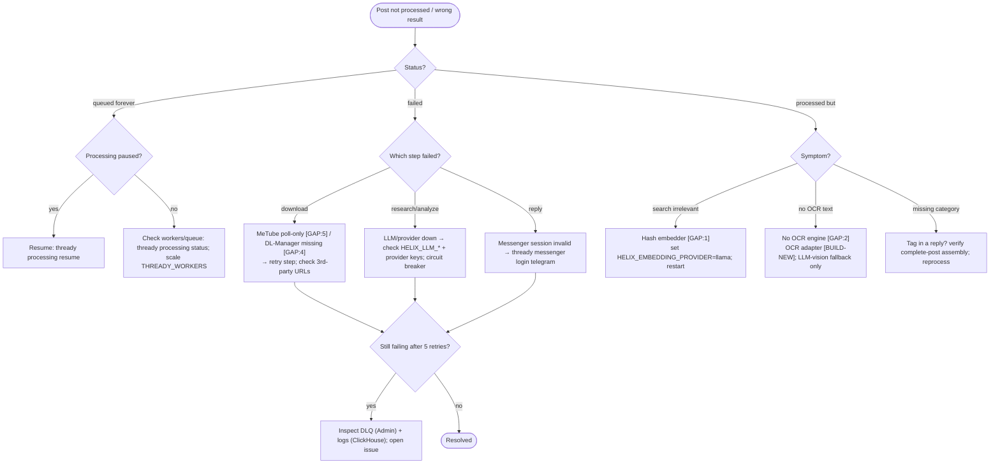

<!--
  Title           : Helix Thready — Troubleshooting
  Classification  : PUBLIC
  Location        : docs/public/research/mvp/user-guides/troubleshooting.md
  Status          : Draft — v0.1 (zero-version)
  Revision        : 1 (2026-07-21)
  Author          : Helix Thready documentation swarm (user-guides)
  Related         : ./configuration.md, ./installation.md, ./end-user-manual.md, ./faq.md
-->

# Helix Thready — Troubleshooting

| Rev | Date | Author | Change |
|-----|------|--------|--------|
| 1 | 2026-07-21 | swarm (user-guides) | Initial symptom → cause → fix guide |
| 2 | 2026-07-22 | swarm (user-guides, Pass 3) | Depth pass: corrected messenger names to VERIFIED Herald `HERALD_MTPROTO_*` / `HERALD_TGRAM_*`; split the triage diagram explanation into multi-paragraph form; added §11 environment-variable & performance troubleshooting matrix and §12 quick symptom index; renumbered Open items to §13. |

Symptom-first troubleshooting. Many entries reference **known scaffold traps** from the
[gap register](../../../../private/research/mvp/helix_thready_subsystem_gaps_and_improvements.md) — these
are not bugs in your setup, they are documented `[BUILD-NEW]`/stub statuses you should recognize.
Start with `thready doctor` ([cli-reference.md §5.8](./cli-reference.md#58-doctor--diagnostics)).

## Table of contents

1. [Post-processing triage (diagram)](#1-post-processing-triage-diagram)
2. [Service won't start](#2-service-wont-start)
3. [Can't sign in to a messenger](#3-cant-sign-in-to-a-messenger)
4. [Posts never get processed](#4-posts-never-get-processed)
5. [Semantic search returns irrelevant results](#5-semantic-search-returns-irrelevant-results)
6. [A download never completes](#6-a-download-never-completes)
7. [Comic/screenshot text isn't extracted](#7-comicscreenshot-text-isnt-extracted)
8. [Auth / token / RBAC errors](#8-auth--token--rbac-errors)
9. [Configuration changes not taking effect](#9-configuration-changes-not-taking-effect)
10. [Where the logs are](#10-where-the-logs-are)
11. [Environment-variable & performance troubleshooting matrix](#11-environment-variable--performance-troubleshooting-matrix)
12. [Quick symptom index](#12-quick-symptom-index)
13. [Open items](#13-open-items)

## 1. Post-processing triage (diagram)

> Rendered PNG/SVG exported via Docs Chain (§11.4.65). Source: [diagrams/troubleshoot-post.mmd](./diagrams/troubleshoot-post.mmd).

**Explanation (for readers/models that cannot see the diagram).** The triage starts from a post that
either never processed or produced a wrong result, and its first and most important branch is on the
post's **status**, because "never ran" and "ran wrong" have entirely different root causes. Reading
the status (`thready post status <id>`) is therefore step zero of every download/processing complaint.

If the post is *queued forever*, the two candidate causes are a **paused pipeline** and a **starved
worker pool**. Check pause first (`thready processing status`; resume if paused) because it is the
cheaper explanation and the more common operator mistake; only if processing is running do you look at
queue depth and raise `THREADY_WORKERS`. A queued-forever post is never lost — it is waiting, so the
fix is always to restore capacity, never to re-submit.

If the post *failed*, branch on the **step** that failed, because each step has a distinct failure
domain. A `download` failure usually traces to the two documented download gaps (MeTube is poll-only
`[GAP:5]`, the generic Download Manager doesn't exist yet `[GAP:4]`) or to a dead 3rd-party URL, and is
retried per-step. A `research`/`analyze` failure points at the LLM stack — check `HELIX_LLM_*`, the
provider keys, and whether the circuit breaker tripped on a flapping provider. A `reply` failure means
the messenger session is invalid, which for Telegram means the `HERALD_MTPROTO_*` session expired and
needs a re-login.

If the post *processed but* looks wrong, branch on the **symptom**. Irrelevant **search** is the
classic hash-embedder trap `[GAP:1]` — set `HELIX_EMBEDDING_PROVIDER=llama`, re-embed, and restart.
Missing **OCR text** is the no-OCR-engine gap `[GAP:2]`, where only the LLM-vision fallback runs until
the adapter ships. A **missing category** almost always means the hashtag lived in a *reply* to the
root post, so the fix is to confirm complete-post assembly and reprocess.

All failing branches converge on one final check: if the post still fails after the 5-retry ceiling it
lands in the **dead-letter queue** for an Admin to inspect alongside the ClickHouse logs; otherwise the
per-step retry resolves it and the post reaches `processed`. The DLQ is the single place stuck work
accumulates, which is why every branch routes there rather than silently dropping the post.

## 2. Service won't start

| Symptom | Cause | Fix |
|---------|-------|-----|
| `ABORT: missing required var X` (exit 3) | Required env var absent | Add it to `.env`; run `thready config validate`. |
| `ABORT: non-semantic embedder blocked` | `HELIX_EMBEDDING_PROVIDER=hash` `[GAP: 1]` | Set `=llama` and point `THREADY_EMBEDDING_BASE_URL` at a running llama.cpp. |
| DB connection refused | Postgres/pgvector not up | `podman compose ... up -d postgres`; check `THREADY_DB_DSN`. |
| `pgvector extension not found` | Extension not installed | `CREATE EXTENSION vector;` in the DB. |
| TLS cert error on boot | Let's Encrypt not issued yet | Check `LETS_ENCRYPT_*`; see [deployment](../deployment/index.md). |

The service **fails loudly and lists** what's missing — read the first error line; it names the key.

## 3. Can't sign in to a messenger

`[GAP: 3]` **Know the status first.** Telegram works via the `gotd/td` MTProto user client (being
promoted from the `qaherald` harness). **Max is not implemented** — the adapter is `[BUILD-NEW]`.

| Symptom | Cause | Fix |
|---------|-------|-----|
| `messenger 'max' not implemented` | Max adapter is `[BUILD-NEW]` (Herald `MAX.md` = `PLANNED`) | Expected in the zero version; use Telegram. Track ATM — Max adapter. |
| Telegram login code never arrives | Wrong `HERALD_MTPROTO_APP_ID`/`APP_HASH` or `HERALD_MTPROTO_PHONE` | Re-check credentials from my.telegram.org/apps; phone must be E.164. |
| `SESSION_PASSWORD_NEEDED` / 2FA loop | Account has cloud 2FA | Set `HERALD_MTPROTO_PASSWORD`. |
| Session lost after restart | Session file not persisted | Set `HERALD_MTPROTO_SESSION_FILE` to a writable, encrypted path (default `~/.config/herald/mtproto.session`). |
| Can't backfill channel history | Using the Bot-API path (`HERALD_TGRAM_BOT_TOKEN`) — a bot cannot read history | Ensure the MTProto **user** client (`HERALD_MTPROTO_*`) is active; the bot token is reply-only. |
| Replies never post but reading works | Bot token/chat unset | Set `HERALD_TGRAM_BOT_TOKEN` + `HERALD_TGRAM_CHAT_ID`; verify `THREADY_REPLY_ACCOUNT`. |

## 4. Posts never get processed

| Symptom | Cause | Fix |
|---------|-------|-----|
| All posts `queued`, none `processing` | Processing paused | `thready processing status`; `thready processing resume`. |
| Slow drain under load | Worker pool too small | Raise `THREADY_WORKERS` (default 32). |
| A post `processing` for very long | Research-heavy soft timeout | `THREADY_POST_TIMEOUT` (default 30 m); long downloads are delegated and shouldn't hold a slot. |
| System replies being re-processed | Should never happen | Only organic posts are processed by design; if you see this, file it — the reply-exclusion invariant is broken. |
| Duplicate processing | Should never happen | Single-claim via Postgres lock guarantees exactly-once; report if observed. |

## 5. Semantic search returns irrelevant results

`[GAP: 1]` **The #1 gotcha.** HelixLLM's default `HashEmbedder` emits non-semantic pseudo-vectors;
search built on it returns garbage with only a startup warning.

**Fix:**
1. `thready doctor embeddings` → if it shows `provider=hash`, that's the cause.
2. Start a real llama.cpp embedding server; set `HELIX_EMBEDDING_PROVIDER=llama` and
   `THREADY_EMBEDDING_BASE_URL`/`THREADY_EMBEDDING_MODEL`.
3. Ensure `THREADY_EMBEDDING_DIM` matches the model (the RAG path historically hardcoded 768 — set it
   explicitly).
4. **Re-embed** existing content: `thready search reindex --all` (embeddings computed on the hash
   provider must be regenerated).
5. Restart; confirm the portal's "degraded" banner clears.

## 6. A download never completes

| Content | Cause | Status |
|---------|-------|--------|
| Video (`#Video`, `#Channel`) | MeTube is **poll-only** `[GAP: 5]` — no completion webhook | Thready polls `GET /api/postprocess/status`; completion notification lags. The download still finishes; the outbound webhook is `[BUILD-NEW]`. |
| Torrent (`#Torrent`) | Boba callback contract bespoke `[GAP: 6.4]` | Boba has SSE + `POST /api/v1/hooks`; if callbacks don't arrive, check `THREADY_BOBA_CALLBACK_URL` reachability. |
| Direct file URL (HTTP/FTP/…) | Download Manager **doesn't exist yet** `[GAP: 4]` | Direct-URL downloads are unavailable until the `[BUILD-NEW]` Download Manager ships. |
| Broken existing asset | Physical link broke | `thready asset reheal <id>` re-downloads. |

Use `thready post retry <id> --step download` to re-drive a stuck download step. Persistent failures
land in the DLQ.

## 7. Comic/screenshot text isn't extracted

`[GAP: 2]` VisionEngine has **no OCR engine**. Comic transcription and screenshot text extraction fall
back to **LLM-vision** (lower fidelity, non-deterministic, no bounding boxes) until the
Tesseract/PaddleOCR adapter `[BUILD-NEW]` lands. `THREADY_OCR_PROVIDER=none` today means "LLM-vision
only". This is expected in the zero version — not a misconfiguration.

## 8. Auth / token / RBAC errors

| Symptom | Cause | Fix |
|---------|-------|-----|
| `401 unauthorized` (exit 4) | Missing/expired token | `thready auth login`, or set `THREADY_TOKEN`. |
| `403 forbidden` (exit 77) | RBAC denies the action | You lack the role/scope; an Admin must grant it. Not a bug — server enforces. |
| Tokens rejected across services | HS256 single-service only `[GAP: 10]` | Move to `THREADY_JWT_SIGNING_ALG=RS256` with a shared public key. |
| MFA loop | TOTP not enrolled (Admin) | Complete TOTP enrolment; admin tiers are forced. |
| API key works but too broad | Over-scoped key | Mint a narrower key: `thready auth token --scopes read:search`. |

## 9. Configuration changes not taking effect

- **Runtime-editable settings** (directories, poll frequency, branding, retention) go
  client → REST → System and apply immediately, emitting `config.changed`. If not, check RBAC and the
  audit log.
- **Secrets are NOT hot-reloaded.** Rotating `THREADY_JWT_SECRET`, provider keys, DB DSN, etc. requires
  a **service restart**. This is deliberate (secrets are read once at boot).
- **`.env` precedence:** a value exported in your shell **overrides** the `.env` file. If a change to
  `.env` "does nothing", check for a stale `export` in `~/.bashrc`/`~/.zshrc`.

## 10. Where the logs are

- **Structured logs** — logrus (JSON in prod) shipped to **ClickHouse** via `observability`
  (`THREADY_CLICKHOUSE_DSN`). Query with the observability tooling; **not** ELK/Loki.
- **Traces** — OpenTelemetry (`OTEL_EXPORTER_OTLP_ENDPOINT`) → Jaeger/Zipkin.
- **Metrics** — Prometheus at `THREADY_METRICS_ADDR` → Grafana.
- **Audit** — `thready audit tail` / `audit query` (append-only).
- **Container logs** — `podman logs <container>` per stack.
- **Secrets are always redacted** in every sink.

## 11. Environment-variable & performance troubleshooting matrix

Symptoms that trace to a specific misconfigured or under-tuned variable. This complements the
[configuration reference](./configuration.md) — here you start from the *symptom*, there you look up
the *variable*.

| Symptom | Likely variable | Cause | Fix |
|---------|-----------------|-------|-----|
| Search relevance is garbage | `HELIX_EMBEDDING_PROVIDER` | Set to `hash` (or defaulted) `[GAP: 1]` | Set `=llama`; point `THREADY_EMBEDDING_BASE_URL` at a live llama.cpp; reindex. |
| Search returns nothing / dimension error | `THREADY_EMBEDDING_DIM` | Mismatch with the model's true dim (RAG path historically hardcoded 768) | Set to the model's real dimension (e.g. `1024`); re-embed. |
| Search slow (> 500 ms) | `THREADY_VECTOR_INDEX` | Sequential scan (no ANN index) | Set `=hnsw`; ensure the index is built on the embedding column. |
| Whole system slow under load | `THREADY_WORKERS` / `THREADY_DB_MAX_OPEN_CONNS` | Worker or connection-pool starvation | Raise workers; raise pool to match; watch Prometheus queue depth. |
| Downloads pile up | `THREADY_DOWNLOAD_CONCURRENCY` | Too few parallel download jobs | Raise it; confirm the 3rd-party service (Boba/MeTube) is reachable. |
| LLM steps time out | `THREADY_POST_TIMEOUT` / `HELIX_LLM_BASE_URL` | Model host unreachable or budget too tight for research-heavy posts | Verify the llama.cpp host; raise the soft budget; check the circuit breaker. |
| Tokens rejected across services | `THREADY_JWT_SIGNING_ALG` | HS256 is single-service only `[GAP: 10]` | Move to `RS256` with a shared public key. |
| Vision de-dupes but never OCRs text | `HELIX_VISION_OPENCV_ENABLED` vs OCR | OpenCV ≠ OCR `[GAP: 2]` | Expected; OCR adapter is `[BUILD-NEW]`. OpenCV only finds near-duplicates. |
| Assets 404 via a direct path | `THREADY_ASSET_SERVICE_URL` | Client used a raw path instead of resolving through the Asset Service | Always resolve links via the Asset Service; never store direct file paths. |
| MinIO signed URLs expire mid-download | `THREADY_STORAGE_SIGNED_URL_TTL` | TTL too short for large assets | Raise it; retry `thready asset get`. |
| Config edit "does nothing" | *(shell export)* | A `~/.bashrc`/`~/.zshrc` `export` overrides `.env` | Unset the stale export, or change the value there. |
| Secret rotation not applied | *(any secret)* | Secrets read once at boot — not hot-reloaded | Restart the service after rotating. |

## 12. Quick symptom index

Jump straight to the section for a one-line symptom:

| You see… | Go to |
|----------|-------|
| `ABORT: missing required var` on start | [§2](#2-service-wont-start) |
| `ABORT: non-semantic embedder blocked` | [§2](#2-service-wont-start) / [§5](#5-semantic-search-returns-irrelevant-results) |
| `messenger 'max' not implemented` | [§3](#3-cant-sign-in-to-a-messenger) |
| Login code never arrives | [§3](#3-cant-sign-in-to-a-messenger) |
| Posts stuck `queued` | [§4](#4-posts-never-get-processed) |
| Search results irrelevant | [§5](#5-semantic-search-returns-irrelevant-results) |
| Download never finishes | [§6](#6-a-download-never-completes) |
| Comic/screenshot text missing | [§7](#7-comicscreenshot-text-isnt-extracted) |
| `401`/`403` (exit 4/77) | [§8](#8-auth--token--rbac-errors) |
| Variable-specific slowness/errors | [§11](#11-environment-variable--performance-troubleshooting-matrix) |

## 13. Open items

- `[OPEN: trb-1]` `thready search reindex` depends on the semantic-search service `[GAP register §11]`;
  confirm the exact reindex command once implemented.
- `[OPEN: trb-2]` DLQ inspection UX (portal/CLI surface for stuck posts) to be finalized with the
  BackgroundTasks integration. Tracked: **ATM — DLQ inspection surface**.
- `[OPEN: trb-3]` Several fixes here reference `[BUILD-NEW]` services (Max, Download Manager, OCR,
  MeTube webhook); their operator-facing error messages finalize when those ship.

---

*Made with love ♥ by Helix Development.*
