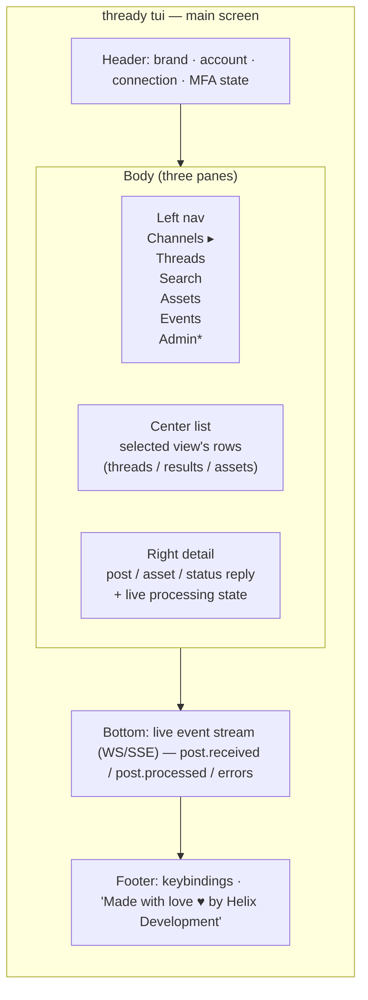

<!--
  Title           : Helix Thready — TUI Usage Guide
  Classification  : PUBLIC
  Location        : docs/public/research/mvp/user-guides/tui-usage.md
  Status          : Draft — v0.1 (zero-version)
  Revision        : 1 (2026-07-21)
  Author          : Helix Thready documentation swarm (user-guides)
  Related         : ./cli-reference.md, ./web-portal-guide.md, ./end-user-manual.md
-->

# Helix Thready — TUI Usage Guide

| Rev | Date | Author | Change |
|-----|------|--------|--------|
| 1 | 2026-07-21 | swarm (user-guides) | Initial Bubble Tea TUI guide |

The Thready TUI is a full-screen terminal application built with **Bubble Tea + Cobra + Lipgloss**
(the `helix_track_cli` pattern) `[IN-HOUSE]`. "Everything possible from the Web works from the TUI"
(final request § TUI). It uses the **same REST `/v1` + event bus** as every client, so it is fully
interactive and live. Launch with `thready tui`.

> **VERIFIED vs ASSUMPTION.** The framework (Bubble Tea + Cobra + Lipgloss) is VERIFIED from the
> decision matrix. The pane layout and keybindings below are this guide's proposal
> `[DEFAULT — adjustable]`. `[GAP register §8.6]` `helix_track_cli` is FOUNDATION and not
> deep-audited — verify the exact widgets before finalizing.

## Table of contents

1. [Launching & connecting](#1-launching--connecting)
2. [Screen layout (diagram)](#2-screen-layout-diagram)
3. [Navigation & keybindings](#3-navigation--keybindings)
4. [Views](#4-views)
5. [The live event stream](#5-the-live-event-stream)
6. [Accessibility & theming](#6-accessibility--theming)
7. [Tutorials](#7-tutorials)
8. [Open items](#8-open-items)

## 1. Launching & connecting

```bash
thready auth login          # once; session stored in OS keyring
thready tui                 # launches the full-screen UI
thready tui --account Acme  # start scoped to an account
```

The TUI reuses your CLI session and server config
([cli-reference.md §1](./cli-reference.md#1-install--global-flags)). If not authenticated it drops you
into an inline login form.

## 2. Screen layout (diagram)



> Rendered PNG/SVG exported via Docs Chain (§11.4.65). Source: [diagrams/tui-layout.mmd](./diagrams/tui-layout.mmd).

**Explanation (for readers/models that cannot see the diagram).** The TUI is a single full-screen
layout with four horizontal bands. The **header** shows the active brand (respecting per-Account
white-label), the selected Account, connection health to the API/event bus, and your MFA/auth state.
The **body** is split into three vertical panes: a **left navigation** list of views (Channels,
Threads, Search, Assets, Events, and an Admin section marked `*` that only appears for Admin tiers);
a **center list** showing the rows for the selected view (threads, search results, or assets); and a
**right detail** pane rendering the selected item — a complete post with its status reply and asset
links, or an asset's metadata — including its **live processing state** that updates as events arrive.
Across the bottom sits the **live event stream**, a scrolling log of `post.received` /
`post.processed` / error events pushed over WebSocket/SSE, so you watch processing happen in real time
without refreshing. The **footer** shows context-sensitive keybindings and carries the Helix
Development slogan. Focus moves between the three body panes and the event stream; the layout is the
terminal analogue of the [web portal](./web-portal-guide.md) master-detail screens.

## 3. Navigation & keybindings

| Key | Action |
|-----|--------|
| `Tab` / `Shift+Tab` | Move focus between panes |
| `↑`/`↓` or `k`/`j` | Move within a list |
| `Enter` | Open / drill into the selected item |
| `Esc` | Back / close detail |
| `/` | Focus search (semantic query) |
| `g` then a letter | Jump to view: `gc` Channels, `gt` Threads, `gs` Search, `ga` Assets, `ge` Events |
| `r` | Re-process selected post (`thready post reprocess`) |
| `R` | Retry a failed step (choose step) |
| `p` | Pause/resume processing (Admin; scope prompt) |
| `f` | Filter current list (since/kind/status) |
| `y` | Copy selected id/asset ref to clipboard |
| `?` | Keybinding help overlay |
| `q` / `Ctrl+C` | Quit |

## 4. Views

- **Channels** — list channels, add (invite link), set poll interval, remove. Telegram only for the
  zero version `[GAP: 3]`; Max shows a "not yet available" badge.
- **Threads** — browse complete posts per channel; the detail pane shows root + organic replies,
  detected categories, status reply, and linked assets/research.
- **Search** — type a query; results are semantic over posts + generated materials (< 500 ms target).
  `[GAP: 1]` if results look wrong, the server is on the hash embedder — the header shows an
  `embedder: hash ⚠` warning.
- **Assets** — list/get renditions (raw/`-web`), reheal broken links. Downloads resolve via the Asset
  Service (never direct paths).
- **Events** — full-screen view of the live stream with filters.
- **Admin** (Admin tiers) — members, skills, retention, branding, processing pause/resume, billing view.

## 5. The live event stream

The bottom band subscribes to the event bus (WebSocket, SSE fallback). It renders one line per event
with a severity color. Durable JetStream consumers replay missed events on reconnect (final request
§3.4), so if your terminal drops the connection you don't lose events — the stream backfills.

```text
09:41:02  post.received   chan=devops  post=8f3a…  #Research #Video
09:41:07  skill.dispatch  post=8f3a…   order=[download,research,reply]
09:41:55  post.processed  post=8f3a…   assets=1  research=1  took=48s
09:42:10  download.error  post=91b2…   step=metube  retry=2/5 (backoff 8s)
```

## 6. Accessibility & theming

- Respects `NO_COLOR` and 16/256/truecolor terminals via Lipgloss.
- Light + dark theming derived from the OpenDesign tokens (helix-green `#B6E376` default), honoring
  per-Account branding in the header `[CONSTITUTION §11.4.162]`.
- All actions have keyboard equivalents (no mouse required); screen-reader-friendly plain-text mode
  via `thready tui --plain`.

## 7. Tutorials

**Tutorial A — Watch a post process end-to-end.**
1. `thready tui` → `gc` Channels → select a channel → `Enter`.
2. Post a `#Research #Video` message in that Telegram channel from your account.
3. Watch the bottom stream: `post.received` → `skill.dispatch` → `post.processed`.
4. `gt` Threads → open the post → see the status reply and the new asset/research in the detail pane.

**Tutorial B — Triage a failed download.**
1. `ge` Events → filter `download.error`.
2. Select the post → `R` → choose `download` to retry the step.
3. If it keeps failing, the FAQ/troubleshooting entry for
   [downloads](./troubleshooting.md#6-a-download-never-completes) explains the MeTube poll-only caveat.

## 8. Open items

- `[OPEN: tui-1]` Pane layout & keymap are `[DEFAULT — adjustable]`; validate against the implemented
  Bubble Tea models. Tracked: **ATM — finalize TUI keymap + panes**.
- `[OPEN: tui-2]` `helix_track_cli` reference not deep-audited `[GAP register §8.6]`. Tracked:
  **ATM — audit helix_track_cli before adopting widgets wholesale**.

---

*Made with love ♥ by Helix Development.*
