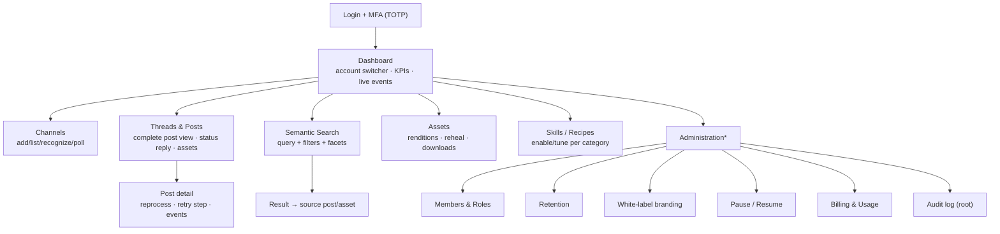

<!--
  Title           : Helix Thready — Web Portal Guide
  Classification  : PUBLIC
  Location        : docs/public/research/mvp/user-guides/web-portal-guide.md
  Status          : Draft — v0.1 (zero-version)
  Revision        : 1 (2026-07-21)
  Author          : Helix Thready documentation swarm (user-guides)
  Related         : ./end-user-manual.md, ./account-admin-guide.md, ./root-admin-guide.md,
                    ../design/index.md
-->

# Helix Thready — Web Portal Guide

| Rev | Date | Author | Change |
|-----|------|--------|--------|
| 1 | 2026-07-21 | swarm (user-guides) | Initial Angular portal guide |

The Web portal is the **primary management surface** (`[OPERATOR]` Web+CLI first). It is an **Angular**
app on the shared **OpenDesign `design_system`** (Angular 19 for the product client; Angular 22 for
marketing/SSG) `[IN-HOUSE]` `[CONSTITUTION §11.4.162]`. Everything a user or admin needs — browsing
threads, semantic search, assets, administration — is here. It consumes the same REST `/v1` + event
bus as the CLI/TUI.

> **VERIFIED vs ASSUMPTION.** Angular + OpenDesign is VERIFIED from the decision matrix. Exact screen
> names/routes below are this guide's proposal `[DEFAULT — adjustable]`, aligned to the
> [design area](../design/index.md) once its wireframes are published. `design_system` is FOUNDATION
> (web-only, extracted from HelixOTA) `[GAP register §8.1]` — the Thready brand theme layer is a `P1`.

## Table of contents

1. [Accessing the portal](#1-accessing-the-portal)
2. [Information architecture (diagram)](#2-information-architecture-diagram)
3. [Login & MFA](#3-login--mfa)
4. [Threads & posts](#4-threads--posts)
5. [Semantic search](#5-semantic-search)
6. [Administration screens](#6-administration-screens)
7. [Real-time updates](#7-real-time-updates)
8. [Accessibility, SEO & performance bar](#8-accessibility-seo--performance-bar)
9. [Desktop (Tauri) notes](#9-desktop-tauri-notes)
10. [Tutorials](#10-tutorials)
11. [Open items](#11-open-items)

## 1. Accessing the portal

| Environment | URL |
|-------------|-----|
| Production | `https://thready.hxd3v.com` |
| Staging | `https://sta.thready.hxd3v.com` |
| Development | `https://dev.thready.hxd3v.com` |

Each subdomain routes to a fully isolated stack (final request §8.2). Use a modern evergreen browser;
HTTP/3 is used when available with HTTP/2 fallback.

## 2. Information architecture (diagram)



> Rendered PNG/SVG exported via Docs Chain (§11.4.65). Source: [diagrams/web-portal-ia.mmd](./diagrams/web-portal-ia.mmd).

**Explanation (for readers/models that cannot see the diagram).** After login and TOTP MFA the user
lands on the **Dashboard**, which carries an account switcher (for people who belong to multiple
Accounts), headline KPIs, and a live event feed. From the dashboard the primary navigation fans out to
**Channels** (add/list channels, see auto-recognition and poll settings), **Threads & Posts** (the
complete-post reading experience, with each post's status reply and linked assets), **Semantic
Search** (a query box with structured filters and facets), **Assets** (renditions, reheal, downloads),
and **Skills/Recipes** (enable and tune the per-hashtag recipes). An **Administration** section marked
`*` is visible only to Admin tiers and expands to Members & Roles, Retention, White-label branding,
processing Pause/Resume, Billing & Usage, and — for the Root Admin only — the Audit log. Two drill-down
paths are shown explicitly: a thread opens a **Post detail** view with reprocess/retry-step controls
and that post's event history; and a search result links straight back to its **source post or asset**,
so search is a navigation entry point, not a dead end. The IA mirrors the [CLI command tree](./cli-reference.md#2-command-tree-diagram)
and the [TUI views](./tui-usage.md#4-views) one-to-one.

## 3. Login & MFA

1. Enter email + password (Argon2id-hashed server-side, ≥12 chars, breach-checked).
2. Enter your TOTP code — **mandatory for Admin tiers**, optional for Standard Users
   (`THREADY_MFA_REQUIRED_TIERS`).
3. Sessions: access token 15 min, refresh 7 d, idle logout 30 min (Aggressive posture, Q9).

First-time Admins are forced through TOTP enrolment before any other screen loads.

## 4. Threads & posts

The Threads view lists complete posts per channel. Opening a post shows:

- The **complete post**: root message + full organic reply chain (system replies excluded).
- Detected **categories** (hashtags + content type), including any inferred by indirect determination.
- The **status reply** Thready posted back (success/metrics/asset refs).
- **Linked assets** (raw + `-web` renditions) resolved via the Asset Service, and any generated
  **research** documents.
- **Processing state** with `Reprocess` and `Retry step` actions (client → REST → System).

## 5. Semantic search

A single query box backed by pgvector + a real llama.cpp embedder searches **both** original posts and
generated materials by meaning (< 500 ms target). Filters: kind (post/asset/research), account,
date range, category, sensitivity. Each result deep-links to its source.

> `[GAP: 1]` If the deployment is running on HelixLLM's default **hash embedder**, search relevance is
> garbage. The portal surfaces an amber banner *"Semantic search degraded: non-semantic embedder"* and
> links to [troubleshooting.md §5](./troubleshooting.md#5-semantic-search-returns-irrelevant-results).

## 6. Administration screens

Visible per RBAC:

- **Members & Roles** — invite/remove, set `account_admin`/`user` (Account scope); Root can edit any.
- **Retention** — per-account default (shorten within Root's cap); Root sets global.
- **White-label branding** — colors/logo/slogan per Account; Helix attribution persists in footers.
- **Processing** — pause/resume (Account scope for Admins, global for Root).
- **Billing & Usage** — the metering view (own account for Admins; all for Root).
- **Audit log** — append-only, queryable (Root Admin).

These map to the [Account Admin](./account-admin-guide.md) and [Root Admin](./root-admin-guide.md)
guides.

## 7. Real-time updates

The portal subscribes to the event bus over WebSocket (SSE fallback). Lists and the post detail view
update live as `post.received`/`post.processed`/error events arrive; sticky events (last-value with
invalidation) rehydrate state on load, and durable replay covers reconnects (final request §3.4).

```typescript
// Illustrative Angular service (final contract in ../api/index.md)
this.events.subscribe('post.processed', (e: PostProcessed) => {
  this.store.upsertPost(e.postId, { status: 'processed', assets: e.assets });
});
```

## 8. Accessibility, SEO & performance bar

Websites/portal meet the engineering-quality bar `[CONSTITUTION §11.4.190]`: fully responsive, **WCAG
AA**, Core Web Vitals, page < 1.5 s (Aggressive SLO), semantic HTML, and for marketing surfaces
SEO-complete (meta/OG/Twitter, canonical, schema.org/JSON-LD, robots+sitemap). Proven with captured
screenshots + Lighthouse and visual-regression tests (`VisualRegression` LLM-vision + `ScreenDiff`
pixel). Light + dark themes mandatory with explicit choice + system default.

**Localization.** The portal UI is fully localized in **English, Russian, and Serbian Cyrillic**
(`en`/`ru`/`sr-Cyrl`) via HelixTranslate + `digital.vasic.i18n` (Q35). A language switcher is available
in the account/profile menu; the default is `THREADY_DEFAULT_LOCALE`
([configuration.md §15](./configuration.md#15-retention-billing--localization)). Post content stays in
its original language with on-demand translation; only the UI chrome is translated.

## 9. Desktop (Tauri) notes

The Desktop app is a **Tauri 2** shell (Rust core + the same Angular UI) — the org standard
`[DEFAULT — adjustable]` (Q18). It adds OS-specific features (native notifications for
`post.processed`, file-system asset export, tray controls for pause/resume) but is otherwise the
portal. Install per OS from releases ([installation.md §8](./installation.md#8-client-installs)).

## 10. Tutorials

**Tutorial A — First login as an Account Admin.**
1. Open your account URL → sign in → enrol TOTP.
2. Dashboard → **Channels** → *Add channel* → paste a Telegram invite link → save.
3. Wait for auto-recognition; watch the live feed for `post.received`.
4. Dashboard → **Members** → invite your team as `user`.

**Tutorial B — Investigate and re-run a failed post.**
1. **Threads** → filter status `failed` → open the post.
2. Read the status reply's error; click **Retry step** → choose the failed step, or **Reprocess** for
   a full refresh.
3. Confirm via the live event feed that it reaches `post.processed`.

**Tutorial C — Brand your account.**
1. **Administration → White-label branding** (if enabled by Root).
2. Set primary color, upload light+dark logos, set slogan → save.
3. Reload — header, generated-doc headers/footers, and status replies pick up the brand; the Helix
   Development footer attribution remains.

## 11. Open items

- `[OPEN: web-1]` Screen names/routes are `[DEFAULT — adjustable]`; align with the
  [design area](../design/index.md) wireframes once published. Tracked: **ATM — reconcile portal IA
  with Figma**.
- `[OPEN: web-2]` `design_system` is web-only FOUNDATION; the Thready brand theme + npm publish are
  `P1` `[GAP register §8.1]`. Tracked: **ATM — Thready theme on design_system**.
- `[OPEN: web-3]` Angular product version (19 vs 22) for Thready's product client is a
  `[DEFAULT — adjustable]` recommendation (Q17); confirm before build.

---

*Made with love ♥ by Helix Development.*
